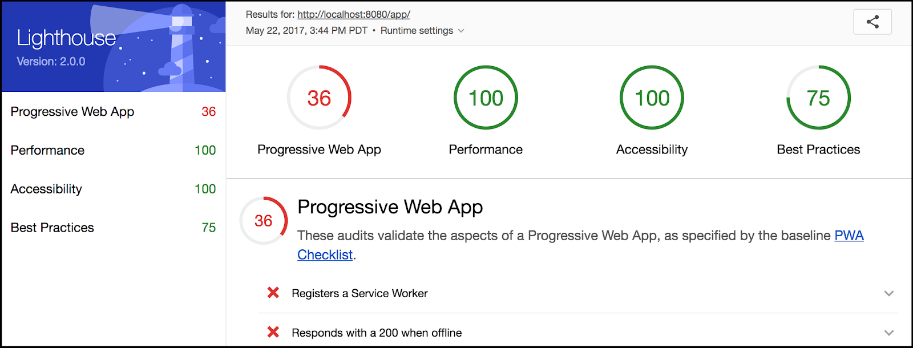
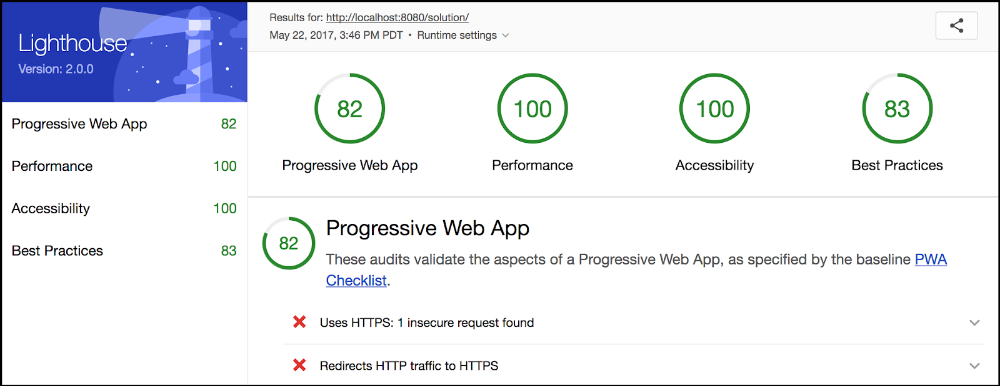

project_path: /web/_project.yaml
book_path: /web/ilt/pwa/_book.yaml

{# wf_auto_generated #}
{# wf_updated_on: 2018-02-15 #}
{# wf_published_on: 2016-01-01 #}


# Lab: Auditing with Lighthouse {: .page-title }


Concepts:  [Lighthouse PWA Analysis Tool](lighthouse-pwa-analysis-tool)

<div id="overview"></div>


## Overview


This lab shows you how you can use  [Lighthouse](/web/tools/lighthouse/), an  [open-source](https://github.com/GoogleChrome/lighthouse) tool from Google, to audit a web app for PWA features. Lighthouse provides a set of metrics to help guide you in building a PWA with a full application-like experience for your users.

#### What you will learn

* How to use Lighthouse to audit your progressive web apps

#### What you should know

* Basic JavaScript and HTML

#### What you need before you begin

* Connection to the internet
*  [Chrome](https://www.google.com/chrome/browser/desktop/) 52+ browser
* Node v6+
* A text editor

<div id="1"></div>


## 1. Get set up


If you have not downloaded the repository, installed Node, and started a local server, follow the instructions in [Setting up the labs](setting-up-the-labs).

Open your browser and navigate to __localhost:8080/lighthouse-lab/app__.


Note: <a href="tools-for-pwa-developers#unregister">Unregister</a> any service workers and <a href="tools-for-pwa-developers#clearcache">clear all service worker caches</a> for localhost so that they do not interfere with the lab.


If you have a text editor that lets you open a project, open the __lighthouse-lab/app__ folder. This will make it easier to stay organized. Otherwise, open the folder in your computer's file system. The __app__ folder is where you will be building the lab.

This folder contains:

* __css/main.css__ is the cascading stylesheet for the application
* __images__ folder contains images for the app and home screen icon
* __index.html__ is the main HTML page for our sample site/application

<div id="2"></div>


## 2. Install Lighthouse


Lighthouse is available as a Chrome extension for  [Chrome](https://www.google.com/chrome/browser/desktop/index.html) 52 and later.

Download the Lighthouse Chrome extension from the  [Chrome Web Store](http://chrome.google.com/webstore/detail/lighthouse/blipmdconlkpinefehnmjammfjpmpbjk). When installed it places an   icon in your taskbar.

<div id="3"></div>


## 3. Test the app


In the browser (on the __app__ page) click the Lighthouse icon and choose __Generate report__ (you may be prompted to close Developer Tools if they are open).

Lighthouse runs the report and generates an HTML page with the results. The report page should look similar to this:




Note: The UI for Lighthouse is still being updated, so your report may not look exactly like this one.


Looks like we have a pretty low score (your score may not match exactly). Take a moment to look through the report and see what is missing.

<div id="4"></div>


## 4. Adding a manifest file


The report indicates that we need a manifest file.

### 4.1 Create the manifest file

Create an empty file called __manifest.json__ in the __app__ directory.

Replace TODO 4.1 in __index.html__ with the following:

#### index.html

```
<!-- Web Application Manifest -->
<link rel="manifest" href="manifest.json">
```

### 4.2 Add manifest code

Add the following to the __manifest.json__ file:

#### manifest.json

```
{
  "name": "Demo Blog Application",
  "short_name": "Blog",
  "start_url": "index.html",
  "icons": [{
        "src": "images/touch/icon-128x128.png",
        "sizes": "128x128",
        "type": "image/png"
      }, {
        "src": "images/touch/icon-192x192.png",
        "sizes": "192x192",
        "type": "image/png"
      }, {
        "src": "images/touch/icon-256x256.png",
        "sizes": "256x256",
        "type": "image/png"
      }, {
        "src": "images/touch/icon-384x384.png",
        "sizes": "384x384",
        "type": "image/png"
      }, {
        "src": "images/touch/icon-512x512.png",
        "sizes": "512x512",
        "type": "image/png"
      }],
  "background_color": "#3E4EB8",
  "display": "standalone",
  "theme_color": "#2E3AA1"
}
```

### 4.3 Add tags for other browsers

Replace TODO 4.3 in <strong>index.html</strong> with the following:

#### index.html

```
<!-- Chrome for Android theme color -->
<meta name="theme-color" content="#2E3AA1">

<!-- Add to homescreen for Chrome on Android -->
<meta name="mobile-web-app-capable" content="yes">
<meta name="application-name" content="Blog">
<link rel="icon" sizes="192x192" href="images/touch/icon-192x192.png">

<!-- Add to homescreen for Safari on iOS -->
<meta name="apple-mobile-web-app-capable" content="yes">
<meta name="apple-mobile-web-app-status-bar-style" content="black">
<meta name="apple-mobile-web-app-title" content="Blog">
<link rel="apple-touch-icon" href="images/touch/icon-192x192.png">

<!-- Tile for Win8 -->
<meta name="msapplication-TileColor" content="#3372DF">
<meta name="msapplication-TileImage" content="images/touch/icon-192x192.png">
```

#### Explanation

We have created a manifest file and "add to homescreen" tags. Don't worry about the details of the manifest and these tags. Here is how they work:

1. Chrome uses __manifest.json__ to know how to style and format some of the progressive parts of your app, such as the "add to homescreen" icon and splash screen.
2. Other browsers don't (currently) use the __manifest.json__ file to do this, and instead rely on HTML tags for this information. While Lighthouse doesn't require these tags, we've added them because they are important for supporting as many browsers as possible.

This lets us satisfy the manifest related requirements of Lighthouse (and a PWA).

#### For more information

*  [Add to home screen](https://developer.chrome.com/multidevice/android/installtohomescreen)
*  [Web app manifests](/web/updates/2014/11/Support-for-installable-web-apps-with-webapp-manifest-in-chrome-38-for-Android)

<div id="5"></div>


## 5. Adding a service worker


We can see from the report that having a service worker is necessary.

### 5.1 Register a service worker

Create an empty JavaScript file in the root directory (__app__) and name it __service-worker.js__. This is going to be our service worker file.

Now replace TODO 5.1 in <strong>index.html</strong> with the following and save the file:

#### index.html

```
<script>
  (function() {
    if (!('serviceWorker' in navigator)) {
      console.log('Service worker not supported');
      return;
    }
    navigator.serviceWorker.register('service-worker.js')
    .then(function(registration) {
      console.log('SW successfully registered');
    })
    .catch(function(error) {
      console.log('registration failed', error);
    });
  })();
</script>
```

### 5.2 Caching offline & start pages

The report also indicates that our app must respond with a 200 when offline and must have our starting URL ("start_url") cached.

Add the following code to the empty __service-worker.js__ file (which should be at __app/service-worker.js__):

#### service-worker.js

```
self.addEventListener('install', function(event) {
  event.waitUntil(
    caches.open('static-cache-v1')
    .then(function(cache) {
      return cache.addAll([
        '.',
        'index.html',
        'css/main.css',
        'https://fonts.googleapis.com/css?family=Roboto:300,400,500,700',
        'images/still_life-1600_large_2x.jpg',
        'images/still_life-800_large_1x.jpg',
        'images/still_life_medium.jpg',
        'images/still_life_small.jpg'
      ]);
    })
  );
});

self.addEventListener('fetch', function(event) {
  event.respondWith(caches.match(event.request)
  .then(function(response) {
      if (response) {
        return response;
      }
      return fetch(event.request);
    })
  );
});
```

Save the file and refresh the page (for the app, not the Lighthouse page). Check the console and confirm that the service worker has registered successfully.

#### Explanation

We have created a service worker for our app and registered it. Here is what it does:

1. The first block (`install` event listener) caches the files our app's files, so that they are saved locally. This lets us access them even when offline, which is what the next block does.
2. The second block (`fetch` event listener) intercepts requests for resources and checks first if they are cached locally. If they are, the browser gets them from the cache without needing to make a network request. This lets us respond with a 200 even when offline.

Once we have loaded the app initially, all the files needed to run the app are saved in the cache. If the page is loaded again, the browser grabs the files from the cache regardless of network conditions. This also lets us satisfy the requirement of having our starting URL (__index.html__) cached.

#### Solution code

To get a copy of the working code, navigate to the __solution__ folder.

<div id="6"></div>


## 6. Test the updated app


Now we need to retest the app to see our changes. Return to the localhost page where that app is hosted. Click the Lighthouse icon and generate a report (you may be prompted to close Developer Tools if they are still open).

Now we should have passed many more tests.


Note: You may need to <a href="tools-for-pwa-developers#disablehttpcache">disable the browser cache</a> to see the improved results. Then refresh the app and run Lighthouse again.


 The report should look something like this:



Now our score is much better (your score may not match exactly).

You can see that we are still missing the HTTPS requirements, since we are using a local server. In production, service workers require HTTPS, so you'll need to use that.

<div id="7"></div>


## 7. Optional: Run Lighthouse from the command line


If you want to run Lighthouse from the command line (for example, to integrate it with a build process) it is available as a Node module that you can install from the terminal.

If you haven't already,  [download Node](https://nodejs.org/en/) and select the Long Term Support (LTS) version that best suits your environment and operating system (Lighthouse requires Node v6 or greater).

Install Lighthouse's Node module from the command line:

    npm install -g lighthouse


Run Lighthouse on a demo progressive web app:

    lighthouse https://airhorner.com/


Or on the app that you just made (note that your localhost port may be different):

    lighthouse http://localhost:8080/lighthouse-lab/app/

You can check Lighthouse flags and options with:

    lighthouse --help

The lighthouse command line tool will generate an HTML (the same as the Chrome extension) in the working directory. You can then open the file with your browser.

<div id="8"></div>


## Congratulations!


You have learned how to use the Lighthouse tool to audit your progressive web apps.


