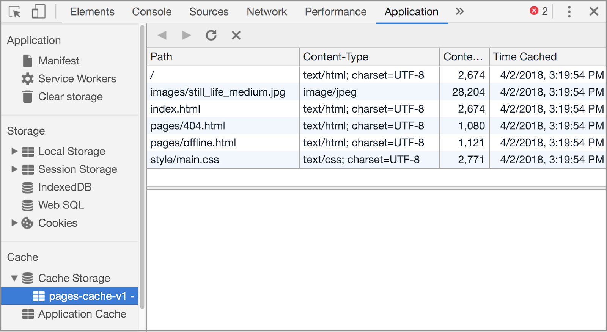

project_path: /web/_project.yaml
book_path: /web/ilt/pwa/_book.yaml

{# wf_auto_generated #}
{# wf_blink_components: N/A #}
{# wf_updated_on: 2019-04-26 #}
{# wf_published_on: 2016-01-01 #}


# Lab: Caching Files with Service Worker {: .page-title }



<div id="overview"></div>


## Overview


This lab covers the basics of caching files with the service worker. The technologies involved are the  [Cache API](https://developer.mozilla.org/en-US/docs/Web/API/Cache) and the  [Service Worker API](https://developer.mozilla.org/en-US/docs/Web/API/Service_Worker_API). See the  [Caching files with the service worker](caching-files-with-service-worker) doc for more examples using the Cache API. See  [Introduction to Service Worker](introduction-to-service-worker) and  [Lab: Scripting the service worker](lab-scripting-the-service-worker) to learn the basics of service workers.

#### What you will learn

* How to use the Cache API to access and manipulate data in the cache
* How to cache an application shell and offline pages
* How to intercept network requests and respond with resources in the cache
* How to remove unused caches on service worker activation

#### What you should know

* Basic JavaScript and HTML
* Familiarity with the concept and basic syntax of ES2015  [Promises](/web/fundamentals/getting-started/primers/promises)

#### What you will need

* Computer with terminal/shell access
* Connection to the internet
* A  [browser that supports `caches`](https://jakearchibald.github.io/isserviceworkerready/#caches)
* A text editor

<div id="get-set-up"></div>


## 1. Get set up


If you have not downloaded the repository and installed the  [LTS version of Node.js](https://nodejs.org/en/), follow the instructions in [Setting up the labs](setting-up-the-labs).

Navigate into the `cache-api-lab/app/` directory and start a local development server:

    cd cache-api-lab/app
    npm install
    node server.js

You can terminate the server at any time with `Ctrl-c`.

Open your browser and navigate to `localhost:8081/`. You should see a simple picture blog site.

Note: [Unregister](tools-for-pwa-developers#unregister) any service workers and [clear all service worker caches](tools-for-pwa-developers#clearcache) for localhost so that they do not interfere with the lab. In Chrome DevTools, you can achieve this by clicking __Clear site data__ from the __Clear storage__ section of the __Application__ tab.

Open the `cache-api-lab/app/` folder in your preferred text editor. The `app/` folder is where you will be building the lab.

This folder contains:

* `images/` folder contains sample images
* `pages/` folder contains sample pages and a custom offline page
* `style/` folder contains the app's cascading stylesheet
* `index.html` is the main HTML page for our sample site/application
* `package.json` and `package-lock.json` track dependencies for the local development server
* `server.js` configures a local development server
* `sw.js` is the service worker file where we set up the interactions with the cache (currently empty)

<div id="cache-the-application-shell"></div>


## 2. Cache the application shell


The service worker's "install" event is a strategic time to cache static assets. Caching the application shell on install ensures that the service worker has access to all shell assets (if any assets fail to cache, the service worker installation is aborted).

Paste the following code into `sw.js` to cache the application shell during the install event:

```
const filesToCache = [
  '/',
  'style/main.css',
  'images/still_life_medium.jpg',
  'index.html',
  'pages/offline.html',
  'pages/404.html'
];

const staticCacheName = 'pages-cache-v1';

self.addEventListener('install', event => {
  console.log('Attempting to install service worker and cache static assets');
  event.waitUntil(
    caches.open(staticCacheName)
    .then(cache => {
      return cache.addAll(filesToCache);
    })
  );
});
```

Save the code and reload the page in the browser. [Activate the new service worker](tools-for-pwa-developers#update) and then [open cache storage](tools-for-pwa-developers#storage) in the browser. You should see the files appear in the table. You may need to refresh the cache for the changes to appear. In Chrome, the cache storage section of developer tools should look like:



Note: In Chrome, you can [delete the cache](tools-for-pwa-developers#clearcache) in DevTools.

#### Explanation

We first define the files to cache and assign them to the `filesToCache` variable. These files make up the "application shell" (the static HTML,CSS, and image files that give your app a unified look and feel). We also assign a cache name to a variable so that updating the cache name (and by extension the cache version) happens in one place.

In the install event handler we create the cache with  [`caches.open`](https://developer.mozilla.org/en-US/docs/Web/API/CacheStorage/open) and use the  [`addAll` method](https://developer.mozilla.org/en-US/docs/Web/API/Cache/addAll) to add the files to the cache. We wrap this in  [`event.waitUntil`](https://developer.mozilla.org/en-US/docs/Web/API/ExtendableEvent/waitUntil) to extend the lifetime of the event until all of the files are added to the cache and `addAll` resolves successfully.

#### For more information

*  [The Application Shell](introduction-to-progressive-web-app-architectures)
*  [The install event - MDN](https://developer.mozilla.org/en-US/docs/Web/API/InstallEvent)

<div id="serve-files-from-the-cache"></div>


## 3. Serve files from the cache


Now that we have the files cached, we can intercept requests for those files from the network and respond with the files from the cache.

Add the following fetch listener in `sw.js`:

```
self.addEventListener('fetch', event => {
  console.log('Fetch event for ', event.request.url);
  event.respondWith(
    caches.match(event.request)
    .then(response => {
      if (response) {
        console.log('Found ', event.request.url, ' in cache');
        return response;
      }
      console.log('Network request for ', event.request.url);
      return fetch(event.request)

      // TODO 4 - Add fetched files to the cache

    }).catch(error => {

      // TODO 6 - Respond with custom offline page

    })
  );
});
```

Save the code and [activate the updated service worker](tools-for-pwa-developers#update) in the browser. Refresh the page to see the network requests being logged to the console. Now take the app offline by terminating the server with `Ctrl+c` and refresh the page. The page should load normally!

#### Explanation

The `fetch` event listener intercepts all requests. We use  [`event.respondWith`](https://developer.mozilla.org/en-US/docs/Web/API/FetchEvent/respondWith) to create a custom response to the request. Here we are using the  [Cache falling back to network](/web/fundamentals/instant-and-offline/offline-cookbook/#cache-falling-back-to-network) strategy: we first check the cache for the requested resource (with  [`caches.match`](https://developer.mozilla.org/en-US/docs/Web/API/Cache/match)) and then, if that fails, we send the request to the network.

#### For more information

*  [caches.match - MDN](https://developer.mozilla.org/en-US/docs/Web/API/Cache/match)
*  [The Fetch API](working-with-the-fetch-api)
*  [The fetch event - MDN](https://developer.mozilla.org/en-US/docs/Web/API/FetchEvent)

<div id="add-network-responses-to-the-cache"></div>


## 4. Add network responses to the cache


In addition to caching predetermined files, we can also dynamically add files to the cache as they are requested.

Replace TODO 4 in the `fetch` event handler with code to dynamically cache files:

```
.then(response => {
  // TODO 5 - Respond with custom 404 page
  return caches.open(staticCacheName).then(cache => {
    cache.put(event.request.url, response.clone());
    return response;
  });
});
```

Save the file. Take the app back online by restarting the server (`node server.js`) and [activate the updated service worker](tools-for-pwa-developers#update). Visit one of the links on the homepage, then take the app offline again. Now if you reload the visited page, it should load normally! Try navigating to the pages you haven't visited before to confirm that they don't work offline.

Take the app back online before continuing.

#### Explanation

Here we are taking the responses returned from the network requests and putting them into the cache.

We need to pass a `clone` of the response to `cache.put`, because the response is a  [stream](https://developer.mozilla.org/en-US/docs/Web/API/ReadableStream) and can only be read once. See Jake Archibald's  [What happens when you read a response](https://jakearchibald.com/2014/reading-responses/) article for a more comprehensive explanation.

#### For more information

*  [Cache.put - MDN](https://developer.mozilla.org/en-US/docs/Web/API/Cache/put)

<div id="optional-respond-with-custom-404-page"></div>


## 5. Optional: Respond with custom 404 page


Below TODO 5 in `service-worker.js`, write your own code to respond with the `404.html` page from the cache if the response status is `404`. You can check the response status with `response.status`.

To test your code, save what you've written and then [update the service worker](tools-for-pwa-developers#update) in the browser. Click the __Non-existent file__ link to request a resource that doesn't exist.

#### Explanation

Network response errors do not cause a `fetch` promise to reject. Instead, `fetch` promises resolve with the response object containing the network error code. This means we handle network errors explicitly by checking the response `status`. `fetch` promises only reject when the browser cannot reach the network in the first place (user is offline).

Note: When intercepting a network request and serving a custom response, the service worker does not redirect the user to the address of the new response. The response is served at the address of the original request. For example, if the user requests a nonexistent file at `www.example.com/non-existent.html` and the service worker responds with a custom 404 page, `404.html`, the custom page will display at `www.example.com/non-existent.html`, not `www.example.com/404.html`.

#### For more information

*  [Response.status - MDN](https://developer.mozilla.org/en-US/docs/Web/API/Response/status)
*  [Response status codes - MDN](https://developer.mozilla.org/en-US/docs/Web/HTTP/Status)
*  [Response.ok - MDN](https://developer.mozilla.org/en-US/docs/Web/API/Response/ok)

#### Solution code

The solution code can be found in the `05-404-page/` directory.

<div id="optional-respond-with-custom-offline-page"></div>


## 6. Optional: Respond with custom offline page


Below TODO 6 in `sw.js`__,__ update the `.catch` block to respond with the `offline.html` page from the cache. The catch will trigger if the fetch to the network fails.

To test your code, save what you've written and then update the service worker in the browser. [Take the app offline](tools-for-pwa-developers#offline) and navigate to a page you haven't visited before to see the custom offline page.

#### Explanation

If `fetch` cannot reach the network, it rejects with an error and triggers the `.catch`.

#### Solution code

The solution code can be found in the `06-offline-page/` directory.

<div id="delete-outdated-caches"></div>


## 7. Delete outdated caches


We can get rid of unused caches in the service worker "activate" event.

Add the following activate event listener to `sw.js`:

```
self.addEventListener('activate', event => {
  console.log('Activating new service worker...');

  const cacheWhitelist = [staticCacheName];

  event.waitUntil(
    caches.keys().then(cacheNames => {
      return Promise.all(
        cacheNames.map(cacheName => {
          if (cacheWhitelist.indexOf(cacheName) === -1) {
            return caches.delete(cacheName);
          }
        })
      );
    })
  );
});
```

Change the name of the cache to "pages-cache-v2":

```
var staticCacheName = 'pages-cache-v2';
```

Save the file and [update the service worker](tools-for-pwa-developers#update) in the browser. [Inspect the cache storage](tools-for-pwa-developers#storage) in your browser. You should see just the new cache. The old cache, `pages-cache-v1`, has been removed.

#### Explanation

It's important to remove outdated resources to conserve space on users' devices. We delete old caches in the `activate` event to ensure that we aren't deleting caches before the new service worker has taken over the page (in case the new service worker activation fails, in which case we don't want to remove the existing service worker's caches). To remove outdated caches, we create an array of caches that are currently in use and delete all other caches.

#### For more information

*  [Promise.all - MDN](https://developer.mozilla.org/en-US/docs/Web/JavaScript/Reference/Global_Objects/Promise/all)
*  [Array.map - MDN](https://developer.mozilla.org/en-US/docs/Web/JavaScript/Reference/Global_Objects/Array/map)

#### Solution code

The solution code can be found in the `solution/` directory.

<div id="congratulations"></div>


## Congratulations!


You have learned how to use the Cache API in the service worker.

### What we've covered

You have learned the basics of using the Cache API in the service worker. We have covered caching the application shell, intercepting network requests and responding with items from the cache, adding resources to the cache as they are requested, responding to network errors with a custom pages, and deleting unused caches.

### Resources

#### Learn more about caching and the Cache API

*  [Cache - MDN](https://developer.mozilla.org/en-US/docs/Web/API/Cache)
*  [The Offline Cookbook](/web/fundamentals/instant-and-offline/offline-cookbook/)

#### Learn more about using service workers

*  [Using Service Workers - MDN](https://developer.mozilla.org/en-US/docs/Web/API/Service_Worker_API/Using_Service_Workers)


