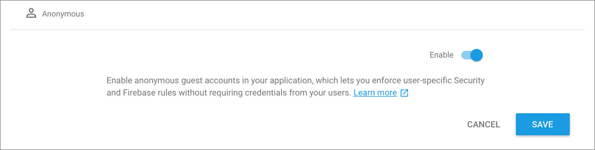
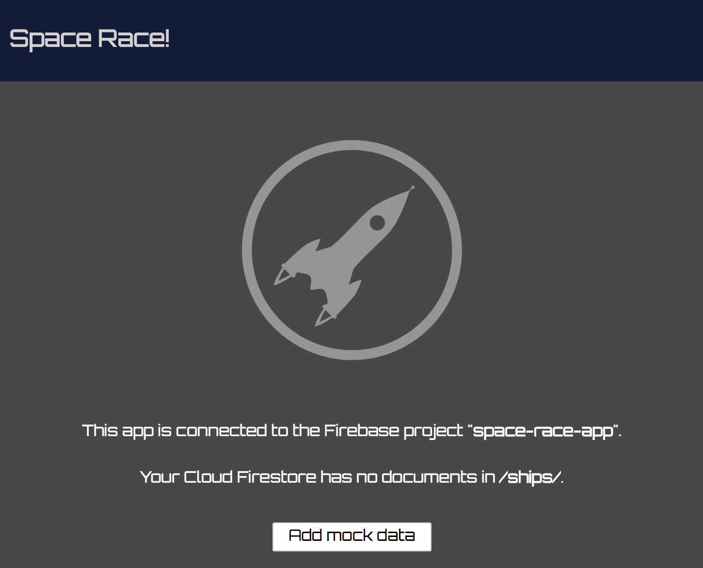
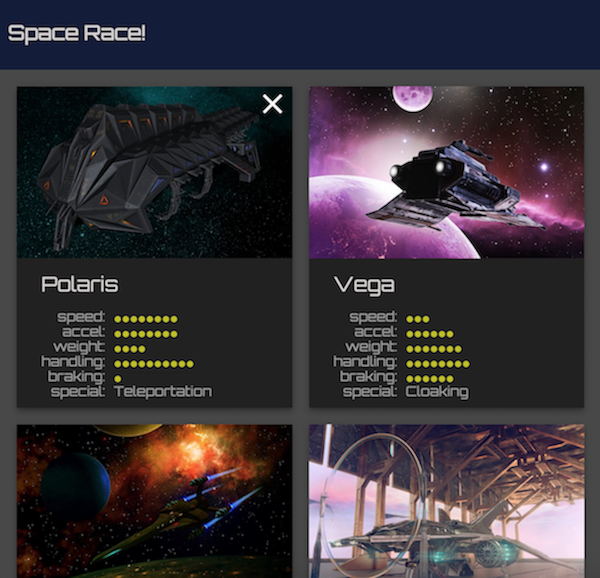

project_path: /web/_project.yaml
book_path: /web/ilt/pwa/_book.yaml

{# wf_auto_generated #}
{# wf_blink_components: N/A #}
{# wf_updated_on: 2019-04-26 #}
{# wf_published_on: 2016-01-01 #}


# Lab: Cloud Firestore {: .page-title }



<div id="overview"></div>


## Overview


#### What you'll learn

* How to set up a Cloud Firestore project on Firebase
* Basic reads and writes with Firestore
* (Optional) How to use Cloud Firestore offline

#### What you should already know

* Basic HTML, CSS, and JavaScript
* ES2015 Promises
* How to run commands from the command line
* (For an optional section) Familiarity with service workers and Workbox

#### What you will need

* Computer with terminal/shell access
* Connection to the internet
* A text editor
*  [Node](https://nodejs.org/en/) and  [npm](https://www.npmjs.com/)

<div id="get-set-up"></div>


## 1. Get set up


If you have not already downloaded the repository, follow the instructions in [Setting up the labs](setting-up-the-labs). You don't need to start the server for this lab.

Open the `firestore-lab/project/` folder in your preferred text editor. The `project/` folder is where you will be building the lab.

<div id="set-up-a-cloud-firestore-project"></div>


## 2. Set up a Cloud Firestore project


Create a new Cloud Firestore project:

1. Open the  [Firebase Console](https://console.firebase.google.com/) and create a new project.
2. In the __Database__ section, click __Try Firestore Beta__.
3. Check the "Start in __test mode__" option
4. Click __Enable__

Note: You can't use both Cloud Firestore and Cloud Datastore in the same project, which might affect apps using App Engine. If your project already uses Cloud Datastore, try using Cloud Firestore with a different project.

Then add the following scripts to `index.html` just before the closing `</body>` tag:

#### index.html

```
<script src="/__/firebase/4.9.0/firebase-app.js"></script>
<script src="/__/firebase/4.9.0/firebase-auth.js"></script>
<script src="/__/firebase/4.9.0/firebase-firestore.js"></script>
<script src="/__/firebase/init.js"></script>
```

This code imports the required libraries when the app is hosted using Firebase Hosting.

<div id="install-the-firebase-tools-and-configure-the-project"></div>


## 3. Install the Firebase tools and configure the project


You'll need to get a Cloud Firestore enabled version of the Firebase CLI.

Open a command line window and change directories into the `project/` folder.

Then, run the following command:

    npm install -g firebase-tools

After the tools have finished installing, log in to allow the Firebase CLI to interact with your firebase project.

    firebase login

Then run the following command in the `project/` directory to create the configuration files and initialize the Firebase app:

    firebase init

After running the above command, a prompt should appear in the terminal. Follow the prompts as described below:

1. Select Firestore (by moving the cursor to the Firestore option and pressing Space) and press `return`
2. Select the Firebase project we just created and press `return`
3. Press `return` to use the default file for Firestore rules
4. Press `return` to use the default file for Firestore indexes

Now if we run our web app it will automatically know what Firebase (and Firestore) project to use, but we have a couple more steps before we can serve our app.

Open the `firebase.json` file and add in the `hosting` configuration. The whole file should look like the following:

#### firebase.json

```
{
  "hosting": {
    "public": "./",
    "ignore": [
      "firebase.json",
      "database-rules.json",
      "storage.rules",
      "functions"
    ],
    "headers": [
      {
        "source": "**/*.@(js|html)",
        "headers": [
          {
            "key": "Cache-Control",
            "value": "max-age=0"
          }
        ]
      }
    ],
    "rewrites": [
      {
        "source": "**",
        "destination": "/index.html"
      }
    ]
  },
  "firestore": {
    "rules": "firestore.rules",
    "indexes": "firestore.indexes.json"
  }
}
```

#### Explanation

The `hosting` config lets you define how Firebase will host your app. We must define this option in order to use the Firebase development server, which we do in a later step. See the  [Deployment Configuration](https://firebase.google.com/docs/hosting/full-config#section-full-firebasejson) reference for more information.

<div id="enable-firebase-authentication"></div>


## 4. Enable Firebase Authentication


Although authentication isn't the focus of this codelab, it's important to have some form of authentication in our app. We'll use Anonymous login - this means the user will be silently logged in without being prompted.

You can enable  [Anonymous authentication](https://firebase.google.com/docs/auth/web/anonymous-auth) in your app using the Firebase Console. Run the following command to be automatically taken to the __Sign-in providers__ configuration page.

```
firebase open auth
```

Alternatively, in the Firebase Console for your project go to __Develop > Authentication > Sign-In Method__.

Once on this page, click on __Anonymous__, then click __Enable__ and click __Save__:



<div id="run-the-local-server"></div>


## 5. Run the Local Server


We're ready to actually start work on our app! Let's run it locally with the `firebase` command:

```
firebase serve
```

Now open your browser and view `localhost:5000`. You'll see your copy of __Space Race!__ which has been connected to your Firebase project.



The app has automatically connected to our project and silently logged us in as an anonymous user.

<div id="write-data-to-firestore"></div>


## 6. Write data to Firestore


In this section we'll write some data to Firestore so that we can populate the app's UI. This can be done manually via the Firebase console, but we'll do it in the app itself to demonstrate a basic Firestore write.

The primary model object in our app is a spaceship. Firestore data is represented by documents, which are organized into collections and subcollections. In this app, we will store each ship as a document in a top-level collection called "ships". You can learn more about the Firestore data model in the  [documentation](https://firebase.google.com/docs/firestore/data-model).

Our app's Cloud Firestore database doesn't currently have any data. In the Firebase Console for your project go to __Develop > Database__ and observe that the database is empty.

Let's implement the function to add data to our app.

Open `scripts/SpaceRace.Data.js` and find the function `SpaceRace.prototype.addShip`. Replace the entire function with the code below:

#### SpaceRace.Data.js

```
SpaceRace.prototype.addShip = function(data) {
  const collection = firebase.firestore().collection('ships');
  return collection.add(data);
};
```

The code above adds a new document to the `ships` Firestore collection. The function first gets a reference to the `ships` collection and then `add`'s the `data`. The document `data` comes from a plain JavaScript object.

### Security rules

We're almost there - before we can write documents to Cloud Firestore we need to configure Firestore's security rules. These rules describe which parts of our database should be readable and writable, and by which users. For now, we'll allow all authenticated users to read and write to the entire database. This is a little too permissive for a production app, but during the development process we want something relaxed enough so we won't constantly run into authentication issues while experimenting.

Open the file called `firestore.rules` and replace the whole file with the following code:

#### firestore.rules

```
service cloud.firestore {
  match /databases/{database}/documents {
    match /{document=**} {
      // Only authenticated users can read or write data
      allow read, write: if request.auth != null;
    }
  }
}
```

Then run the following in the command line:

```
firebase deploy --only firestore:rules
```

This will deploy the `firestore.rules` file to our Firebase project.

Alternatively, you could open the Firebase console and navigate to __Develop > Database > Rules__ and replace the default rules with our new rules.

Note: If you'd like to learn more about security rules, have a look at the  [security rules documentation](https://firebase.google.com/docs/firestore/security/get-started).

Refresh the page and tap the "__Add Mock Data__" button. This button calls the `addMockShips` function defined in `SpaceRace.Mock.js`, which uses the `addShip` function we defined earlier. `addMockShips` creates a batch of ship documents, __although you won't yet see this in the app__. We still need to implement retrieving the data.

Next, navigate to the __Database__ tab in the Firebase console. You should now see new entries in the `ships` collection (you may need to refresh the page):


Congratulations, you have just written data to Cloud Firestore from a web app! In the next section you'll learn how to retrieve data from Firestore and display it in the app.

<div id="display-data-from-firestore"></div>


## 7. Display data from Firestore


In this section you will learn how to retrieve data from Firestore and display it in the app. The two key steps are creating a query and adding a snapshot listener. This listener will be notified of all existing data that matches the query and receive updates in real time.

Let's construct the query that will serve the list of ships. Replace the `SpaceRace.prototype.getAllShips()` method with the following code:

#### SpaceRace.Data.js

```
SpaceRace.prototype.getAllShips = function(render) {
  const query = firebase.firestore()
    .collection('ships')
    .limit(50);
  this.getDocumentsInQuery(query, render);
};
```

In this snippet we create a query which will retrieve up to 50 ships of the top-level collection named "ships". Once we've declared this query, we pass it to the `getDocumentsInQuery()` method, which is responsible for loading and rendering the data. This method will use a snapshot listener. Replace the `SpaceRace.prototype.getDocumentsInQuery()` method with the following code:

#### SpaceRace.Data.js

```
SpaceRace.prototype.getDocumentsInQuery = function(query, render) {
  query.onSnapshot(snapshot => {
    if (!snapshot.size) return render();
    snapshot.docChanges.forEach(change => {
      if (change.type === 'added') {
        render(change.doc);
      }
      else if (change.type === 'removed') {
        document.getElementById(change.doc.id).remove();
      }
    });
  });
};
```

The `query.onSnapshot` in the code above triggers its callback argument every time there is a change to the result of the query. The first time, the callback is triggered with the entire result set of the query, which is the complete `ships` collection from Firestore. Individual document changes have a `type` property, indicating how they have changed. If a document is `added`, then the document is passed to the `render` function. If the document was `removed`, the corresponding ship card is removed from the DOM.

Now that we've implemented both data retrieval methods, refresh the app and verify that the ships we added to Cloud Firestore (and see in the Firestore console) are now visible in the app. If you completed this section successfully, your app is now reading and writing data with Cloud Firestore!

Try adding your own custom ships by filling out the app's form and clicking "Add". As your list of ships changes, this listener will keep updating automatically. Now try going to the Firebase Console and adding a ship by hand - you'll see it show up on your site immediately!

Note: It is also possible to fetch documents from Firestore once, rather than listening for real time updates using the `Query.get()` method.



<div id="delete-data-from-firestore"></div>


## 8. Delete data from Firestore


Let's write a function to delete specific ships from the collection.

Replace the `SpaceRace.prototype.deleteShip()` method in `SpaceRace.Data.js` with the following code:

#### SpaceRace.Data.js

```
SpaceRace.prototype.deleteShip = function(id) {
  const collection = firebase.firestore().collection('ships');
  return collection.doc(id).delete()
    .catch(function(error) {
      console.error('Error removing document: ', error);
    });
};
```

Once you've implemented this, you'll be able to delete specific ships by clicking on the "X" in the top right corner of the ship's card. Save the file, refresh the app, and try deleting a ship.

<div id="optional-take-the-app-offline"></div>


## 9. Optional: Take the app offline


Cloud firestore also supports offline data persistence, which caches a local copy of your app's data that can be modified when users are offline, and synced once connectivity is restored. Combined with  [service workers](/web/fundamentals/primers/service-workers/), we can update our app to work offline.

Create a file called `sw.js` at the root of the `project/` directory with the following code:

```
importScripts('https://storage.googleapis.com/workbox-cdn/releases/3.4.1/workbox-sw.js');

if (workbox) {

  // Pre-cache HTML, CSS, and image assets
  workbox.precaching.precacheAndRoute([
    {
      "url": "index.html",
      "revision": "a7a5b45e7a48ecf2cb10fd8bddf70342"
    },
    {
      "url": "style/main.css",
      "revision": "7ca18ea2f5608b3c3f67339a57a4fc8e"
    },
    {
      "url": "images/delete.svg",
      "revision": "840ae217e9fe8c73c6d76286aefef63f"
    },
    {
      "url": "images/rocket-form.svg",
      "revision": "6bcd12b01e14547c1f9e0069c3da5f0d"
    },
    {
      "url": "images/rocket-icon.png",
      "revision": "f61c19851368484e8cb7efebf4d26a77"
    },
    {
      "url": "images/rocket.svg",
      "revision": "19df337059a0d6420869bcd20bdc6fab"
    },
    {
      "url": "images/ship_0.jpg",
      "revision": "58bb2ed6c80b6ca362c18515f07f2aee"
    },
    {
      "url": "images/ship_1.jpg",
      "revision": "94895878d03c00fae4f19583efb53ad2"
    },
    {
      "url": "images/ship_2.jpg",
      "revision": "992f720b3d4d3d21c83a7e71057effc9"
    },
    {
      "url": "images/ship_3.jpg",
      "revision": "06c2a683898186f728c564c9e518d16c"
    },
    {
      "url": "images/ship_4.jpg",
      "revision": "04673dcead6d46a65fdfb7c78984afd8"
    },
    {
      "url": "images/ship_5.jpg",
      "revision": "d08b0352c8971af5f881dcde0542ed97"
    },
    {
      "url": "images/ship_6.jpg",
      "revision": "0ccd8c0c257264e0496eed72d4beb936"
    },
    {
      "url": "images/ship_7.jpg",
      "revision": "af52e423fd57b2205c95bd308d50663e"
    },
    {
      "url": "images/ship_8.jpg",
      "revision": "00a5102cdfac3dbc041fb5b286e6b0e7"
    },
    {
      "url": "images/ship_9.jpg",
      "revision": "4b57c477216cb8c106b0c09ee9376249"
    }
  ]);

  // Force update of newest service worker
  workbox.skipWaiting();
  workbox.clientsClaim();

  // Google Fonts
  workbox.routing.registerRoute(
    new RegExp('https://fonts.(?:googleapis|gstatic).com/(.*)'),
    workbox.strategies.staleWhileRevalidate()
  );

  // Material Design & navigation library
  workbox.routing.registerRoute(
    new RegExp('https://unpkg.com/(.*)'),
    workbox.strategies.staleWhileRevalidate()
  );

  // App scripts
  workbox.routing.registerRoute(
    new RegExp('/scripts/(.*)'),
    workbox.strategies.staleWhileRevalidate()
  );

  // Firebase libraries
  workbox.routing.registerRoute(
    new RegExp('http://localhost:5000/__/firebase'),
    workbox.strategies.staleWhileRevalidate()
  );

} else {
  console.log(`Workbox didn't load 😬`);
}
```

Then add a script just before the closing `body` tag in `index.html` to register the service worker that we just created:

#### index.html

```
  <script>
    if ('serviceWorker' in navigator) {
      window.addEventListener('load', () => {
        navigator.serviceWorker.register('/sw.js')
          .then(reg => {
            console.log('Service worker registered! 😎', reg);
          })
          .catch(err => {
            console.log('😥 Registration failed: ', err);
          });
      });
    }
  </script>
```

Finally, replace the `SpaceRace` function in `SpaceRace.js` with the following code, which calls the `enablePersistence` method:

#### scripts/SpaceRace.js

```
function SpaceRace() {
  firebase.auth().signInAnonymously().then(() => {
    firebase.firestore().enablePersistence()
      .then(() => {
        this.initTemplates();
        this.initRouter();
      });
  }).catch(err => {
    console.log(err);
  });
}
```

Refresh the app in the browser twice (once to install the service worker and once to cache site assets). Then de-active the firebase local server with `Ctrl + c`, and turn off your computer's wifi. Reload the web app and observe that it loads offline. Try adding new ships and deleting existing ships. Restore your wifi connection and restart the server with `firebase serve`. Then reload the page and observe that all of the offline changes have persisted!

Note: Offline-enabled Firestore may not behave as expected if multiple tabs are open. Be sure to test the app in a single tab. See the  [documentation](https://firebase.google.com/docs/firestore/manage-data/enable-offline) for more.

#### Explanation

The supplied service worker uses  [Workbox](/web/tools/workbox/) to cache the site's assets - such as HTML, CSS, and JavaScript - locally on the device. This allows our app to load (very quickly!) even if these resources can't be fetched from the network. If you aren't familiar with service workers, checkout this  [primer](/web/fundamentals/primers/service-workers/) and this  [lab](/web/ilt/pwa/lab-scripting-the-service-worker). To learn more about Workbox, see the  [documentation](/web/tools/workbox/) and this  [Codelab](https://codelabs.developers.google.com/codelabs/workbox-lab/#0).

In addition to using the service worker API for offline resources, we also added the `enablePersistence` method to the function which initializes our app, `SpaceRace`. This configures our Cloud Firestore instance to cache a copy of our Firestore data locally. Using local data has two major advantages:

1. Our app's data loads very quickly, because it's doesn't have to wait for the network.
2. The app can access and modify data even when offline, and sync up changes once connectivity returns.

See the  [documentation](https://firebase.google.com/docs/firestore/manage-data/enable-offline) to learn more about offline persistence in Firestore, including important nuances about security.

<div id="conclusion"></div>


## 10. Conclusion


In this codelab, you learned how to perform basic reads and writes with Firestore, as well as how to secure data access with security rules. You've also learned how to use Cloud Firestore and service workers to enable offline functionality.

To learn more about Firestore, visit the following resources:

*  [Introduction to Cloud Firestore](https://firebase.google.com/docs/firestore/)
*  [Choosing a Data Structure](https://firebase.google.com/docs/firestore/manage-data/structure-data)
*  [Cloud Firestore Web Codelab](https://codelabs.developers.google.com/codelabs/firestore-web/index.html)


