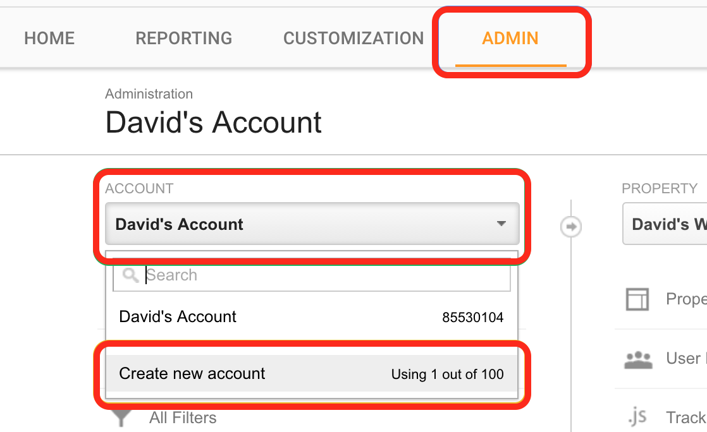
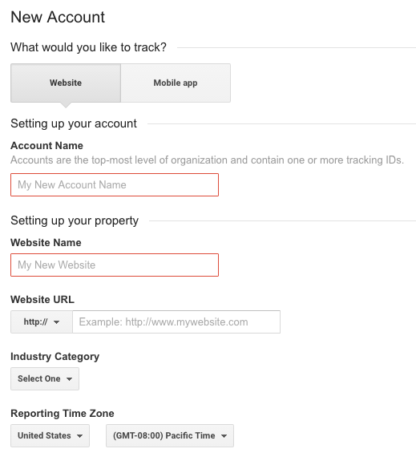
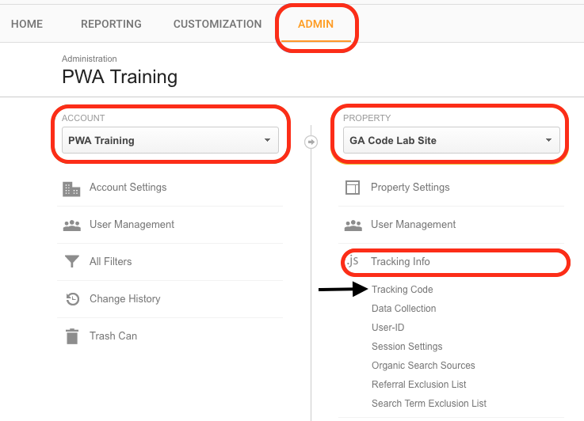
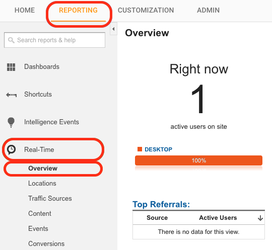
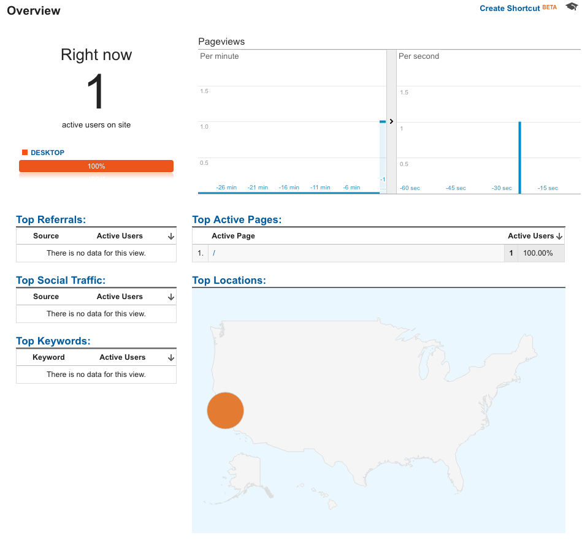
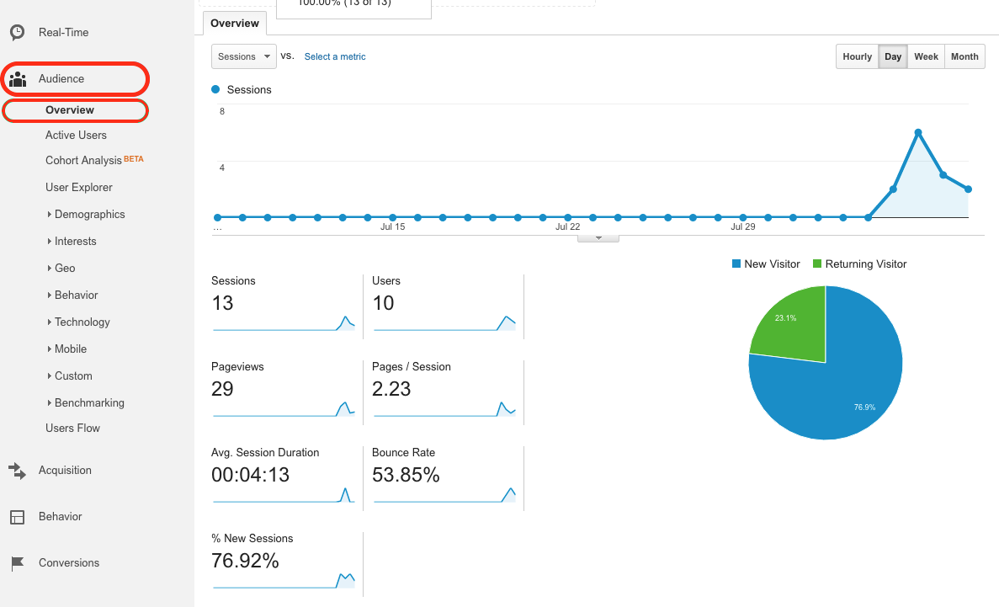
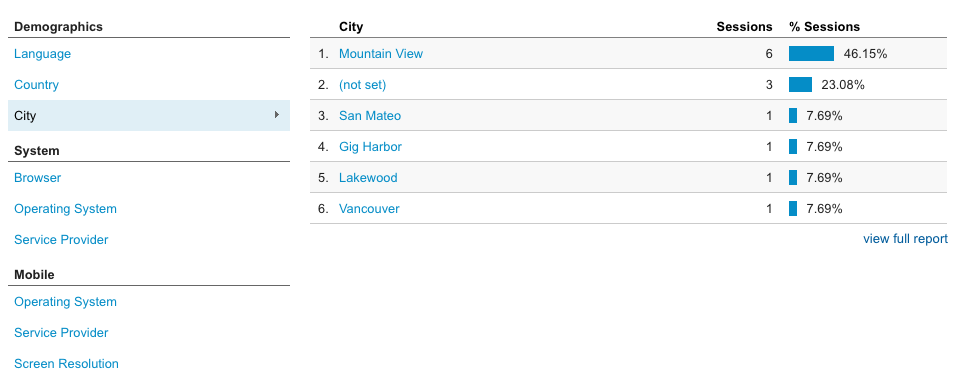
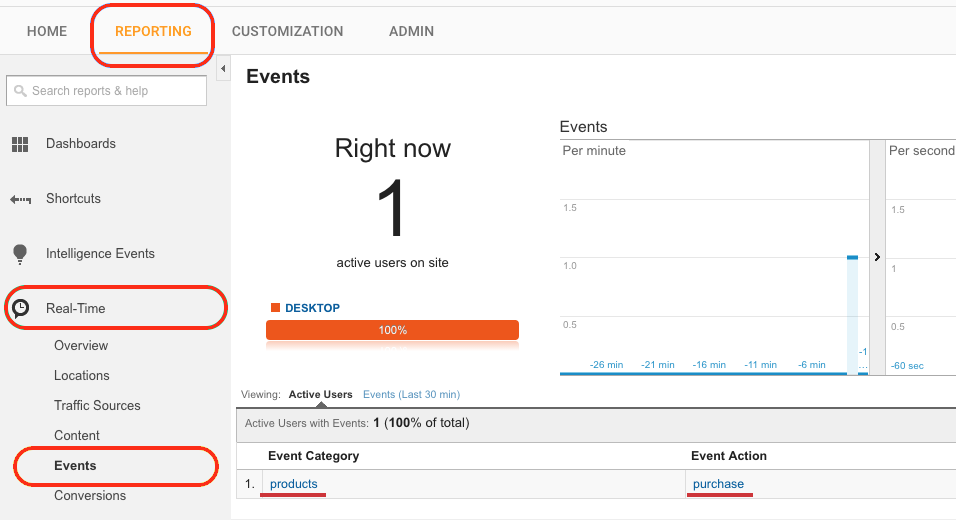
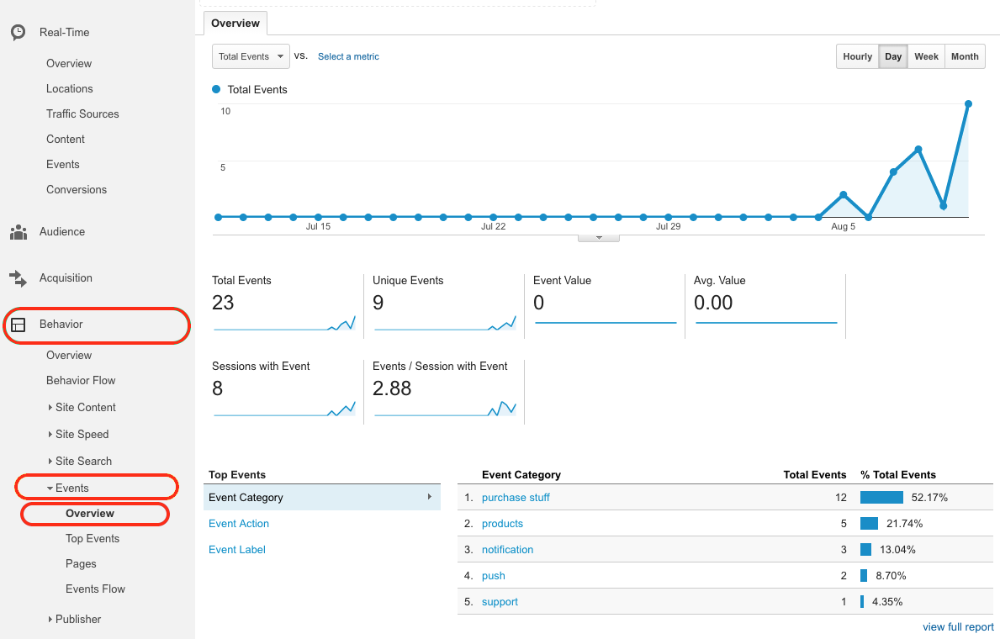
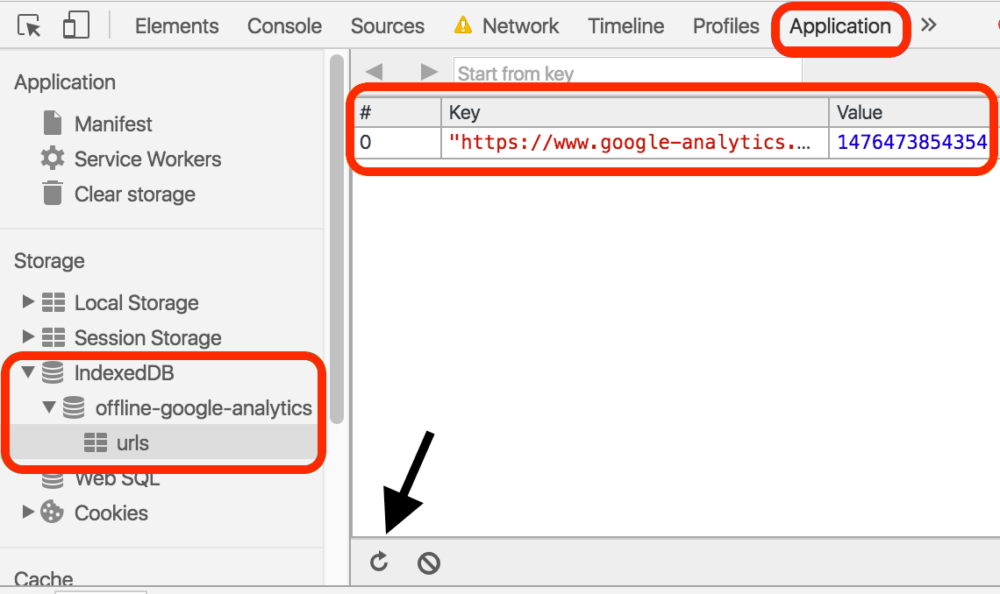

project_path: /web/_project.yaml
book_path: /web/ilt/pwa/_book.yaml

{# wf_auto_generated #}
{# wf_updated_on: 2017-06-21T18:47:58Z #}
{# wf_published_on: 2016-01-01 #}


# Lab: Integrating Analytics {: .page-title }


Concepts:  [Integrating Analytics](integrating-analytics)

<div id="overview"></div>


## Overview


This lab shows you how to integrate Google Analytics into your web apps.

#### What you will learn

* How to create a Google Analytics account
* How to create a Google Firebase account
* How to integrate Google Analytics into a web app
* How to add and track custom events (including push notifications)
* How to use Google Analytics with service workers
* How to use analytics even when offline

#### What you should know

* Basic JavaScript and HTML
* Familiarity with  [Push Notifications](/web/fundamentals/engage-and-retain/push-notifications/)
* Some familiarity with the  [Fetch API](https://developer.mozilla.org/en-US/docs/Web/API/Fetch_API)
* The concept of an  [Immediately Invoked Function Expression](https://en.wikipedia.org/wiki/Immediately-invoked_function_expression) (IIFE)
* How to enable the developer console

#### What you will need

* Computer with terminal/shell access
* Connection to the internet 
* A  [browser that supports push](http://caniuse.com/#search=push)
* A text editor
*  [Node](https://nodejs.org/en/) installed

<div id="1"></div>


## 1. Get set up


If you have not downloaded the repository, installed Node, and started a local server, follow the instructions in [Setting up the labs](setting-up-the-labs).

Open Chrome and navigate to __localhost:8080/google-analytics-lab/app__.


Note: <a href="tools-for-pwa-developers#unregister">Unregister</a> any service workers and <a href="tools-for-pwa-developers#clearcache">clear all service worker caches</a> for localhost so that they do not interfere with the lab.


If you have a text editor that lets you open a project, open the __google-analytics-lab/app__ folder. This will make it easier to stay organized. Otherwise, open the folder in your computer's file system. The __app__ folder is where you will be building the lab.

This folder contains:

* __pages__ folder contains sample resources that we use in experimenting:
* __page-push-notification.html__
* __other.html__
* __images__ folder contains images to style our notifications
* __index.html__ is the main HTML page for our sample site/application
* __main.js__ is the main JavaScript for the app
* __analytics-helper.js__ is an empty helper file
* __sw.js__ is the service worker file
* __manifest.json__ is the manifest for push notifications

In the browser, you should be prompted to allow notifications. If the prompt does not appear, then [manually allow notifications](tools-for-pwa-developers#permissions). You should see a permission status of "granted" in the console.

You should also see that a service worker registration is logged to the console.

The app for this lab is a simple web page that has some  [push notification](/web/fundamentals/engage-and-retain/push-notifications/) code. 

__main.js__ requests notification permission and registers a service worker, __sw.js__. The service worker has listeners for push events and notification events.

__main.js__ also contains functions for subscribing and unsubscribing for push notifications. We will address that later (subscribing to push isn't yet possible because we haven't registered with a push service).

Test the notification code by using developer tools to [send a push notification](tools-for-pwa-developers#push).

A notification should appear on your screen. Try clicking it. It should take you to a sample page.


Note: The developer tools UI is constantly changing and, depending on the browser, may look a little different when you try it.


Note: Simulated push notifications can be sent from the browser even if the subscription object is null.


#### For more information

You can learn how to build the starter app and learn more about push in <a href="lab-integrating-web-push">Push Notifications codelab</a>.

<div id="2"></div>


## 2. Create a Google Analytics account


Note: The Google Analytics UI is subject to updates and may not look exactly like the screenshots presented in this lab.


In a separate tab or window, navigate to  [analytics.google.com](https://analytics.google.com/). Sign in with your  [Gmail account](https://accounts.google.com/signup), and follow the step that matches your status:

#### If you already have a Google Analytics account:

Create another one. Select the __Admin__ tab. Under __account__, select your current Google Analytics account and choose __create new account__. A single Gmail account can have multiple (currently 100) Google Analytics accounts. 



#### If you don't have a Google Analytics account:

Select __Sign up__ to begin creating your account.

The account creation screen should look like this:



#### What would you like to track? 

Choose website. 


Note: Websites and mobile apps implement Google Analytics differently. This lab covers web sites. For mobile apps, see <a href="https://support.google.com/analytics/answer/2587086?ref_topic=2587085&rd=1">analytics for mobile applications</a>.


Note: All the names we use for the account and website are arbitrary. They are only used for reference and don't affect analytics.


#### Setting up your account

Enter an account name (for example "PWA Training"). 

#### Setting up your property

The property must be associated with a site. We will use a mock  [GitHub Pages](https://pages.github.com/) site. 

1. Set the website name to whatever you want, for example "GA Code Lab Site".   
2. Set the website URL to __USERNAME.github.io/google-analytics-lab/__, where __USERNAME__ is your  [GitHub](https://github.com/) username (or just your name if you don't have a GitHub account). Set the protocol to __https://__. 


Note: For this lab, the site is just a placeholder, you do not need to set up a GitHub Pages site or be familiar with GitHub Pages or even GitHub. The site URL that you use to create your Google Analytics account is only used for things like automated testing. 


3. Select any industry or category. 
4. Select your timezone. 
5. Unselect any data sharing settings.
6. Then choose __Get Tracking ID__ and agree to the terms and conditions. 

#### Explanation

Your account is the top most level of organization. For example, an account might represent a company. An account has  [properties](https://support.google.com/analytics/answer/2649554) that represent individual collections of data. One property in an account might represent the company's web site, while another property might represent the company's iOS app. These properties have tracking IDs (also called property IDs) that identify them to Google Analytics. You will need to get the tracking ID to use for your app.

#### For more information

*  [Analytics for mobile applications](https://support.google.com/analytics/answer/2587086?ref_topic=2587085&rd=1)
*  [GitHub](https://github.com/) and  [GitHub Pages](https://pages.github.com/)
*  [Properties](https://support.google.com/analytics/answer/2649554)
*  [Google/Gmail accounts](https://accounts.google.com/signup)
*  [Google Analytics](https://analytics.google.com/)

<div id="3"></div>


## 3. Get your tracking ID and snippet


You should now see your property's tracking ID and tracking code snippet.

If you lost your place:

1. Select the __Admin__ tab. 
2. Under __account__, select your account (for example "PWA Training") from the drop down list. 
3. Then under __property__, select your property (for example "GA Code Lab Site") from the down list. 
4. Now choose __Tracking Info__, followed by __Tracking Code__. 



Your tracking ID looks like `UA-XXXXXXXX-Y` and your tracking code snippet looks like:

#### index.html

```
<script>
  (function(i,s,o,g,r,a,m){i['GoogleAnalyticsObject']=r;i[r]=i[r]||function(){(i[r].q=i[r].q||[]) \ 
.push(arguments)},i[r].l=1*new Date();a=s.createElement(o),m=s.getElementsByTagName(o)[0]; \
a.async=1;a.src=g;m.parentNode.insertBefore(a,m)})(window,document,'script', \
'https://www.google-analytics.com/analytics.js','ga');

  ga('create', 'UA-XXXXXXXX-Y', 'auto');
  ga('send', 'pageview');

</script>
```

Copy this script (from the Google Analytics page) and paste it in TODO 3 in <strong>index.html</strong> and <strong>pages/other.html</strong>. Save the scripts and refresh the <strong>app</strong> page (you can close the <strong>page-push-notification.html</strong> page that was opened from the notification click). 

Now return to the Google Analytics site. Examine the real time data:

1. Select the __Reporting__ tab.
2. Select __Real-Time.__
3. Select __Overview.__



You should see yourself being tracked. The screen should look similar to this (note that the full path may be shown):




Note: If you don't see this, refresh the <strong>app</strong> page and check again.


The __Active Page__ indicates which page is being viewed. Back in the app, click __Other page__ to navigate to the other page. Then return to the Google Analytics site and check __Active Page__ again. It should now show __app/pages/other.html__ (this might take a few seconds).

#### Explanation

When a page loads, the tracking snippet script is executed. The  [Immediately Invoked Function Expression](https://en.wikipedia.org/wiki/Immediately-invoked_function_expression) (IIFE) in the script does two things:

1. Creates another `script` tag that starts asynchronously downloading __analytics.js__, the library that does all of the analytics work. 
2. Initializes a global `ga` function, called the command queue. This function allows "commands" to be scheduled and run once the __analytics.js__ library has loaded. 

The next lines add two commands to the queue. The first creates a new  [tracker object](/analytics/devguides/collection/analyticsjs/tracker-object-reference). Tracker objects track and store data. When the new tracker is created, the analytics library gets the user's IP address, user agent, and other page information, and stores it in the tracker. From this info Google Analytics can extract:

* User's geographic location
* User's browser and operating system (OS)
* Screen size
* If Flash or Java is installed
* The referring site

The second command sends a " [hit](https://support.google.com/analytics/answer/6086082)." This sends the tracker's data to Google Analytics. Sending a hit is also used to note a user interaction with your app. The user interaction is specified by the hit type, in this case a "pageview." Because the tracker was created with your tracking ID, this data is sent to your account and property.

Real-time mode in the Google Analytics dashboard shows the hit received from this script execution, along with the page (__Active Page__) that it was executed on.

You can read this  [documentation](/analytics/devguides/collection/analyticsjs/how-analyticsjs-works) to learn more about how __analytics.js__ works.

The code so far provides the basic functionality of Google Analytics. A tracker is created and a  pageview hit is sent every time the page is visited. In addition to the data gathered by tracker creation, the pageview event allows Google Analytics to infer:

* The total time the user spends on the site 
* The time spent on each page and the order in which the pages are visited
* Which internal links are clicked (based on the URL of the next pageview)

#### For more information

*  [The tracking snippet](/analytics/devguides/collection/analyticsjs/)
*  [Tracker objects](/analytics/devguides/collection/analyticsjs/tracker-object-reference)
*  [Creating trackers](/analytics/devguides/collection/analyticsjs/creating-trackers)
*  [The create command](/analytics/devguides/collection/analyticsjs/command-queue-reference#create)
*  [The send command](/analytics/devguides/collection/analyticsjs/command-queue-reference#send)
*  [Hits](https://support.google.com/analytics/answer/6086082)
*  [The data sent in a hit](/analytics/devguides/collection/protocol/v1/parameters)
*  [How analytics.js works](/analytics/devguides/collection/analyticsjs/how-analyticsjs-works)

<div id="4"></div>


## 4. View user data


We are using the real-time viewing mode because we have just created the app. Normally, records of past data would also be available. You can view this from the reporting tab by selecting __Audience__ and then __Overview__. 


Note: Data for our app is not available yet. It takes some time to process the data, typically <a href="https://support.google.com/analytics/answer/1070983#DataProcessingLatency">24-48 hours</a>.


Here you can see general information such as pageview records, bounce rate, ratio of new and returning visitors, and other statistics.



You can also see specific information like visitors' language, country, city, browser, operating system, service provider, screen resolution, and device.



#### For more information

*  [Learn about Google Analytics for business](https://analyticsacademy.withgoogle.com/)

<div id="5"></div>


## 5. Use Debug Mode


Checking the dashboard is not an efficient method of testing. Google Analytics offers the __analytics.js__ library with a debug mode.

TODO: Replace <strong>analytics.js</strong> in the tracking snippet (in <strong>index.html</strong> and <strong>pages/other.html</strong>) with <strong>analytics_debug.js</strong>.


Note: Don't use <strong>analytics_debug.js</strong> in production. It is much larger than <strong>analytics.js</strong>.


Save the scripts and refresh the page. You should see the browser console logging details of the "create" and "send" commands. 


Note: There is also a <a href="https://chrome.google.com/webstore/detail/google-analytics-debugger/jnkmfdileelhofjcijamephohjechhna">Chrome debugger extension</a> that can be used alternatively. 


Navigate back to __app/index.html__ using the __Back__ link. Check the console logs again. Note how the location field changes on the data sent by the send command.

#### For more information

*  [Chrome debugger extension](https://chrome.google.com/webstore/detail/google-analytics-debugger/jnkmfdileelhofjcijamephohjechhna)
*  [Debugging Google Analytics](/analytics/devguides/collection/analyticsjs/debugging)

<div id="6"></div>


## 6. Add custom events


Google Analytics supports custom events that allow fine grain analysis of user behavior. 

In <strong>main.js</strong>, replace TODO 6 with the following:

#### main.js

```
ga('send', {
  hitType: 'event',
  eventCategory: 'products',
  eventAction: 'purchase',
  eventLabel: 'Summer products launch'
});
```

Save the script and refresh the page. Click __BUY NOW!!!__. Check the console log, do you see the custom event? 

Now return to the real-time reporting section of the Google Analytics dashboard (from the __Reporting__ tab, select __Real-Time__). Instead of selecting __Overview__, select __Events__. Do you see the custom event? (If not, try clicking __BUY NOW!!!__ again.)



#### Explanation

When using the send command in the `ga` command queue, the hit type can be set to 'event', and values associated with an event can be added as parameters. These values represent the `eventCategory`, `eventAction`, and `eventLabel`. All of these are arbitrary, and used to organize events. Sending these custom events allows us to deeply understand user interactions with our site.


Note: Many of the <code>ga</code> commands are flexible and can use multiple signatures. 

You can see all method signatures in the <a href="/analytics/devguides/collection/analyticsjs/command-queue-reference">command queue reference</a>.


__Optional__: Update the custom event that you just added to use the alternative signature described in the <a href="/analytics/devguides/collection/analyticsjs/command-queue-reference">command queue reference</a>. Hint: Look for the "send" command examples.

You can view past events in the Google Analytics dashboard from the __Reporting__ tab by selecting __Behavior__, followed by __Events__ and then __Overview__. However your account won't yet have any past events to view (because you just created it).



#### For more information

*  [Event tracking](/analytics/devguides/collection/analyticsjs/events)
*  [About events](https://support.google.com/analytics/answer/1033068)
*  [Command queue reference](/analytics/devguides/collection/analyticsjs/command-queue-reference)

<div id="7"></div>


## 7. Showing push notifications


Lets use a custom event to let us know when users subscribe to push notifications.

### 7.1 Create a project on Firebase

First we need to add push subscribing to our app. To subscribe to the push service in Chrome, you need to create a project on Firebase.

1. In the  [Firebase console](https://console.firebase.google.com/), select __Create New Project__.
2. Supply a project name and click __Create Project__.
3. Click the __Settings__ (gear) icon next to your project name in the navigation pane, and select __Project Settings__.
4. Select the __Cloud Messaging__ tab. You can find your __Server key__ and __Sender ID__ in this page. Save these values.

Replace `YOUR_SENDER_ID`  in the __manifest.json__ file with the Sender ID of your Firebase project. The __manifest.json__ file should look like this:

#### manifest.json

```
{
  "name": "Google Analytics codelab",
  "gcm_sender_id": "YOUR_SENDER_ID"
}
```

Save the file. Refresh the app and click __Subscribe__. The browser console should indicate that you have subscribed to push notifications.

#### Explanation

Chrome uses Firebase Cloud Messaging (FCM) to route its push messages. All push messages are sent to FCM, and then FCM passes them to the correct client.


Note: FCM has replaced Google Cloud Messaging (GCM). Some of the code to push messages to Chrome still contains references to GCM. These references are correct and work for both GCM and FCM.


### 7.2 Add custom analytics

Now we can add custom analytics events for push subscriptions.

Replace TODO 7.2a with the following code

#### main.js

```
ga('send', 'event', 'push', 'subscribe', 'success');
```

Replace TODO 7.2b with the following code

#### main.js

```
ga('send', 'event', 'push', 'unsubscribe', 'success');
```

Save the script and refresh the app. Now test the subscribe and unsubscribe buttons. Confirm that you see the custom events logged in the browser console, and that they are also shown on the Google Analytics dashboard. 

Note that this time we used the alternative  [send command signature](/analytics/devguides/collection/analyticsjs/command-queue-reference#send), which is more concise.

__Optional__: Add analytics hits for the `catch` blocks of the `subscribe` and `unsubscribe` functions. In other words, add analytics code to record when users have errors subscribing or unsubscribing. Then manually block notifications in the app by clicking the icon next to the URL and revoking permission for notifications. Refresh the page and test subscribing, you should see an event fired for the subscription error logged in the console (and in the real-time section of the Google Analytics dashboard). Remember to restore notification permissions when you are done.

#### Explanation

We have added Google Analytics send commands inside our push subscription code. This lets us track how often users are subscribing and unsubscribing to our push notifications, and if they are experiencing errors in the process.

<div id="8"></div>


## 8. Using analytics in the service worker


The service worker does not have access to the analytics command queue, `ga`, because the command queue is in the main thread (not the service worker thread) and requires the `window` object. We will need to use a separate API to send hits from the service worker.

### 8.1 Use the Measurement Protocol interface

In <strong>analytics-helper.js</strong>, replace TODO 8.1a with the following code, but use your analytics tracking ID instead of <code>UA-XXXXXXXX-Y</code>:

#### analytics-helper.js

```
// Set this to your tracking ID
var trackingId = 'UA-XXXXXXXX-Y';
```

Replace TODO 8.1b in the same file with the following code:

#### analytics-helper.js

```
function sendAnalyticsEvent(eventAction, eventCategory) {
  'use strict';

  console.log('Sending analytics event: ' + eventCategory + '/' + eventAction);

  if (!trackingId) {
    console.error('You need your tracking ID in analytics-helper.js');
    console.error('Add this code:\nvar trackingId = \'UA-XXXXXXXX-X\';');
    // We want this to be a safe method, so avoid throwing unless absolutely necessary.
    return Promise.resolve();
  }

  if (!eventAction && !eventCategory) {
    console.warn('sendAnalyticsEvent() called with no eventAction or ' +
    'eventCategory.');
    // We want this to be a safe method, so avoid throwing unless absolutely necessary.
    return Promise.resolve();
  }

  return self.registration.pushManager.getSubscription()
  .then(function(subscription) {
    if (subscription === null) {
      throw new Error('No subscription currently available.');
    }

    // Create hit data
    var payloadData = {
      // Version Number
      v: 1,
      // Client ID
      cid: subscription.endpoint,
      // Tracking ID
      tid: trackingId,
      // Hit Type
      t: 'event',
      // Event Category
      ec: eventCategory,
      // Event Action
      ea: eventAction,
      // Event Label
      el: 'serviceworker'
    };

    // Format hit data into URI
    var payloadString = Object.keys(payloadData)
    .filter(function(analyticsKey) {
      return payloadData[analyticsKey];
    })
    .map(function(analyticsKey) {
      return analyticsKey + '=' + encodeURIComponent(payloadData[analyticsKey]);
    })
    .join('&');

    // Post to Google Analytics endpoint
    return fetch('https://www.google-analytics.com/collect', {
      method: 'post',
      body: payloadString
    });
  })
  .then(function(response) {
    if (!response.ok) {
      return response.text()
      .then(function(responseText) {
        throw new Error(
          'Bad response from Google Analytics:\n' + response.status
        );
      });
    } else {
      console.log(eventCategory + '/' + eventAction +
        'hit sent, check the Analytics dashboard');
    }
  })
  .catch(function(err) {
    console.warn('Unable to send the analytics event', err);
  });
}
```

Save the script.

#### Explanation

Because the service worker does not have access to the analytics command queue, `ga`, we need to use the Google Analytics  [Measurement Protocol](/analytics/devguides/collection/protocol/v1/) interface. This interface lets us make HTTP requests to send hits, regardless of the execution context. 

We start by creating a variable with your tracking ID. This will be used to ensure that hits are sent to your account and property, just like in the analytics snippet. 

The `sendAnalyticsEvent` helper function starts by checking that the tracking ID is set and that the function is being called with the correct parameters. After checking that the client is subscribed to push, the hit data is created in the `payloadData` variable:

#### analytics-helper.js

```
var payloadData = {
  // Version Number
  v: 1,
  // Client ID
  cid: subscription.endpoint,
  // Tracking ID
  tid: trackingId,
  // Hit Type
  t: 'event',
  // Event Category
  ec: eventCategory,
  // Event Action
  ea: eventAction,
  // Event Label
  el: 'serviceworker'
};
```

The __version number__, __client ID__, __tracking ID__, and __hit type__ parameters are  [required by the API](/analytics/devguides/collection/protocol/v1/devguide). The __event category__, __event action__, and __event label__ are the same parameters that we have been using with the command queue interface.

Next, the hit data is  [formatted into a URI](/analytics/devguides/collection/protocol/v1/reference) with the following code:

#### analytics-helper.js

```
var payloadString = Object.keys(payloadData)
.filter(function(analyticsKey) {
  return payloadData[analyticsKey];
})
.map(function(analyticsKey) {
  return analyticsKey + '=' + encodeURIComponent(payloadData[analyticsKey]);
})
.join('&');
```

Finally the data is sent to the  [API endpoint](/analytics/devguides/collection/protocol/v1/reference) (__https://www.google-analytics.com/collect__) with the following code:

#### analytics-helper.js

```
return fetch('https://www.google-analytics.com/collect', {
  method: 'post',
  body: payloadString
});
```

The hit is sent with the  [Fetch API](https://developer.mozilla.org/en-US/docs/Web/API/Fetch_API) using a POST request. The body of the request is the hit data.


Note: You can learn more about the Fetch API in the  [fetch codelab](lab-fetch-api).


#### For more information

*  [Measurement Protocol](/analytics/devguides/collection/protocol/v1/)
*  [Push demo](https://github.com/gauntface/simple-push-demo)

### 8.2 Send hits from the service worker

Now that we can use the Measurement Protocol interface to send hits, let's add custom events to the service worker.

Replace TODO 8.2a in <strong>sw.js</strong> with the following code:

#### sw.js

```
self.importScripts('js/analytics-helper.js');
```

Replace TODO 8.2b in <strong>sw.js</strong> with the following code:

#### sw.js

```
e.waitUntil(
  sendAnalyticsEvent('close', 'notification')
);
```

Replace TODO 8.2c in <strong>sw.js</strong> with the following code:

#### sw.js

```
sendAnalyticsEvent('click', 'notification')
```

Replace TODO 8.2d in <strong>sw.js</strong> with the following code:

#### sw.js

```
sendAnalyticsEvent('received', 'push')
```

Save the script. Refresh the page to install the new service worker. Then close and reopen the app to activate the new service worker (remember to close all tabs and windows running the app). 

Now try these experiments and check the console and Google Analytics dashboard for each:

1. Trigger a push notification. 
2. Click the notification, and note what happens. 
3. Trigger another notification and then close it (with the x in the upper right corner).

Do you see console logs for each event? Do you see events on Google Analytics?


Note: Because these events use the Measurement Protocol interface instead of <strong>analytics_debug.js</strong>, the debug console logs don't appear. You can debug the Measurement Protocol hits with <a href="/analytics/devguides/collection/protocol/v1/validating-hits"> hit validation</a>.


#### Explanation

We start by using  [ImportScripts](https://developer.mozilla.org/en-US/docs/Web/API/WorkerGlobalScope/importScripts) to import the __analytics-helper.js__ file with our `sendAnalyticsEvent` helper function. Then we use this function to send custom events at appropriate places (such as when push events are received, or notifications are interacted with). We pass in the `eventAction` and `eventCategory` that we want to associate with the event as parameters. 


Note: We have used <code>event.waitUntil</code> to wrap all of our asynchronous operations. If unfamiliar, <code>event.waitUntil</code> extends the life of an event until the asynchronous actions inside of it have completed. This ensures that the service worker will not be terminated pre-emptively while waiting for an asynchronous action to complete.


#### For more information

*  [ImportScripts](https://developer.mozilla.org/en-US/docs/Web/API/WorkerGlobalScope/importScripts)
*  [event.waitUntil](https://developer.mozilla.org/en-US/docs/Web/API/ExtendableEvent/waitUntil)

<div id="9"></div>


## 9. Use analytics offline


What can you do about sending analytics hits when your users are offline? Analytics data can be stored when users are offline and sent at a later time when they have reconnected. Fortunately, there is an  [npm package](https://www.npmjs.com/package/sw-offline-google-analytics) for this.

From the app/ directory, run the following command line command:

    npm install sw-offline-google-analytics

This will import the  [node](https://nodejs.org/en/) module.

In <strong>sw.js</strong> replace TODO 9 with:

#### sw.js

```
importScripts('path/to/offline-google-analytics-import.js');
goog.offlineGoogleAnalytics.initialize();
```

Where `path/to/offline-google-analytics-import.js` is the path to the __offline-google-analytics-import.js__ file in the __node_module__ folder. 

Now save the script. Update the service worker by refreshing the page and closing and reopening the app (remember to close all tabs and windows running the app).

Now [simulate offline behavior](tools-for-pwa-developers#offline).

Click __BUY NOW!!!__ to fire our first custom analytics event. 

You will see an error in the console because we are offline and can't make requests to Google Analytics servers. You can confirm by checking the real-time section of Google Analytics dashboard and noting that the event is not shown.

[Now check IndexedDB](tools-for-pwa-developers#indexeddb). Open __offline-google-analytics__. You should see a URL cached. If you are using Chrome (see screenshot below), it is shown in __urls__.You may need to click the refresh icon in the __urls__ interface.



Now disable offline mode, and refresh the page. Check __IndexedDB__ again, and observe that the URL is no longer cached.

Now check the Google Analytics dashboard. You should see the custom event!

#### Explanation

Here we import and initialize the __offline-google-analytics-import.js__ library. You can check out the  [documentation](/web/updates/2016/07/offline-google-analytics) for details, but this library adds a fetch event handler to the service worker that only listens for requests made to the Google Analytics domain. The handler attempts to send Google Analytics data just like we have done so far, by network requests. If the network request fails, the request is stored in IndexedDB. The requests are then sent later when connectivity is re-established.

This strategy won't work for hits sent from our service worker because the service worker doesn't listen to fetch events from itself (that could cause some serious problems!). This isn't so important in this case because all the hits that we would want to send from the service worker are tied to online events (like push notifications) anyways.


Note: These events don't use <strong>analytics_debug.js</strong>, so the debug console logs don't appear.


Note: Some users have reported a bug in Chrome that recreates deleted databases on reload.


#### For more information

*  [ImportScripts](https://developer.mozilla.org/en-US/docs/Web/API/WorkerGlobalScope/importScripts)
*  [Offline Google Analytics](/web/updates/2016/07/offline-google-analytics)
*  [Google I/O offline example](/web/showcase/2015/service-workers-iowa#offline_google_analytics)
*  [IndexedDB](https://developer.mozilla.org/en-US/docs/Web/API/IndexedDB_API)

<div id="10"></div>


## 10. Optional: Add hits for notification actions


Add two actions to the push notifications. Send a distinct analytics hit for each action that the user clicks. Remember that you will need to use the Measurement Protocol interface because this code will be in the service worker. Test the actions and make sure the hits are sending.


Note: Notification actions may not be available in Firefox.


<div id="11"></div>


## 11. Optional: Use hitCallback


How can you send analytics hits for an action that takes the user away from your page, such as clicking a link to an external vendor or submitting a form (many browsers stop executing JavaScript once the current page starts unloading, preventing send commands from being executed)? 

Research the  [hitCallback](/analytics/devguides/collection/analyticsjs/sending-hits) functionality. Use a hitCallback to send an analytics event whenever a user clicks the __Special offers__ external link. Make sure to use a timeout so that if the analytics library fails, the user's desired action will still complete!


Note: If the user's browser supports <code>navigator.sendBeacon</code> then 'beacon' can be specified as the transport mechanism. This avoids the need for a hitCallback. See the <a href="/analytics/devguides/collection/analyticsjs/sending-hits">documentation</a> for more info.


#### For more information

*  [Sending hits](/analytics/devguides/collection/analyticsjs/sending-hits)

#### Solution code

To get a copy of the working code, navigate to the __solution__ folder.

<div id="12"></div>


## Congratulations!


You now know how to integrate Google Analytics into your apps, and how to use analytics with service worker and push notifications.

<div id="additional"></div>

### Resources

*  [Adding analytics.js to Your Site](/analytics/devguides/collection/analyticsjs/)
*  [Google Analytics Academy](https://analyticsacademy.withgoogle.com/) (non-technical)
*  [Measuring Critical Performance Metrics with Google Analytics](https://codelabs.developers.google.com/codelabs/performance-analytics/index.html?index=..%2F..%2Findex#0) code lab
*  [pageVisibilityTracker plugin](https://github.com/googleanalytics/autotrack/blob/master/docs/plugins/page-visibility-tracker.md#improving-session-duration-calculations) (improves pageview and session duration accuracy)


