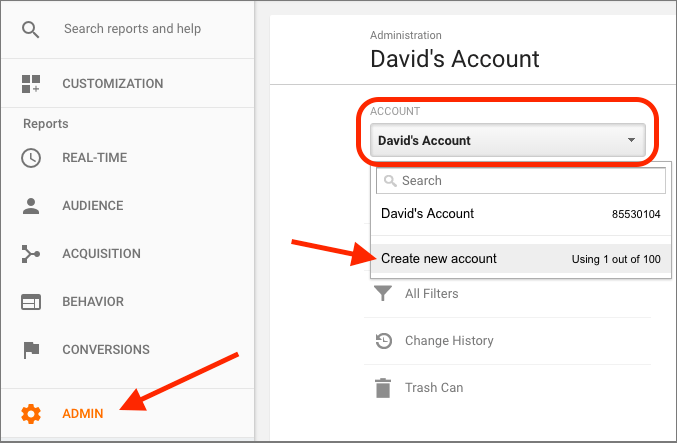
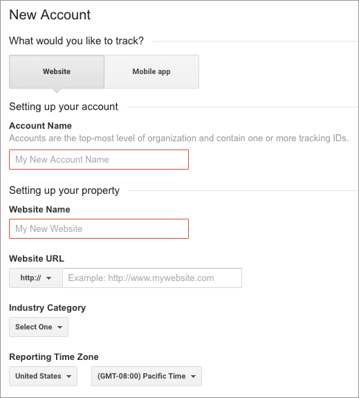
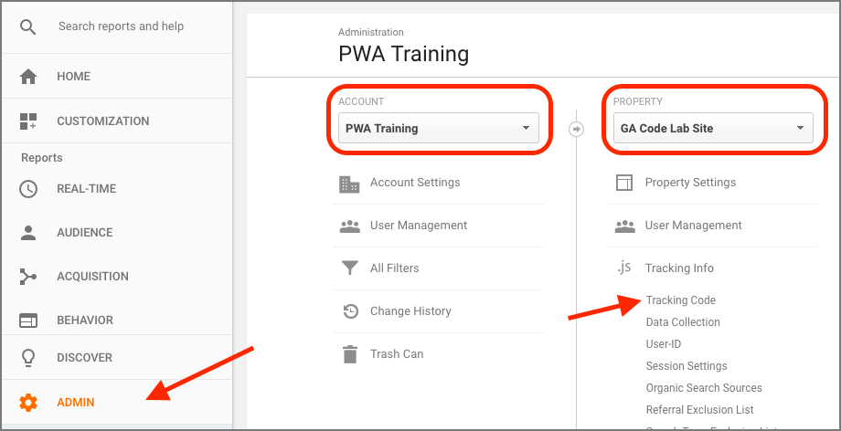
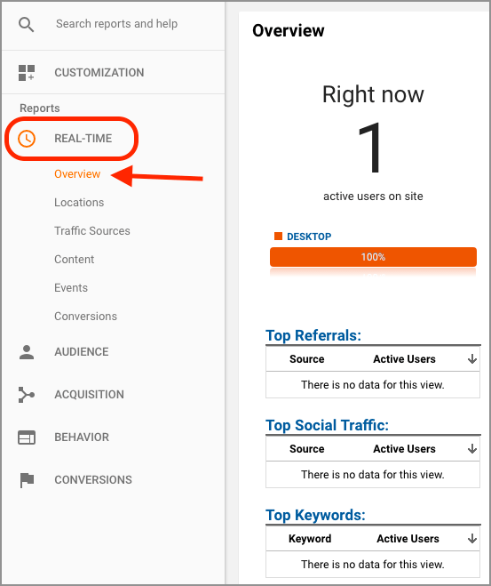
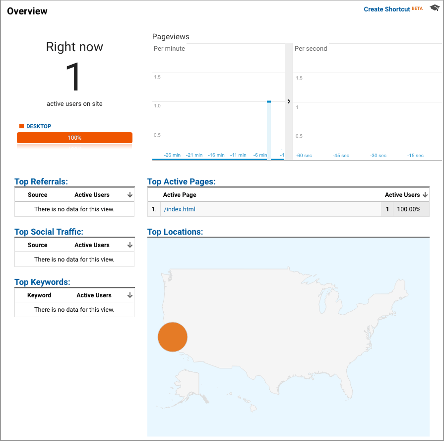
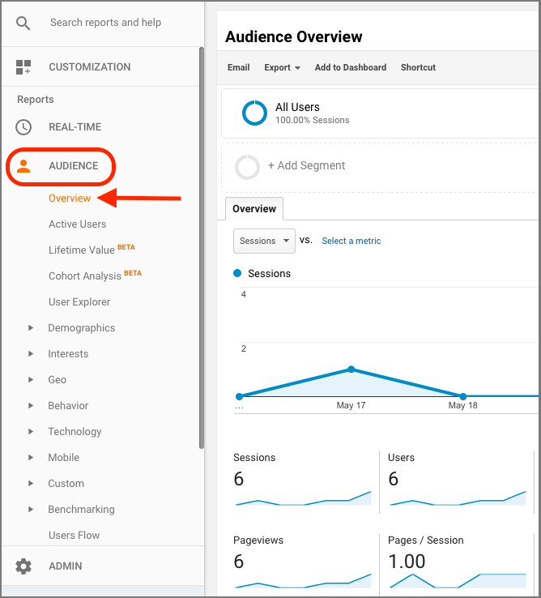
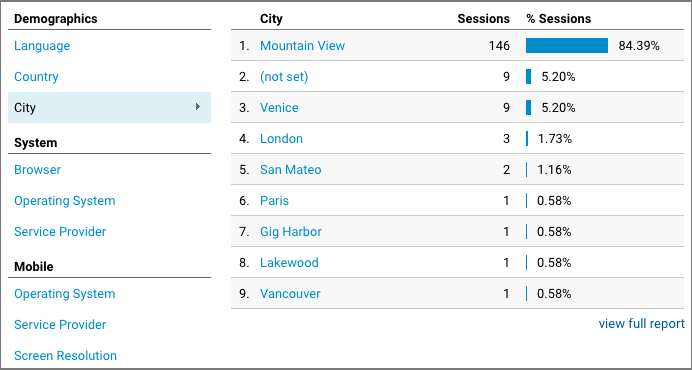
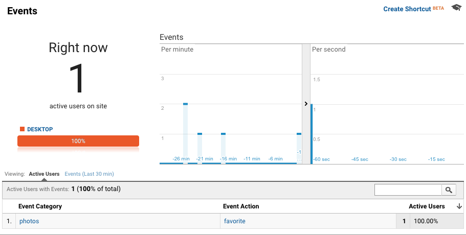
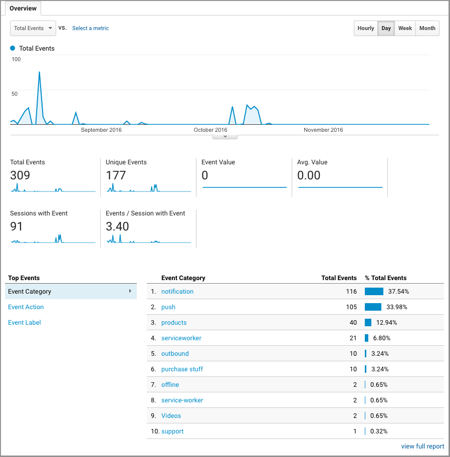

project_path: /web/_project.yaml
book_path: /web/ilt/pwa/_book.yaml

{# wf_auto_generated #}
{# wf_blink_components: N/A #}
{# wf_updated_on: 2019-04-26 #}
{# wf_published_on: 2016-01-01 #}


# Lab: Integrating Analytics {: .page-title }



<div id="overview"></div>


## Overview


This lab shows you how to integrate Google Analytics into your Progressive Web Apps. You'll learn how use analytics in service workers, and how to track offline events.

#### What you'll learn

* How to create a Google Analytics account
* How to create a Google Firebase account
* How to integrate Google Analytics into a web app
* How to add and track custom events (including push notifications)
* How to use Google Analytics with service workers
* How to use analytics even when offline

#### What you should know

* Basic JavaScript and HTML
* Familiarity with  [Push Notifications](/web/fundamentals/engage-and-retain/push-notifications/)
* Some familiarity with the  [Fetch API](https://developer.mozilla.org/en-US/docs/Web/API/Fetch_API)

#### What you will need

* Computer with terminal/shell access
* Connection to the internet
* A  [browser that supports push](http://caniuse.com/#search=push)
* A text editor
*  [Node](https://nodejs.org/en/) installed

<div id="get-set-up"></div>


## 1. Get set up


If you have not downloaded the repository and installed the  [LTS version of Node.js](https://nodejs.org/en/), follow the instructions in [Setting up the labs](setting-up-the-labs).

Navigate into the `google-analytics-lab/app/` directory and start a local development server:

    cd google-analytics-lab/app
    npm install
    node server.js

You can terminate the server at any time with `Ctrl-c`.

Open Chrome and navigate to `localhost:8081/google-analytics-lab/app/`.

Note: [Unregister](tools-for-pwa-developers#unregister) any service workers and [clear all service worker caches](tools-for-pwa-developers#clearcache) for localhost so that they do not interfere with the lab. In Chrome DevTools, you can achieve this by clicking __Clear site data__ from the __Clear storage__ section of the __Application__ tab.

In the browser, you should be prompted to allow notifications. If the prompt does not appear, then [manually allow notifications](tools-for-pwa-developers#permissions). You should see a permission status of "granted" in the console.

You should also see that a service worker registration is logged to the console.

The app for this lab is a simple web page that has some  [push notification](/web/fundamentals/engage-and-retain/push-notifications/) code.

Open the `google-analytics-lab/app/` folder in your preferred text editor. The `app/` folder is where you will be building the lab.

This folder contains:

* `pages/` folder contains sample resources that we use in experimenting:
* `page-push-notification.html`
* `other.html`
* `images/` folder contains images to style our app and notifications
* `index.html` is the main HTML page for our sample site/application
* `styles/main.css` is the app's CSS
* `js/main.js` is the main JavaScript for the app
* `js/analytics-helper.js` is an empty helper file
* `sw.js` is the service worker file
* `manifest.json` is the manifest for push notifications
* `package-lock.json` & `package.json` track app dependencies (the only dependencies in this case are for the local development server)
* `server.js` is a local development server for testing

Currently, `main.js` requests notification permission and registers a service worker, `sw.js`. `main.js` also contains functions for subscribing and unsubscribing for push notifications. We will address that later (subscribing to push isn't yet possible because we haven't registered with a push service).

`sw.js` contains listeners for push events and notification events.

Test the notification code by using developer tools to [send a push notification](tools-for-pwa-developers#push).

A notification should appear on your screen. Try clicking it. It should take you to a sample page. You can see the logic for this behavior in `sw.js` in the `notificationclick` and `push` event handlers.

Note: Simulated push notifications can be sent from the browser even if the subscription object is null, which is how we are able to test push notifications before registering with a push service.

#### For more information

You can learn more about web push notifications in the <a href="lab-integrating-web-push">Push Notifications lab</a> and in the  [Web Fundamentals documentation](/web/fundamentals/push-notifications/).

<div id="create-a-google-analytics-account"></div>


## 2. Create a Google Analytics account


Note: The Google Analytics UI is subject to updates and may not look exactly like the screenshots presented in this lab.

In a separate tab or window, navigate to  [analytics.google.com](https://analytics.google.com/). Sign in with your  [Gmail account](https://accounts.google.com/signup), and follow the step that matches your status:

#### If you already have a Google Analytics account:

Create another one: Select the __Admin__ tab. Under __account__, select your current Google Analytics account and choose __create new account__. A single Gmail account can have multiple (currently 100) Google Analytics accounts.



Follow the instructions below to set up your new Analytics account.

#### If you don't have a Google Analytics account:

Select __Sign up__ to begin creating your account.

Follow the instructions below to set up your new Analytics account.

#### Creating your account

The account creation screen should look like this:



#### What would you like to track?

Choose __Website__.

Note: Websites and mobile apps implement Google Analytics differently. This lab covers web apps. For mobile apps, see  [analytics for mobile applications](https://support.google.com/analytics/answer/2587086?ref_topic=2587085&rd=1).

Note: All the names we use for the account and website are arbitrary. They are only used for reference and don't affect analytics.

#### Setting up your account

Enter an account name (for example "PWA Training").

#### Setting up your property

The property must be associated with a site. We will use a mock  [GitHub Pages](https://pages.github.com/) site.

1. Set the website name to whatever you want, for example "GA Lab Site".
2. Set the website URL to `USERNAME.github.io/google-analytics-lab/`, where `USERNAME` is your  [GitHub](https://github.com/) username (or just your name if you don't have a GitHub account). Set the protocol to `https://`.
3. Select any industry or category.
4. Select your timezone.
5. Unselect any data sharing settings.
6. Then choose __Get Tracking ID__ and agree to the terms and conditions.

Note: For this lab, the site is just a placeholder, you do not need to set up a GitHub Pages site or be familiar with GitHub Pages or even GitHub. The site URL that you use to create your Google Analytics account is only used for things like automated testing.

#### Explanation

Your account is the top most level of organization. For example, an account might represent a company. An account has  [properties](https://support.google.com/analytics/answer/2649554) that represent individual collections of data. One property in an account might represent the company's web site, while another property might represent the company's iOS app. These properties have tracking IDs (also called property IDs) that identify them to Google Analytics. You will need to get the tracking ID to use for your app.

#### For more information

*  [Analytics for mobile applications](https://support.google.com/analytics/answer/2587086?ref_topic=2587085&rd=1)
*  [GitHub](https://github.com/) and  [GitHub Pages](https://pages.github.com/)
*  [Properties](https://support.google.com/analytics/answer/2649554)
*  [Google/Gmail accounts](https://accounts.google.com/signup)
*  [Google Analytics](https://analytics.google.com/)

<div id="get-your-tracking-id-and-snippet"></div>


## 3. Get your tracking ID and snippet


You should now see your property's tracking ID and tracking code snippet.

If you lost your place:

1. Select the __Admin__ tab.
2. Under __account__, select your account (for example "PWA Training") from the drop down list.
3. Then under __property__, select your property (for example "GA Lab Site") from the drop down list.
4. Now choose __Tracking Info__, followed by __Tracking Code__.



Your tracking ID looks like `UA-XXXXXXXX-Y` and your tracking code snippet looks like:

```
  <script async src="https://www.googletagmanager.com/gtag/js?id=UA-114028926-1"></script>
  <script>
    window.dataLayer = window.dataLayer || [];
    function gtag() {dataLayer.push(arguments);}
    gtag('js', new Date());

    gtag('config', 'UA-XXXXXXXXX-Y');
  </script>
```

Note: If you haven't used Google Analytics in a while and are more familiar with `analytics.js`, this script may look unfamiliar. This code uses `gtag.js`, a more streamlined analytics system. You can read more about the differences between `analytics.js` and `gtag.js` in  [this documentation](/analytics/devguides/collection/gtagjs/migration).

Copy this script (from the Google Analytics page) and paste it in the bottom of `index.html` and `pages/other.html`. Save the scripts and refresh the app page (you can close the `page-push-notification.html` page that was opened earlier from the notification click).

Now return to the Google Analytics site. Examine the real time data section by selecting __Real-Time__ and then __Overview__:



You should see yourself being tracked. The screen should look similar to this:



Note: If you don't see this, refresh the app and check again.

In the Google Analytics dashboard, the __Active Page__ indicates which page is being viewed. Back in the app, click the link to __Other page__ to navigate to the other page. Then check the Google Analytics dashboard and examine __Active Page__ again. It should now show `/pages/other.html` (this might take a few seconds).

#### Explanation

When a page loads, the tracking snippet script is executed.

At a high level, that analytics snippet gathers data from the user's IP address, user agent, and other page information, such as:

* User's geographic location
* User's browser and operating system (OS)
* Screen size
* If Flash or Java is installed
* The referring site

This data is then sent as a  [pageview hit](https://support.google.com/analytics/answer/6086080) to your Google Analytics  [property](https://support.google.com/analytics/answer/2649554) (specified by your tracking ID).

The real-time section of the Google Analytics dashboard shows the hit received from this script execution, along with the page (__Active Page__) that it was executed on.

The code so far provides the minimum functionality of Google Analytics. From the data gathered by the analytics library, the pageview event allows Google Analytics to infer information such as:

* The total time the user spends on the site
* The time spent on each page and the order in which the pages are visited
* Which internal links are clicked (based on the URL of the next pageview)

#### For more information

*  [Basic web tracking setup](https://support.google.com/analytics/topic/1008079?visit_id=1-636540718257710306-411227954&rd=1)
*  [gtag.js](/analytics/devguides/collection/gtagjs/)
* Other  [Google Analytics tools](/analytics/devguides/collection/)

#### Viewing user data

We are using real-time viewing because we have just created this app. Normally, records of past data would also be available. You can view this by selecting __Audience__ and then __Overview__.

Note: Historical data for our app is not available yet. It takes some time to process the data, typically  [24-48 hours](https://support.google.com/analytics/answer/1070983#DataProcessingLatency).

Here you can see general information such as pageview records, bounce rate, ratio of new and returning visitors, and other statistics.



You can also see specific information like visitors' language, country, city, browser, operating system, service provider, screen resolution, and device.



#### For more information

*  [Learn about Google Analytics for business](https://analyticsacademy.withgoogle.com/)

<div id="add-analytics-events"></div>


## 4. Add analytics events


Google Analytics supports marking "events" that allow fine grain analysis of user behavior.

In `main.js`, replace the `favorite` function with the following:

```
const favorite = () => {
  gtag('event', 'favorite', {
    'event_category': 'photos',
    'event_label': 'cats'
  });
};
```

Save the script and refresh the app's main page (`index.html`). Click __Favorite__.

Return to the __Real-Time__ reporting section of the Google Analytics dashboard. Instead of selecting __Overview__, select __Events__. Do you see the custom event? (If not, try clicking __Favorite__ again.)



#### Explanation

We can use the  [gtag.js API](/gtagjs/reference/api) to  [send specific events](/analytics/devguides/collection/gtagjs/events) to our property, which can be organized with categories and labels. In this example, a custom event with the `action` "favorite" is fired. The event is organized with the "photos" category and "cats" label.

Google Analytics also supports  [default events](/analytics/devguides/collection/gtagjs/events#default_google_analytics_events), which are generally recommended because they facilitate interoperability with other tools. For simplicity, we'll stick to custom events for now, as default events require  [specific parameters](/gtagjs/reference/event).

You can view past events in the Google Analytics dashboard by selecting __Behavior__, followed by __Events__ and then __Overview__. However your account won't yet have any past events to view (because you just created it).



#### Learn more

[Event parameters reference](https://support.google.com/analytics/answer/1033068#Anatomy)

<div id="showing-push-notifications"></div>


## 5. Showing push notifications


Let's use a custom event to let us know when users subscribe to push notifications.

### 5.1 Create a project on Firebase

First we need to add push subscribing to our app. To subscribe to the push service in Chrome, you need to create a project on Firebase.

1. In the  [Firebase console](https://console.firebase.google.com/), select __Add project__.
2. Supply a project name and click __Create Project__.
3. Click the __Settings__ (gear) icon next to your project name in the navigation pane, and select __Project Settings__.
4. Select the __Cloud Messaging__ tab. You can find your __Server key__ and __Sender ID__ in this page. Save these values.

Replace `YOUR_SENDER_ID`  in the `manifest.json` file with the Sender ID of your Firebase project. The `manifest.json` file should look like this:

```
{
  "name": "Google Analytics lab",
  "gcm_sender_id": "YOUR_SENDER_ID"
}
```

Save the file. Refresh the app and click __Subscribe__. The browser console should indicate that you have subscribed to push notifications.

#### Explanation

Chrome uses Firebase Cloud Messaging (FCM) to route its push messages. All push messages are sent to FCM, and then FCM passes them to the correct client.

Note: FCM has replaced Google Cloud Messaging (GCM). Some of the code to push messages to Chrome still contains references to GCM. These references are correct and work for both GCM and FCM.

### 5.2 Add custom analytics

Now we can add custom analytics events for push subscriptions.

In the `subscribe` function, add the following code to mark subscription events:

```
gtag('event', 'subscribe', {
  'event_category': 'push',
  'event_label': 'cat updates'
});
```

Similarly, add the following code to mark unsubscribe events in the `unsubscribe` function:

```
gtag('event', 'unsubscribe', {
  'event_category': 'push',
  'event_label': 'cat updates'
});
```

Save the script and refresh the app. Now test the __Subscribe__ and __Unsubscribe__ buttons. Confirm that you see the custom events in the Google Analytics dashboard.

__Optional__: Add analytics hits for the `catch` blocks of the `subscribe` and `unsubscribe` functions. In other words, add analytics code to record when users have errors subscribing or unsubscribing. Make sure the event's `action` (the second argument to `gtag`) is distinct, for example `subscribe-err`). Then manually block notifications in the app by clicking the icon next to the URL and revoking permission for notifications. Refresh the page and test subscribing, you should see an event fired for the subscription error in the Google Analytics dashboard. Remember to restore notification permissions when you are done.

#### Explanation

Adding these custom events lets us track how often users are subscribing and unsubscribing to our push notifications, and if they are experiencing errors in the process.

<div id="using-analytics-in-the-service-worker"></div>


## 6. Using analytics in the service worker


The `gtag.js` analytics library requires access to the `Window` object. Service workers don't have access to `Window`, so we will need to use a separate API to send analytics hits from the service worker. The  [Measurement Protocol API](/analytics/devguides/collection/protocol/v1/) is a low level interface that allows developers to send analytics data directly as HTTP requests.

### 6.1 Use the Measurement Protocol interface

In `analytics-helper.js`, add the following code to specify your property's tracking ID (use your analytics tracking ID instead of `UA-XXXXXXXX-Y`):

```
// Set this to your tracking ID: UA-XXXXXXXX-Y
const trackingId = null;
```

Below the tracking ID variable, add the following Measurement Protocol helper function:

```
const sendAnalyticsEvent = (eventAction, eventCategory) => {

  console.log('Sending analytics event: ' + eventCategory + '/' + eventAction);

  if (!trackingId) {
    console.error('You need your tracking ID in analytics-helper.js');
    console.error('Add this code:\nconst trackingId = \'UA-XXXXXXXX-X\';');
    // We want this to be a safe method, so avoid throwing unless absolutely necessary.
    return Promise.resolve();
  }

  if (!eventAction && !eventCategory) {
    console.warn('sendAnalyticsEvent() called with no eventAction or ' +
    'eventCategory.');
    // We want this to be a safe method, so avoid throwing unless absolutely necessary.
    return Promise.resolve();
  }

  return self.registration.pushManager.getSubscription()
  .then(subscription => {
    if (subscription === null) {
      throw new Error('No subscription currently available.');
    }

    // Create hit data
    const payloadData = {
      // Version Number
      v: 1,
      // Client ID
      cid: subscription.endpoint,
      // Tracking ID
      tid: trackingId,
      // Hit Type
      t: 'event',
      // Event Category
      ec: eventCategory,
      // Event Action
      ea: eventAction,
      // Event Label
      el: 'serviceworker'
    };

    // Format hit data into URI
    const payloadString = Object.keys(payloadData)
    .filter(analyticsKey => {
      return payloadData[analyticsKey];
    })
    .map(analyticsKey => {
      return analyticsKey + '=' + encodeURIComponent(payloadData[analyticsKey]);
    })
    .join('&');

    // Post to Google Analytics endpoint
    return fetch('https://www.google-analytics.com/collect', {
      method: 'post',
      body: payloadString
    });
  })
  .then(response => {
    if (!response.ok) {
      return response.text()
      .then(responseText => {
        throw new Error(
          'Bad response from Google Analytics:\n' + response.status
        );
      });
    } else {
      console.log(eventCategory + '/' + eventAction +
        ' hit sent, check the Analytics dashboard');
    }
  })
  .catch(function(err) {
    console.warn('Unable to send the analytics event', err);
  });
};
```

Save the script.

#### Explanation

We start by creating a variable with your tracking ID. The Measurement Protocol needs this to identify your property, just like in the analytics snippet.

The `sendAnalyticsEvent` helper function starts by checking that the tracking ID is set and that the function is being called with the correct parameters. After checking that the client is subscribed to push, the analytics data is created in the `payloadData` variable:

```
const payloadData = {
  // Version Number
  v: 1,
  // Client ID
  cid: subscription.endpoint,
  // Tracking ID
  tid: trackingId,
  // Hit Type
  t: 'event',
  // Event Category
  ec: eventCategory,
  // Event Action
  ea: eventAction,
  // Event Label
  el: 'serviceworker'
};
```

The __version number__, __client ID__, __tracking ID__, and __hit type__ parameters are  [required by the API](/analytics/devguides/collection/protocol/v1/devguide). The __event category__, __event action__, and __event label__ are the same parameters that we have been using with the `gtag.js` interface.

Next, the hit data is  [formatted into a URI](/analytics/devguides/collection/protocol/v1/reference) with the following code:

```
    const payloadString = Object.keys(payloadData)
    .filter(analyticsKey => {
      return payloadData[analyticsKey];
    })
    .map(analyticsKey => {
      return analyticsKey + '=' + encodeURIComponent(payloadData[analyticsKey]);
    })
    .join('&');
```

Finally, the data is sent to the  [API endpoint](/analytics/devguides/collection/protocol/v1/reference) with the following code:

```
return fetch('https://www.google-analytics.com/collect', {
  method: 'post',
  body: payloadString
});
```

Note: You can learn more about the Fetch API in the  [Fetch lab](lab-fetch-api).

### 6.2 Send hits from the service worker

Now that we can use the Measurement Protocol interface to send hits, let's add custom events to the service worker.

Import the helper file at the top of the service worker (`sw.js`):

```
importScripts('js/analytics-helper.js');
```

In the `notificationclose` listener, add the following code to send notification close events:

```
e.waitUntil(
  sendAnalyticsEvent('close', 'notification')
);
```

In the `notificationclick` listener, add the following code to mark click events:

```
sendAnalyticsEvent('click', 'notification')
```

Finally, add the following code to the `push` listener:

```
sendAnalyticsEvent('received', 'push')
```

Save the script. Refresh the page to install the new service worker. Then close and reopen the app to activate the new service worker (remember to close all tabs and windows running the app).

Click __Subscribe__ to subscribe the new service worker to push notifications.

Now try these experiments and check the Google Analytics dashboard for each:

1. [Trigger a push notification](tools-for-pwa-developers#push).
2. Click the notification, and note what happens.
3. Trigger another notification and then close it.

Do you see the events on Google Analytics?

Note: Testing the Measurement Protocol can be difficult because it does not return HTTP error codes, even if a hit is malformed or missing required parameters. You can  [test the Measurement Protocol using a validation server](/analytics/devguides/collection/protocol/v1/validating-hits).

#### Explanation

We start by using  [ImportScripts](https://developer.mozilla.org/en-US/docs/Web/API/WorkerGlobalScope/importScripts) to import the `analytics-helper.js` file with our `sendAnalyticsEvent` helper function. This function is used to send custom events at appropriate places (such as when push events are received, or notifications are interacted with). The `eventAction` and `eventCategory` that we want to associate with the event are passed in as parameters.

Note: [`event.waitUntil`](https://developer.mozilla.org/en-US/docs/Web/API/ExtendableEvent/waitUntil) extends the life of an event until the asynchronous actions inside of it have completed. This ensures that the service worker will not be terminated preemptively while waiting for an asynchronous action to complete.

<div id="use-analytics-offline"></div>


## 7. Use analytics offline


What can you do about sending analytics hits when your users are offline? Analytics data can be stored when users are offline and sent at a later time when they have reconnected.

Fortunately,  [Workbox](/web/tools/workbox/) has a module that supports  [offline analytics](/web/tools/workbox/modules/workbox-google-analytics).

In the top of the service worker, add the following code to import and instantiate the analytics module:

```
importScripts('https://storage.googleapis.com/workbox-cdn/releases/3.4.1/workbox-sw.js');

workbox.googleAnalytics.initialize();
```

Save the script. Update the service worker by refreshing the page and closing and reopening the app (remember to close all tabs and windows running the app).

Refresh the page again. Simulate offline mode by terminating the node server with `Ctrl + c` and turning off your machine's wifi.

Then click __Favorite__ to fire a custom analytics event.

You will see an error in the console because we are offline and can't make requests to Google Analytics servers.

[Now check IndexedDB](tools-for-pwa-developers#indexeddb). Open the __requests__ store in the __workbox-background-sync__ database. You should see a URL cached. (You may need to refresh IndexedDB.)


Now restart the server with `node server.js` and turn wifi back on. Wait a few moments and check __IndexedDB__ again (you'll most likely need to refresh the IndexedDB UI), and observe that the URL is no longer cached.

Now check the Google Analytics dashboard. You should see the custom event!

#### Explanation

The Workbox analytics module adds a fetch event handler to the service worker that only listens for requests made to the Google Analytics endpoint. The handler attempts to send Google Analytics data just like we have done so far, by network requests. If the network request fails, the request is stored in IndexedDB and queued with  [background sync](/web/tools/workbox/modules/workbox-background-sync). The requests are then sent later when connectivity is re-established. You can learn more in the  [Workbox Google Analytics documentation](/web/tools/workbox/modules/workbox-google-analytics).

Note: This strategy won't work for hits sent from within the service worker because the service worker doesn't listen to fetch events from itself (that could cause some serious problems!). This isn't so important in this case, because all the hits sent from our service worker are tied to online events (like push notifications).

So far we have successfully enabled offline analytics. But retried requests are currently indistinguishable from requests that succeeded while online. This means you'll receive all the interaction data from offline users, but you won't be able to tell which interactions occurred while the user was offline. To address this, you can annotate data that is sent in retried requests.

One solution is to modify offline requests with a  [custom dimension](https://support.google.com/analytics/answer/2709828). This task is outside the scope of the lab, but you can see an example in the  [Workbox Google Analytics documentation](/web/tools/workbox/modules/workbox-google-analytics). If you're using the `gtag.js` library instead of `analytics.js`, you'll want to read about  [custom dimensions with gtag.js](/analytics/devguides/collection/gtagjs/custom-dims-mets).

<div id="congratulations"></div>


## Congratulations!


You now know how to integrate Google Analytics into your progressive web apps. You also learned how to use analytics with service workers and to track offline events.

### Resources

*  [Google Analytics Academy](https://analyticsacademy.withgoogle.com/)
*  [Measuring Critical Performance Metrics with Google Analytics Codelab](https://codelabs.developers.google.com/codelabs/performance-analytics/index.html?index=..%2F..%2Findex#0)


