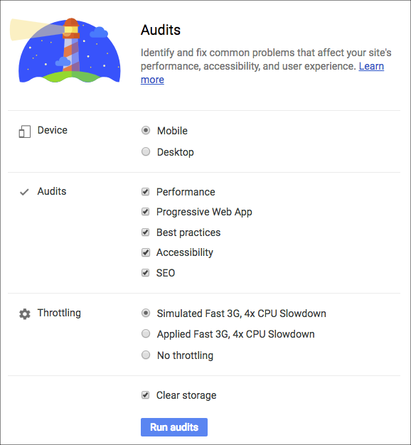
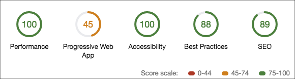
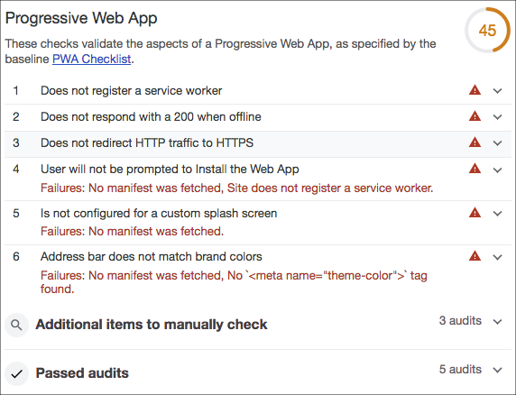
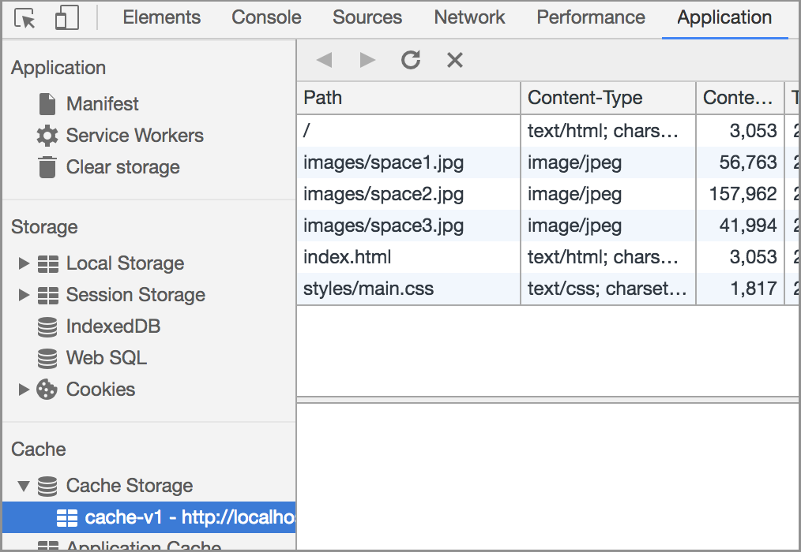

project_path: /web/_project.yaml
book_path: /web/ilt/pwa/_book.yaml

{# wf_auto_generated #}
{# wf_blink_components: N/A #}
{# wf_updated_on: 2019-04-26 #}
{# wf_published_on: 2016-01-01 #}


# Lab: Offline Quickstart {: .page-title }



<div id="overview"></div>


## Overview


In this lab you'll use  [Lighthouse](/web/tools/lighthouse/) to audit a website for Progressive Web App (PWA) standards. You'll also add offline functionality with the service worker API.

#### What you'll learn

* How to audit sites with Lighthouse
* How to add offline capabilities to an application

#### What you should know

* Basic HTML, CSS, and JavaScript
* Familiarity with ES2015  [Promises](/web/fundamentals/getting-started/primers/promises)

#### What you will need

* Computer with terminal/shell access
* Connection to the internet
* Chrome browser (for using Lighthouse)
* A text editor
* Optional: Chrome on an Android device

<div id="get-set-up"></div>


## 1. Get set up


If you have not downloaded the repository and installed the  [LTS version of Node.js](https://nodejs.org/en/), follow the instructions in [Setting up the labs](setting-up-the-labs).

Navigate into the `offline-quickstart-lab/app/` directory and start a local development server:

    cd offline-quickstart-lab/app
    npm install
    node server.js

You can terminate the server at any time with `Ctrl-c`.

Open your browser and navigate to `localhost:8081/`. You should see that the site is a simple and static web page.

Note: [Unregister](tools-for-pwa-developers#unregister) any service workers and [clear all service worker caches](tools-for-pwa-developers#clearcache) for localhost so that they do not interfere with the lab. In Chrome DevTools, you can achieve this by clicking __Clear site data__ from the __Clear storage__ section of the __Application__ tab.

Open the `offline-quickstart-lab/app/` folder in your preferred text editor. The `app/` folder is where you will be building the lab.

This folder contains:

* `images/` folder contains sample images
* `styles/main.css` is the main stylesheet
* `index.html` is the main HTML page for our sample site
* `package-lock.json` and `package.json` track app dependencies (the only dependencies in this case are for the local development server)
* `server.js` is a local development server for testing
* `service-worker.js` is the service worker file (currently empty)

<div id="auditing-the-site-with-lighthouse"></div>


## 2. Auditing the site with Lighthouse


Before we start making changes to the site, let's audit with  [Lighthouse](/web/tools/lighthouse/) to see what can be improved.

Return to the app (in Chrome) and open the __Audits__ tab of the  [Developer Tools](/web/tools/chrome-devtools/shortcuts). You should see the Lighthouse icon and configuration options. Select "Mobile" for __Device__, select all __Audits__, select either of the __Throttling__ options, and choose to __Clear storage__:



Click __Run audits__. The audits take a few moments to complete.

#### Explanation

You should see a report with scores in Developer Tools once the audit is complete. It should show scores, something like this (the scores might not be exactly the same):

Note: Lighthouse scores are an approximation and can be influenced by your environment (for example, if you have a large amount of browser windows open). Your scores might not be exactly the same as those shown here.



And the __Progressive Web App__ section should look similar to this:



The report has scores and metrics in five categories:

* Progressive Web App
* Performance
* Accessibility
* Best Practices
* SEO

As you can see, our app scores poorly in the Progressive Web App (PWA) category. Let's improve our score!

<div id="taking-the-app-offline"></div>


## 3. Taking the app offline


Take a moment to look through the PWA section of the report and see what is missing.

### 3.1 Register a service worker

One of the failures listed in the report is that no service worker is registered. We currently have an empty service worker file at `app/service-worker.js`.

Add the following script to the bottom of `index.html`, just before the closing `</body>` tag:

```
<script>
if ('serviceWorker' in navigator) {
  window.addEventListener('load', function() {
    navigator.serviceWorker.register('service-worker.js')
      .then(reg => {
        console.log('Service worker registered! 😎', reg);
      })
      .catch(err => {
        console.log('😥 Service worker registration failed: ', err);
      });
  });
}
</script>
```

#### Explanation

This code registers the empty `sw.js` service worker file once the page has loaded. However the current service worker file is empty and won't do anything. Let's add service code in the next step.

### 3.2 Precache resources

Another failure listed in the report is that the app doesn't respond with a 200 status code when offline. We need to update our service worker to solve this.

Add the following code to the service worker file (`sw.js`):

```
const cacheName = 'cache-v1';
const precacheResources = [
  '/',
  'index.html',
  'styles/main.css',
  'images/space1.jpg',
  'images/space2.jpg',
  'images/space3.jpg'
];

self.addEventListener('install', event => {
  console.log('Service worker install event!');
  event.waitUntil(
    caches.open(cacheName)
      .then(cache => {
        return cache.addAll(precacheResources);
      })
  );
});

self.addEventListener('activate', event => {
  console.log('Service worker activate event!');
});

self.addEventListener('fetch', event => {
  console.log('Fetch intercepted for:', event.request.url);
  event.respondWith(caches.match(event.request)
    .then(cachedResponse => {
        if (cachedResponse) {
          return cachedResponse;
        }
        return fetch(event.request);
      })
    );
});
```

Now return to the browser and refresh the site. Check the console to see that the service worker:

* registered
* installed
* activated

Note: If you already registered the service worker previously, or are having trouble getting all the events to fire, [unregister](tools-for-pwa-developers#unregister) any service workers and refresh the page. If that fails, close all instances of the app and reopen it.

Next, terminate the local development server in your command line by running `Ctrl + c`. Refresh the site again and observe that it loads even though the server is offline!

Note: You may see a console error indicating that the service worker could not be fetched: `An unknown error occurred when fetching the script. service-worker.js Failed to load resource: net::ERR_CONNECTION_REFUSED`. This error is shown because the browser couldn't fetch the service worker script (because the site is offline), but that's expected because we can't use the service worker to cache itself. Otherwise the user's browser would be stuck with the same service worker forever!

#### Explanation

Once the service worker is registered by the registration script in `index.html`, the service worker `install` event occurs. During this event, the `install` event listener opens a named cache, and caches the files specified with the `cache.addAll` method. This is called "precaching" because it happens during the `install` event, which is typically the first time a user visits your site.

After a service worker is installed, and if another service worker is not currently controlling the page, the new service worker is "activated" (the `activate` event listener is triggered in the service worker) and it begins controlling the page.

When resources are requested by a page that an activated service worker controls, the requests pass through the service worker, like a network proxy. A `fetch` event is triggered for each request. In our service worker, the `fetch` event listener searches the caches and responds with the cached resource if it's available. If the resource isn't cached, the resource is requested normally.

Caching resources allows the app to work offline by avoiding network requests. Now our app can respond with a 200 status code when offline!

Note: The activate event isn't used for anything besides logging in this example. The event was included to help debug service worker lifecycle issues.

__Optional__: You can also see the cached resources in the __Application__ tab of Developer Tools by expanding the __Cache Storage__ section:



<div id="re-audit-the-improved-site"></div>


## 4. Re-audit the improved site


Restart the development server with `node server.js` and refresh the site. Then open the __Audits__ tab in Developer Tools again, and re-run the Lighthouse audit by selecting __New Audit__ (the plus sign in the upper left corner). When the audit is finished, you should see that our PWA score is significantly better, but could still be improved We'll continue to improve our score in the following section.

<div id="optional-add-to-home-screen"></div>


## 5. Optional: Add to Home Screen


Note: This section is optional because testing the  [Web App Install Banner](/web/fundamentals/app-install-banners/) is beyond the scope of the lab. You can try it on your own by using  [remote debugging](/web/tools/chrome-devtools/remote-debugging/).

Our PWA score still isn't great. Some of the remaining failures listed in the report are that the user will not be prompted to install our web app, and that we haven't configured a splash screen or brand colors in the address bar. We can fix these issues and progressively implement  [Add to Home Screen](/web/fundamentals/app-install-banners/) by satisfying some additional  [criteria](/web/tools/lighthouse/audits/install-prompt). Most importantly, we need to create a  [manifest file](/web/fundamentals/web-app-manifest/).

### 5.1 Create a Manifest file

Create a file in `app/` called `manifest.json`, and add the following code:

```
{
  "name": "Space Missions",
  "short_name": "Space Missions",
  "lang": "en-US",
  "start_url": "/index.html",
  "display": "standalone",
  "theme_color": "#FF9800",
  "background_color": "#FF9800",
  "icons": [
    {
      "src": "images/touch/icon-128x128.png",
      "sizes": "128x128"
    },
    {
      "src": "images/touch/icon-192x192.png",
      "sizes": "192x192"
    },
    {
      "src": "images/touch/icon-256x256.png",
      "sizes": "256x256"
    },
    {
      "src": "images/touch/icon-384x384.png",
      "sizes": "384x384"
    },
    {
      "src": "images/touch/icon-512x512.png",
      "sizes": "512x512"
    }
  ]
}
```

The images referenced in the manifest are already supplied in the app.

Then add the following HTML to the bottom of the `<head>` tag in `index.html`:

```
<link rel="manifest" href="manifest.json">

<meta name="mobile-web-app-capable" content="yes">
<meta name="apple-mobile-web-app-capable" content="yes">
<meta name="application-name" content="Space Missions">
<meta name="apple-mobile-web-app-title" content="Space Missions">
<meta name="theme-color" content="#FF9800">
<meta name="msapplication-navbutton-color" content="#FF9800">
<meta name="apple-mobile-web-app-status-bar-style" content="black-translucent">
<meta name="msapplication-starturl" content="/index.html">
<meta name="viewport" content="width=device-width, initial-scale=1, shrink-to-fit=no">

<link rel="icon" sizes="128x128" href="/images/touch/icon-128x128.png">
<link rel="apple-touch-icon" sizes="128x128" href="/images/touch/icon-128x128.png">
<link rel="icon" sizes="192x192" href="icon-192x192.png">
<link rel="apple-touch-icon" sizes="192x192" href="/images/touch/icon-192x192.png">
<link rel="icon" sizes="256x256" href="/images/touch/icon-256x256.png">
<link rel="apple-touch-icon" sizes="256x256" href="/images/touch/icon-256x256.png">
<link rel="icon" sizes="384x384" href="/images/touch/icon-384x384.png">
<link rel="apple-touch-icon" sizes="384x384" href="/images/touch/icon-384x384.png">
<link rel="icon" sizes="512x512" href="/images/touch/icon-512x512.png">
<link rel="apple-touch-icon" sizes="512x512" href="/images/touch/icon-512x512.png">
```

Return to the site. In the __Application__ tab of Developer Tools, select the __Clear storage__ section, and click __Clear site data__. Then refresh the page. Now select the __Manifest__ section. You should see the icons and configuration options that are configured in the `manifest.json` file. If you don't see your changes, open the site in an incognito window and check again.

#### Explanation

The `manifest.json` file tells the browser how to style and format some of the progressive aspects your app, such as the browser chrome, home screen icon, and splash screen. It can also be used to configure your web app to open in `standalone` mode, like a native app does (in other words, outside of the browser).

Support is still under development for some browsers as of the time of this writing, and the `<meta>` tags configure a subset of these features for certain browsers that don't yet have full support.

We had to __Clear site data__ to remove our old cached version of `index.html` (since that version didn't have the manifest link). Try running another Lighthouse audit and see how much the PWA score improved!

### 5.2 Activating the install prompt

The next step to installing our app is to show users with the install prompt. Chrome 67 prompted users automatically, but  [starting in Chrome 68](/web/updates/2018/06/a2hs-updates), the install prompt should be activated programmatically in response to a user gesture.

Add an "Install app" button and banner to the top of `index.html` (just after the `<main>` tag) with the following code:

```
<section id="installBanner" class="banner">
    <button id="installBtn">Install app</button>
</section>
```

Then style the banner by adding the following styles to `styles/main.css`:

```
.banner {
  align-content: center;
  display: none;
  justify-content: center;
  width: 100%;
}
```

Save the file. Finally, add the following script tag to `index.html`:

```
  <script>
    let deferredPrompt;
    window.addEventListener('beforeinstallprompt', event => {

      // Prevent Chrome 67 and earlier from automatically showing the prompt
      event.preventDefault();

      // Stash the event so it can be triggered later.
      deferredPrompt = event;

      // Attach the install prompt to a user gesture
      document.querySelector('#installBtn').addEventListener('click', event => {

        // Show the prompt
        deferredPrompt.prompt();

        // Wait for the user to respond to the prompt
        deferredPrompt.userChoice
          .then((choiceResult) => {
            if (choiceResult.outcome === 'accepted') {
              console.log('User accepted the A2HS prompt');
            } else {
              console.log('User dismissed the A2HS prompt');
            }
            deferredPrompt = null;
          });
      });

      // Update UI notify the user they can add to home screen
      document.querySelector('#installBanner').style.display = 'flex';
    });
  </script>
```

Save the file. Open the app in Chrome on an Android device, using  [remote debugging](/web/tools/chrome-devtools/remote-debugging/). When the page loads, you should see the "Install app" button (you won't see it on a desktop, so be sure you are testing on mobile). Click the button and the Add to Home Screen prompt should pop up. Follow the steps to install the app on your device. After installation, you should be able to open the web app in standalone mode (outside of the browser) by tapping the newly created home screen icon.

#### Explanation

The HTML & CSS code adds a hidden banner and button that we can use to allow users to activate the installation prompt.

Once the `beforeinstallprompt` event fires, we prevent the default experience (in which Chrome 67 and earlier automatically prompts users to install) and capture the `beforeinstallevent` in the global `deferredPrompt` variable. The "Install app" button is then configured to show the prompt with the `beforeinstallevent`'s `prompt()` method. Once the user makes a choice (to install or not) the `userChoice` promise resolves with the user's choice (`outcome`). Finally, we display the install button once everything is ready.

<div id="congratulations"></div>


## Congratulations!


You've learned how to audit sites with Lighthouse, and how to implement the basics of offline functionality. If you completed the optional sections, you also learned how to install web apps to the home screen!

#### More resources

[Lighthouse](https://github.com/GoogleChrome/lighthouse) is open source! You can fork it, add your own tests, and file bugs. Lighthouse is also available as a  [command line tool](https://github.com/GoogleChrome/lighthouse#using-the-node-cli) for integration with build processes.


