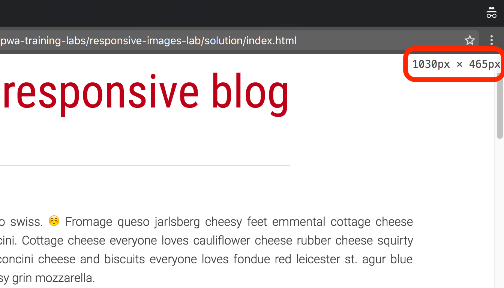

project_path: /web/_project.yaml
book_path: /web/ilt/pwa/_book.yaml

{# wf_auto_generated #}
{# wf_updated_on: 2018-04-06 #}
{# wf_published_on: 2016-01-01 #}


# Lab: Responsive Images {: .page-title }


<div id="overview"></div>


## Overview


This lab shows you how to make images on your web page look good on all devices.

#### What you will learn

* How to make your images responsive so that they are sized appropriately for multiple form factors
* How to use `srcset` and `sizes` to display the right image for the viewport width
* How to use <code>&lt;picture&gt;</code> and `source` in combination with media queries so that images on the page automatically respond as the window is resized

#### What you should know

* Basic HTML and CSS

#### What you will need

* Text editor
* Computer with terminal/shell access

<div id="1"></div>


## 1. Get set up


If you have not downloaded the repository, installed Node, and started a local server, follow the instructions in [Setting up the labs](setting-up-the-labs).

Open your browser and navigate to __localhost:8080/responsive-images-lab/app__.


Note: <a href="tools-for-pwa-developers#unregister">Unregister</a> any service workers and <a href="tools-for-pwa-developers#clearcache">clear all service worker caches</a> for localhost so that they do not interfere with the lab.


If you have a text editor that lets you open a project, open the __responsive-images-lab/app__ folder. This will make it easier to stay organized. Otherwise, open the folder in your computer's file system. The __app__ folder is where you will be building the lab.

This folder contains:

* __images__ folder contains sample images, each with several versions at different resolutions
* __index.html__ is the main HTML page for our sample site/application
* __styles/main.css__ is the cascading style sheet for the sample site

<div id="2"></div>


## 2. Set the relative width


Before making the images responsive, let's make sure they won't overflow the screen.

Replace TODO 2 in <strong>styles/main.css</strong> with the following code:

#### main.css

```
img {
  max-width: 100%;
}
```

Save the code and refresh the page in your browser. Try resizing the window. The image widths should stay entirely within the window.

#### Explanation

The value in `max-width` represents a percentage of the containing element, in this case the <code>&lt;article&gt;</code> element.


Note: You could also specify the <code>max-width</code> in terms of the viewport width using <code>vw</code> units (for example, <code>100vw</code>). In this case we are using a percentage value to keep the images the same width as the text.


<div id="3"></div>


## 3. Using the srcset attribute


The goal is to get the browser to fetch the version of the image with the smallest dimensions that is still bigger than the final display size of the image. `srcset` lets us list a set of images at different resolutions for the browser to choose from when fetching the image. The browser's choice depends on the viewport dimensions, the image size relative to the viewport, the pixel density of the user's device, and the source file's dimensions.

### 3.1 Add a srcset to an image

To complete TODO 3.1 in <strong>index.html</strong>, add the following <code>srcset</code> attribute to the <code>&lt;img&gt;</code> element containing the SFO image:

#### index.html

```
srcset="images/sfo-1600_large.jpg, images/sfo-1000_large.jpg, images/sfo-800_medium.jpg, images/sfo-500_small.jpg"
```

Save the code and refresh the page in the browser. Open your browser's Developer Tools and [look at the network requests](tools-for-pwa-developers#viewnetwork). Try refreshing the page at different window sizes. You should see that the browser is fetching __images/sfo-1600_large.jpg__ no matter the window size.

#### Explanation

In the __images__ folder there are several versions of the SFO image, each at different resolutions. We list these in the `srcset` attribute to give the browser the option to choose which file to use. However, the browser has no way of determining the file sizes before it loads them, so it always chooses the first image in the list.

### 3.2 Add width descriptors to the srcset

To load the correct image size based on the viewport width we need to tell the browser how big each file is before it fetches them.

To complete TODO 3.2 in <strong>index.html</strong>, add width descriptors to the SFO <code>&lt;img&gt;</code> element:

#### index.html

```
srcset="images/sfo-1600_large.jpg 1600w, images/sfo-1000_large.jpg 1000w, images/sfo-800_medium.jpg 800w, images/sfo-500_small.jpg 500w"
```

Save the code and refresh the page in the browser. Refresh the page at various window sizes and [check the network requests](tools-for-pwa-developers#viewnetwork) to see which version of the image is fetched at each size. On a 1x display, the browser fetches __sfo-500_small.jpg__ when the window is narrower than 500px, __sfo-800_medium.jpg__ when it is narrower than 800px, and so forth.


Note: If a larger version of an image is available in the browser (HTTP) cache, some browsers might load that image even if it is not the one specified by <code>srcset</code> (because if the browser already has a higher resolution image stored locally, why not use it?). To disable this for the lab, make sure your <a href="tools-for-pwa-developers#disablehttpcache">HTTP cache is disabled</a> in developer tools.


Note: In Chrome, with <strong>DevTools</strong> open, the browser window dimensions appear as it is being resized (see the image below). This feature will be very useful throughout this codelab.




#### Explanation

By adding a width descriptor to each file in the `srcset`, we are telling the browser the width of each image in pixels  *before*  it fetches the image. The browser can then use these widths to decide which image to fetch based on its window size. It fetches the image with the smallest width that is still larger than the viewport width.


Note: You can also optionally specify a pixel density instead of a width. However, you cannot specify both pixel densities and widths in the same <code>srcset</code> attribute. We explore using pixel densities in a later section.


<div id="4"></div>


## 4. Using the sizes attribute


### 4.1 Display an image at half the width of the viewport (50vw)

Replace TODO 4.1 in <strong>styles/main.css</strong> with the following code:

#### styles/main.css

```
img#sfo {
  transition: width 0.5s;
  max-width: 50vw;
}
```

Save the code and refresh the page in the browser. Try refreshing the page at various window sizes and [check the network requests](tools-for-pwa-developers#viewnetwork) at each size. The browser is fetching the same sized images as before.

#### Explanation

Because the CSS is parsed after the HTML at runtime, the browser has no way to know what the final display size of the image will be when it fetches it. Unless we tell it otherwise, the browser assumes the images will be displayed at 100% of the viewport width and fetches the images based on this. We need a way to tell the browser beforehand if the images will be displayed at a different size.

### 4.2 Add the sizes attribute to the image

We can give <code>&lt;img&gt;</code> a `sizes` attribute to tell the browser the display size of the image before it is fetched.

To complete TODO 4.2 in <strong>index.html</strong> add <code>sizes="50vw"</code> to the <code>img</code> element so that it looks like this:

#### index.html

```

```

Save the code and refresh the page in the browser. Refresh the page at various window sizes and [check the network requests](tools-for-pwa-developers#viewnetwork) each time. You should see that for the same approximate window sizes you used to test the previous step, the browser is fetching a smaller image.

#### Explanation

The `sizes` value matches the image's `max-width` value in the CSS. The browser now has everything it needs to choose the correct image version. The browser knows its own viewport width and the pixel density of the user's device, and we have given it the source files' dimensions (using the width descriptor) and the image sizes relative to the viewport (using the `sizes` attribute).

#### For more information

*  [Srcset and sizes](https://ericportis.com/posts/2014/srcset-sizes/)

<div id="5"></div>


## 5. Using media queries


### 5.1 Add a media query to the CSS

We can use media queries to resize images in real time based on the viewport width.

Replace TODO 5.1 in <strong>styles/main.css</strong> with the following code:

#### styles/main.css

```
@media screen and (max-width: 700px) {
  img#sfo {
    max-width: 90vw;
    width: 90vw;
  }
}
```

Save the code and refresh the page in the browser. Shrink the window to less than 700px (in Chrome, the viewport dimensions are shown on the screen if __DevTools__ is open). The image should resize to fill 90% of the window width.

#### Explanation

The media query tests the viewport width of the screen, and applies the CSS if the viewport is less than 700px wide.

#### For more information

*  [@media](https://developer.mozilla.org/en-US/docs/Web/CSS/@media)

### 5.2 Add the media query to the sizes attribute

We can tell the browser about the media query in the `sizes` attribute so that it fetches the correct image when the image changes size.

To complete TODO 5.2 in <strong>index.html</strong>, update the <code>sizes</code> attribute in the SFO image:

#### index.html

```
sizes="(max-width: 700px) 90vw, 50vw"
```

Save the code and refresh the page in the browser. Resize the browser window so that it is 600px wide. On a 1x display, the browser should fetch __sfo-800_medium.jpg__.

<div id="6"></div>


## 6. Optional: Use the picture and source elements


We can use the <code>&lt;picture&gt;</code> element and the <code>&lt;source&gt;</code> element, in combination with media queries, to change the image source as the window is resized.

Replace TODO 6 in <strong>index.html</strong> with the following code:

#### index.html

```
<figure>
    <picture>
    <source media="(min-width: 750px)"
            srcset="images/horses-1600_large_2x.jpg 2x,
                    images/horses-800_large_1x.jpg" />
    <source media="(min-width: 500px)"
            srcset="images/horses_medium.jpg" />
    
    </picture>
    <figcaption>Horses in Hawaii</figcaption>
</figure>
```

Save the code and refresh the page in the browser. Try resizing the browser window. You should see the image change at 750px and 500px.

#### Explanation

The <code>&lt;picture&gt;</code> element lets us define multiple source files using the <code>&lt;source&gt;</code> tag. This is different than simply using an <code>&lt;img&gt;</code> tag with the `srcset` attribute because the source tag lets us add things like media queries to each set of sources. Instead of giving the browser the image sizes and letting it decide which files to use, we can define the images to use at each window size.

We have included several versions of the sample image, each at different resolutions and cropped to make the focus of the image visible at smaller sizes. In the code above, at larger than 750px, the browser fetches either __horses-1600_large_2x.jpg__ (if the device has a 2x display) or __horses-800_large_1x.jpg__. If the window's width is less than 750px but greater than 500px, the browser fetches __horses_medium.jpg__. At less than 500px the browser fetches the fallback image, __horses_small.jpg__.


Note: If the user's browser doesn't support the <code>&lt;picture&gt;</code> element, it fetches whatever is in the <code>&lt;img&gt;</code> element. The <code>&lt;picture&gt;</code> element is just used to specify multiple sources for the <code>&lt;img&gt;</code> element contained in it. The <code>&lt;img&gt;</code> element is what displays the image.


#### For more information

*  [picture element - MDN](https://developer.mozilla.org/en-US/docs/Web/HTML/Element/picture)
*  [source element - MDN](https://developer.mozilla.org/en-US/docs/Web/HTML/Element/source)

<div id="7"></div>


## Congratulations!


You have learned how to make images on your web page look good on all devices!

<div id="resources"></div>

### Resources

#### Learn about automating the process

*  [Gulp responsive images (NPM)](https://www.npmjs.com/package/gulp-responsive) - requires libvips on Mac
*  [Gulp responsive images (GitHub)](https://github.com/dcgauld/gulp-responsive-images) - requires graphicsmagick on all platforms
*  [Responsive Image Breakpoints Generator v2.0](http://www.responsivebreakpoints.com/)

#### Learn more about srcset and sizes

*  [Srcset and sizes](https://ericportis.com/posts/2014/srcset-sizes/)
*  [Responsive Images: If you're just changing resolutions, use srcset](https://css-tricks.com/responsive-images-youre-just-changing-resolutions-use-srcset/)

#### Learn more about art direction

*  [Use Cases and Requirements for Standardizing Responsive Images](http://usecases.responsiveimages.org/#art-direction)


