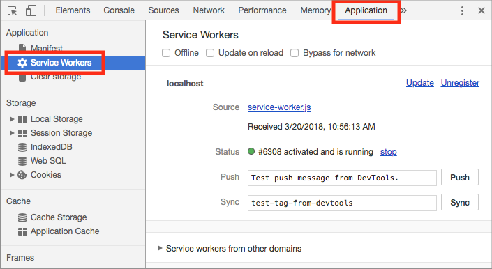
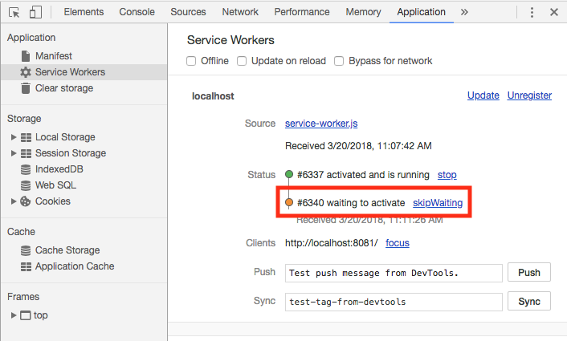
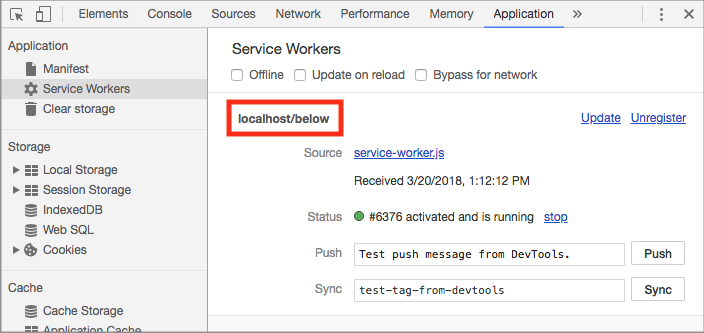

project_path: /web/_project.yaml
book_path: /web/ilt/pwa/_book.yaml

{# wf_auto_generated #}
{# wf_blink_components: N/A #}
{# wf_updated_on: 2019-04-26 #}
{# wf_published_on: 2016-01-01 #}


# Lab: Scripting the Service Worker {: .page-title }



<div id="overview"></div>


## Overview


This lab walks you through creating a simple service worker and explains the service worker life cycle.

#### What you will learn

* Create a basic service worker script, install it, and do simple debugging

#### What you should know

* Basic JavaScript and HTML
* Concepts and basic syntax of ES2015  [Promises](/web/fundamentals/getting-started/primers/promises)
* How to enable the developer console

#### What you need before you begin

* Computer with terminal/shell access
* Connection to the internet
* A  [browser that supports service workers](https://jakearchibald.github.io/isserviceworkerready/)
* A text editor

<div id="get-set-up"></div>


## 1. Get set up


If you have not downloaded the repository and installed the  [LTS version of Node.js](https://nodejs.org/en/), follow the instructions in [Setting up the labs](setting-up-the-labs).

Navigate into the `service-worker-lab/app/` directory and start a local development server:

    cd service-worker-lab/app
    npm install
    node server.js

You can terminate the server at any time with `Ctrl-c`.

Open your browser and navigate to `localhost:8081/`.

Note: [Unregister](tools-for-pwa-developers#unregister) any service workers and [clear all service worker caches](tools-for-pwa-developers#clearcache) for localhost so that they do not interfere with the lab. In Chrome DevTools, you can achieve this by clicking __Clear site data__ from the __Clear storage__ section of the __Application__ tab.

Open the `service-worker-lab/app/` folder in your preferred text editor. The `app/` folder is where you will be building the lab.

This folder contains:

* `below/another.html`, `js/another.js`, `js/other.js`, and `other.html` are sample resources that we use to experiment with service worker scope
* `styles/` folder contains the cascading stylesheets for this lab
* `test/` folder contains files for testing your progress
* `index.html` is the main HTML page for our sample site/application
* `service-worker.js` is the JavaScript file that is used to create our service worker
* `package.json` and `package-lock.json` track the node packages used in this project
* `server.js` is a simple express server that we use to host our app

<div id="register-the-service-worker"></div>


## 2. Register the service worker


Open `service-worker.js` in your text editor. Note that the file is empty. We have not added any code to run within the service worker yet.

Open `index.html` in your text editor.

Inside the `<script>` tags, add the following code to register the service worker:

```
if ('serviceWorker' in navigator) {
  window.addEventListener('load', () => {
    navigator.serviceWorker.register('service-worker.js')
    .then(registration => {
      console.log('Service Worker is registered', registration);
    })
    .catch(err => {
      console.error('Registration failed:', err);
    });
  });
}
```

Save the script and refresh the page. The [console](tools-for-pwa-developers#console) should return a message indicating that the service worker was registered. In Chrome, you can check that a service worker is registered by opening DevTools (Control + Shift + I on Windows and Linux, or ⌘ + alt + I on Mac), clicking the __Application tab__, and then clicking the __Service Workers__ option. You should see something similar to the following:



__Optional__: Open the site on an  [unsupported browser](https://jakearchibald.github.io/isserviceworkerready/) and verify that the support check conditional works.

#### Explanation

The above code registers the `service-worker.js` file as a service worker. It first checks whether the browser supports service workers. This should be done every time you register a service worker because some browsers may not support service workers. The code then registers the service worker using the  [`register`](https://developer.mozilla.org/en-US/docs/Web/API/ServiceWorkerContainer/register) method of the  [`ServiceWorkerContainer` API](https://developer.mozilla.org/en-US/docs/Web/API/ServiceWorkerContainer), which is contained in the window's  [`Navigator`](https://developer.mozilla.org/en-US/docs/Web/API/Navigator) interface.

`navigator.serviceWorker.register(...)` returns a promise that resolves with a  [`registration`](https://developer.mozilla.org/en-US/docs/Web/API/ServiceWorkerRegistration) object once the service worker is successfully registered. If the registration fails, the promise will reject.

<div id="listening-for-life-cycle-events"></div>


## 3. Listening for life cycle events


Changes in the service worker's status trigger events in the service worker.

### 3.1 Add event listeners

Open `service-worker.js` in your text editor.

Add the following event listeners to the service worker:

```
self.addEventListener('install', event => {
  console.log('Service worker installing...');
  // Add a call to skipWaiting here
});

self.addEventListener('activate', event => {
  console.log('Service worker activating...');
});
```

Save the file.

Manually [unregister the service worker](tools-for-pwa-developers#unregister) and refresh the page to install and activate the updated service worker. The console log should indicate that the new service worker was registered, installed, and activated.

Note: The registration log may appear out of order with the other logs (installation and activation). The service worker runs concurrently with the page, so we can't guarantee the order of the logs (the registration log comes from the page, while the installation and activation logs come from the service worker). Installation, activation, and other service worker events occur in a defined order inside the service worker, however, and should always appear in the expected order.

#### Explanation

The service worker emits an `install` event at the end of registration. In the above code, a message is logged inside the `install` event listener, but in a real-world app this would be a good place for caching static assets. We'll look at how to do that in  [Lab: Caching files with Service Worker](lab-caching-files-with-service-worker).

When a service worker is registered, the browser detects if the service worker is new (either because it is different from the previously installed service worker or because there is no registered service worker for this site). If the service worker is new (as it is in this case), then the browser installs it.

The service worker emits an `activate` event when it takes control of the page. The above code  logs a message here, but this event is often used to update caches.

Only one service worker can be active at a time for a given scope (see [Exploring service worker scope](#optional-exploring-service-worker-scope)), so a newly installed service worker isn't activated until the existing service worker is no longer in use. This is why all pages controlled by a service worker must be closed before a new service worker can take over. Since we unregistered the existing service worker, the new service worker was activated immediately.

Note: Simply refreshing the page is not sufficient to transfer control to a new service worker, because the new page will be requested before the current page is unloaded, and there won't be a time when the old service worker is not in use.

Note: You can also manually activate a new service worker using some browsers' [developer tools](tools-for-pwa-developers#accesssw) and programmatically with  [`skipWaiting()`](https://developer.mozilla.org/en-US/docs/Web/API/ServiceWorkerGlobalScope/skipWaiting), which we discuss in section 3.4.

### 3.2 Update the service worker

Add the following comment anywhere in `service-worker.js`:

```
// I'm a new service worker
```

Save the file and refresh the page. Look at the logs in the console; notice that the new service worker installs but does not activate. In Chrome, you can see the waiting service worker in the __Application__ tab in DevTools.



Close all pages associated with the service worker. Then, reopen the `localhost:8081/`. The console log should indicate that the new service worker has now activated.

Note: If you are getting unexpected results, make sure your [HTTP cache is disabled](tools-for-pwa-developers#disablehttpcache) in developer tools.

#### Explanation

The browser detects a byte difference between the new and existing service worker file (because of the added comment), so the new service worker is installed. Since only one service worker can be active at a time (for a given scope), even though the new service worker is installed, it isn't activated until the existing service worker is no longer in use. By closing all pages under the old service worker's control, we are able to activate the new service worker.

### 3.3 Skipping the waiting phase

It is possible for a new service worker to activate immediately, even if an existing service worker is present, by skipping the waiting phase.

In `service-worker.js`, add a call to `skipWaiting` in the `install` event listener:

```
self.skipWaiting();
```

Save the file and refresh the page. Notice that the new service worker installs and activates immediately, even though a previous service worker was in control.

#### Explanation

The `skipWaiting()` method allows a service worker to activate as soon as it finishes installation. The install event listener is a common place to put the `skipWaiting()` call, but it can be called anywhere during or before the waiting phase. See  [this documentation](/web/fundamentals/instant-and-offline/service-worker/lifecycle#skip_the_waiting_phase) for more on when and how to use `skipWaiting()`. For the rest of the lab, we can now test new service worker code without manually unregistering the service worker.

#### For more information

*  [Service worker lifecycle](/web/fundamentals/instant-and-offline/service-worker/lifecycle)

<div id="intercept-network-requests"></div>


## 4. Intercept network requests


Service Workers can act as a proxy between your web app and the network.

Let's add a fetch listener to intercept requests from our domain.

Add the following code to `service-worker.js`:

```
self.addEventListener('fetch', event => {
  console.log('Fetching:', event.request.url);
});
```

Save the script and refresh the page to install and activate the updated service worker.

Check the console and observe that no fetch events were logged. Refresh the page and check the console again. You should see fetch events this time for the page and its assets (like CSS).

Click the links to __Other page__, __Another page__, and __Back__.

You'll see fetch events in the console for each of the pages and their assets. Do all the logs make sense?

Note: If you visit a page and do not have the HTTP cache disabled, CSS and JavaScript assets may be cached locally. If this occurs you will not see fetch events for these resources.

#### Explanation

The service worker receives a fetch event for every HTTP request made by the browser that is within its [scope](#optional-exploring-service-worker-scope). The  [fetch event](https://developer.mozilla.org/en-US/docs/Web/API/FetchEvent) object contains the request. Listening for fetch events in the service worker is similar to listening to click events in the DOM. In our code, when a fetch event occurs, we log the requested URL to the console (in practice we could also create and return our own custom response with arbitrary resources).

Why didn't any fetch events log on the first refresh? By default, fetch events from a page won't go through a service worker unless the page request itself went through a service worker. This ensures consistency in your site; if a page loads without the service worker, so do its subresources.

#### For more information

*  [Fetch Event - MDN](https://developer.mozilla.org/en-US/docs/Web/API/FetchEvent)
*  [Using Fetch - MDN](https://developer.mozilla.org/en-US/docs/Web/API/Fetch_API/Using_Fetch)
*  [Introduction to Fetch - Google Developer](/web/updates/2015/03/introduction-to-fetch)

#### Solution code

To get a copy of the working code, navigate to the `04-intercepting-network-requests/` folder.

<div id="optional-exploring-service-worker-scope"></div>


## 5. Optional: Exploring service worker scope


Service workers have  [scope](/web/ilt/pwa/introduction-to-service-worker#registration_and_scope). The scope of the service worker determines from which paths the service worker intercepts requests.

### 5.1 Find the scope

Update the registration code in `index.html` with:

```
if ('serviceWorker' in navigator) {
  window.addEventListener('load', () => {
    navigator.serviceWorker.register('service-worker.js')
    .then(registration => {
      console.log('SW registered with scope:', registration.scope);
    })
    .catch(err => {
      console.error('Registration failed:', err);
    });
  });
}
```

Refresh the browser. Notice that the console shows the scope of the service worker (in this case it's `http://localhost:8081/`).

#### Explanation

The promise returned by `register()` resolves to the  [registration object](https://developer.mozilla.org/en-US/docs/Web/API/ServiceWorkerRegistration), which contains the service worker's scope.

The default scope is the path to the service worker file, and extends to all lower directories. So a service worker in the root directory of an app controls requests from all files in the app.

### 5.2 Move the service worker

Move `service-worker.js` into the `below/` directory and update the service worker URL in the registration code in `index.html`.

[Unregister](tools-for-pwa-developers#unregister) the current service worker in the browser and refresh the page.

The console shows that the scope of the service worker is now `http://localhost:8081/below/`. In Chrome, you can also see the service worker scope in the application tab of DevTools:



Back on the main page, click __Other page__, __Another page__ and __Back__. Which fetch requests are being logged? Which aren't?

#### Explanation

The service worker's default scope is the path to the service worker file. Since the service worker file is now in `below/`, that is its scope. The console is now only logging fetch events for `another.html`, `another.css`, and `another.js`, because these are the only resources within the service worker's scope.

### 5.3 Set an arbitrary scope

Move the service worker back out into the project root directory (`app/`) and update the service worker URL in the registration code in `index.html`.

Use the  [reference on MDN](https://developer.mozilla.org/en-US/docs/Web/API/ServiceWorkerContainer/register) to set the scope of the service worker to the `below/` directory using the optional parameter in `register()`.

[Unregister the service worker](tools-for-pwa-developers#unregister) and refresh the page. Click __Other page__, __Another page__ and __Back__.

Again the console shows that the scope of the service worker is now `http://localhost:8081/below/`, and logs fetch events only for `another.html`, `another.css`, and `another.js`.

#### Explanation

It is possible to set an arbitrary scope by passing in an additional parameter when registering, for example:

```
navigator.serviceWorker.register('/service-worker.js', {
  scope: '/kitten/'
});
```

In the above example the scope of the service worker is set to `/kitten/`. The service worker intercepts requests from pages in `/kitten/` and `/kitten/lower/` but not from pages like `/kitten` or `/`.

Note: You cannot set an arbitrary scope that is above the service worker's actual location. However, if your service worker is active on a client being served with the `Service-Worker-Allowed` header, you can specify a max scope for that service worker above the service worker's location.

#### For more information

*  [Service worker registration object](https://developer.mozilla.org/en-US/docs/Web/API/ServiceWorkerRegistration)
*  [The register() method](https://developer.mozilla.org/en-US/docs/Web/API/ServiceWorkerContainer/register)
*  [Service worker scope](https://developer.mozilla.org/en-US/docs/Web/API/ServiceWorkerRegistration/scope)

#### Solution code

To get a copy of the working code, navigate to the `solution/` folder.

<div id="congratulations"></div>


## Congratulations!


You now have a simple service worker up and running and understand the service worker life cycle.

#### For more information

[Service worker life cycle](/web/fundamentals/primers/service-workers/lifecycle)


