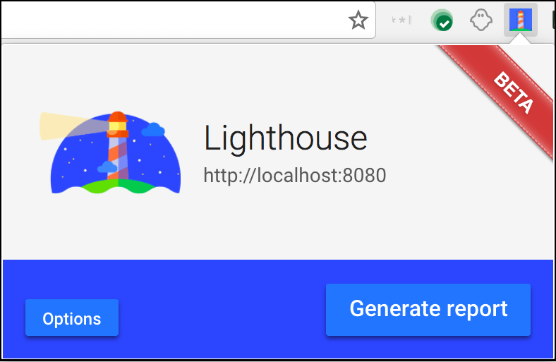

project_path: /web/_project.yaml
book_path: /web/ilt/pwa/_book.yaml

{# wf_auto_generated #}
{# wf_updated_on: 2017-07-12 #}
{# wf_published_on: 2016-01-01 #}

# Lighthouse PWA Analysis Tool {: .page-title }

Codelab:  [Auditing with Lighthouse](lab-auditing-with-lighthouse)

## Introduction

How do I tell if all of my Progressive Web App (PWA) features are in order?  [Lighthouse](/web/tools/lighthouse/) is an  [open-source](https://github.com/GoogleChrome/lighthouse) tool from Google that audits a web app for PWA features. It provides a set of metrics to help guide you in building a PWA with a full application-like experience for your users.

Lighthouse tests if your app:

* Can load in offline or flaky network conditions
* Is relatively fast
* Is served from a secure origin
* Uses certain accessibility best practices

Lighthouse is available as a Chrome extension for Chrome 52 (and later) and a command line tool.

## Running Lighthouse as a Chrome extension

Download the Lighthouse Chrome extension from the  [Chrome Web Store](http://chrome.google.com/webstore/detail/lighthouse/blipmdconlkpinefehnmjammfjpmpbjk).

When installed it places an   icon in your taskbar.

Run Lighthouse on your application by selecting the icon and choosing __Generate report__ (with your app open in the browser page).

Lighthouse generates an HTML page with the results. An example page is shown below.

Note: You can test it out on an example PWA, <a href="https://www.airhorner.com/">airhorner.com</a>.

## Running Lighthouse from the command line

If you want to run Lighthouse from the command line (for example, to integrate it with a build process) it is available as a  [Node](https://nodejs.org/en/) module.

You can download Node from  [nodejs.org](https://nodejs.org/en/) (select the version that best suits your environment and operating system).

Note: You need Node v6 or greater to run Lighthouse.

To install Lighthouse's Node module from the command line, use the following command:

    npm install -g lighthouse

This installs the tool globally. You can then run Lighthouse from the command line (where  [https://airhorner.com/](https://airhorner.com/) is your app):

    lighthouse https://airhorner.com/

You can check Lighthouse flags and options with the following command:

    lighthouse --help

