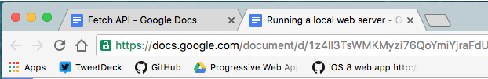
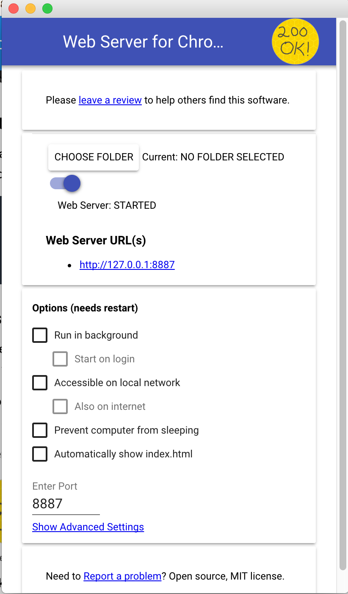

project_path: /web/_project.yaml
book_path: /web/ilt/_book.yaml

{# wf_auto_generated #}
{# wf_updated_on: 2017-02-22T21:26:30Z #}
{# wf_published_on: 2016-01-01 #}

# Running a Local Web Server {: .page-title }

## Overview

Most of the code labs will require to run from a web server. To meet this requirements we present different ways in which you can run web content locally.

## What server to use

* If you are running Chrome (on any OS) then install Web Server for Chrome
* If you're running Chrome OS install Web Server for Chrome
* If you are running Linux or Macintosh use Python's Built in Server

## Web Server for Chrome

Web Server for Chrome is a Chrome extension that creates a local web server. It will run on all platforms where Chrome runs including Chromebooks.

[Install Web Server for Chrome from the Chrome Store](https://chrome.google.com/webstore/detail/web-server-for-chrome/ofhbbkphhbklhfoeikjpcbhemlocgigb?hl=en).

To open the web server extension:

1. Make sure  your Bookmark bar is open. Go to the View menu and ensure that Always Show Bookmark Bar is checked. 
2. Click on the Apps button (far left in the image below)

3. Select  the Web Server Icon

When the web server lunches you will see the following window:

To run your code click __ *Choose Folder* __ and point to the folder hosting your code and click on the URL under __Web Server URL(s)__. Check ‘Automatically show index.html' to test a web app.

## Python Web Server

Python has a built in web server that can be executed from your shell or terminal. This will work everywhere Python is installed. versions of Python come preinstalled in Macintosh and most flavors of Linux; Windows users can download an installer from  [python.org](https://www.python.org/downloads/windows/)

The exact command will depend on the version of Python installed in your system. To verify what version is installed run the following command:

__python -V__

Navigate to your app's base directory in a command window.

### Python 2

If you have version 2 installed, run the following command:

__python -m SimpleHTTPServer 8000__

You will be prompted if you want to accept incoming connections. Whatever choice you make is fine.

### Python 3

If your version of Python is 3 or higher run:

__python -m http.server 8000__

You will be prompted if you want to accept incoming connections. Whatever choice you make is fine. 

You can now open  [http://localhost:8000/](http://localhost:8000/) in a browser to test your app.

## MAMP and XAMPP

MAMP and XAMPP provide web server distribution installers for your operating systems. 

### MAMP

[MAMP](https://www.mamp.info/en/) is available for both Windows and Macintosh. It installs a local server environment on your computer.  To use MAMP to host your content:

* Download the versions for your OS  from the  [MAMP download page](https://www.mamp.info/en/downloads/)
* Copy your project's folder to the root of MAMP's server. In Macintosh the default location is __ */Applications/MAMP/htdocs* __. The default Windows location is __ *c:\MAMP\htdocs* __
* Point your browser to the server URL __ *http://localhost:8888/your-folder* __

You can find documentation on the  [documentation site](https://documentation.mamp.info/en/documentation/) and in the  [MAMP for Windows documentation site](https://documentation.mamp.info/en/documentation/mamp-windows/).

### XAMPP 

[XAMPP](https://www.apachefriends.org/) is a cross platform Apache distribution that installs Apache, MariaDB (fork of MySQL), PHP and Perl on your computer.  To use XAMPP to serve your project:

* Download the latest version for your OS from the  [XAMPP download page](https://www.apachefriends.org/download.html)
* Copy your content to XAMPP's default document root folder(__ *C:/xampp/htdocs* __)
* Point your browser to your applications ( [__ *http://localhost/your-folder* __](http://localhost/your-folder))

## Node.js and Gulp

For some code labs we'll make available a Gulp-based build system that includes a browsersync server configured to the correct directory. To start the server run:

__gulp server__

This command will run the server and open your default browser to the index page.

