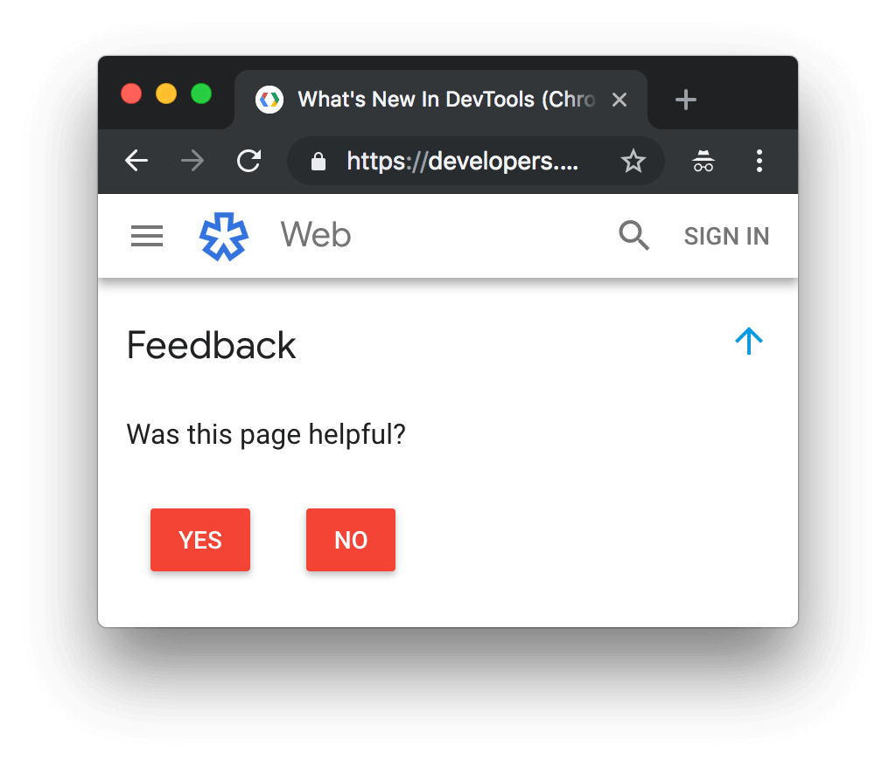
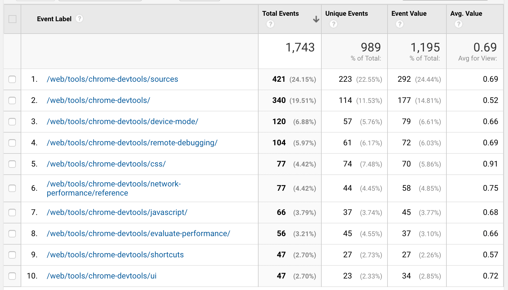

project_path: /web/_project.yaml
book_path: /web/resources/_book.yaml
description: Widgets you can use to simplify your writing and development

{# wf_updated_on: 2019-03-04 #}
{# wf_published_on: 2016-09-13 #}
{# wf_blink_components: N/A #}

# Widgets {: .page-title }



Web**Fundamental** provides a wide variety of widgets to use in documentation.

## Common Links

Maintaining links can be a pain, to simplify this, you can
add common links to the [`_common-links.md`][common-links] file, add it as in include to your
markdown document then use the reference link syntax to reference it in your
document.

First, define the link, in [`_common-links.md`][common-links], using the
standard reference link markdown syntax:

    [id]: http://example.com/  "Optional Title Here"

Be sure to add links sorted alphabetically by id, check to ensure the link
you're adding doesn't already exist yet.

Next, include the [`_common-links.md`][common-links] file in your document.

    <<../_common-links.md>>

Note: The path to the [`_common-links.md`][common-links] file must be relative
from the current directory.

Finally, use the reference link in your document:

    This is [an example][id] reference-style link.

## Includes

The `include` tag includes another file or template at the location of the
tag. If the file contains Django template directives, those directives will be
interpolated.



<pre class="prettyprint">
&#123;% include "web/_shared/sample.html" %}
</pre>

Note: Included files using this syntax must be HTML. Markdown will not be processed.

## Article translation is out of date

If you update an article that has a localized version, please add the
`translation-out-of-date` widget. The widget has been translated into all
languages we support and recommends that developers check the English version
as the localized version may be out of date.

The widget looks like:



To include it, use:

<pre class="prettyprint">
&#123;% include "web/_shared/translation-out-of-date.html" %}
</pre>

## Including live JavaScript in pages (`framebox`)

The `framebox` tag lets you embed a live demo of JavaScript functionality in
a page, running the demo in a domain-sandboxed environment. The contents of the
`framebox` tag are moved to a separate file served from a non-google.com
domain, and automatically included in the documentation page using an `iframe`.
Frameboxes can contain HTML, CSS, and JavaScript. Text in frameboxes is
automatically submitted for translation with the rest of the document, and
served in the same locale as the page.



Click the button to toggle the border.
  <button id="demobutton">Click Me</button>



The code for this example:

<pre class="prettyprint lang-html">&#123;% framebox height="80px" %}

Click the button to toggle the border.
  <button id="demobutton">Click Me</button>

&#123;% endframebox %}</pre>

Supported parameters for framebox:

* `height`: Sets the height of the framebox
* `class`: Adds a class to the framebox’ `iframe`

## Including code from the local project (`includecode`)

Use `includecode` with a `content_path` argument to refer to a path to
a file in the content area, typically in a hidden subdirectory. The path is
relative to the locale root. If the file is not found in the page's locale, it
also checks for the file in the en locale before failing.

<pre class="prettyprint">
&lt;pre class="prettyprint">
&#123;% includecode content_path="web/fundamentals/resources/_code/file.js" %}
&lt;/pre>
</pre>

Includes can be limited by using `region_tag="region"` and including a
`[START region]` and `[END region]` within the code file.

By default `includecode` returns the specified section of the source code,
including whitespace, without modification. This may be undesired if the
specified region is deeply indented in the source file as it may appear out of
line with the rest of the documentation. You can adjust the indentation of the
included code with the `adjust_indentation="auto"` option.

<pre class="prettyprint">
&lt;pre class="prettyprint">
&#123;% includecode content_path="path/file.js" adjust_indentation="auto" %}
&lt;/pre>
</pre>

## Reusable related guides includes

Web**Fundamentals** made it easy to include related guides, unfortunately
DevSite doesn't have an equivalent. To make life easier and allow for simple
reuse, you can use a set of pre-created related guides.

<pre class="prettyprint">
&#123;% include "_shared/related-guides/heading.html" %}
&#123;% include "_shared/related-guides/service-workers.html" %}
</pre>

Will render as:




## Videos

  <iframe class="devsite-embedded-youtube-video" data-video-id="yQhFmPExcbs"
          data-autohide="1" data-showinfo="0" frameborder="0" allowfullscreen>
  </iframe>

Wrap all YouTube videos in `
` or
`
`. `class="video-wrapper"`
automatically floats the video right on larger screens, keeping it at 50% of
the column width but forcing the video into vertical layout on smaller screens,
with the video at 100% of the column width. As the video's size changes, it
automatically maintains a 16:9 ratio. `class="video-wrapper-full-width"` keeps
the video at 100% of the column width at all sizes, and still scales it to
automatically maintain a 16:9 ratio.

    

      <iframe class="devsite-embedded-youtube-video" data-video-id="yQhFmPExcbs"
              data-autohide="1" data-showinfo="0" frameborder="0" allowfullscreen>
      </iframe>
    

[common-links]: https://github.com/google/WebFundamentals/blob/master/src/content/en/_common-links.md

## Add the "was this page helpful?" widget to your docs {: #helpful }

Note: This widget is intended for the Google Web DevRel team.

Want to find out if readers actually find your docs useful? Add the "was this page helpful?"
widget to your docs.

### Step 1: Add the widget to your page {: #helpful1 }

1. Open your doc in a code editor.
1. Put the following code at the bottom of your page.

     <pre>## Feedback &#123;: #feedback .hide-from-toc }

     &#123;% include "web/_shared/helpful.html" %}</pre>

The widget reports your data to Google Analytics as an [event][event]{:.external}.
The category of the event is `Helpful`. The label is the page's absolute path. The value
is `0` if the user clicks **No** (the doc was not helpful) or `1` if the user clicks
**Yes** (the doc was helpful).

[event]: https://developers.google.com/analytics/devguides/collection/analyticsjs/events

### Step 2: Wait {: #helpful2 }

Once the widget is live on your page, you'll probably need to wait a while before you can derive
any meaning from the data. The more responses you get, the more confident you can be that the
data actually represents the sentiment of your users.

### Step 3: Access the data {: #helpful3 }

1. Request access to the **Web Fundamentals** site data on Google Analytics.
1. Open [Google Analytics](https://analytics.google.com).
1. Go to Behavior > Events > Overview.
1. Under **Events Category** select **Helpful**. If you can't see **Helpful**, click **view full report** and find it there.
1. For **Primary Dimension** select **Label**.

The **Total Events** column represents the total number of times that someone clicked **Yes** or **No**.
The **Avg. Value** column represents the average sentiment. For example, if 100 people responded, and
the average value is `0.75`, that means that 75 out of 100 people clicked **Yes** (the page is helpful).

### Step 4: Interpret and act on the data {: #helpful4 }

* If your page is getting low ratings, take a look at it and think about how you can improve it.
  Make that change, and then check back after a while to see if your rating improved.
* If your page is getting high ratings and you think you know why, share this knowledge with the
  rest of the team. We can conduct experiments to see if this change reproducibly improves page ratings.

## Feedback {: #feedback .hide-from-toc }


