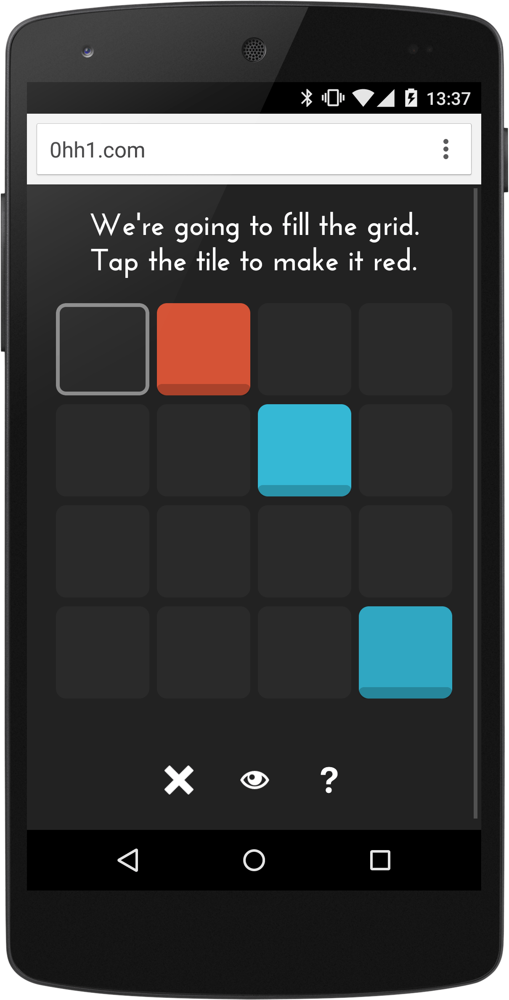

project_path: /web/_project.yaml
book_path: /web/showcase/_book.yaml

{# wf_published_on: 2015-03-24 #}
{# wf_updated_on: 2015-03-24 #}
{# wf_author: pbakaus #}
{# wf_featured_image: /web/showcase/2015/images/0hh1/card.jpg #}

# 0h h1 {: .page-title }

### TL;DR {: .hide-from-toc }

[0h h1](http://0hh1.com/){: .external } is a fun (and addictive) game that just feels right
on mobile.

## Q & A with Martin Kool

### Why the web?

I have always loved the endless possibilities of web technology, and I
consider myself lucky for having embraced it so many years ago, because these
past years have seen amazing enhancements that really bring the web forward,
both on desktop and mobile.

And JavaScript. OMG! That's just Play-Doh for nerds. Almost literally, because
both Play-Doh and JavaScript really allow you to make a little pile of
spaghetti ;) But that just makes it all the more awesome.

But honestly, you can go from zero to 88 MPH in no time, host a demo on
Dropbox or elsewhere, run it from a device and get it out so people can test
it. The feedback loop is really short - devices included - which allows me to
adapt quickly, make the required changes early on and move forward. Then
when it's almost ready to release a game it's amazing to see how many people
can be reached through all the different app stores and a playable web version
combined.

### What worked really well during development?

I'm known to code my JavaScript with a hypothetical chainsaw as I just want
to get stuff done. Ship it, you know? So for me it's about creating a working
game in black and white that's playable for people - that's what I start with,
and then I try to find a design theme that's almost spartan but gets the job
done. Once those are in place I'm just fine-tuning all the details using
Chrome on a Mac while constantly trying out Cordova builds on my Nexus 5.

### If you could have any API to improve your app, what would it be?

Let me start with two minor wishes, before I throw out the big one:

One is the WebView restrictions on mobile devices. Wrapping a game using
Cordova usually gets you a webview that is quite old. I shouldn't complain as
WKWebView is coming and it'll be a few more months when the whole process is
streamlined, but until then it's a mess with all the plugins and everything to
get your HTML5 stuff perform on mobile.

The other is this: Google really needs to provide devs with easy means of
handling cheaters in leaderboards and achievements. In my game 0h n0 some
player got a score of 1 and I've spent a full day trying to get this
management code to run locally, which should connect given the proper
keys and stuff all set up in my dashboard. But in the end it just won't
work, and I feel it should be a service built in the Google Play Game
Services dashboard for devs on Google Play.

But here's the one thing that would truly make all the difference...

Why on Earth do we still need to *wrap* HTML5 into some native Java/ObjC
coat to turn it into an app? That's just... beyond my comprehension. I'd
expected this to be "fixed" five years ago, but here we are still using
Cordova to fill the "gap" between native and the web that originally coined
up the name "Phone Gap". I still consider Cordova a broker that one day will
hopefully be gone as I can use JavaScript to build and compile my app and to
use all APIs that a mobile device or tablet has. So both Android and iOS
should IMHO allow devs to build "native" apps with nothing more than
JavaScript and Sublime.

