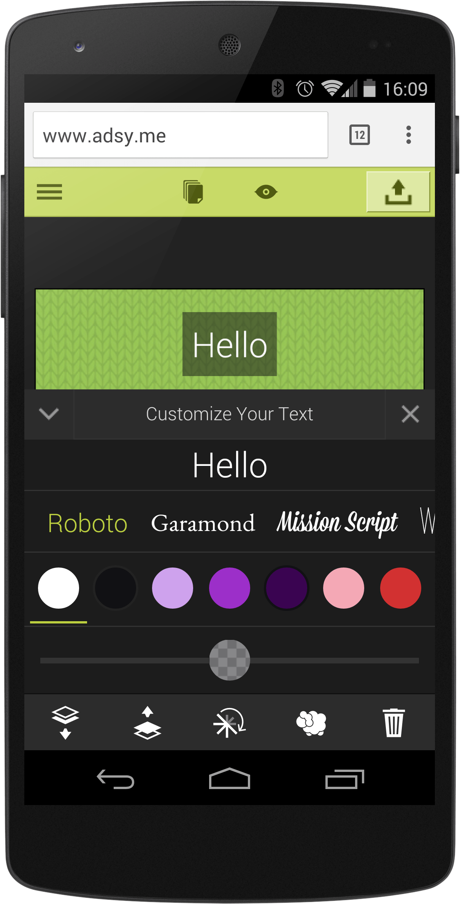

project_path: /web/_project.yaml
book_path: /web/showcase/_book.yaml

{# wf_published_on: 2015-05-04 #}
{# wf_updated_on: 2015-05-04 #}
{# wf_author: pbakaus #}
{# wf_featured_image: /web/showcase/2015/images/adsy_me/card.jpg #}
{# wf_tags: spotlight #}

# Adsy.me {: .page-title }

### TL;DR {: .hide-from-toc }

[Adsy.me](http://adsy.me/){: .external } is a super quick and easy way to build mobile
micro sites.

### What we like?

Adsy.me is a tool that allows anyone to create a mobile (micro-) website, and
they immediately gained my trust by eating their own dogfood: The whole tool
is a fantastic mobile web app that feels very responsive and intuitive.

### Possible Improvements

By utilizing more lazy-loading techniques, the app could load even faster, and
it would benefit from utilizing the full screen API, as well as a ServiceWorker
for going offline.

## Q & A with Frederick Tubiermont

### Why the web?

Three main reasons motivated our choice: openness, cross-platform support and
instant updates for our users.

**Openness** = great for discoverability.
It might sound obvious but the web is open. It can be freely crawled by search
engines (Google first) and is the ideal ecosystem for easy discovery.

**Cross-platform**
The web works (almost) seamlessly across platforms (when browser updates
don't ruin your development efforts ;-)). If you have the right in-house
talent to execute your app properly, it will work on all major devices /
platforms, without the need to develop a different branch for each OS.
Ideally, it saves time & money.

**Instant updates**
You don't need to submit any app updates to the app stores. The end-users
always get the latest version of your product when they refresh their browser.
This is a key advantage if you develop in an agile way, pushing bug fixes and
new features on a regular basis.

By the way, I wrote an article called "7 reasons why appstores are doomed"
(and how we'll be better off in a post-appstores era), which
[you can read here](https://medium.com/@adsy_me/7-reasons-why-appstores-are-doomed-ce05dda53e7c).

### What worked really well during development?

Tough question because, to be honest, it's not that easy (1) to properly
develop for the web (2) to find the right talents who master JS & HTML5 at an
execution level matching our requirements (3) to attract those talents to a
bootstrapped startup who can't afford Silicon Valley salaries.

So it wasn't by any means an easy journey but at the end our efforts were
rewarded. I think that we delivered an unprecedented creation experience in
the mobile browser and I'm proud we did it with just 2 guys in 18 months,
even if it required long days & sleepless nights of hard work.

### If you could have any API to improve your app, what would it be?

I'd love to connect our web app to the Wordpress developers'
community/ecosystem, in one way or another, to open our framework to their
talent while giving our users access to the huge selection of Wordpress
plugins, without the need to reinvent the wheel.

Who knows, you might read in the near future that adsy goes Wordpress ;-)
Stay tuned.

