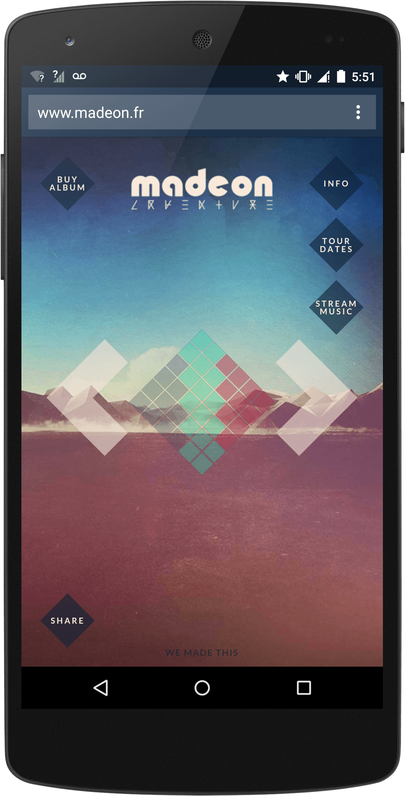

project_path: /web/_project.yaml
book_path: /web/showcase/_book.yaml

{# wf_published_on: 2015-08-14 #}
{# wf_updated_on: 2015-08-14 #}
{# wf_author: pbakaus #}
{# wf_featured_image: /web/showcase/2015/images/adventuremachine/card.jpg #}
{# wf_tags: spotlight #}

# Madeon Adventure Machine {: .page-title }

### TL;DR {: .hide-from-toc }

[Madeon Adventure Machine](http://www.madeon.fr/adventuremachine/){: .external } is a clever
promotion for Madeon's new album that is a fun drum machine.

### What we like?

The Adventure Machine is a really simple app, but it does its job quite well.
By utilizing Web Audio and optionally Web Midi (yes – you can connect your own
synthesizer!), the newly created loops that appear by the touch of a button
sync perfectly, and the interface works well on mobile, especially when
installed to home screen.

### Possible Improvements

The load time (see WebPageTest score) on mobile 3G could be significantly
improved if the the precaching of all beats and loops was removed or done in
a smarter way. Gzip compression on assets is missing and and easy fix, and
the touch targets are slightly too small for smaller screens.

## Q & A with Syd Lawrence

### Why the web?

We wanted the project to be available to as many people as possible around
the world. We also wanted as many people to interact with it as possible,
so we needed to remove every potential barrier to entry.

### What worked really well during development?

We used the Web MIDI API for the first time for this project. Interacting
with a website using a MIDI instrument is an amazing feeling.

### If you could have any API to improve your app, what would it be?

For this web app, tbh, there are ways we could improve it, but there are
already APIs we could use to help with this.

### What happened after launch?

It exceeded all hopes and expectations. It got to #2 on the front page of
reddit, and had almost half a million users within the first month. It also
generated a substantial number of album sales and tour ticket purchases.

