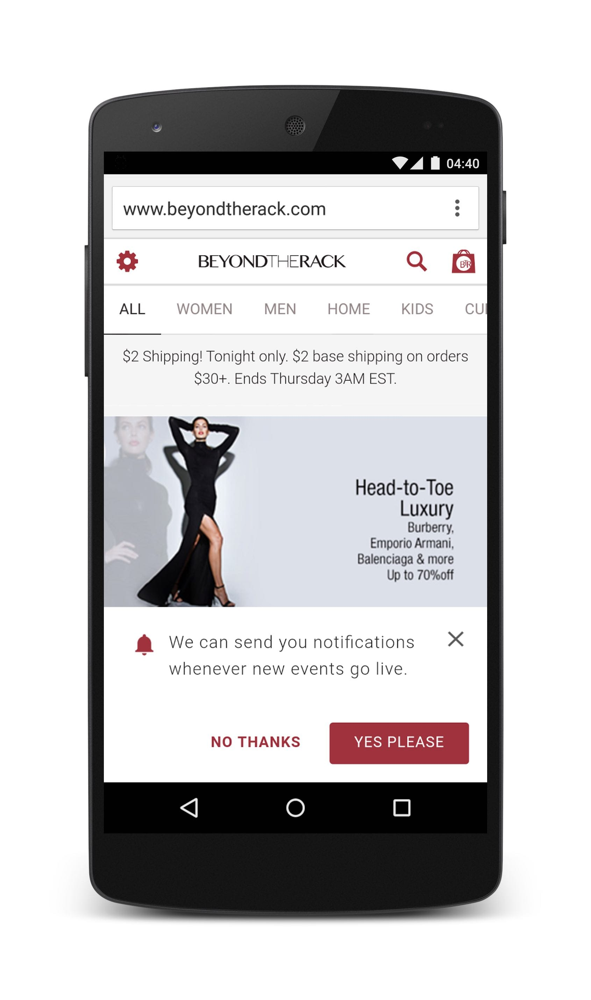
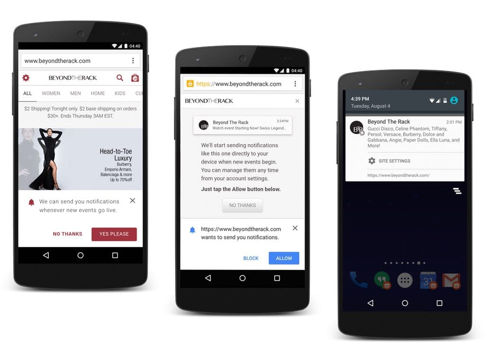

project_path: /web/_project.yaml
book_path: /web/showcase/_book.yaml
description: Beyond the Rack re-engages users on the mobile web, increasing revenue per visit by 26% with push notifications.

{# wf_published_on: 2015-10-25 #}
{# wf_updated_on: 2017-10-06 #}
{# wf_author: paulkinlan #}
{# wf_featured_image: /web/showcase/2015/images/beyond-the-rack/card.jpg #}
{# wf_featured_snippet: Push notifications allowed us to bring one of the most compelling capabilities from our native app to our mobile site. We see a direct 20% click through rate from push notifications—having another channel to reach our users is a game changer. #}
{# wf_tags: progressive-web-apps,webpush,notifications,serviceworker,casestudy #}

# Beyond the Rack {: .page-title }

### TL;DR {: .hide-from-toc }

[Beyond the Rack](https://www.beyondtherack.com) re-engages users on the
mobile web, increasing revenue per visit by 26% with push notifications.
  
> "Push notifications allowed us to bring one of the most compelling
> capabilities from our native app to our mobile site. We see a direct 20%
> click through rate from push notifications—having another channel to reach
> our users is a game changer." 
> <b>Richard Cohene</b>, VP Marketing, Beyond the Rack

### Key Insights

* **52%** of total users are mobile web
* **26%** is the average increase in spend that occurred by members who visited via push
* **20%** click through rate from push notifications
* **72%** more time spent on the site per visit from members who visited via push notifications

<a class="button button-primary" href="pdfs/btr-web-push-casestudy.pdf">
  Download PDF Case study
</a>

## About Beyond the Rack

Beyond the Rack is a leading online retailer that runs sale events of designer products
for its 14 million members globally. Until recently, the company primarily depended on 
targeted, daily emails to re-engage users. Recent internal research showed that **52%** of 
users were visiting their site via the mobile web, so they looked for ways to improve 
their mobile engagement and sales. At this point Beyond the Rack reached out to their 
mobile shopping platform partner Mobify. Working with Mobify, Beyond the Rack implemented 
push notifications on their mobile website and saw a **50%** increase in repeat visits within 
3 months. The company also found push notifications delivered higher value visits, with 
members spending **26%** more per visit on average.

## Timely, relevant notifications

Every day, Beyond the Rack sends emails to their members about new and exclusive sales 
events. With limited sale periods—usually 48 hours—the company couldn’t rely solely on 
customers checking their email to generate sales. Beyond the Rack’s new push notifications 
provided a **20%** click through rate which worked perfectly for flash sales alerts. The 
notifications also provided Beyond the Rack with another touchpoint to interact with a 
highly-engaged and commercially-valuable audience.

## High attention users arrive from push notifications

Beyond the Rack members who visited the site via push notifications  spent **72%** more 
time on the site per visit and shopped more often than the average visitor. By creating 
timely pushes, Beyond the Rack increased the relevance and excitement of their pushes &mdash; and 
customers showed their love through higher sales.

## The value of web-based push notifications for business

More than **50%** of new members discover Beyond the Rack via the mobile web so having an 
avenue to re-engage them after this initial interaction in a personalized way makes it more 
than just a platform for discovery. Because push messages appear at the front of a customer’s 
mobile phone home screen, they prompt greater response and more immediate action.

## About Push Notification

Push notifications enable your mobile web users to choose to receive notifications on their
device just like an installed native app. This lets you effectively re-engage them with customized, 
compelling content.

## More Information

For more information on Push Notifications on the web check out our resources:

* [Getting Started with your first Push Notifications](/web/fundamentals/getting-started/codelabs/push-notifications/)
* [Push and Notifications guide](/web/fundamentals/push-notifications)
