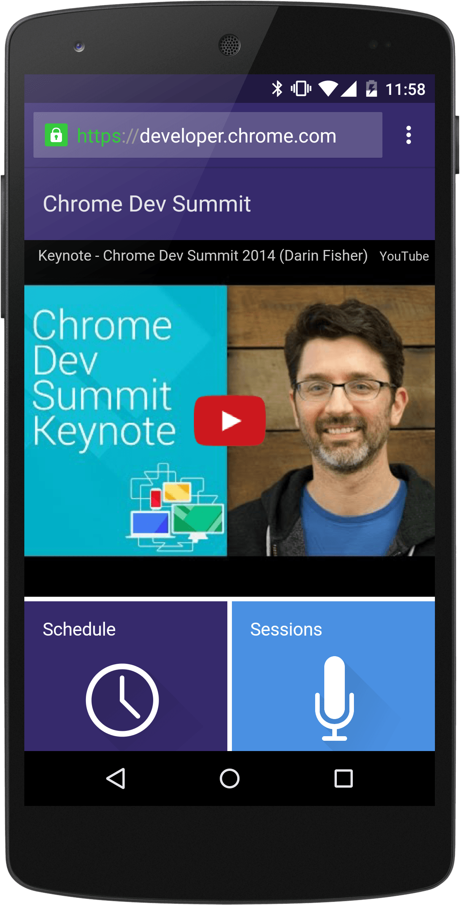
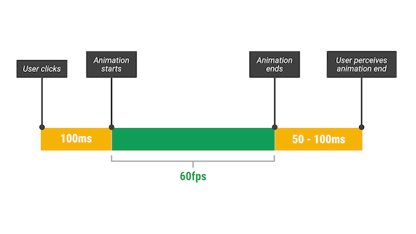
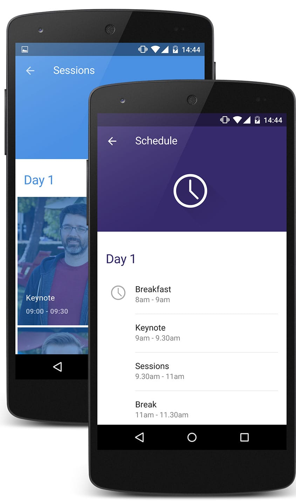

project_path: /web/_project.yaml
book_path: /web/showcase/_book.yaml
description: The Chrome Dev Summit 2014 website was built in-house by our own Paul Lewis, the CDS website showed how to build a great mobile web experience for conference visitors.

{# wf_published_on: 2015-03-27 #}
{# wf_updated_on: 2015-03-27 #}
{# wf_author: pbakaus #}
{# wf_featured_image: /web/showcase/2015/images/chrome-dev-summit/card.jpg #}
{# wf_tags: casestudy,chromedevsummit #}

# Chrome Dev Summit 2014 {: .page-title }

### TL;DR {: .hide-from-toc }

Built in-house by our own Paul Lewis, the CDS website showed how to build a
great mobile web experience for conference visitors.

### Behind the scenes

Remarkable is the smoothness at which the site runs in various mobile browsers.
It's utilizing the layout and paint cycles of the browser in the best way
possible.

New web platform features used

* Service Worker
* Manifest
* Theme Color

Patterns

* Expending cards
* Responsive grid
* Material Design

Source Code

* [GitHub](https://github.com/GoogleChrome/devsummit)

## The Interview

  <iframe class="devsite-embedded-youtube-video" data-video-id="VjCCwplpLAo"
          data-autohide="1" data-showinfo="0" frameborder="0" allowfullscreen>
  </iframe>

## Development

When Paul set out to built the site, a key priority was to embrace 
[Progressive Enhancement](https://en.wikipedia.org/wiki/Progressive_enhancement). 
Instead of designing for desktop, he built it for for small screens first, 
then build up to larger screens – progressively enhancing, instead of 
gracefully degrading. That required a bunch of media queries, but but also a 
fair bit of freedom to eyeball small changes between the key breakpoints. 
Tracking back and forth between screen sizes gave him a sense of where content 
would break, so he could quickly fix it.

Another important aspect of PE is being as backwards-compatible as possible. 
Paul chose to use floats over Flexbox because he felt it would increase the 
number of browsers that the site would work on. For the specific layout of the 
site, this turned out to be no problem at all. If he needed Flexbox he would’ve 
used PE to add it on.

<figure>
  
  <figcaption>
    FLIP is taking advantage of user's perception by prioritizing the animation.
  </figcaption>
</figure>

A major challenge of the site was the card expand and collapse feature, which 
required thinking up a whole new way to do the animations work. Paul came up 
with a strategy he calls [FLIP](https://aerotwist.com/blog/flip-your-animations), 
which involves **setting animating elements to their final state**. From there, 
you apply compositor-friendly properties like transforms and opacity to invert 
the changes and return the element to its start position. Finally, with that 
done, enable transitions on transforms and opacity, and remove those changes. 
This causes the elements to move to their final positions once more! Paul 
admits it’s a little crazy, but it works super well and gives you a 
performance boost.

## Performance

Knowing Paul Lewis as the performance guru he is, I wasn't surprised to 
find out that powerformance was a super important consideration when building 
the site. He heavily relied on [WebPageTest](https://webpagetest.org) to get 
the *Speed Index* value as low as he could. Without the YouTube embed, Paul 
managed to get it to **less than 1,000 on a cable connection**, which meant 
that most of the users would get an initial render in **under a second**.

Most of the work to achieve this was done in Grunt tasks to concatenate, 
minify, and compress images as much as possible. The site also defers 
non-essential images to after page load so that actual content is rendered 
to screen more quickly.

To make the page load time even better, Paul dropped in a 
[service worker](http://www.html5rocks.com/en/tutorials/service-worker/introduction).  
With it, whether you are online or not, a page visit can be served up from 
cache, ensuring that you get to the content even on spotty connectivity 
(extremely important when on conference WiFi!). The CDS site is one of the 
first production sites to use the new feature, which had Paul run into a bunch 
of “early adopter issues”, but the crazy performance boost, he told me, made 
up for it. In fact, he's now taking it to every site he builds!

Performance, of course, isn’t just how well a site loads, but also how well it 
runs. Paul knew the animations were going to be a challenge, which is why he 
came up with [FLIP](https://aerotwist.com/blog/flip-your-animations). Besides 
that, he went out of his way to ensure that nothing got in the way of touch 
input or scrolling. Despite the fact that the site isn’t a hugely complex one, 
he adopted a modified [RAIL methodology](/web/tools/chrome-devtools/profile/evaluate-performance/rail) 
for the build (he didn’t really need much Idle time), and it helped a bunch!

## Design

Since the site was forged by a single person, it meant that Paul was both the 
designer and developer on the project, resulting in unprecedented levels of 
understanding regarding each others’ concerns in the two 'teams'. He likes to 
design desktop down (the opposite of progressive enhancement, which he used 
during development), because it gives him a sense of what needs to go into 
the project. Afterwards Paul drops down to the mobile view, which allows him 
to refine things significantly, and make sure that the most important things 
are getting the most attention. That then informs the Desktop version, because 
invariably information architecture and priority will need updating.

<figure>
  
  <figcaption></figcaption>
</figure>

Not all of it went smoothly. The [Material Design guidelines](https://www.google.com/design/spec/material-design/introduction.html)
at the time weren’t clear about how to make a content site, so there were areas 
where he fell short. The design also failed to account for the schedule and 
session information being related, and in the end, the UX meant that people 
would go to the schedule and be frustrated that they couldn’t get straight to 
the session information.

That being said said, I think Paul did a tremendous job of transporting the 
Material Design spec to a content site. and I’m really pleased with the visuals 
and motion. It has that unique Material Design feel to it, and the information 
and look encourages interaction and hierarchy.

## Success

* Successfully released the entire site on 
[Github](https://github.com/googlechrome/devsummit) (**&gt; 200 stars**) to 
serve as **boilerplate and inspiration to web developers**.
* Incorporated the latest and greatest of the web platform: **service worker, 
web manifest and dynamic theme colors**. The net effect is something that feels 
really integrated with the platform when run on Android devices. If added to 
the user’s home screen, it feels very much like an app they would use, and 
that’s really cool.
* **~73.7k** page views, **180k** clicks to site subsections meant that people 
actually used and engaged with it, much more than expected.

All in all, a great inspiration for today's web developers and a very 
successful conference website.
