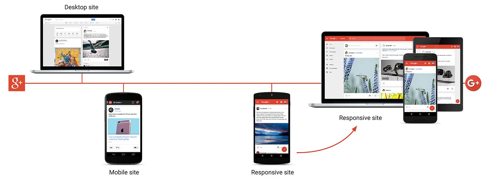
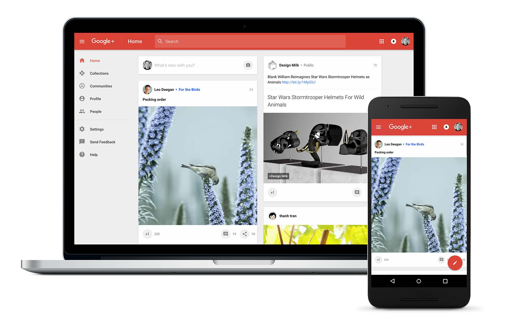

project_path: /web/_project.yaml
book_path: /web/showcase/_book.yaml
description: We hit our goal of never downloading more than 60k of HTML, 60k of JavaScript and 60k of CSS at any one time!

{# wf_published_on: 2015-11-17 #}
{# wf_updated_on: 2015-11-17 #}
{# wf_featured_image: /web/showcase/2015/images/gplus/card.jpg #}
{# wf_featured_snippet: We hit our goal of never downloading more than 60k of HTML, 60k of JavaScript and 60k of CSS at any one time! #}
{# wf_tags: casestudy,css #}

# Google+ {: .page-title }

### TL;DR {: .hide-from-toc }

[Google+](https://plus.google.com) goes completely responsive.

> We hit our goal of never downloading more than 60k of HTML, 60k of
> JavaScript and 60k of CSS at any one time!

## Going Responsive

Google+ is where people come together around shared interests, from 
[Zombie Cats](https://plus.google.com/collection/kp_1P) to 
[Vintage Calculators](https://plus.google.com/collection/wOpZX). Until recently, 
Google+ had two different versions of their website &mdash; one for desktop, 
and one for the mobile web that was designed for older browsers.

## Challenges

Maintaining two sites brought with it a unique set of challenges. Having 
separate versions of the site meant that each feature had to be implemented 
twice. This resulted in a lot of duplicate code and additional effort optimizing 
two experiences for desktop and mobile web. And as the lines between devices 
became increasingly blurry &mdash; with desktops that support touch and 
powerful mobile devices with ever larger screens &mdash; having different 
designs for desktop and mobile made less and less sense.

As we added features, our legacy desktop site also became slow and bloated. 
Earlier this year our homepage weighed around 5MB and produced around 250 HTTP 
requests. It just wasn’t performing well. Images on the site were heavy and 
unoptimized, slowing the page down further. As a result, our stream was almost 
inaccessible on slow and unstable networks and the experience for these users 
was disappointing at best. In addition, the requirement to support legacy 
browsers on the mobile web kept us from relying on JavaScript throughout the 
site and prevented us from implementing highly interactive features. We 
could not rely on the advances in mobile web browsers. 

## Solution
We started with a focus on responsive design: one implementation that would 
work across mobile, tablet, desktop, and beyond. We looked thoroughly at every 
single feature, page, JavaScript library and CSS class. We wanted to build a 
system that would ensure that the site would only download what was absolutely 
necessary to be functional unless the user requested more. The challenge was 
building a website that functioned properly on a slower mobile phone with a 
cellular connection, but still gave a great immersive experience on faster 
browsers and larger screens.

This set of constraints meant that we had to scrutinize each and every code 
change going forward. To achieve this we established a 6^5 rule to ensure that 
on initial page load we didn’t download more than 60K of HTML, 60K of 
JavaScript, 60K of CSS, our animations were always 60fps, and we had an average 
latency of 0.6s.

To achieve this, we chose JavaScript and CSS frameworks that built modularity 
and lazy loading in from the beginning. We therefore ensure that users only 
download JavaScript and CSS when they actually use the feature that requires it. 
This is done through a template driven approach that combined with our build and 
module system so that things work with almost no effort from developers.

With this new framework, we started prototyping a reimplementation of Google+ on
the web. We began disallowing “bad” things and setting strict rules for 
development. One of our major rules was that all our pages needed to be both 
server-side and client-side rendered. With server-side rendering we make sure 
that the user can begin reading as soon as the HTML is loaded, and no 
JavaScript needs to run in order to update the contents of the page. Once the 
page is loaded and the user clicks on a link, we do not want to perform a full 
round-trip to render everything again. This is where client-side rendering 
becomes important &mdash; we just need to fetch the data and the templates, 
and render the new page on the client. This involves lots of tradeoffs; so we 
used a framework that makes server-side and client-side rendering easy without 
the downside of having to implement everything twice &mdash; on the server 
and on the client. 

Other rules included disallowing height and width animation that would cause 
browser re-layouts and have negative effects on performance. For DOM 
manipulations and animations we scheduled tasks to be done in-sync with the 
render refresh rate of the browser. We also group all measure tasks together 
so that we can avoid expensive repeated style calculations. We also relied 
heavily on Chrome profiler tools to ensure everything was working as intended 
as we went along. In addition, we created tools that calculate the effect of 
code changes on JS-footprint to make sure we do not drastically increase 
our page size. 

This took some time, but it would have been much more difficult if we hadn’t 
had the ability to identify and eliminate problems as we built.

We launched our mobile-web version of this responsive implementation in 
February, 2015. This allowed us to vet the new designs and our new process. 
We used data from this launch to validate what worked and what did not. We 
iterated on the design and started expanding to support more devices. In 
November, 2015 we launched this new implementation across all devices.

## Results

Without sacrificing performance, Google+ were able to build a complex web app 
with rich UI. The site is now faster and leaner than ever before. 

  <iframe class="devsite-embedded-youtube-video" data-video-id="MaQcCQQTs6E"
          data-autohide="1" data-showinfo="0" frameborder="0" allowfullscreen>
  </iframe>

> We hit our goal of never downloading more than 60k of HTML, 60k of 
> JavaScript and 60k of CSS at any one time!

<table class="">
  <thead>
    <tr>
      <th></th>
      <th>Before</th>
      <th>After</th>
    </tr>
  </thead>
  <tbody>
    <tr>
      <td>Total home page weight, gzipped (with images)</td>
      <td>22,600 KB</td>
      <td>327 KB</td>
    </tr>
    <tr>
      <td>Request count</td>
      <td>251</td>
      <td>45</td>
    </tr>
    <tr>
      <td>HTML (not gzipped)</td>
      <td>1,100 KB</td>
      <td>362 KB</td>
    </tr>
    <tr>
      <td>JavaScript &amp; CSS (gzipped)</td>
      <td>2,768 KB</td>
      <td>111KB</td>
    </tr>
    <tr>
      <td>Average complete page load time (latency)</td>
      <td>12 seconds 0.7 seconds to first byte</td>
      <td>3 seconds 0.1 seconds to first byte</td>
    </tr>
  </tbody>
</table>
