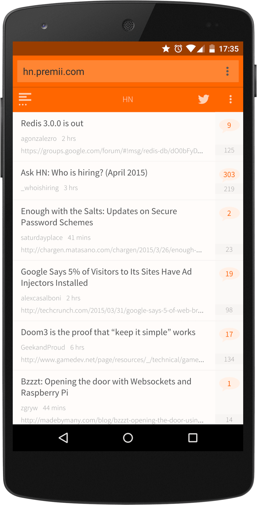

project_path: /web/_project.yaml
book_path: /web/showcase/_book.yaml

{# wf_published_on: 2015-04-01 #}
{# wf_updated_on: 2015-04-01 #}
{# wf_author: paulkinlan #}
{# wf_featured_image: /web/showcase/2015/images/hn_premii/card.jpg #}
{# wf_tags: spotlight #}

# Hacker News Reader {: .page-title }

### TL;DR {: .hide-from-toc }

[Hacker News Reader](http://hn.premii.com/){: .external }: An amazing optimized reader
for Hacker News.

### What we like?

A beautiful and highly optimized reading experience for Hacker News, this
app works well and looks great across mobile, tablet and desktop. It's fast
and testing it on mobile you will see some silky smooth transitions. It has
a really nice use of theme-color for integration into Android and it's
installable as it uses the 
[Web app manifest](/web/fundamentals/engage-and-retain/simplified-app-installs).
Once installed it looks and feels like a native HN news reader app.

### Possible Improvements

The app does a huge number of things very well. It loads quickly and is fast
and smooth to use. If there were one thing the app could do it would be to add
support for offline experiences. This could be a simple error page or a more
complex view of cached content.

## Q & A with Dharmesh Patel

### Why the web?

I prefer to use technology that I am most comfortable in. I created my first
webpage long before I wrote "hello world" in c++.

Open web is the only platform that allows me to reach all kinds of users. I can
easily develop and deploy new features and fixes for my app without depending
on third party. It allows me to push new features and bug fixes anytime.

User can try my app without downloading, and can use same app on different
platforms. As of today, my app works on latest HTML5 capable browsers
including but not limited to Firefox OS, Windows Phone, blackberry, iOS and
Android; and its available to download on different app stores. This app is
also available on the Chrome Web Store. I am a sole developer and I work on
this few hours per week. I don't think that any other technology would have
allowed me to support different platforms.

### What worked really well during development?

I was surprised how well all latest browsers support major HTML5 features.
I started my web app as a prototype to see what I can build using Open Web
(HTML5, CSS, JavaScript). I only tested my app on iOS Safari and Android
browser during development, and it worked on Firefox and with little changes,
I was able to support IE mobile.

Like everyone else, I thought 60FPS was not possible on mobile web app,
specially gestures. I was able to implement pull to refresh, and swipe to
go back with little learning; and was able to make it work on all major
browsers. With that knowledge, I was able to implement Flipboard web app
style story navigation in few hours.

### If you could have any API to improve your app, what would it be?

**Intent**: Should be able to launch Android native share intent or iOS
share from my web app. This will allow user to choose the service of their
choice instead of my app's limited options.

**Persistent local storage**: Like to see better support for localstorage.
5MB/2.5MB is not enough. Not only that, there is no way to figure out how
much space is available. My app can manage storage properly if I knew how
much space is left.

**Native/standalone web app**: Better option to deploy/install my web app on
iOS, Android and WP as a standalone app. I use Cordova but its painful to
update to the latest version. Chrome on Android is moving in right direction,
but iOS and Windows Phone is not providing enough support for standalone app.
