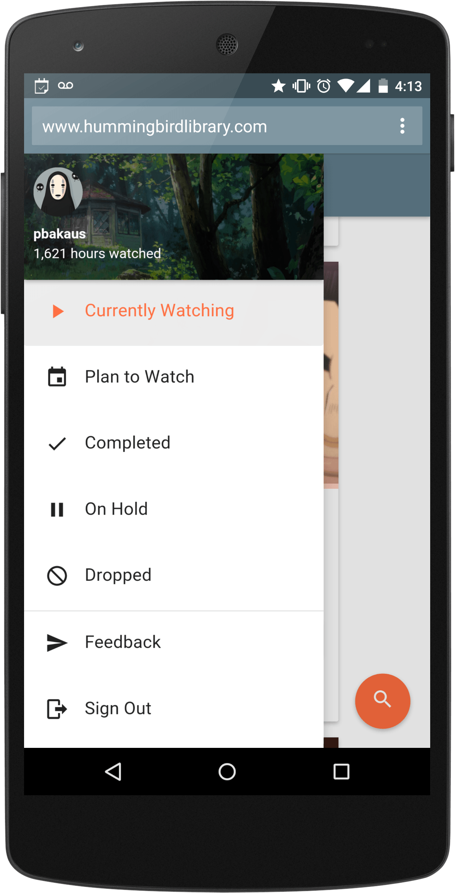

project_path: /web/_project.yaml
book_path: /web/showcase/_book.yaml

{# wf_published_on: 2015-08-14 #}
{# wf_updated_on: 2015-08-14 #}
{# wf_author: pbakaus #}
{# wf_featured_image: /web/showcase/2015/images/hummingbirdlibrary/card.jpg #}
{# wf_tags: spotlight #}

# Hummingbird Library {: .page-title }

### TL;DR {: .hide-from-toc }

[Hummingbird Library](http://hummingbirdlibrary.com/){: .external }: A refreshingly new
frontend to Hummingbird, a popular anime watch-tracker and discovery site.

### What we like?

Anime fans (like me – that view count on the screenshot is real!) have long
been obsessed with keeping track of what they watched. Popular sites in this
space include AniDB and MyAnimeList, but [Hummingbird](https://hummingbird.me)
is the by far best-looking of them all.

Yet, [Hummingbird Library](http://hummingbirdlibrary.com/){: .external }, which sits on top
of the existing Hummingbird API, goes one step further, built from scratch
with Angular and Material Design.
[Theme color](/web/fundamentals/design-and-ux/browser-customization/)
and [manifest](/web/fundamentals/engage-and-retain/app-install-banners/) make
it look super integrated and installable on the home screen, and the whole
experience feels very snappy, focussing on the core functionality of the main
site.

### Possible Improvements

**Performance**: The app would benefit greatly from utilizing a service
worker to offline cache results and UI after initial page load, enabling gzip
compression would dramatically improve load time and having a static, initial
barebone layout in the HTML would improve perceived performance.

**UX**: The flex box model used to display the list of shows works well
with bigger screens but loses its appeal on smaller ones. A non centered,
tighter version of the tiles would work much better on mobile devices.

## Q & A with Leif Thomas

### Why the web?

Developing for the web allows you to reach virtually every platform with a
single codebase, which is a huge advantage when you're the sole developer. And
thanks to great features like
[Add to Homescreen](/web/fundamentals/engage-and-retain/app-install-banners/),
it's easy to give users an experience that is nearly identical to what they
would get in a native application.

### What worked really well during development?

The [angular/material project](https://github.com/angular/material) on GitHub
worked perfectly. It gave me everything I needed to start a project with
AngularJS and Material Design.

### If you could have any API to improve your app, what would it be?

At the browser level, I think an API for performing voice searches within my
web app could really help it. Android has added a lot of voice commands lately
and the ability to use that sort of input on the mobile web would make for a
great experience.

> Good news, we actually have that already :) Check out the Web Speech API.

### Finally, how did you market your app?

I used Facebook, Google+, and Twitter to drive traffic to
www.hummingbirdlibrary.com, but my biggest traffic spike happened after
posting a link to it on reddit. It's a great way to target an audience that
may have a genuine interest in what you're developing.

