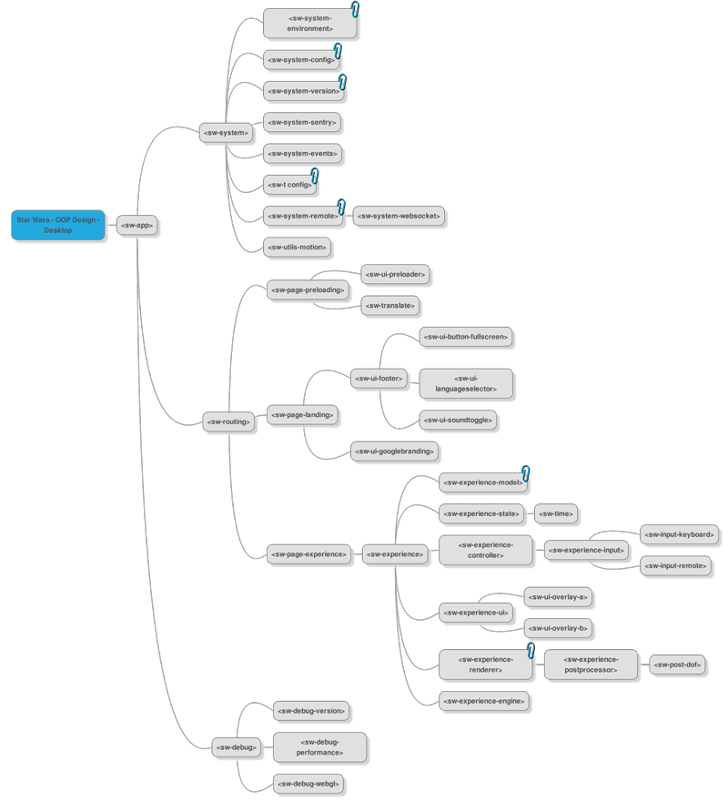
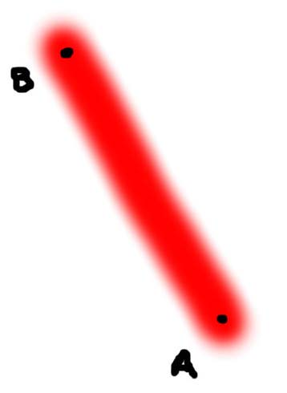
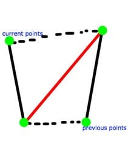
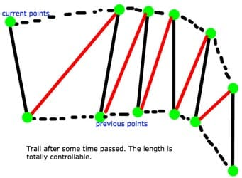

project_path: /web/_project.yaml
book_path: /web/showcase/_book.yaml
description: How to set up a high FPS WebGL project with Polymer.

{# wf_published_on: 2015-12-15 #}
{# wf_updated_on: 2015-12-15 #}
{# wf_author: yatesbuckley,maciejzasada,fouadvaladbeigi #}
{# wf_featured_image: /web/showcase/2015/images/lightsaber/card.jpg #}
{# wf_featured_snippet: How we used Polymer to create a high-performance WebGL mobile controlled Lightsaber that is modular and configurable. We review some of the key details of our <a href="https://lightsaber.withgoogle.com/"> project</a> to help you save time when creating your own next time you run into a pack of angry Stormtroopers. #}
{# wf_tags: casestudy,webgl,experiment #}

# Creating a Lightsaber with Polymer {: .page-title }

### TL;DR {: .hide-from-toc }

How we used Polymer to create a high-performance WebGL mobile controlled
Lightsaber that is modular and configurable. We review some of the key details
of our project <a href='https://lightsaber.withgoogle.com/'>https://lightsaber.withgoogle.com/</a>
to help you save time when creating your own next time you run into a pack of
angry Stormtroopers.

## Overview

If you are wondering what Polymer or WebComponents are we thought it
would be best to start by sharing an extract from an actual working project.
Here is a sample taken from the landing page of our project
[https://lightsaber.withgoogle.com](https://lightsaber.withgoogle.com). It's
a regular HTML file but has some magic inside:

    <!-- Element-->
    <dom-module id="sw-page-landing">
      <!-- Template-->
      <template>
        
        

          <sw-ui-logo></sw-ui-logo>
          

            <sw-t key="landing.type" class="type"></sw-t>
            
.

            <sw-ui-toast></sw-ui-toast>
          

        

        

          <sw-t key="disclaimer.epilepsy" class="type"></sw-t>
        

        <sw-ui-footer state="extended"></sw-ui-footer>
      </template>
      <!-- Polymer element script-->
      
    </dom-module>

So there are many choices out there nowadays when you want to create 
a HTML5 based application. APIs, Frameworks, Libraries, Game Engines etc. 
Despite all the choices it is difficult to get a setup that is a good mix 
between control over high performance of graphics and clean modular 
structure and scalability. We found that Polymer could help us keep the 
project organized while still allowing for low-level performance 
optimizations, and we carefully crafted the way we broke down our project 
into components to best leverage Polymer's capabilities.

Note: For more general information on Polymer you should have a look on their site <a href='https://www.polymer-project.org/'>https://www.polymer-project.org/</a> and go through their tour.

## Modularity with Polymer

[Polymer](https://www.polymer-project.org) is a library that allows a 
lot of power over how your project is built from reusable custom elements. 
It allows you to use standalone, fully functional modules contained in a 
single HTML file. They contain not only the structure (HTML markup) but also 
inline styles and logic. 

Have a look at the example below:

    <link rel="import" href="bower_components/polymer/polymer.html">

    <dom-module id="picture-frame">
      <template>
        <!-- scoped CSS for this element -->
        
        

          <!-- any children are rendered here -->
          <content></content>
        

      </template>

      
    </dom-module>

But on a larger project it might be helpful to separate these three logical 
components (HTML, CSS, JS) and only merge them at compile time. So one thing 
we did was give each element in the project its own separate folder:

<pre>
src/elements/
|-- elements.jade
`-- sw
    |-- debug
    |   |-- sw-debug
    |   |-- sw-debug-performance
    |   |-- sw-debug-version
    |   `-- sw-debug-webgl
    |-- experience
    |   |-- effects
    |   |-- sw-experience
    |   |-- sw-experience-controller
    |   |-- sw-experience-engine
    |   |-- sw-experience-input
    |   |-- sw-experience-model
    |   |-- sw-experience-postprocessor
    |   |-- sw-experience-renderer
    |   |-- sw-experience-state
    |   `-- sw-timer
    |-- input
    |   |-- sw-input-keyboard
    |   `-- sw-input-remote
    |-- pages
    |   |-- sw-page-calibration
    |   |-- sw-page-connection
    |   |-- sw-page-connection-error
    |   |-- sw-page-error
    |   |-- sw-page-experience
    |   `-- sw-page-landing
    |-- sw-app
    |   |-- bower.json
    |   |-- scripts
    |   |-- styles
    |   `-- sw-app.jade
    |-- system
    |   |-- sw-routing
    |   |-- sw-system
    |   |-- sw-system-audio
    |   |-- sw-system-config
    |   |-- sw-system-environment
    |   |-- sw-system-events
    |   |-- sw-system-remote
    |   |-- sw-system-social
    |   |-- sw-system-tracking
    |   |-- sw-system-version
    |   |-- sw-system-webrtc
    |   `-- sw-system-websocket
    |-- ui
    |   |-- experience
    |   |-- sw-preloader
    |   |-- sw-sound
    |   |-- sw-ui-button
    |   |-- sw-ui-calibration
    |   |-- sw-ui-disconnected
    |   |-- sw-ui-final
    |   |-- sw-ui-footer
    |   |-- sw-ui-help
    |   |-- sw-ui-language
    |   |-- sw-ui-logo
    |   |-- sw-ui-mask
    |   |-- sw-ui-menu
    |   |-- sw-ui-overlay
    |   |-- sw-ui-quality
    |   |-- sw-ui-select
    |   |-- sw-ui-toast
    |   |-- sw-ui-toggle-screen
    |   `-- sw-ui-volume
    `-- utils
        `-- sw-t
</pre>

And each element's folder has the same internal structure with separate 
directories and files for logic (coffee files), styles (scss files) and 
template (jade file).

Here's an example `sw-ui-logo` element:

<pre>
sw-ui-logo/
|-- bower.json
|-- scripts
|   `-- sw-ui-logo.coffee
|-- styles
|   `-- sw-ui-logo.scss
`-- sw-ui-logo.jade
</pre>

Note: All examples are in Coffeescript (rather than JavaScript), SASS (rather than CSS) and Jade (rather than HTML). All of these pre-compile translate to their corresponding language with the additional advantages of being less code, and more error checking at compile-time. Otherwise the information is relevant to other environments.

And if you look into the `.jade` file:

    // Element
    dom-module(id='sw-ui-logo')

      // Template
      template
        style
          include elements/sw/ui/sw-ui-logo/styles/sw-ui-logo.css

        img(src='[[url]]')

      // Polymer element script
      script(src='scripts/sw-ui-logo.js')

You can see how things are organised in a clean way by including styles 
and logic from separate files. To include our styles in our Polymer 
elements we use Jade’s `include` statement, so we have actual inline CSS 
file contents after compilation. The `sw-ui-logo.js` script element will 
execute at runtime.

## Modular Dependencies with Bower

Normally we keep libraries and other dependencies at the project level. 
However in the setup above you will notice a `bower.json` that is in the 
element’s folder: element level dependencies. The idea behind this approach 
is that in a situation where you have lots of elements with different 
dependencies we can make sure to load only those dependencies that are 
actually used. And if you remove an element, you don’t need to remember to 
remove its dependency because you also will have removed the `bower.json` file 
that declares these dependencies. Each element independently loads the 
dependencies that relate to it.

However, to avoid a duplication of dependencies we include a `.bowerrc` file 
in each element’s folder as well. This tells bower where to store 
dependencies so we can ensure there is only one at the end in the same 
directory:

    {
      "directory" : "../../../../../bower_components"
    }

This way if multiple elements declare `THREE.js` as a dependency, once 
bower installs it for the first element and starts parsing the second one, 
it will realise that this dependency is already installed and will not 
re-download or duplicate it. Similarly, it will keep that dependency 
files as long as there's at least one element that still defines it in 
its `bower.json`.

A bash script finds all `bower.json` files in the nested elements structure. 
Then it enters these directories one by one and executes `bower install` in 
each of them:

    echo installing bower components...
    modules=$(find /vagrant/app -type f -name "bower.json" -not -path "*node_modules*" -not -path "*bower_components*")
    for module in $modules; do
      pushd $(dirname $module)
      bower install --allow-root -q
      popd
    done

## Quick New Element Template

It takes a bit of time each time you want to create a new element: generating 
the folder and basic file structure with the correct names. So we use 
[Slush](http://slushjs.github.io/){: .external } to write a simple element generator. 

You can call the script from command line:

    $ slush element path/to/your/element-name

And the new element is created, including all the file structure and contents.

We defined templates for the element files, e.g. the `.jade` file template 
looks as follows:

    // Element
    dom-module(id='<%= name %>')

      // Template
      template
        style
          include elements/<%= path %>/styles/<%= name %>.css

        span This is a '<%= name %>' element.

      // Polymer element script
      script(src='scripts/<%= name %>.js')

The Slush generator replaces the variables with actual element paths and names.

## Using Gulp to Build Elements

Gulp keeps the build process under control. And in our structure, to build 
the elements we need Gulp to follow the following steps:

1. Compile the elements' `.coffee` files to `.js`
1. Compile the elements' `.scss` files to `.css`
1. Compile the elements' `.jade` files to `.html`, embedding the `.css` files.

In more detail:

Compiling the elements' `.coffee` files to `.js`

    gulp.task('elements-coffee', function () {
      return gulp.src(abs(config.paths.app + '/elements/**/*.coffee'))
        .pipe($.replaceTask({
          patterns: [{json: getVersionData()}]
        }))
        .pipe($.changed(abs(config.paths.static + '/elements'), {extension: '.js'}))
        .pipe($.coffeelint())
        .pipe($.coffeelint.reporter())
        .pipe($.sourcemaps.init())
        .pipe($.coffee({
        }))
        .on('error', gutil.log)
        .pipe($.sourcemaps.write())
        .pipe(gulp.dest(abs(config.paths.static + '/elements')));
    });

For the steps 2 and 3 we use gulp and a compass plugin to compile `scss` to 
`.css` and `.jade` to `.html`, in a similar approach to 2 above.

## Including Polymer Elements

To actually include the Polymer elements we use HTML imports.

    <link rel="import" href="elements.html">

    <!-- Polymer -->
    <link rel="import" href="../bower_components/polymer/polymer.html">

    <!-- Custom elements -->
    <link rel="import" href="sw/sw-app/sw-app.html">
    <link rel="import" href="sw/system/sw-system/sw-system.html">
    <link rel="import" href="sw/system/sw-routing/sw-routing.html">
    <link rel="import" href="sw/system/sw-system-version/sw-system-version.html">
    <link rel="import" href="sw/system/sw-system-environment/sw-system-environment.html">
    <link rel="import" href="sw/pages/sw-page-landing/sw-page-landing.html">
    <link rel="import" href="sw/pages/sw-page-connection/sw-page-connection.html">
    <link rel="import" href="sw/pages/sw-page-calibration/sw-page-calibration.html">
    <link rel="import" href="sw/pages/sw-page-experience/sw-page-experience.html">
    <link rel="import" href="sw/ui/sw-preloader/sw-preloader.html">
    <link rel="import" href="sw/ui/sw-ui-overlay/sw-ui-overlay.html">
    <link rel="import" href="sw/ui/sw-ui-button/sw-ui-button.html">
    <link rel="import" href="sw/ui/sw-ui-menu/sw-ui-menu.html">

## Optimising Polymer elements for production

A large project can end up having a lot of Polymer elements. In our 
project, we have more than fifty. If you consider each element having a 
separate `.js` file and some having libraries referenced, it becomes more than 
100 separate files. This means a lot of requests the browser needs to make, 
with performance loss. Similarly to a concatenate and minify process we 
would apply to an Angular build, we “vulcanize” the Polymer project at the 
end for production.

[Vulcanize](https://github.com/polymer/vulcanize) is a Polymer tool that 
flattens the dependency tree into a single html file, reducing the 
number of requests. This is especially great for browsers that do not 
support web components natively.

## CSP (Content Security Policy) and Polymer

When developing secure web applications you need to implement CSP. 
[CSP](http://www.html5rocks.com/en/tutorials/security/content-security-policy/) 
is a set of rules that prevent cross-site scripting (XSS) attacks: 
execution of scripts from unsafe sources, or executing inline scripts 
from HTML files.

Now the one, optimized, concatenated and minified `.html` file generated 
by Vulcanize has all the JavaScript code inline in a non CSP compliant 
format. To address this we use a tool called 
[Crisper](https://github.com/PolymerLabs/crisper).

Crisper splits inline scripts from an HTML file and puts them into a single, 
external JavaScript file for CSP compliance. So we pass the vulcanized 
HTML file through Crisper and end up with two files: `elements.html` and 
`elements.js`. Inside `elements.html` it also takes care of loading the 
generated `elements.js`.

## Application Logical Structure

In Polymer, elements can be anything from a non-visual utility to small, 
standalone and reusable UI elements (like buttons) to bigger modules like 
"pages" and even composing full applications.

<figure>
  
  <figcaption>
    A top-level logical structure of our application represented with 
    Polymer elements.
  </figcaption>
</figure>

## Postprocessing with Polymer and Parent-child Architecture

In any 3D graphics pipeline, there is always a last step where effects 
are added on top of the whole picture as a kind of overlay. This is the 
post-processing step, and involves effects like glows, god-rays, 
depth of field, bokeh, blurs etc. The effects are combined and applied to 
different elements according to how the scene is built. In THREE.js we 
could create a custom shader for the post-processing in JavaScript or 
we can do this with Polymer, thanks to its parent-child structure.

If you look at our post-processor's element HTML  code:

    <dom-module id="sw-experience-postprocessor">
      <!-- Template-->
      <template>
        <sw-experience-effect-bloom class="effect"></sw-experience-effect-bloom>
        <sw-experience-effect-dof class="effect"></sw-experience-effect-dof>
        <sw-experience-effect-vignette class="effect"></sw-experience-effect-vignette>
      </template>
      <!-- Polymer element script-->
      
    </dom-module>

We specify the effects as nested Polymer elements under a common class. Then, 
in `sw-experience-postprocessor.js` we do this:

    effects = @querySelectorAll '.effect'
    @composer.addPass effect.getPass() for effect in effects

We use the HTML feature and JavaScript's `querySelectorAll` to find all 
effects nested as HTML elements within the post processor, in the order 
they were specified in. We then iterate over them and add them to the composer.

Now, let's say we want to remove the DOF (Depth of Field) effect and 
change the order of bloom and vignette effects. All we need to do is edit 
the post-processor's definition  to something like:

    <dom-module id="sw-experience-postprocessor">
      <!-- Template-->
      <template>
        <sw-experience-effect-vignette class="effect"></sw-experience-effect-vignette>
        <sw-experience-effect-bloom class="effect"></sw-experience-effect-bloom>
      </template>
      <!-- Polymer element script-->
      
    </dom-module>

and the scene will just run, without changing a single line of actual code.

## Render loop and update loop in Polymer

With Polymer we can also approach rendering and engine updates elegantly. 
We created a `timer` element that uses `requestAnimationFrame` and computes 
values like current time (`t`) and delta time - time elapsed from the 
last frame (`dt`):

    Polymer
      is: 'sw-timer'

      properties:
        t:
          type: Number
          value: 0
          readOnly: true
          notify: true
        dt:
          type: Number
          value: 0
          readOnly: true
          notify: true

      _isRunning: false
      _lastFrameTime: 0

      ready: ->
        @_isRunning = true
        @_update()

      _update: ->
        if !@_isRunning then return
        requestAnimationFrame => @_update()
        currentTime = @_getCurrentTime()
        @_setT currentTime
        @_setDt currentTime - @_lastFrameTime
        @_lastFrameTime = @_getCurrentTime()

      _getCurrentTime: ->
        if window.performance then performance.now() else new Date().getTime()

Then, we use data binding to bind the `t` and `dt` properties to our 
engine (`experience.jade`):

    sw-timer(
      t='t}}',
      dt='dt}}'
    )

    sw-experience-engine(
      t='[t]',
      dt='[dt]'
    )

And we listen to changes of `t` and `dt` in the engine and whenever the 
values change, the `_update` function will be called:

    Polymer
      is: 'sw-experience-engine'

      properties:
        t:
          type: Number

        dt:
          type: Number

      observers: [
        '_update(t)'
      ]

      _update: (t) ->
        dt = @dt
        @_physics.update dt, t
        @_renderer.render dt, t

If you're hungry for FPS though, you might want to remove Polymer's data 
binding in render loop to save couple milliseconds required to notify 
elements about the changes. We implemented custom observers as follows:

`sw-timer.coffee`:

    addUpdateListener: (listener) ->
      if @_updateListeners.indexOf(listener) == -1
        @_updateListeners.push listener
      return

    removeUpdateListener: (listener) ->
      index = @_updateListeners.indexOf listener
      if index != -1
        @_updateListeners.splice index, 1
      return

    _update: ->
      # ...
      for listener in @_updateListeners
          listener @dt, @t
      # ...

The `addUpdateListener` function accepts a callback and saves it in its 
callbacks array. Then, in the update loop, we iterate over every callback and 
we execute it with `dt` and `t` arguments directly, bypassing data binding or 
event firing. Once a callback is no longer meant to be active, we added a 
`removeUpdateListener` function that lets you remove an earlier added callback.

## A Lightsaber in THREE.js

THREE.js abstracts away the low level detail of WebGL and allows us to focus 
on the problem. And our problem is fighting Stormtroopers and we need a 
weapon. So let's build a lightsaber.

The glowy blade is what differentiates a lightsaber from any old 
two-handed weapon. It is mainly made of two parts: the beam and the trail 
which is seen when moving it. We built it with a bright cylinder shape 
and a dynamic trail that follows it as the player moves.

## The Blade

The blade is made up of two sub blades. An inner and an outer one. 
Both are THREE.js meshes with their respective materials.

### The Inner blade

For the inner blade we used a custom material with a custom shader. We 
take a line created by two points and project the line between these two 
points on a plane. This plane is basically what you control when you 
fight with your mobile, it gives the sense of depth and orientation 
to the saber.

To create the feeling of a round glowing object we look at the 
orthogonal point distance of any point on the plane from the main 
line joining the two points A and B as below. The closer a point is to 
the main axis the brighter it is.

<figure>
  
</figure>

The source below shows how we compute a `vFactor` to control the intensity 
in the vertex shader to then use it to blend with the scene in the 
fragment shader.

    THREE.LaserShader = {

      uniforms: {
        "uPointA": {type: "v3", value: new THREE.Vector3(0, -1, 0)},
        "uPointB": {type: "v3", value: new THREE.Vector3(0, 1, 0)},
        "uColor": {type: "c", value: new THREE.Color(1, 0, 0)},
        "uMultiplier": {type: "f", value: 3.0},
        "uCoreColor": {type: "c", value: new THREE.Color(1, 1, 1)},
        "uCoreOpacity": {type: "f", value: 0.8},
        "uLowerBound": {type: "f", value: 0.4},
        "uUpperBound": {type: "f", value: 0.8},
        "uTransitionPower": {type: "f", value: 2},
        "uNearPlaneValue": {type: "f", value: -0.01}
      },

      vertexShader: [

        "uniform vec3 uPointA;",
        "uniform vec3 uPointB;",
        "uniform float uMultiplier;",
        "uniform float uNearPlaneValue;",   
        "varying float vFactor;",

        "float getDistanceFromAB(vec2 a, vec2 b, vec2 p) {",

          "vec2 l = b - a;",
          "float l2 = dot( l, l );",
          "float t = dot( p - a, l ) / l2;",
          "if( t < 0.0 ) return distance( p, a );",
          "if( t > 1.0 ) return distance( p, b );",
          "vec2 projection = a + (l * t);",
          "return distance( p, projection );",

        "}",

        "vec3 getIntersection(vec4 a, vec4 b) {",

          "vec3 p = a.xyz;",
          "vec3 q = b.xyz;",
          "vec3 v = normalize( q - p );",
          "float t = ( uNearPlaneValue - p.z ) / v.z;",
          "return p + (v * t);",

        "}",

        "void main() {",

          "vec4 a = modelViewMatrix * vec4(uPointA, 1.0);",
          "vec4 b = modelViewMatrix * vec4(uPointB, 1.0);",
          "if(a.z > uNearPlaneValue) a.xyz = getIntersection(a, b);",
          "if(b.z > uNearPlaneValue) b.xyz = getIntersection(a, b);",
          "a = projectionMatrix * a; a /= a.w;",
          "b = projectionMatrix * b; b /= b.w;",
          "vec4 p = projectionMatrix * modelViewMatrix * vec4(position, 1.0);",
          "gl_Position = p;",
          "p /= p.w;",
          "float d = getDistanceFromAB(a.xy, b.xy, p.xy) * gl_Position.z;",
          "vFactor = 1.0 - clamp(uMultiplier * d, 0.0, 1.0);",

        "}"

      ].join( "\n" ),

      fragmentShader: [

        "uniform vec3 uColor;",
        "uniform vec3 uCoreColor;",
        "uniform float uCoreOpacity;",    
        "uniform float uLowerBound;",
        "uniform float uUpperBound;",
        "uniform float uTransitionPower;",
        "varying float vFactor;",

        "void main() {",

          "vec4 col = vec4(uColor, vFactor);",
          "float factor = smoothstep(uLowerBound, uUpperBound, vFactor);",
          "factor = pow(factor, uTransitionPower);",
          "vec4 coreCol = vec4(uCoreColor, uCoreOpacity);",
          "vec4 finalCol = mix(col, coreCol, factor);",
          "gl_FragColor = finalCol;",

        "}"

      ].join( "\n" )

    };

### The Outer Blade Glow

For the outer glow we render to a separate renderbuffer and use a 
post-processing bloom effect and blend with the final image to get the 
desired glow. The image below shows the three different regions that you 
need to have if you want a decent saber. Namely the white core, the middle 
blue-ish glow and the outer glow.

<figure>
  
</figure>

## Lightsaber Trail

The trail of the lightsaber is key to the full effect as the original seen 
in the Star Wars series. We made the trail with a fan of triangles generated
dynamically based on the movement of the lightsaber. These fans are then 
passed to the postprocessor for further visual enhancement. To create the 
fan geometry we have a line segment and based on its previous transform 
and current transform we generate a new triangle in the mesh, dropping 
off the tail portion after a certain length. 

<figure>
  
  
</figure>

Once we have a mesh we assign a simple material to it, and pass it to the 
postprocessor to create a smooth effect. We use the same bloom effect that 
we applied to the outer blade glow and get a smooth trail as you can see:

<figure>
  
</figure>

### Glow around the trail

For the final piece to be complete we had to handle glow around the actual 
trail, which could be created in a number of ways. Our solution that we 
don’t go into detail here, for performance reasons was to create a custom 
shader for this buffer that creates a smooth edge around a clamp of the 
renderbuffer. We then combine this output in the final render, here you can 
see the glow that surrounds the trail:

<figure>
  
</figure>

## Conclusion

Polymer is a powerful library and concept (same as WebComponents are in 
general). It is only up to you what you make with it. It can be anything from 
a simple UI button to a full-sized WebGL application. In the previous chapters 
we have shown you some tips and tricks for how to efficiently use Polymer 
in production and how to structure more complex modules that also perform 
well. We also showed you how to achieve a nice looking lightsaber in WebGL. 
So if you combine all that, remember to Vulcanize your Polymer elements 
before deploying to production server and if you don't forget to use Crisper 
if you want to stay CSP compliant, may the force be with you!

<figure>
  
</figure>
