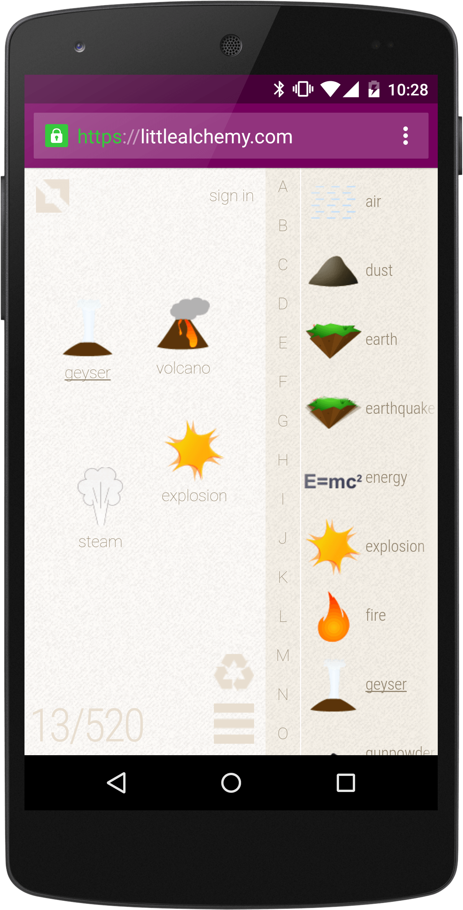

project_path: /web/_project.yaml
book_path: /web/showcase/_book.yaml

{# wf_published_on: 2015-04-08 #}
{# wf_updated_on: 2015-04-08 #}
{# wf_author: pbakaus #}
{# wf_featured_image: /web/showcase/2015/images/little_alchemy/card.jpg #}
{# wf_tags: spotlight,games #}

# Little Alchemy {: .page-title }

### TL;DR {: .hide-from-toc }

[Little Alchem](http://littlealchemy.com/){: .external }: A fun, mobile-friendly combination
game inspired by its bigger brother Alchemy.

### What we like?

Little Alchemy is a prime example of using all of the web platform's latest
abilities to its full advantage. It uses the
[web app manifest](/web/fundamentals/engage-and-retain/simplified-app-installs)
to launch fullscreen when installed and blends in with Android with the help of
[theme-color](/web/fundamentals/design-and-ux/browser-customization/).

The first time load is extremely responsive and shows the preloader right
away. In addition, it can be played entirely offline through its use of
AppCache. Well done.

### Possible Improvements

On Desktop, blocking right clicking is usually considered no-no (but it
allowed me to find the secret cheat code by mistyping the Chrome DevTools
shortcut :)). Not a terribly big deal for a game though.

UI-wise, a grid might improve the 'all-over-the-place' feel, and when
dragging elements on mobile, shifting them slightly to the top so that you
can see what you're moving below your finger could improve visibility.

## Q & A with Jakub Koziol

### Why the web?

Instant access, truly cross-platform and the most convenient way of sharing on
top of that. If that doesn’t sound good I don’t know what does.

Little Alchemy started as an experiment for Chrome Web Store a few years back.
Over time we expanded to other platforms but the web version remains our main
focus. Right now all of our native apps are directly based on the web app. It
cuts a lot of work and streamlines the process of updating the game, which is
incredibly important for a tiny team like ours.

### What worked really well during development?

With the current iteration of Little Alchemy we focused a lot on the mobile
web. During the development we worked with many physical devices and remote
Chrome DevTools helped us to significantly speed up the process.

We also really enjoyed the work on performance and responsive design. Current
set of tools in Chrome allows for very efficient work on these aspects of the
app.

### If you could have any API to improve your app, what would it be?

Games are usually heavily dependent on images. For example we have a library
of over 500 images that need to be scalable and for the optimal experience
they should be loaded before the player starts the game. It requires different
logic than your typical web app where you can lazy load and use atlases. Having
a way to deal with that in an efficient way would save us a lot of work and
would make for a better experience for our players.

Also monetization of web games is still problematic. It’s almost impossible to
implement payments without going straight into free to play and there aren’t
many elegant ways to support HTML5 games with ads. It’s an issue that inform
the types and quality of games on the web platform.
