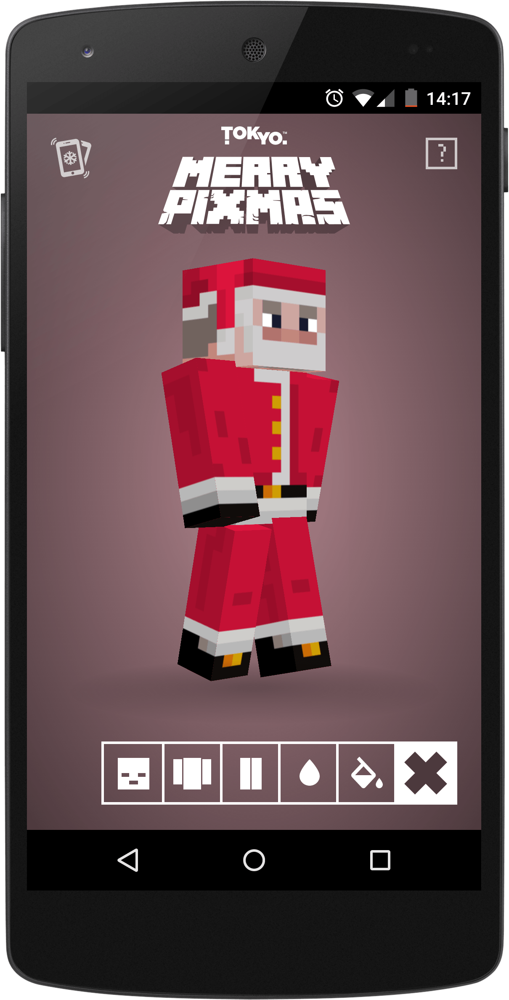

project_path: /web/_project.yaml
book_path: /web/showcase/_book.yaml

{# wf_published_on: 2015-03-27 #}
{# wf_updated_on: 2015-03-27 #}
{# wf_author: pbakaus #}
{# wf_featured_image: /web/showcase/2015/images/merry_pixmas/card.jpg #}
{# wf_tags: spotlight,css,3d #}

# Merry Pixmas {: .page-title }

### TL;DR {: .hide-from-toc }

[Merry Pixmas](http://merrypixmas.com): Christmas fun with 3D CSS Transforms.

### What we like?

A nice Christmas-themed demo that works well across desktop and mobile. It
even comes with brand new theme color support, and a web manifest for a home
screen experience that launches full screen.

Pro tip: Shake your phone to make it snow!

### Possible Improvements

Even though I realize it is a demo, a few specificed cache headers on assets
and non-render-blocking JavaScript could have improved the perceived load time
quite a bit.

## Q & A with Jim Savage

### Why the web?

At [Tokyo](https://tokyo.uk/){: .external }, we’ve long been advocates of the responsive
and mobile web, rather than native for the sake of it. Pixmas was a result of
HTML5 & CSS3 experimentation during down time in-between projects. We are
always trying out new things to keep our knowledge current; so naturally,
for our team of front-end developers, any research would have been web focused
as opposed to a native platform.

As browsers continue to mature we are seeing more native-like functionality;
functions that were only ever available through native development such as
geolocation, camera access, local database storage etc which all contribute to
an overall native-like experience for the user but with the benefits of
cross-platform and fast iteration development. Of course native development
still has its advantages and when tackling a new project, a lot of
consideration is taken for both web & native options. It probably sounds
obvious, but for our clients, it’s important we recommend the best platform
for the job, rather than shoehorn every project into whichever we prefer
to code for.

### What worked really well during development?

I think with Pixmas the main focus was around 3D Transforms and how far we
could really push CSS, so the pixelated illustrative style worked really well
in the browser, and as any front-end developer will tell you a browser's
natural behaviour is square friendly! So basing the overall style and 3D
math around square based problems worked really well. Building a cube with 3D
transforms & HTML is much easier than any other primitive shape. However
the interaction and animations took us a little trial and error to smooth out.

What surprised us most was the smoothness and browser performance of the 3D
on mobile platforms, particularly in the lesser known Android devices. 

### If you could have any API to improve your app, what would it be?

If we were to write Pixmas all over again we’d probably use a WebGL based API.
While it was fun manipulating HTML DOM elements in 3D via CSS, the real power
for web based 3D has to be a dedicated hardware-accelerated technology like
WebGL. CSS 3D is fine for basic webpage effects and transitions but we
definitely hit a limitation in browser performance when coding Pixmas.

Google has some great WebGL projects over at
[Chrome Experiments](https://www.chromeexperiments.com/webgl).
