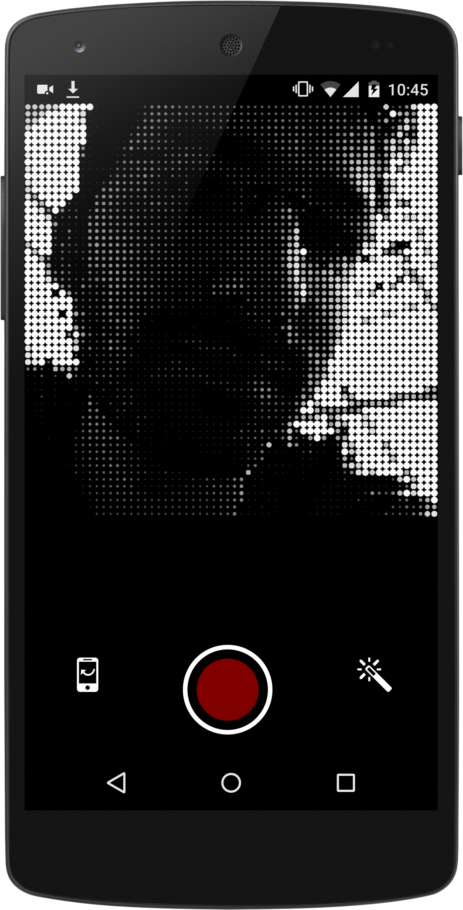

project_path: /web/_project.yaml
book_path: /web/showcase/_book.yaml

{# wf_published_on: 2015-03-24 #}
{# wf_updated_on: 2015-03-24 #}
{# wf_author: pbakaus #}
{# wf_featured_image: /web/showcase/2015/images/web_filter/card.jpg #}
{# wf_tags: spotlight,getusermedia #}

# Web Filter {: .page-title }

### TL;DR {: .hide-from-toc }

[Web Filters](http://exp.bartekdrozdz.com/app/webfilter/){: .external }: Fast, quick and
dirty camera filters.

Warning: This app is not currently working, `getUserMedia` requires a secure
context and this page is not served over HTTPS.

### What we like?

A rather awesome web based camera app that lets you apply filters in real
time.  It automatically saves the image to your local device, which means it
usually gets synchronized to your cloud storage provider of choice (i.e. G+)
making it trivial to share the autcome.

### Possible Improvements

The app can be installed to the home screen but at least on Android, the user
is asked for permission to use the camera every time the app launches. That's
obviously not an issue on the developer side but on Chrome/Android, and a memo
to ourselves to fix.

## Q & A with Bartek Drozdz

### Why the web?

I work with the web since Netscape 4, so this is a natural choice for
any experiment that I do :)

### What worked really well during development?

The mobile browser - Chrome - worked really well. I didn't really have to
figure out any hacky workarounds for anything. I'm very impressed with the
performance of WebGL on mobile. It tends to be better than on many desktop
computers. I think it also was the first time I used WebRTC on mobile. The
support here is also pretty solid. Finally, it was nice to see that I can
save/download the photo directly to the users gallery. There is a small issue
where, if you keep taking photos and downloading them, the browser will issue
a warning. I can see why this security feature exists, but it would be nice to
be able to work around that.

### If you could have any API to improve your app, what would it be?

By the time I was working on this, I think Chrome didn't support orientation
lock. This feature is very important for app dev, because being forced to
support both portrait and landscape creates a lot extra work, often totally
unnecessary.
