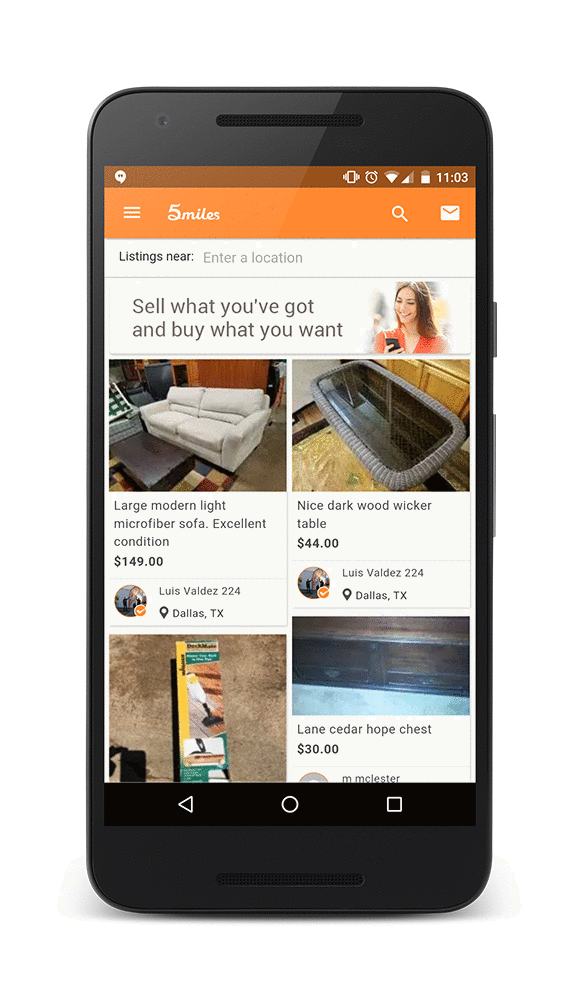

project_path: /web/_project.yaml
book_path: /web/showcase/_book.yaml

{# wf_published_on: 2016-05-12 #}
{# wf_updated_on: 2016-05-12 #}
{# wf_featured_image: /web/showcase/2016/images/5miles/featured.png #}
{# wf_featured_snippet: "With a new user growth rate of 100%, quarter-on-quarter, the mobile web is at the heart of our success...It’s a major venue for low-cost and highly effective customer acquisition and engagement." <b>Lucas Lu</b>, 5miles CEO #}
{# wf_tags: mobile,addtohomescreen,progressive-web-apps,serviceworker,casestudy #}
{# wf_region: north-america #}
{# wf_vertical: retail #}

# 5miles {: .page-title }

### TL;DR {: .hide-from-toc }

5miles decreases bounce rate by 50% and increases conversions by 60% with new
Progressive Web App

### Results

 50% decrease in bounce rates

 30% increase in time spent on site

 30% better conversion for users who arrived
via Add to Home screen

<a class="button button-primary" href="pdfs/5miles.pdf">
  Download PDF Case study
</a>

## About 5miles

“Sell what you got and buy what you want!” is the motto of 5miles, a mobile
marketplace where shoppers can buy everything from furniture to diamond
earrings. The Dallas-based startup with an R&D center in Beijing has more than
seven million app downloads.

## Challenge

More than half of new shoppers discovered 5miles via the mobile web, but the
company found it hard to provide a mobile web user experience that was as fast
and engaging as their mobile app. The resulting high bounce and low retention
rates prompted them to focus on encouraging users to download their native
app. Not everyone downloaded their app, however, and getting users to install
and re-engage with it was challenging and costly.

## Solution

5miles built a Progressive Web App (lite.5milesapp.com) to combine the best
of their app with the broad reach of the web. It leverages new, open web APIs
to offer a mobile web experience that loads quickly, uses less data, and
re-engages users in multiple ways. The new strategy delivered a dramatic
improvement in overall user experience. They’ve seen a 50% decrease in bounce
rates and a subsequent 30% increase in time spent on the site. Engagement
rates are now comparable to their native app.

The company wanted to re-engage their mobile web users just as they would
with mobile app users. With the Progressive Web App, they’re now able to
prompt users to "Add to Home screen,” and users can simply launch the site
from the home-screen icon. This has led to high-quality visits, with these
users converting 30% more than average users.

5miles also added Push Notifications for mobile web users on Android. Sent
via the mobile web, these notifications look and feel exactly like native-app
notifications, and work even if the browser isn't currently running on a
device.

"With a new user growth rate of 100%, quarter-on-quarter, the mobile web is
at the heart of our success,” says Lucas Lu, 5miles CEO. “It’s a major venue
for low-cost and highly effective customer acquisition and engagement."
