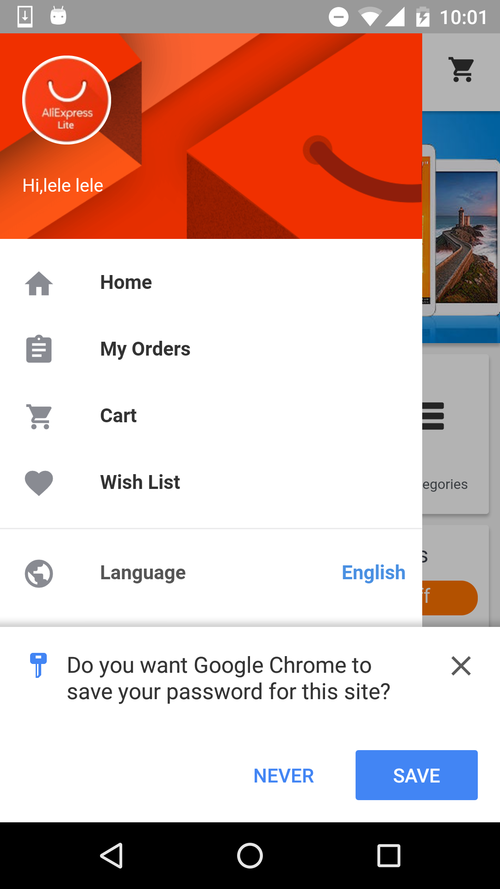

project_path: /web/_project.yaml
book_path: /web/showcase/_book.yaml

{# wf_published_on: 2016-09-29 #}
{# wf_updated_on: 2017-01-17 #}
{# wf_featured_image: /web/showcase/2016/images/ali-express-smart-lock/card.png #}
{# wf_featured_snippet: Most Indian users reach the Internet via 2G and 3G networks, so a fast user experience is essential. To decrease load times, Housing.com added Service Workers and streamlined their site to help consumers quickly find what they’re looking for. Users can continue browsing properties and reviewing previous searches, all while offline. #}
{# wf_tags: smart-lock,casestudy #}
{# wf_region: asia #}
{# wf_vertical: retail #}

# Smart Lock for AliExpress {: .page-title }

### Results

 11% increase in conversion rate

 50% of all new users signed up with the hint
selector dialog

 95% of users have saved their credentials to
Smart Lock for seamless return next time

 85% drop in failures for web sign in

 60% decrease in time spent signing in to
website

<a class="button button-primary" href="pdfs/aliexpress-smartlock-casestudy.pdf">
  Download PDF Case study
</a>

## Company
Launched in April 2010, AliExpress is a global retail marketplace targeted at
consumers worldwide. The platform enables consumers from around the world to buy
directly from wholesalers and manufacturers in China through access to products
at competitive prices. AliExpress is a business within the Alibaba Group.

## Challenges
Shoppers from over 200 countries and regions have downloaded the AliExpress app
or used its desktop and mobile websites. In order to make a purchase, users are
required to enter their account information each time, which can be unpleasant.
In addition, users sometimes forget their login information, requiring them to
leave the app and reset their passwords. This is especially problematic when
moving cross platform in the middle of a purchase.

## Solution
With Smart Lock, AliExpress was able to improve the user experience in their app
and websites: it’s faster for users to login and start the shopping journey,
users do not need to constantly remember their passwords, and users can be
automatically signed in when moving between platforms like Android and Chrome
web.

Smart Lock on Android prefills 3 out of the 4 required onboarding fields (Email,
First Name, Last Name), reducing manual typing errors. 50% of all new users on
the native app are signed up with the hint selector dialog, and 95% of users
have saved their credentials to Smart Lock for seamless return next time.

After implementing Smart Lock on Chrome with the Credential Management API,
there was a 85% drop in failures during sign-in and a 60% decrease in time spent
signing in.

It was easy for AliExpress to implement Smart Lock. It took only one engineer
and about three days to implement and test the API on Android and a similar
amount of effort on Chrome.

> “Since implementing Smart Lock, we’ve been continuously impressed by the
> improving data and positive user feedback. This is one of our greatest
> accomplishments when it comes to optimizing the user experience for our
> sign in process. We’ve seen a reduction in user name and password errors.
> Smart Lock is a great product.”
>
> **Lijun Chen**, Director of AliExpress Mobile Team

## Learn more about Smart Lock

Users save passwords to Google from Chrome or Android and passwords are made
available across platforms.

Find out more at: [g.co/smartlock#for-passwords](https://g.co/smartlock#for-passwords)
