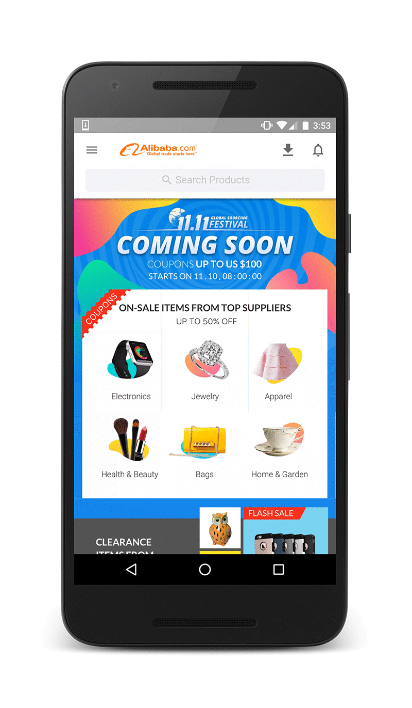

project_path: /web/_project.yaml
book_path: /web/showcase/_book.yaml

{# wf_published_on: 2016-11-09T19:00:00.000Z #}
{# wf_updated_on: 2017-02-15T19:00:00.000Z #}
{# wf_featured_image: /web/showcase/2016/images/alibaba/card.png #}
{# wf_featured_snippet: Alibaba.com is the world’s largest online business-to-business (B2B) trading platform, serving 200+ countries and regions. After upgrading their site to a Progressive Web App (PWA), they saw a 76 percent increase in total conversions across browsers.  #}
{# wf_tags: progressive-web-apps,serviceworker,casestudy #}
{# wf_region: asia #}
{# wf_vertical: retail #}

# Alibaba {: .page-title }

### TL;DR {: .hide-from-toc }

**Alibaba.com increases conversions on the mobile web by 76% with
Progressive Web App.**

### Results

 76% higher conversions across browsers

 14% more monthly active users on iOS; 30% on Android

 4X higher interaction rate from Add to Homescreen

<a class="button button-primary" href="pdfs/alibaba.pdf">
  Download PDF Case study
</a>

## About Alibaba

Alibaba.com is the world’s largest online business-to-business (B2B) trading
platform, serving 200+ countries and regions. After upgrading their site to a
Progressive Web App (PWA), they saw a 76 percent increase in total
conversions across browsers. 

## Challenge

Building great mobile experiences is an indispensable part of Alibaba.com’s
success. The mobile web is their primary platform for discovery on mobile, so
they’ve always focused on design and functionality. They found it difficult
to build an engaging experience for the mobile web, however. They looked at
the mobile web as a platform to shift non-app users to the app, but many
preferred to stay within a browser. 

> Users consider having to download an app to browse or complete a
> transaction an unnecessary barrier, compared to the quick, easy solution
> of browsing directly from their mobile browser
> > **Zou Yu**, director of Alibaba.com’s mobile team.

## Solution

Alibaba.com recognized that to build an effective mobile presence, they needed
to understand how two different user segments—native app users and mobile web
users—interacted with their business. They wanted to deliver a great user
experience for both first-time visitors (in the hopes of re-engaging them) and
repeat visitors (who are more loyal to the site). Alibaba.com built a PWA that
led to a fast, effective, and reliable mobile web experience. The new strategy
delivered a 76 percent increase in total conversions across browsers. (A
conversion corresponds to visits that result in direct contact with a supplier.)

For mobile web users on Android, Alibaba.com integrated features that helped
users re-engage with the site. The company implemented an "Add to Home Screen"
prompt, which resulted in users re-engaging four times more often than other
mobile users. They also noticed that re-engagement on the web was comparable to
that of their native app. For push notifications, the open rate on the mobile
web is the same as that on the native app.

The new strategy also delivered a much better user experience across platforms.
The investment in the mobile web increased monthly active user rates on iOS by
14 percent. On Android devices where re-engagement capabilities like push
notifications and Add to Home Screen were enabled, active user rates increased
by 30 percent.

> Delivering a mobile-first, user-centric mobile site that harnesses the
> best of the native app, with all the accessibility and versatility of the
> mobile web, is key to maintaining our competitive edge and the path to
> better conversions.
> > **Zou Yu**

