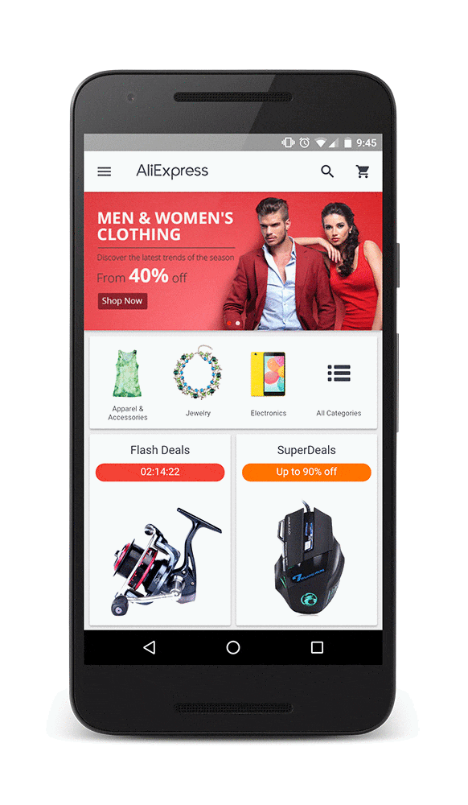

project_path: /web/_project.yaml
book_path: /web/showcase/_book.yaml

{# wf_published_on: 2016-05-17 #}
{# wf_updated_on: 2016-05-17 #}
{# wf_featured_image: /web/showcase/2016/images/aliexpress/featured.png #}
{# wf_featured_snippet: "Smarter shopping, better living!" is the motto of AliExpress, a website where shoppers can buy everything from baby clothes to refrigerators directly from China. Part of the Alibaba Group, the global online retail marketplace is now a popular e-commerce site in America, Russia, and Brazil. #}
{# wf_tags: progressive-web-apps,serviceworker,casestudy #}
{# wf_region: asia #}
{# wf_vertical: retail #}

# AliExpress {: .page-title }

### TL;DR {: .hide-from-toc }

AliExpress increases conversion rate for new users by 104% with new
Progressive Web App

### Results

 104% for new users across all browsers; 82%
increase in iOS conversion rate

 2X more pages visited per session per user
across all browsers

 74% increase in time spent per session
across all browsers

<a class="button button-primary" href="pdfs/aliexpress.pdf">
  Download PDF Case study
</a>

## About AliExpress

"Smarter shopping, better living!" is the motto of AliExpress, a website where
shoppers can buy everything from baby clothes to refrigerators directly from
China. Part of the Alibaba Group, the global online retail marketplace is now
a popular e-commerce site in America, Russia, and Brazil.

## Challenge

Building great mobile experiences is an indispensable part of AliExpress’
success, as mobile commerce is growing
<a href="http://www.demacmedia.com/infographic/mobile-commerce/">three times</a>
faster than e-commerce. The mobile web is their primary platform for discovery
so they have always focused its design and functionality. But AliExpress found
it difficult to build an engaging experience on the web that was as fast as
their mobile app. They looked at the mobile web as a platform to transition a
non-app user to an app user. Not everyone downloaded their app, however, and
getting users to install and re-engage with it was challenging and costly.

## Solution

AliExpress looked for a way to provide all of their web users with the benefits
of their app, such as performance and the ability to work offline and re-engage
users. They built a cross-browser Progressive Web App (https://m.aliexpress.com)
to combine the best of their app with the broad reach of the web.

After implementing their Progressive Web App, AliExpress saw conversion rates
for new users increase by 104%. This investment in the mobile web also resulted
in conversion rates on Safari increasing by 82%. The new strategy also
delivered a much better experience. Users now visit twice as many pages per
session, and time spent per session increased an average of 74% across all
browsers.

> "One of the reasons we built a Progressive Web App was to be able to invest
> in the web experience across all browsers. Not only did we see huge benefits
> on browsers that support the latest features, but we also got to see a bump
> across the board. That is the sign of a great investment, and one that will
> keep paying for itself as browsers evolve."  
> <b>Lijun Chen</b>, director of AliExpress Mobile Team.
