project_path: /web/_project.yaml
book_path: /web/showcase/_book.yaml
description: Six artists were invited to paint, design, and sculpt in VR.

{# wf_published_on: 2016-04-19 #}
{# wf_updated_on: 2016-04-19 #}
{# wf_author: michaelchang,jeffnusz #}
{# wf_featured_snippet: Six artists were invited to paint, design, and sculpt in VR. This is the process for how we recorded their sessions, converted the data, and presented it in real-time with web browsers. #}
{# wf_tags: experiment,webvr,casestudy #}

# Virtual Art Sessions {: .page-title }

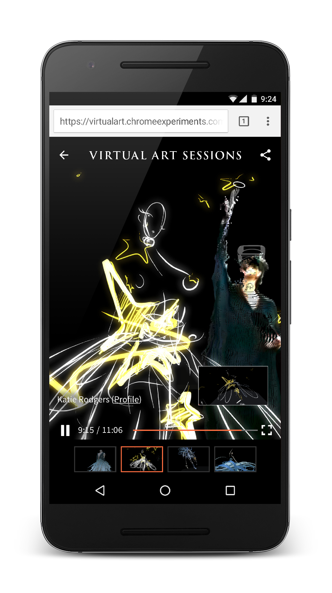

### TL;DR {: .hide-from-toc }

Six artists were invited to paint, design, and sculpt in VR. This is the
process for how we recorded their sessions, converted the data, and presented
it in real-time with web browsers.

<a href="https://g.co/VirtualArtSessions">https://g.co/VirtualArtSessions</a>

What a time to be alive! With the introduction of virtual reality as a consumer
product, new and unexplored possibilities are being discovered. Tilt Brush, a
Google product available on the HTC Vive, allows you to draw in three
dimensional space. When we tried Tilt Brush for the first time, that feeling of
drawing with motion-tracked controllers coupled with the presence of being "in a
room with super-powers" lingers with you; there really isn't an experience quite
like being able to draw in the empty space all around you.

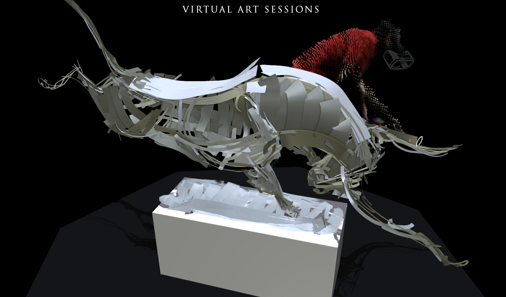

The Data Arts Team at Google was presented with the challenge of showcasing this
experience to those without a VR headset, on the web where Tilt Brush doesn't
yet operate. To that end, the team brought in a sculptor, an illustrator, a
concept designer, a fashion artist, an installation artist, and street artists
to create artwork in their own style within this new medium.

## Recording Drawings in Virtual Reality

Built in Unity, the Tilt Brush software itself is a desktop application that
uses room-scale VR to track your head position (head mounted display, or HMD)
and the controllers in each of your hands. Artwork created in Tilt Brush is by
default exported as a `.tilt` file. To bring this experience to the web, we
realized we needed more than just the artwork data. We worked closely with the
Tilt Brush team to modify Tilt Brush so it exported undo/delete actions as well
as the artist's head and hand positions at 90 times a second.

When drawing, Tilt Brush takes your controller position and angle and converts
multiple points over time into a "stroke". You can see an example
[here](https://docs.google.com/document/d/11ZsHozYn9FnWG7y3s3WAyKIACfbfwb4PbaS8cZ_xjvo/edit#).
We wrote plugins that extracted these strokes and output them as raw JSON.

    {
      "metadata": {  
        "BrushIndex": [  
          "d229d335-c334-495a-a801-660ac8a87360"  
        ]  
      },  
      "actions": [  
        {  
          "type": "STROKE",  
          "time": 12854,  
          "data": {  
            "id": 0,  
            "brush": 0,  
            "b_size": 0.081906750798225,  
            "color": [  
              0.69848710298538,  
              0.39136275649071,  
              0.211316883564  
            ],  
            "points": [  
              [  
                {  
                  "t": 12854,  
                  "p": 0.25791856646538,  
                  "pos": [  
                    [  
                      1.9832634925842,  
                      17.915264129639,  
                      8.6014995574951  
                    ],  
                    [  
                      -0.32014992833138,  
                      0.82291424274445,  
                      -0.41208130121231,  
                      -0.22473378479481  
                    ]  
                  ]  
                }, ...many more points  
              ]  
            ]  
          }  
        }, ... many more actions 
      ]  
    }

The above snippet outlines the format of the sketch JSON format.

Here, each stroke is saved as an action, with a type: "STROKE". In addition to 
stroke actions, we wanted to show an artist making mistakes and changing their 
mind mid-sketch, so it was critical to save "DELETE" actions which serve as 
either erase or undo actions for an entire stroke.

Basic information for each stroke is saved, so the brush type, brush size, color 
rgb are all collected.

Finally, each vertex of the stroke is saved out and that includes the position, 
angle, time, as well as the controller's trigger pressure strength (noted as `p` 
within each point).

Note that the rotation is a 4-component quaternion. This is important later when 
we render the strokes out to avoid gimbal lock.

## Playing Back Sketches with WebGL

In order to show the sketches in a web browser, we used 
[THREE.js](http://threejs.org/){: .external } and wrote geometry generation code that mimicked 
what Tilt Brush does under the hood.

While Tilt Brush produces triangle strips in real-time based on the user's hand 
motion, the entirety of the sketch is already "finished" by the time we show it 
on the web. This allows us to bypass much of the real-time calculation and bake 
the geometry on load.

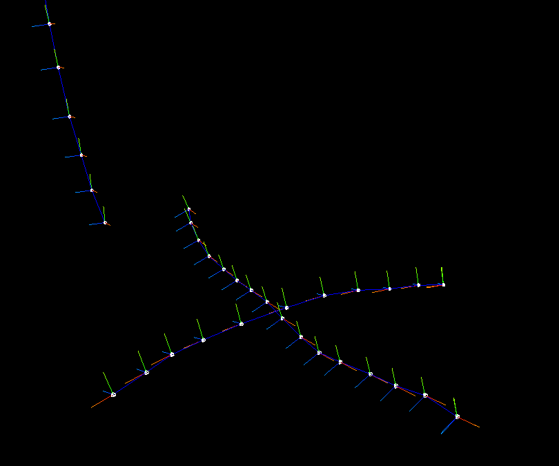

Each pair of vertices in a stroke produce a direction vector (the blue lines 
connecting each point as shown above, `moveVector` in the code snippet below). 
Each point also contain an orientation, a quaternion that represent the 
controller's current angle. To produce a triangle strip, we iterate over each of 
these points producing normals that are perpendicular to the direction and 
controller orientation.

The process for computing the triangle strip for each stroke is nearly identical 
to the code used in Tilt Brush:  
 
    const V_UP = new THREE.Vector3( 0, 1, 0 );  
    const V_FORWARD = new THREE.Vector3( 0, 0, 1 );

    function computeSurfaceFrame( previousRight, moveVector, orientation ){  
      const pointerF = V_FORWARD.clone().applyQuaternion( orientation );

      const pointerU = V_UP.clone().applyQuaternion( orientation );

      const crossF = pointerF.clone().cross( moveVector );  
      const crossU = pointerU.clone().cross( moveVector );

      const right1 = inDirectionOf( previousRight, crossF );  
      const right2 = inDirectionOf( previousRight, crossU );

      right2.multiplyScalar( Math.abs( pointerF.dot( moveVector ) ) );

      const newRight = ( right1.clone().add( right2 ) ).normalize();  
      const normal = moveVector.clone().cross( newRight );  
      return { newRight, normal };  
    }

    function inDirectionOf( desired, v ){  
      return v.dot( desired ) >= 0 ? v.clone() : v.clone().multiplyScalar(-1);  
    }

Combining the stroke direction and orientation by themselves return 
mathematically ambiguous results; there could be multiple normals derived and 
would often yield a "twist" in the geometry.

When iterating over the points of a stroke, we maintain a "preferred right" 
vector and pass this into the function `computeSurfaceFrame()`. This function 
gives us a normal from which we can derive a quad in the quad strip, based on 
the direction of the stroke (from last point to current point), and the 
orientation of the controller (a quaternion). More importantly, it also returns 
a new "preferred right" vector for the next set of computations. 

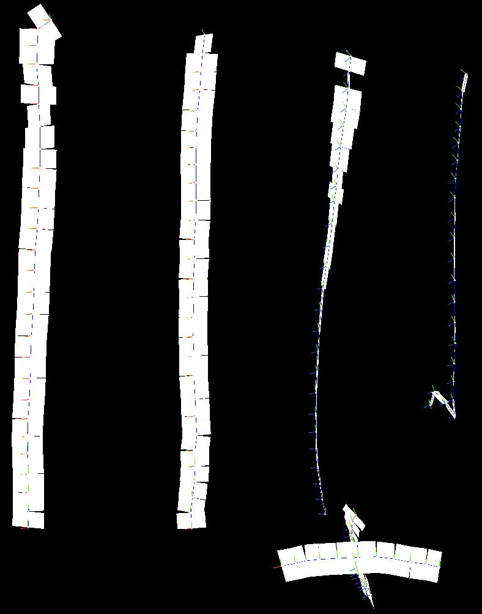

After generating quads based on the control points of each stroke, we _fuse the 
quads_ by interpolating their corners, from one quad to the next.

    function fuseQuads( lastVerts, nextVerts) {  
      const vTopPos = lastVerts[1].clone().add( nextVerts[0] ).multiplyScalar( 0.5 
    );  
      const vBottomPos = lastVerts[5].clone().add( nextVerts[2] ).multiplyScalar( 
    0.5 );

      lastVerts[1].copy( vTopPos );  
      lastVerts[4].copy( vTopPos );  
      lastVerts[5].copy( vBottomPos );  
      nextVerts[0].copy( vTopPos );  
      nextVerts[2].copy( vBottomPos );  
      nextVerts[3].copy( vBottomPos );  
    }

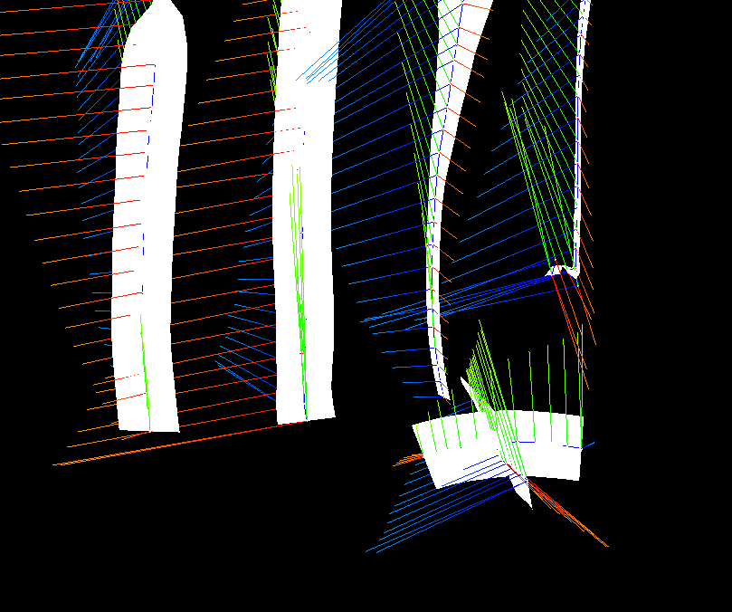  
<figure>
<figcaption>Fused quads.</figcaption>
</figure>
Each quad also contain UVs which are generated as a next step. Some brushes 
contain a variety of stroke patterns to give the impression that every stroke 
felt like a different stroke of the paint brush. This is accomplished using 
_texture atlasing, _where each brush texture contain all the possible 
variations. The correct texture is selected by modifying the UV values of the 
stroke.

    function updateUVsForSegment( quadVerts, quadUVs, quadLengths, useAtlas, 
    atlasIndex ) {  
      let fYStart = 0.0;  
      let fYEnd = 1.0;

      if( useAtlas ){  
        const fYWidth = 1.0 / TEXTURES_IN_ATLAS;  
        fYStart = fYWidth * atlasIndex;  
        fYEnd = fYWidth * (atlasIndex + 1.0);  
      }

      //get length of current segment  
      const totalLength = quadLengths.reduce( function( total, length ){  
        return total + length;  
      }, 0 );

      //then, run back through the last segment and update our UVs  
      let currentLength = 0.0;  
      quadUVs.forEach( function( uvs, index ){  
        const segmentLength = quadLengths[ index ];  
        const fXStart = currentLength / totalLength;  
        const fXEnd = ( currentLength + segmentLength ) / totalLength;  
        currentLength += segmentLength;

        uvs[ 0 ].set( fXStart, fYStart );  
        uvs[ 1 ].set( fXEnd, fYStart );  
        uvs[ 2 ].set( fXStart, fYEnd );  
        uvs[ 3 ].set( fXStart, fYEnd );  
        uvs[ 4 ].set( fXEnd, fYStart );  
        uvs[ 5 ].set( fXEnd, fYEnd );

      });

    }

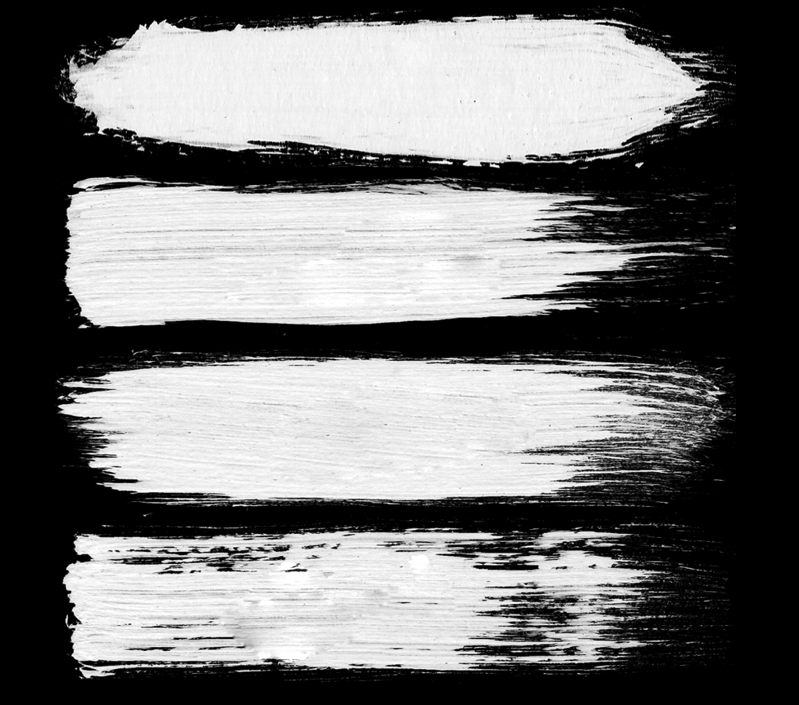  
<figure>
<figcaption>Four textures in a texture atlas for oil brush</figcaption>
</figure>

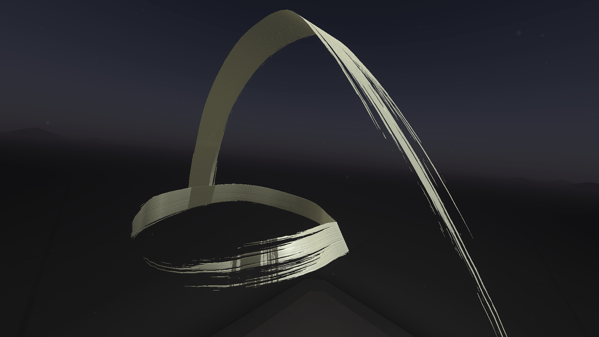  
<figure>
<figcaption>In Tilt Brush</figcaption>
</figure>

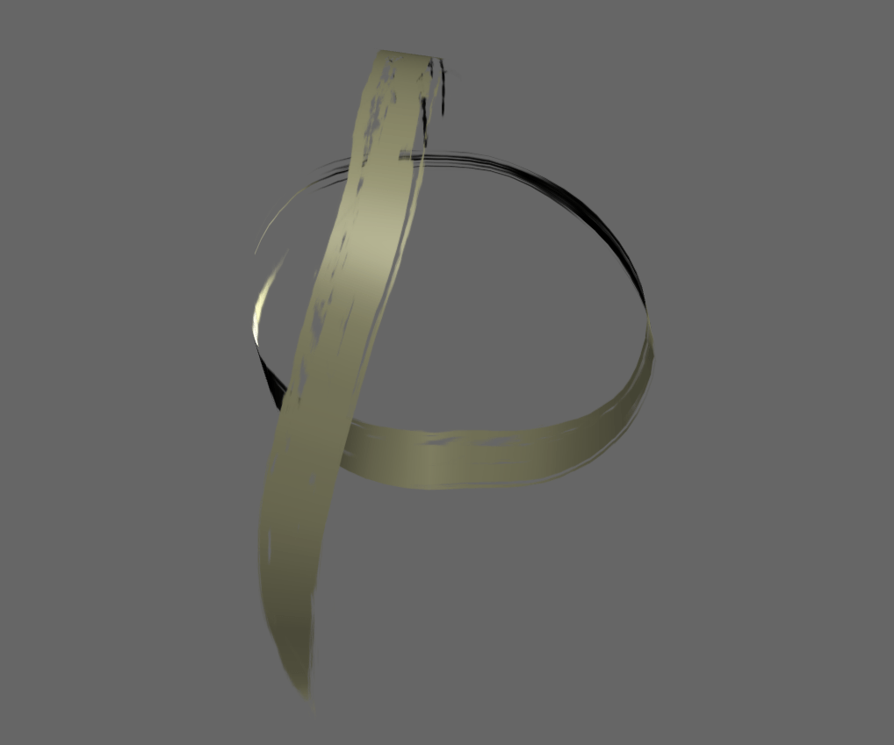  
<figure>
<figcaption>In WebGL</figcaption>
</figure>

Since each sketch has unbounded number of strokes, and the strokes won't need to 
modified in run-time, we pre-compute the stroke geometry ahead of time and merge 
them into one single mesh. Even though each new brush type must be its own 
material, that still reduces our draw calls to one per brush. 

  
<figure>
<figcaption>The entire sketch above is performed in one draw call in WebGL</figcaption>
</figure>

To stress test the system, we created a sketch that took 20 minutes filling the 
space with as many vertices as we could. The resulting sketch still played at 
60fps in WebGL.

Since each of the original vertices of a stroke also contained time, we can 
easily play back the data. Re-calculating the strokes per-frame would be really 
slow, so instead we pre-computed the entire sketch on load and simply revealed 
each quad when it was time to do so.

Hiding a quad simply meant collapsing its vertices to the 0,0,0 point. When the 
time has reached the point at which the quad is supposed to be revealed, we 
reposition the vertices back into place.

An area for improvement is manipulating the vertices entirely on the GPU with 
shaders. The current implementation places them by looping through the vertex 
array from the current timestamp, checking which vertices need to be revealed 
and then updating the geometry. This puts a lot of load on the CPU which causes 
the fan to spin as well as wasting battery life.

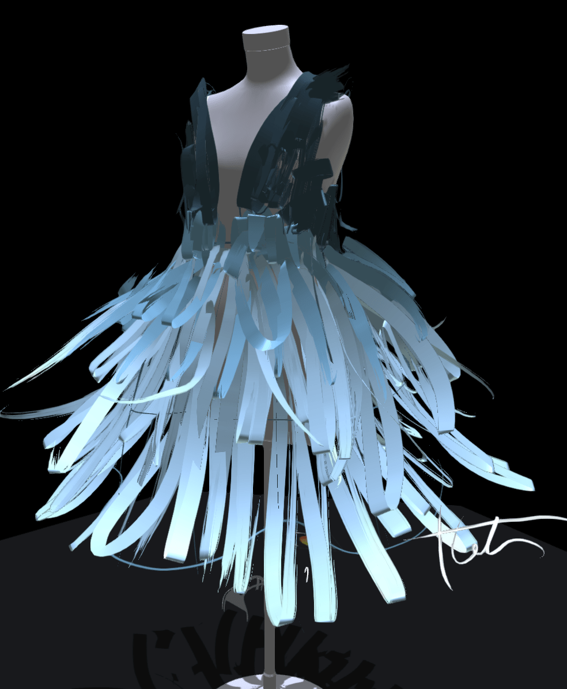

## Recording the Artists

We felt that the sketches themselves wouldn't be enough. We wanted to show the 
artists inside their sketches, painting each brushstroke. 

To capture the artists, we used Microsoft Kinect cameras to record the depth 
data of the artists' body in space. This gives us the ability to show their 
three dimensional figures in the same space the drawings appear.

Since the artist's body would occlude itself preventing us from seeing what's 
behind it, we used a double Kinect system, both at opposite sides of the room 
pointing at the center.

In addition to the depth information, we also captured the color information of 
the scene with standard DSLR cameras. We used the excellent 
[DepthKit](http://www.depthkit.tv/){: .external } software to calibrate and merge 
the footage from the depth camera and the color cameras. The Kinect is capable 
of recording color, but we chose to use DSLRs because we could control the 
exposure settings, use beautiful high-end lenses, and record in high definition. 
 
To record the footage, we built a special room to house the HTC Vive, the artist 
and the camera. All surfaces were covered with material that absorbed infrared 
light to give us a cleaner point cloud (duvetyne on the walls, ribbed rubber 
matting on the floor). In case the material showed up in the point cloud 
footage, we chose black material so it wouldn't be as distracting as something 
that was white.

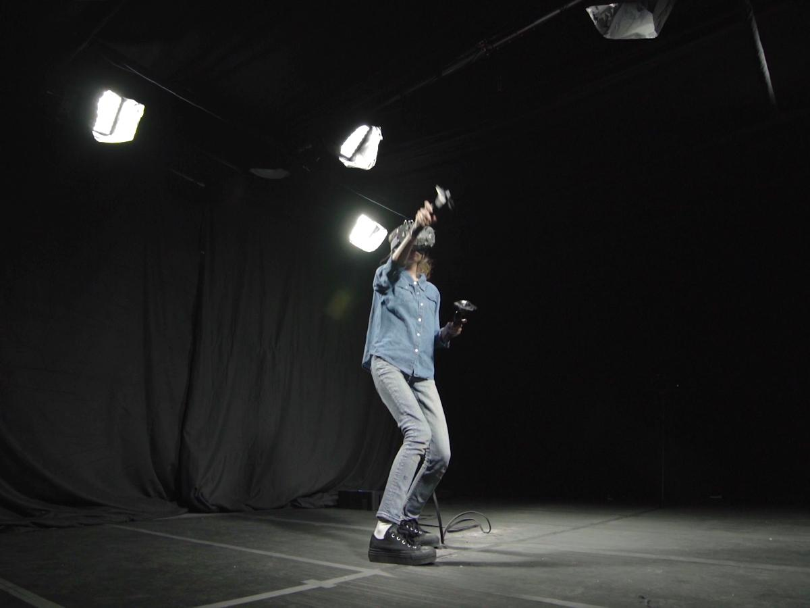

The resulting video recordings gave us enough information to project a particle 
system. We wrote some additional tools in 
[openFrameworks](http://openframeworks.cc/){: .external } to further clean up the footage, in 
particular removing the floors, walls and ceiling.

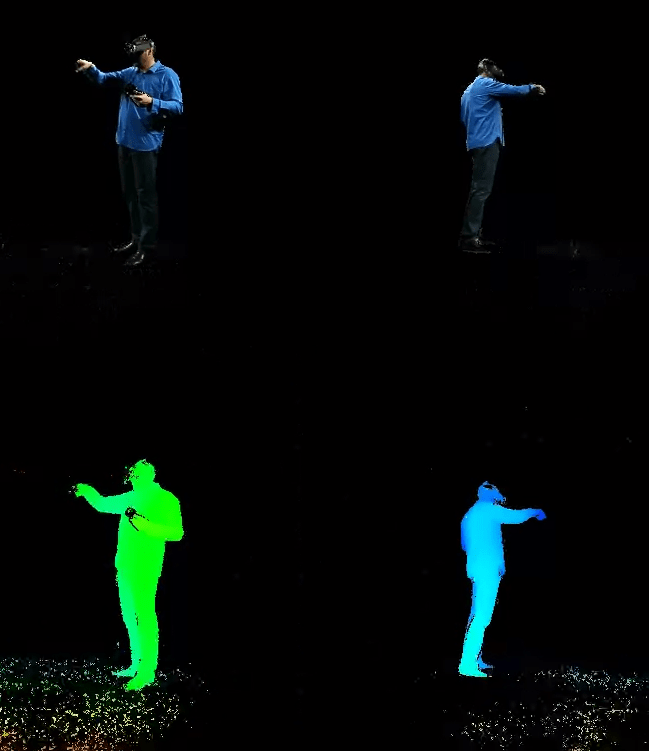  
<figure>
<figcaption>All four channels of a recorded video session (two color channels above and two 
depth below)</figcaption>
</figure>

In addition to showing the artists, we wanted to render the HMD and the 
controllers in 3D as well. This was not only important for showing the HMD in 
the final output clearly (the HTC Vive's reflective lenses were throwing off 
Kinect's IR readings), it gave us points of contact for debugging the particle 
output and lining up the videos with the sketch.

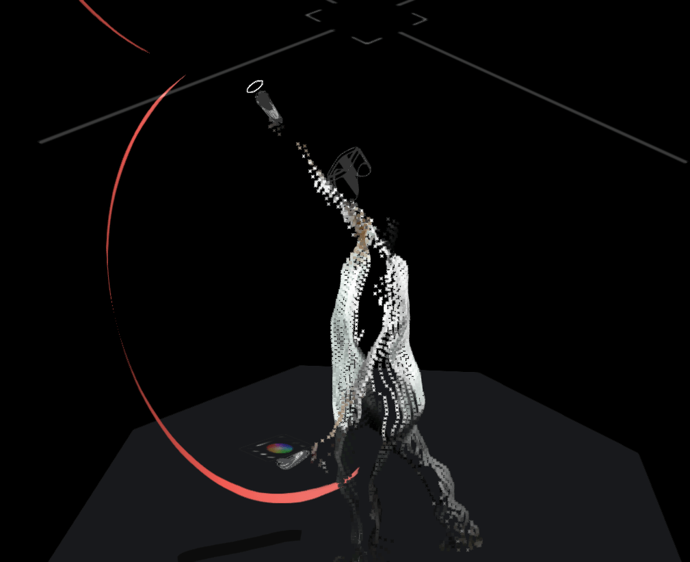  
<figure>
<figcaption>The head mounted display, controllers, and particles lined up</figcaption>
</figure>

This was done by writing a custom plugin into Tilt Brush that extracted the 
positions of the HMD and controllers each frame. Since Tilt Brush runs at 90fps, 
tons of data streamed out and a sketch's input data was upwards of 20mb 
uncompressed. We also used this technique to capture events that aren't recorded 
in the typical Tilt Brush save file, such as when the artist selects an option 
on the tools panel and the position of the mirror widget.

In processing the 4TB of data we captured, one of the biggest challenges was 
aligning all the different visual/data sources. Each video from a DSLR camera 
need to be aligned with the corresponding Kinect, so that the pixels aligned in 
space as well as time. Then the footage from these two camera rigs needed to be 
aligned with each other to form a single artist. Then we needed to align our 3d 
artist with the data captured from their drawing. Phew! We wrote browser based 
tools to help with most of these tasks, and you can try them yourself 
[here](https://virtualart.chromeexperiments.com/test/){: .external }.

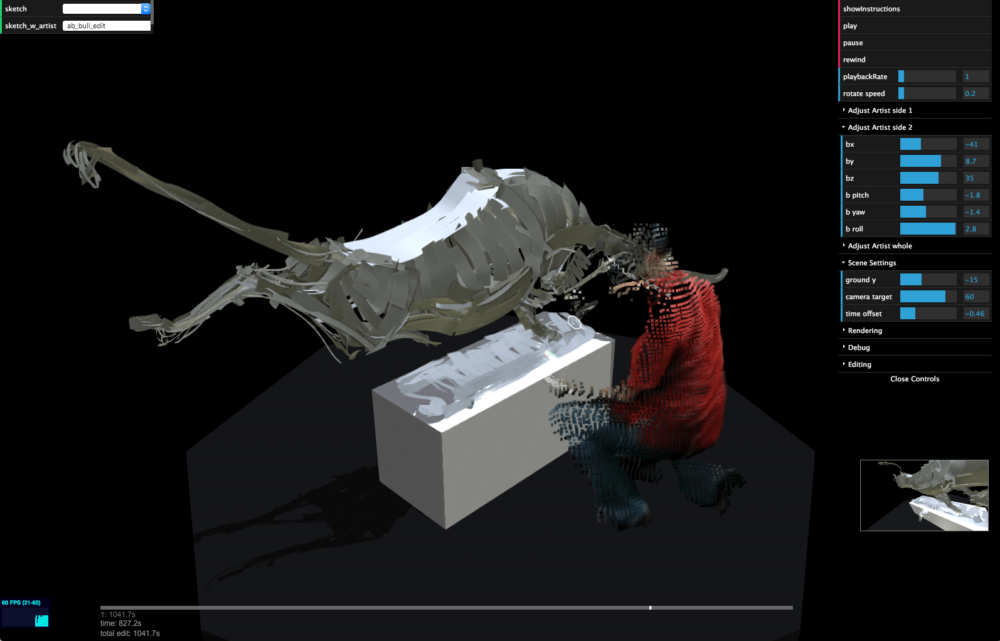

Once the data was aligned, we used some scripts written in NodeJS to process it 
all and output  a video file and series of JSON files, all trimmed and 
synchronized. To reduce the file size, we did three things. First, we reduced 
the accuracy of each floating point number so that they are at maximum 3 
decimal's worth of precision. Second, we cut the number of points by a third to 
30fps, and interpolated the positions client-side. Finally, we serialized the 
data so instead of using plain JSON with key/value pairs, an order of values is 
created for position and rotation of the HMD and controllers. This cut the file 
size down to just shy of 3mb which was acceptable to deliver over the wire.

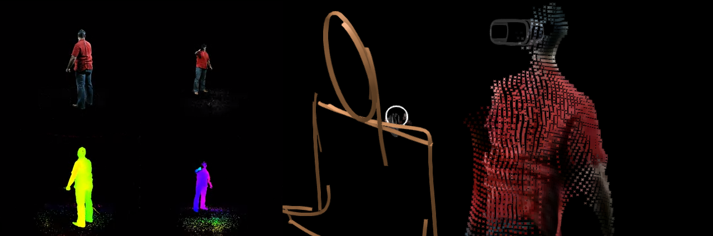

Since the video itself is served as an HTML5 video element that is read in by a 
WebGL texture to become particles, the video itself needed to play hidden in the 
background. A shader converts the colors in the depth imagery into positions in 
3D space. James George has shared [a great example](https://github.com/obviousjim/DepthKitJS)
of how you can do with with footage straight out of DepthKit.

iOS has restrictions on inline video playback, which we assume is to prevent 
users from being pestered by web video ads that autoplay. We used a technique 
similar to [other workarounds on the 
web](http://stanko.github.io/html-canvas-video-player/), which is to copy the 
video frame into a canvas and manually update the video seek time, every 1/30 of 
a second. 

    videoElement.addEventListener( 'timeupdate', function(){  
      videoCanvas.paintFrame( videoElement );      
    });

    function loopCanvas(){

      if( videoElement.readyState === videoElement.HAVE\_ENOUGH\_DATA ){

        const time = Date.now();  
        const elapsed = ( time - lastTime ) / 1000;

        if( videoState.playing && elapsed &gt;= ( 1 / 30 ) ){  
          videoElement.currentTime = videoElement.currentTime + elapsed;  
          lastTime = time;  
        }

      }

    }

    frameLoop.add( loopCanvas );

Our approach had the unfortunate side-effect of significantly lowering iOS 
framerate since the copying of pixel buffer from video to canvas is very 
CPU-intensive. To get around this, we simply served smaller sized versions of 
the same videos which allow at least 30fps on an iPhone 6.

## Conclusion

The general consensus for VR software development as of 2016 is to keep 
geometries and shaders simple so that you can run at 90+fps in an HMD. This 
turned out to be a really great target for WebGL demos since the techniques used 
in Tilt Brush map very nicely to WebGL.

While web browsers displaying complex 3D meshes is not exciting in and of 
itself, this was a proof of concept that cross pollination of VR work and the 
web is entirely possible.

