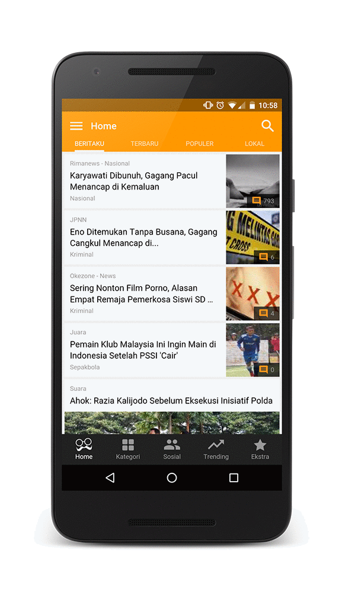

project_path: /web/_project.yaml
book_path: /web/showcase/_book.yaml

{# wf_published_on: 2016-05-14 #}
{# wf_updated_on: 2016-05-14 #}
{# wf_featured_image: /web/showcase/2016/images/babe/featured.png #}
{# wf_featured_snippet: "For us, it’s no longer an either-or decision. To reach new users, we must be on the mobile web!",  <b>Weihan Liew</b>, BaBe CEO. #}
{# wf_tags: progressive-web-apps,serviceworker,casestudy #}
{# wf_region: asia #}
{# wf_vertical: retail #}

# BaBe {: .page-title }

### TL;DR {: .hide-from-toc }

BaBe’s cross-browser Progressive Web App rivals performance of native app.

### Results

 Time spent on site comparable to native
app: 3 minutes vs. 3 minutes per session

 Articles read on site comparable to native
app: 3 vs. 4 per session

<a class="button button-primary" href="pdfs/babe.pdf">
  Download PDF Case study
</a>

## About BaBe

Launched in 2013, BaBe is the largest news-aggregator app in Indonesia. It
has been downloaded by more than a million people. This app-only business
moved to the web for the first time in early 2016, building a cross-browser
Progressive Web App with feature parity and a look and feel almost identical
to their native app.

## Challenge

Getting users to download their app has always been a core challenge, and this
problem only got more difficult as they expanded to target people outside the
big cities. Several obstacles included poor internet connectivity and prevalent
use of low-end devices. Together these hindered their inability to scale.

## Solution

They built a Progressive Web App (https://app.babe.co.id) to combine the best
of their app with the broad reach of the web. It leverages new, open web APIs
to offer a mobile-web experience that loads quickly, uses less data, and
re-engages users in multiple ways. 

After implementing their Progressive Web App, they saw it perform slightly
faster than their native app in testing. They also noticed that engagement was
comparable, with users spending 3 minutes on site vs. 3 minutes on the native
app per session. Articles read per session on the new Progressive Web App was
also comparable to that on the native app—3 articles vs. 4 articles,
respectively. “I've started to consume BaBe more through the mobile web than
through the native app. It's just faster and better. Why would I bother
downloading an app anymore?” Weihan Liew, BaBe CEO.
