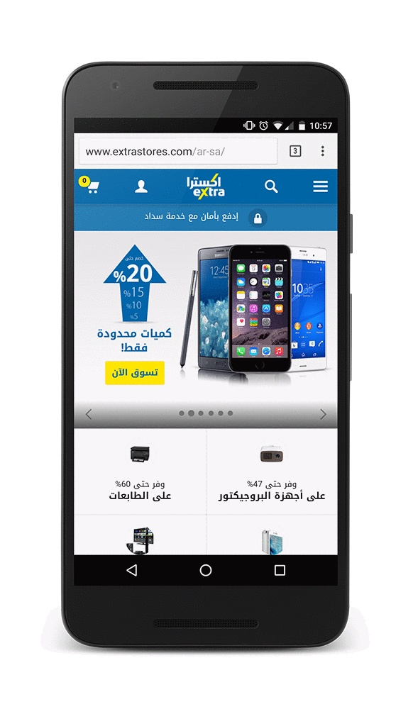

project_path: /web/_project.yaml
book_path: /web/showcase/_book.yaml

{# wf_published_on: 2016-05-17 #}
{# wf_updated_on: 2016-05-17 #}
{# wf_featured_image: /web/showcase/2016/images/extra/featured.png #}
{# wf_featured_snippet: "Push Notifications are a huge part of our mobile engagement strategy. It’s a more personal way to communicate with our customers. That’s incredibly valuable to our bottom line." <b>Mujeeb Hazzaa</b>, Chief Business Development Officer #}
{# wf_tags: progressive-web-apps,webpush,notifications,serviceworker,casestudy #}
{# wf_region: middle-east #}
{# wf_vertical: retail #}

# eXtra Electronics {: .page-title }

### TL;DR {: .hide-from-toc }

United eXtra Electronics grows eCommerce sales by 100% with Web Push Notifications

### Results

 12% click-through rate

 100% more sales from users arriving via web push

 4x increase in re-engagement

<a class="button button-primary" href="pdfs/extra.pdf">
  Download PDF Case study
</a>

## About COMPANY

eXtra is Saudi Arabia’s leading and fastest-growing consumer electronics
and home appliance retailer. They serve over 12 million shoppers at 40+
stores across Saudi Arabia, Oman, and Bahrain.

## Challenge

Saudi Arabia is one of the largest smartphone markets in the world. With over
2.5 million shoppers discovering, researching, and purchasing via eXtra.com every
month, eXtra’s 100% year-on-year mobile growth is driven by the mobile web.
Until 2016, the company depended primarily on targeted emails to re-engage with
mobile web users, which required customers to sign up and register. Re-engaging
with their mobile web shoppers became a constant area of focus.

## Solution

eXtra worked with Mobify, their mobile shopping platform partner, to implement
Push Notifications for Android web users visiting their mobile website. These
Push Notifications sent via the mobile web look and feel exactly like native app
notifications, and work even if the browser isn’t currently running on a device.

eXtra saw an incredible, instant customer reaction. Within six weeks, they noticed
that those who had opted into receiving Push Notifications were returning
4X more often and spending twice as much time on the site. eXtra’s new web
Push Notifications provided a 12% click-through rate, which worked perfectly for
sales alerts. The return on investment was substantial and eXtra saw a 100%
increase in sales from those arriving via web push. Web Push Notifications now
exceed email as eXtra.com’s best-performing retention-marketing channel.

Plus, the notifications provide eXtra with another touchpoint to interact with
shoppers. Imagine tapping into a highly engaged and commercially valuable
audience instantly, with just a few simple enhancements. “Push Notifications
are a huge part of our mobile engagement strategy,” says Mujeeb Hazzaa, chief
business development officer. “It’s a more personal way to communicate with our
customers. That’s incredibly valuable to our bottom line.”
