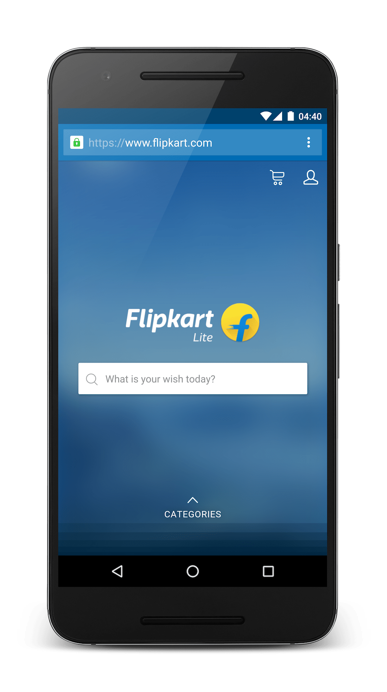

project_path: /web/_project.yaml
book_path: /web/showcase/_book.yaml

{# wf_published_on: 2016-03-28 #}
{# wf_updated_on: 2016-03-28 #}
{# wf_featured_image: /web/showcase/2016/images/flipkart/card.jpg #}
{# wf_featured_snippet: In 2015, Flipkart, India’s largest e-commerce site, adopted an app-only strategy and temporarily shut down their mobile website. The company found it harder and harder to provide a user experience that was as fast and engaging as that of their mobile app. But then, Flipkart decided to rethink their development approach. They were drawn back to the mobile web by the introduction of features that made the mobile web run instantly, work offline, and re-engage users. #}
{# wf_tags: progressive-web-apps,offline,serviceworker,casestudy #}
{# wf_region: asia #}
{# wf_vertical: retail #}

# Flipkart triples time-on-site with Progressive Web App {: .page-title }

### TL;DR {: .hide-from-toc }

Flipkart, India’s largest e-commerce site, decided to combine their web
presence and native app into a Progressive Web Application that has resulted
in a 70% increase in conversions.

In 2015, Flipkart, India’s largest e-commerce site, adopted an app-only
strategy and temporarily shut down their mobile website. The company found it
harder and harder to provide a user experience that was as fast and engaging
as that of their mobile app. But then, Flipkart decided to rethink their
development approach. They were drawn back to the mobile web by the
introduction of features that made the mobile web run instantly, work offline,
and re-engage users.

### Key insights

* Users time on site with Flipkart lite vs. previous mobile experience:
  **3.5 minutes vs 70 seconds**.
* **3x** more time spent on site
* **40%** higher re-engagement rate
* **70%** greater conversion rate among those arriving via Add to Homescreen
* **3x** lower data usage

<a class="button button-primary" href="pdfs/flipkart.pdf">
  Download PDF Case study
</a>

## Flipkart Lite

They soon began building Flipkart Lite, a Progressive Web App that
combines the best of the web and the best of the Flipkart native app.
It leverages new, open web APIs to offer a mobile web experience
that loads fast, uses less data than before, and re-engages users in
multiple ways. Users visit via their browser and find a fast app-like user
experience. When they come back, it loads nearly instantly, even on flaky
networks. Users can choose to add the site to their homescreen with
just two taps, making it easier for them to come back. Amar Nagaram,
an Engineering Director at Flipkart shares, "We know that everyone needs
to build mobile-first experiences. With Flipkart Lite, we've developed a
powerful, technically-advanced web app that performs as well as our
native app. We now feel we have the best of both worlds."

## A fast and streamlined site

With **63%** of Flipkart Lite users reaching the site via a 2G network, a fast
user experience was essential. To decrease load times, Flipkart added
service workers and streamlined the site to help consumers quickly reach
the product they are looking for. Users can even continue to browse
categories, review previous searches, and view product pages—all
while offline.

## Taking advantage of the web's low friction

Reaching a broad set of users is important for Flipkart. With Flipkart Lite,
users are one click away from accessing content and many new users are
first-time internet users. In addition to easy access, Flipkart Lite requires
less data. A key metric for Flipkart is tracking data usage to complete first
transaction: when comparing Flipkart Lite to the native app, Flipkart Lite
uses **3x** less data. Nagaram continues, "Having a strong and engaging
mobile website means we’re no longer turning away potential shoppers
who don’t want to use data or space to download an app."

## Bringing users back with home screen icon

Flipkart wanted to be able to re-engage with mobile web users just as they
would with mobile app users.

The company implemented an "Add to Home Screen" prompt. Now, **60%**
of all visits to Flipkart Lite come from people launching the site from the
homescreen icon. Add to Home Screen also delivers high-quality visits,
with customers converting **70%** more than average users.

These two activities alone resulted in engagement numbers that were **40%**
higher than before.

## Building for future success for the evolving online shopper

Flipkart will continue using progressive web technology to reach their
evolving online shoppers. Nagaram concludes, "Flipkart Lite has enabled
us to find some of our highest-value customers. We will continue to expand
progressive web app technology across all of our platforms, investing
significant resources to maximize the potential scale. We truly believe that
this is a new way to experience mobile and we’re just getting started."

