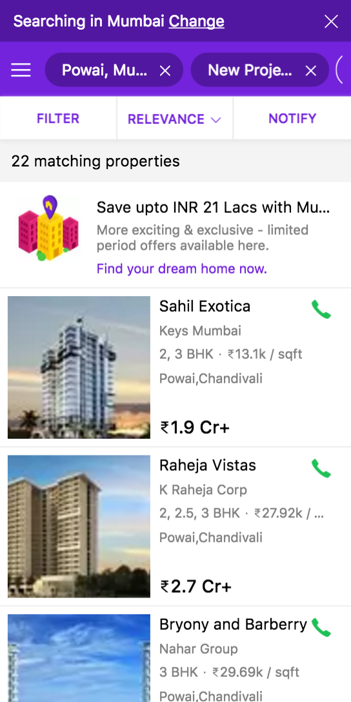

project_path: /web/_project.yaml
book_path: /web/showcase/_book.yaml

{# wf_published_on: 2016-09-26 #}
{# wf_updated_on: 2017-10-06 #}
{# wf_featured_image: /web/showcase/2016/images/housing/card.png #}
{# wf_featured_snippet: Most Indian users reach the Internet via 2G and 3G networks, so a fast user experience is essential. To decrease load times, Housing.com added Service Workers and streamlined their site to help consumers quickly find what they’re looking for. Users can continue browsing properties and reviewing previous searches, all while offline. #}
{# wf_tags: progressive-web-apps,offline,serviceworker,casestudy #}
{# wf_region: asia #}
{# wf_vertical: real-estate #}

# Housing.com increases conversions and lowers bounce rate by 40% with new PWA {: .page-title }

### Results

 38% more conversions

 40% lower bounce rate

 10% longer average session

 30% faster page load

<a class="button button-primary" href="pdfs/housing.pdf">
  Download PDF Case study
</a>

## Company
Housing.com is one of India’s top startups. On track to receive 50 million
visits this year, it has become one of the leading online real estate
platforms in India. After building [Housing Go](https://housing.com/){: .external }, a
Progressive Web App (PWA), they saw a 38% increase in total conversions
across browsers. The new PWA also delivered higher-value users, with
visitors spending 10% longer per session and returning more often.

## Challenges
Housing.com knew their mobile users woudn’t tolerate slow load times, which
significantly affect conversions. They measured the impact of users’ average
page-load time and found that even a one-second improvement brought a
significant boost in the conversion rate.

Poor connectivity and the prevalence of low-end devices also hindered
Housing.com’s growth. They developed a native app so that mobile users
could work offline and re-engage. But current and potential customers were
very data-sensitive, because the cost of Internet access was still high, and
many consumers hesitated to use data or space to download the native app.

## Solution
Relying on technological advancements and the improved capabilities of modern
web browsers and web applications such as Service Workers, IndexedDB, Add to
Home Screen, and Push Notifications, Housing.com set out to create a PWA that
was fast, efficient, and reliable. The result was a mobile web experience
that is fast, uses less data, and re-engages users in multiple ways. With the
new PWA, Housing.com saw conversion rates rise 38% and the bounce rate fall
by over 40%.
 
Most Indian users reach the Internet via 2G and 3G networks, so a fast user
experience is essential. To decrease load times, Housing.com added Service
Workers and streamlined their site to help consumers quickly find what
they’re looking for. Users can continue browsing properties and reviewing
previous searches, all while offline. “High-end smartphones are not that
prevalent in our target user base,” says Vivek Jain, Housing.com CPTO.
“With our new PWA, we could get past our users’ hesitance to download
our app in their low-end devices, yet give them a wonderful experience.”
 
The new strategy proved effective. Page-load performance increased by
over 30%, and average time-per-session increased 10% across all browsers.
“Understanding the network limitations of our users and the importance
of a great user experience led us to build a PWA,” Jain says. “User
experience is something that defines state-of-the-art applications.”

## Related resources

* [Service Workers](/web/fundamentals/getting-started/primers/service-workers)
* [Add to Home Screen](/web/fundamentals/app-install-banners)
* [Push Notifications](/web/fundamentals/push-notifications)

### Codelabs

[Your First Progressive Web App](/web/fundamentals/getting-started/codelabs/your-first-pwapp/)  
Learn how to use the app shell model, service workers and more to build a Progressive Web App.

### Udacity courses

[Intro to Progressive Web Apps](https://www.udacity.com/course/intro-to-progressive-web-apps--ud811) 
In this course you’ll get started working on your very first Progressive
Web App - a web app that can take advantage of many of the features native
applications have enjoyed. You’ll also get more experience in creating a
web app that works offline using Service Workers. Finally, you’ll make your
app installable to the user’s home screen with the Web App Manifest file.
