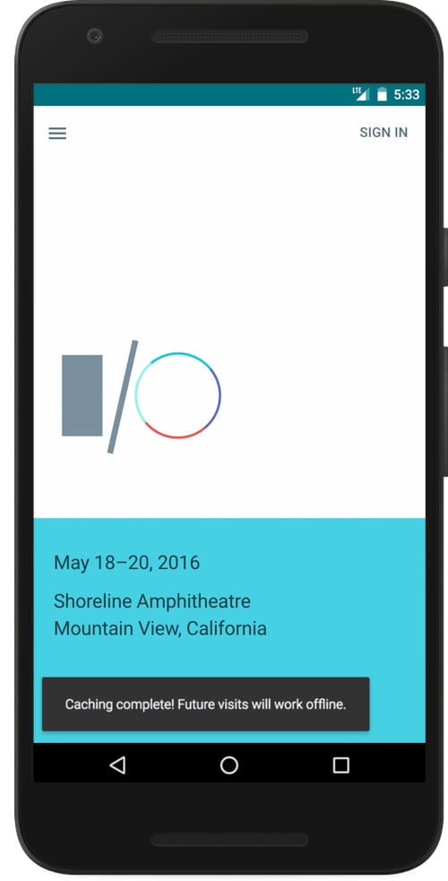
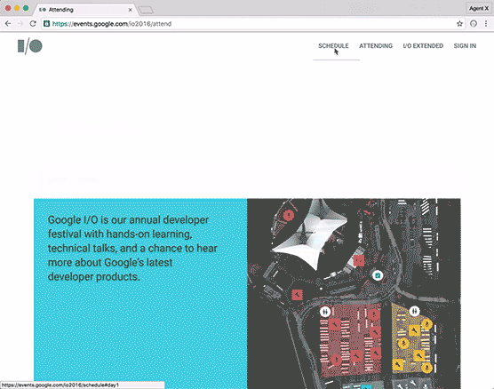
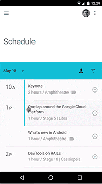

project_path: /web/_project.yaml
book_path: /web/showcase/_book.yaml
description: Building the Google I/O 2016 PWA using web components

{# wf_published_on: 2016-06-10 #}
{# wf_updated_on: 2016-06-10 #}
{# wf_author: ericbidelman #}
{# wf_featured_image: /web/showcase/2016/images/iowa/featured.gif #}
{# wf_featured_snippet: 
Learn how we built a the Google I/O 2016 Progressive Web App (IOWA) using web components, Polymer, and material design and launched it into production on Google.com.

IOWA is a single page application (SPA) that's built using web components, Polymer, Firebase, and has an extensive backend written in App Engine (Go). It pre-caches content for offline users using a service worker, dynamically loads new pages, gracefully transitions between views, and reuses content after first load.
 #}
{# wf_tags: progressive-web-apps,webpush,notifications,serviceworker,casestudy,webcomponents,google-io #}
{# wf_region: north-america #}

# Building the Google I/O 2016 Progressive Web App {: .page-title }



### TL;DR {: .hide-from-toc }

Learn how we built a single page app using web components, Polymer, and material design and launched it into production on Google.com.

### Results

 More engagement than the native app (<b>4:06 min</b> mobile web vs. Android's 2:40 min).

 <b>450ms faster first paint</b> for return users thanks to service worker caching

 <b>84%</b> of visitors supported Service Worker

 Add to homescreen saves were up <b>+900%</b> compared to 2015.

 3.8% users went offline but continued to generate 11k pageviews!

 <b>50%</b> of signed in users enabled notifications.

 <b>536k</b> notifications were sent to users (12% brought them back).

 <b>99%</b> of users' browsers supported the web components polyfills

## Overview

This year, I had the pleasure of [working on](https://events.google.com/io2016/humans.txt) the [Google I/O 2016 progressive web app](https://events.google.com/io2016/){: .external }, affectionately named "IOWA". It's mobile first, works fully offline, and heavily inspired by [material design](https://www.google.com/design/spec/material-design/introduction.html).

IOWA is a [single page application](https://en.wikipedia.org/wiki/Single-page_application) (SPA) that's built using [web components](http://webcomponents.org/){: .external }, Polymer, and Firebase, and has an extensive backend
written in App Engine (Go). It pre-caches content using a [service worker](/web/fundamentals/getting-started/primers/service-workers), dynamically loads new pages, gracefully transitions between views, and reuses content after first load.

In this case study, I'll go through some of the more interesting architectural decisions that we made for
the frontend. If you're interested in the source code, [check it out](https://github.com/GoogleChrome/ioweb2016) on Github.

<a hidden class="button button-primary" href="https://github.com/GoogleChrome/ioweb2016">
  View on Github
</a>

## Building an SPA using web components

### Every page as a component

One of the core aspects about our frontend is that it's centered around web components. In fact, every page in our SPA is a web component:

    <io-home-page date="2016-05-18T17:00:00Z" app="[[app]]"></io-home-page>
    <io-schedule-page date="2016-05-18T17:00:00Z" app="app}}"></io-schedule-page>
    <io-attend-page></io-attend-page>
    <io-extended-page></io-extended-page>
    <io-faq-page></io-faq-page>

Why did we do this? The first reason is that this code is readable. As a first time reader, it's completely obvious what every page in our app is. The second reason is that web components have some nice properties for building an SPA. Lots of common frustrations (state management, view activation, style scoping) go away thanks to the inherent features of the `<template>` element, [Custom Elements](https://w3c.github.io/webcomponents/spec/custom/){: .external }, and [Shadow DOM](http://w3c.github.io/webcomponents/spec/shadow/). These are developer tools being built into the browser. Why not take advantage of them?

By creating a Custom Element for each page, we got a lot for free:

- Page lifecycle management.
- Scoped CSS/HTML particular to the page.
- All the CSS/HTML/JS specific to a page is bundled and loaded together as needed.
- Views are reusable. Since pages are DOM nodes, simply adding or removing them changes the view.
- Future maintainers can understand our app simply by groking the markup.
- Server-rendered markup can be progressively enhanced as element definitions are registered and upgraded by the browser.
- Custom Elements have an inheritance model. DRY code is good code.
- ... lots more stuff.

We took full advantage of these benefits in IOWA. Let's dive into some of the details.

### Dynamically activating pages

The [`<template>` element](https://www.html5rocks.com/en/tutorials/webcomponents/template/){: .external }
is the browser's standard way to create reusable markup. `<template>` has two
characteristics that SPAs can take advantage of. First, anything inside
of the `<template>` is inert until an instance of the template is created. Second, the browser
parses the markup but the contents aren't reachable from the main page. It's a true, reusable chunk of markup. For example:

    <template id="t">
      
This markup is inert and not part of the main page's DOM.

       <!-- not loaded by the browser -->
      <video id="vid" src="vid.mp4" autoplay></video> <!-- doesn't load/start -->
      
    </template>

Note: `document.querySelector('#vid') === null` but `t.content.querySelector('#vid') !== null`.

Polymer [extends](https://www.polymer-project.org/1.0/docs/devguide/templates) the `<template>`'s with a few [type extension custom elements](http://www.html5rocks.com/en/tutorials/webcomponents/customelements/#typeextension),
namely `<template is="dom-if">` and `<template is="dom-repeat">`. Both are custom
elements that extend `<template>` with extra capabilities. And thanks to the
declarative nature of web components, both do exactly what you'd expect.
The first component stamps markup based on a conditional. The second repeats
markup for every item in a list (data model).

How is IOWA using these type extension elements?

If you recall, every page in IOWA is a web component. However, **it would be silly to
declare every component on first load**. That would mean creating an instance of every page when the app first loads. We didn't want to hurt our initial load performance, especially as some users will only navigate to 1 or 2 pages.

Our solution was to cheat. In IOWA, we wrap each page's element in a `<template is="dom-if">`
so that its contents don't load on first boot. Then we activate pages when the template's `name` attribute matches the URL. The [`<lazy-pages>`](https://github.com/GoogleChrome/ioweb2016/blob/master/app/elements/lazy-pages.html) web component handles all this logic for us. The markup looks something like this:

    <!-- Lazy pages manages the template stamping. It watches for route changes
         and sets `template.if = true` on the appropriate template. -->
    <lazy-pages>
      <template is="dom-if" name="home">
        <io-home-page date="2016-05-18T17:00:00Z"></io-home-page>
      </template>

      <template is="dom-if" name="schedule">
        <io-schedule-page date="2016-05-18T17:00:00Z"></io-schedule-page>
      </template>

      <template is="dom-if" name="attend">
        <io-attend-page></io-attend-page>
      </template>
    </lazy-pages>

What I like about this is that every page is parsed and ready to go when the page loads but its CSS/HTML/JS only get executed on-demand (when its parent `<template>` is stamped). Dynamic + lazy views using web components FTW.

**Future improvements**

When the page first loads, we're loading all the [HTML Imports](https://www.html5rocks.com/en/tutorials/webcomponents/imports/){: .external } for each page at once. An obvious improvement would be to lazy load the element definitions only when they're needed. Polymer also has a nice helper for async loading HTML Imports:

    Polymer.Base.importHref('io-home-page.html', (e) => { ... });

IOWA doesn't do this because a) we got lazy and b) it's unclear just how much performance boost we would have seen. Our first paint was already ~1s.

### Page lifecycle management

The Custom Elements API defines "[lifecycle callbacks](https://w3c.github.io/webcomponents/spec/custom/#concept-custom-element-definition-lifecycle-callbacks)" for managing the state of a
component. When you implement these methods, you get free hooks into the life
of a component:

    createdCallback() {
      // automatically called when an instance of the element is created.
    }

    attachedCallback() {
      // automatically called when the element is attached to the DOM.
    }

    detachedCallback() {
      // automatically called when the element is removed from the DOM.
    }

    attributeChangedCallback() {
      // automatically called when an HTML attribute changes.
    }

It was easy to leverage these callbacks in IOWA. Remember, every page is a self-contained DOM node. Navigating to a "new view" in our SPA is a matter of attaching one node to the DOM and removing another.

We used the `attachedCallback` to perform setup work (init state, attach event listeners). When users navigate to a different page, the `detachedCallback` does cleanup (remove listeners, reset shared state). We also expanded the native lifecycle callbacks with several of our own:

    onPageTransitionDone() {
      // page transition animations are complete.
    },

    onSubpageTransitionDone() {
      // sub nav/tab page transitions are complete.
    }

These were useful additions for delaying work and minimizing the jank between page transitions. More on this later.

### DRYing up common functionality across pages {: #dry }

Inheritance is a powerful feature of Custom Elements. It provides a standard inheritance model
for the web.

Unfortunately, Polymer 1.0 has [yet to implement](https://github.com/Polymer/polymer/issues/3345) element inheritance
at the time of writing. In the meantime, Polymer's [Behaviors](https://www.polymer-project.org/1.0/docs/devguide/behaviors) feature
was just as useful. Behaviors are just mixins.

Rather than creating the same API surface on all pages, it made sense to DRY-up
the codebase by creating shared mixins. For example, `PageBehavior` defines common
properties/methods that all pages in our app need:

**PageBehavior.html**

    let PageBehavior = {

      // Common properties all pages need.
      properties: {
        name: { type: String }, // Slug name of the page.
        ...
      },

      attached() {
        // If the page defines a `onPageTransitionDone`, call it when the router
        // fires 'page-transition-done'.
        if (this.onPageTransitionDone) {
          this.listen(document.body, 'page-transition-done', 'onPageTransitionDone');
        }

        // Update page meta data when new page is navigated to.
        document.body.id = `page-${this.name}`;
        document.title = this.title || 'Google I/O 2016';

        // Scroll to top of new page.
        if (IOWA.Elements.Scroller) {
          IOWA.Elements.Scroller.scrollTop = 0;
        }

        this.setupSubnavEffects();
      },

      detached() {
        this.unlisten(document.body, 'page-transition-done', 'onPageTransitionDone');
        this.teardownSubnavEffects();
      }
    };

    IOWA.IOBehaviors = IOWA.IOBehaviors || {PageBehavior: PageBehavior};

Note: Polymer [shortens](https://www.polymer-project.org/1.0/docs/devguide/registering-elements#lifecycle-callbacks) the `attachedCallback` and `detachedCallback` lifecycle methods to `attached` and `detached`.

As you can see, `PageBehavior` performs common tasks that run when a new page
is visited. Things like updating the `document.title`, resetting the scroll position, and setting up event listeners for scroll and sub nav effects.

Individual pages use `PageBehavior` by loading it as a dependency and using `behaviors`.
They're also free to override its base properties/methods if needed. As an example,
here's what our homepage "subclass" overrides:

**io-home-page.html**

    <link rel="import" href="../bower_components/polymer/polymer.html">
    <link rel="import" href="PageBehavior.html">
    <!-- rest of the import dependencies used by the page. -->

    <dom-module id="io-home-page">
      <template>
        <!-- PAGE'S MARKUP -->
      </template>
      
    </dom-module>

### Sharing styles

To share styles across different components in our app, we used Polymer's [shared style modules](https://www.polymer-project.org/1.0/docs/devguide/styling#style-modules). Style modules allow you to define a chunk of CSS once and reuse it in different places throughout an app. For us, "different places" meant different components.

In IOWA, we created `shared-app-styles` to share colors, typography, and layout
classes across pages and other components we made.

**shared-app-styles.html**

    <link rel="import" href="../bower_components/polymer/polymer.html">
    <link rel="import" href="../bower_components/iron-flex-layout/iron-flex-layout.html">
    <link rel="import" href="../bower_components/paper-styles/color.html">

    <dom-module id="shared-app-styles">
      <template>
        
      </template>
    </dom-module>

**io-home-page.html**

    <link rel="import" href="shared-app-styles.html">
    <!-- Rest of import dependencies used by the page. -->

    <dom-module id="io-home-page">
      <template>
        
        <!-- PAGE'S MARKUP -->
      </template>
      
    </dom-module>

Here, `` is Polymer's syntax for saying "include the styles in the module named "shared-app-styles".

### Sharing application state

By now you know that every page in our app is a Custom Element. I've said it a million times. Ok, but if every page is self-contained web component, you might be asking yourself how we share state across the app.

IOWA uses a technique similar to dependency injection (Angular) or redux (React) for sharing state. We created a global `app` property and hung shared sub-properties off it. `app`
gets passed around our application by injecting it into every component that
needs its data. Using Polymer's [data binding features](https://www.polymer-project.org/1.0/docs/devguide/data-binding) makes this easy since we can do the wiring without writing any code:

    <lazy-pages>
      <template is="dom-if" name="home">
        <io-home-page date="2016-05-18T17:00:00Z" app="[[app]]"></io-home-page>
      </template>

      <template is="dom-if" name="schedule">
        <io-schedule-page date="2016-05-18T17:00:00Z" app="app}}"></io-schedule-page>
      </template>
      ...
    </lazy-pages>

    <google-signin client-id="..." scopes="profile email"
                             user="app.currentUser}}"></google-signin>

    <iron-media-query query="(min-width:320px) and (max-width:768px)"
                                  query-matches="app.isPhoneSize}}"></iron-media-query>

The `<google-signin>` element updates its `user` property when users log in to our app. Since that property is bound to `app.currentUser`, any page that wants to access the current user simply needs to bind to `app` and read the `currentUser` sub-property. By itself, this technique is useful for sharing state across the app. However, another benefit was that we ended up creating a **single sign-in element and reusing its results across the site**. Same for the media queries. It would have been wasteful for every page to duplicate sign-in or create its own set of media queries. Instead, components which are responsible for app-wide functionality/data exist at the app-level.

Note: I'm purposefully showing two-way bindings (``) and one-way bindings
(`[[]]`) in this example. Use (``) bindings when changes need to flow into
an element as well as propagate back out (when changes are made internally).
Use (`[[]]`) bindings when an element just needs to read data.

## Page transitions

As you navigate the Google I/O web app, you'll notice its slick
page transitions (_à la_ [material design](https://www.google.com/design/spec/material-design/introduction.html)).

<figure>
  
  <figcaption>
    IOWA's page transitions in action.
  </figcaption>
</figure>

When users navigate to a new page, a sequence of things happen:

1. The top nav slides a selection bar to the new link.
- The page's heading fades away.
- The page's content slides down then fades away.
- By reversing those animations, the new page's heading and content appear.
- (Optional) The new page does additional initialization work.

One of our challenges was figuring out how to craft this slick transition without sacrificing performance. There's a lot of dynamic work that takes place, and [jank](http://jankfree.org/){: .external } wasn't welcome at our party. Our solution was a combination of the Web Animations API and [Promises](/web/fundamentals/getting-started/primers/promises). Using the two together gave us versatility, a plug and play animation system, and granular control to minimize _das_ jank.

**How it works**

When users click to a new page (or hit back/forward), our router's `runPageTransition()` does its magic by running through a series of Promises. Using Promises allowed us to carefully orchestrate the animations and helped rationalize the "async-ness" of CSS Animations and dynamically loading content.

    class Router {

      init() {
        window.addEventListener('popstate', e => this.runPageTransition());
      }

      runPageTransition() {
        let endPage = this.state.end.page;

        this.fire('page-transition-start');              // 1. Let current page know it’s starting.

        IOWA.PageAnimation.runExitAnimation()            // 2. Play exist animation sequence.
          .then(() => {
            IOWA.Elements.LazyPages.selected = endPage;  // 3. Activate new page in <lazy-pages>.
            this.state.current = this.parseUrl(this.state.end.href);
          })
          .then(() => IOWA.PageAnimation.runEnterAnimation())  // 4. Play entry animation sequence.
          .then(() => this.fire('page-transition-done')) // 5. Tell new page transitions are done.
          .catch(e => IOWA.Util.reportError(e));
      }

    }

**Recall** from the section ["Keeping things DRY: common functionality across pages"](#dry),
pages listen for the `page-transition-start` and `page-transition-done` DOM events. Now you're seeing where those events get fired.

We used the Web Animations API instead of the `runEnterAnimation`/`runExitAnimation` helpers. In the case of `runExitAnimation`, we grab a couple of DOM nodes (the masthead and main content area), declare the start/end of each animation, and create a [`GroupEffect`](http://danielcwilson.com/blog/2015/09/animations-part-4/#groupeffects) to run the two in parallel:

    function runExitAnimation(section) {
      let main = section.querySelector('.slide-up');
      let masthead = section.querySelector('.masthead');

      let start = {transform: 'translate(0,0)', opacity: 1};
      let end = {transform: 'translate(0,-100px)', opacity: 0};
      let opts = {duration: 400, easing: ‘cubic-bezier(.4, 0, .2, 1)''};
      let opts_delay = {duration: 400, delay: 200};

      return new GroupEffect([
        new KeyframeEffect(masthead, [start, end], opts),
        new KeyframeEffect(main, [{opacity: 1}, {opacity: 0}], opts_delay)
      ]);
    }

Just modify the array to make view transitions more (or less) elaborate!

Note: `GroupEffect` is part of the [web-animations-next polyfill](https://github.com/web-animations/web-animations-js) but has yet to land in the [Level 1 spec](https://w3c.github.io/web-animations/).

## Scroll effects

IOWA has a few interesting effects when you scroll the page. The first is our [floating action button (FAB)](https://www.google.com/design/spec/components/buttons-floating-action-button.html) that takes users back to the top of the page:

    <a href="#" tabindex="-1" aria-hidden="true" aria-label="back to top" onclick="backToTop">
      <paper-fab icon="io:expand-less" noink tabindex="-1"></paper-fab>
    </a>

The smooth scroll is implemented using Polymer's [app-layout elements](https://elements.polymer-project.org/elements/app-layout). They provide out-of-the-box scrolling effects like sticky/returning top navs, drop shadows, color and background transitions, parallax effects, and smooth scrolling.

    // Smooth scrolling the back to top FAB.
    function backToTop(e) {
      e.preventDefault();

      Polymer.AppLayout.scroll({top: 0, behavior: 'smooth',
                                target: document.documentElement});

      e.target.blur();  // Kick focus back to the page so user starts from the top of the doc.
    }

Another place we used the `<app-layout>` elements was for the sticky nav. As you can see in the video, it goes away when users scroll down the page and returns when scrolling back up.

<figure>
  
  <figcaption>
    Sticky scroll navs using <code>&lt;app-layout></code>.
  </figcaption>
</figure>

We used the `<app-header>` element pretty much as-is. It was easy to drop in and gain
fancy scrolling effects in the app. Sure, we could have implemented them ourselves, but having the details already codified in a reusable component was a huge time saver.

Declare the element. Customize it with attributes. You're done!

    <app-header reveals condenses effects="fade-background waterfall"></app-header>

## Conclusion

For the I/O progressive web app, we were able to build an entire frontend in several weeks thanks to web components and Polymer's pre-made [material design widgets](https://elements.polymer-project.org/browse?package=paper-elements). The features of the native APIs (Custom Elements, Shadow DOM, `<template>`) lend themselves naturally to the dynamism of an SPA. Reusability saves a ton of time.

If you're interested in creating a progressive web app of your own, check out the [App Toolbox](https://www.polymer-project.org/1.0/toolbox/). Polymer's App Toolbox is a collection of components, tools and templates for building PWAs with Polymer. It's an easy way to get up and running.
