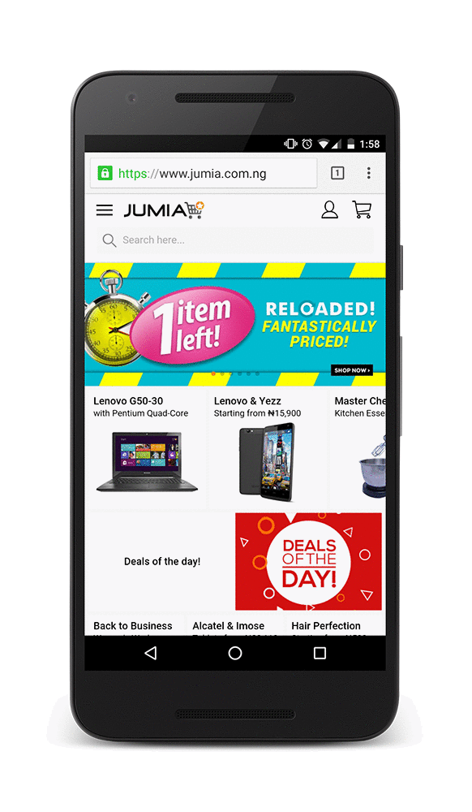

project_path: /web/_project.yaml
book_path: /web/showcase/_book.yaml

{# wf_published_on: 2016-05-17 #}
{# wf_updated_on: 2016-05-17 #}
{# wf_featured_image: /web/showcase/2016/images/jumia/featured.png #}
{# wf_featured_snippet: "We finally have proper means to address our fastest growing pool of customers — mobile web users. That’s incredibly valuable. We even see better results from web Push Notifications than from app pushes." <b>Jeremy Doutte</b>, Jumia CEO #}
{# wf_tags: progressive-web-apps,webpush,notifications,serviceworker,casestudy #}
{# wf_region: africa #}
{# wf_vertical: retail #}

# Jumia {: .page-title }

### TL;DR {: .hide-from-toc }

Push Notifications help Jumia reverse cart abandonment and increase
conversions by 9X

### Results

 38% Open rate

 9X more conversion on previously abandoned
carts from web push users

7.85% conversion rate on previously abandoned
carts from web push users, vs. 4.5% for native app.

<a class="button button-primary" href="pdfs/jumia.pdf">
  Download PDF Case study
</a>

## About Jumia

Jumia is a leading e-commerce website in Africa. Most of their customers use
mobile devices, which also provide the largest source of traffic and user
growth.

## Challenge

Nearly a quarter of shopping carts were abandoned on Jumia’s mobile site
every day. To counter this, they reminded customers via email to complete
their purchases. But getting people to provide their email addresses is
challenging, and email open rates are low. With over 65% of their web traffic
on mobile browsers, Jumia looked to progressive web app technologies like
Push Notifications to solve their problem and re-engage mobile users who
had abandoned carts.

## Solution

Working with middleware provider Accengage, Jumia implemented Push
Notifications in just days through Google Tag Manager. They then began
sending Push Notifications to customers with abandoned carts. These
notifications look the same as those from native apps, and arrive even
if the browser is no longer running.

The new strategy delivered a 38% open rate on mobile and shoppers recovered
carts 9X more often than before. Conversion rates from Push Notifications
for cart abandonments on mobile web now outpace the native app’s—7.85%
versus 4.5% respectively. “We’re closer to our users with web push, because
it’s a more personal way to communicate with them. Customers aren’t all
willing to download our apps, as they dread the impact on their data bills,”
says Jeremy Doutte, Jumia CEO.
