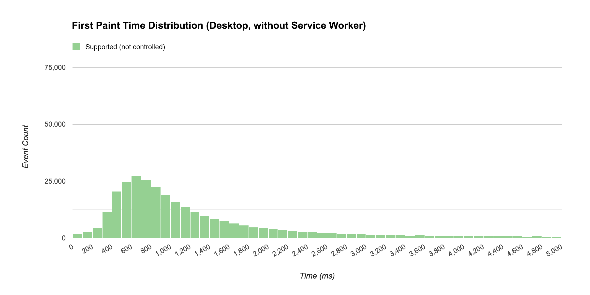
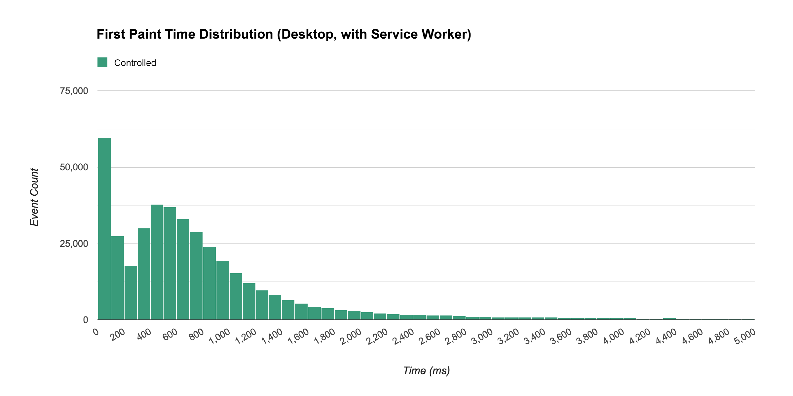
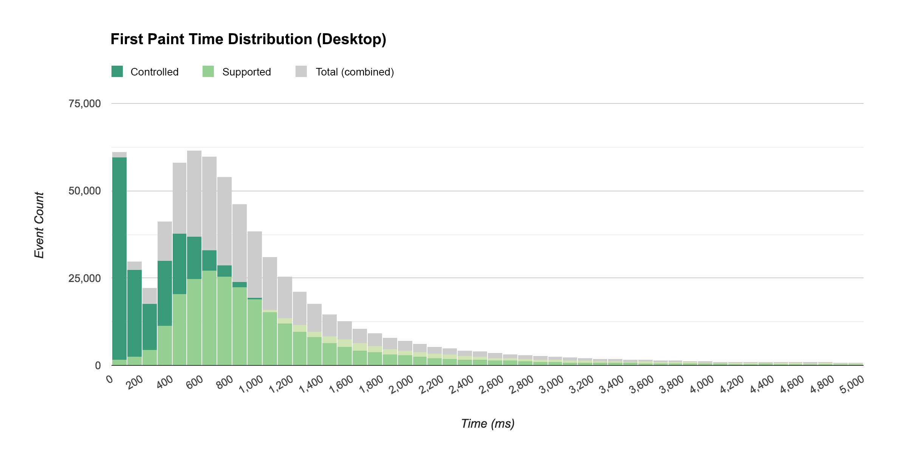
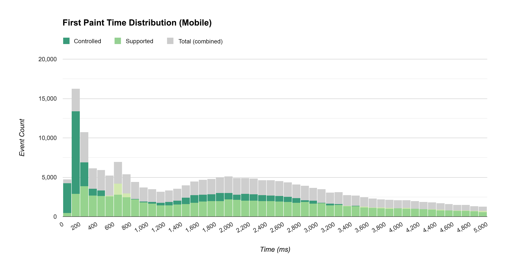

project_path: /web/_project.yaml
book_path: /web/showcase/_book.yaml
description: Measuring the Real-world Performance Impact of Service Workers

{# wf_published_on: 2016-07-22T18:00:00.000Z #}
{# wf_updated_on: 2016-07-22T18:00:00.000Z #}
{# wf_author: philipwalton #}
{# wf_featured_image: /web/showcase/2016/images/service-worker-perf/desktop-all.png #}
{# wf_featured_snippet: One of the most significant benefits of service workers (from a performance perspective, at least) is their ability to proactively control the caching of assets. A web application that can cache all of its necessary resources should load substantially faster for returning visitors. But what do these gains actually look like to real users? And how do you even measure this? #}
{# wf_tags: progressive-web-apps,serviceworker,casestudy,performance,google-io #}

# Measuring the Real-world Performance Impact of Service Workers {: .page-title }

*By <a href="https://philipwalton.com">Philip Walton</a> Developer Programs Engineer*

One of the most significant benefits of [service workers](/web/fundamentals/primers/service-worker/) (from a performance perspective, at least) is their ability to proactively control the caching of assets. A web application that can cache all of its necessary resources should load substantially faster for returning visitors. But what do these gains actually look like to real users? And how do you even measure this?

The [Google I/O web app](https://events.google.com/io2016/){: .external } (IOWA for short) is a [progressive web app](/web/progressive-web-apps/) that leveraged most of the new capabilities offered by service workers to deliver a rich, app-like experience to its users. It also used Google Analytics to capture key performance data and usage patterns from its large and diverse user audience.

This case study explores how IOWA used Google Analytics to answer key performance questions and report on the real-world impact of service workers.

## Starting with the questions

Any time you implement analytics in a website or application, it's important to start by identifying the questions you're trying to answer from the data you'll be collecting.

While we had several questions we wanted to answer, for the purposes of this case study, let's focus on two of the more interesting ones.

**1. Is service worker caching more performant than the existing HTTP caching mechanisms available in all browsers?**

We already expect pages to load faster for returning visitors than for new visitors since browsers can cache requests and serve them instantly on repeat visits.

Service workers offers alternative caching capabilities that give developers fine-grained control over exactly what and how caching is done. In IOWA, we optimized our service worker implementation so that every asset would be cached, so returning visitors could use the app completely offline.

But would this effort be any better than what the browser already does by default? And if so, how much better?&nbsp;<a href="#footnotes">[1]</a>

**2. How does service worker impact the experience of the site loading?**

In other words, how fast does it *feel* like the site is loading, regardless of the actual load times as measured by traditional page load metrics?

Answering questions about how an experience feels is obviously not an easy task, and no metric is going to perfectly represent such a subjective sentiment. That being said, there are definitely some metrics that are better than others, so choosing the right ones is important.

## Choosing the right metric

Google Analytics, by default, tracks [page load times](https://support.google.com/analytics/answer/1205784) (via the [Navigation Timing API](https://developer.mozilla.org/en-US/docs/Web/API/Navigation_timing_API)) for 1% of a site's visitors, and it makes that data available via metrics like [Avg. Page Load Time](/analytics/devguides/reporting/core/dimsmets#view=detail&group=site_speed&jump=ga_avgpageloadtime).

*Avg. Page Load Time* is a good metric for answering our first question, but it's not a particularly good metric for answering the second. For one thing the `load` event doesn't necessarily correspond to the moment when the user can actually interact with the app. Moreover, two apps with the exact same load time may *feel* like they load much differently. For example, a site with a splash screen or a loading indicator probably feels like it loads much faster than a site that just shows a blank page for several seconds.

In IOWA, we showed a splash screen countdown animation that (in my opinion) very successfully served to entertain the user while the rest of the app loaded in the background. Because of this, tracking how long it takes the splash screen to appear makes a lot more sense as a way to measure perceived load performance. We chose the metric **time to first paint** to get this value.

Once we decided on the questions we wanted to answer and identified the metrics that would be useful in answering them, it was time to implement Google Analytics and start measuring.

## The analytics implementation

If you've used Google Analytics before, then you're probably familiar with the [recommended JavaScript tracking snippet](/analytics/devguides/collection/analyticsjs/#alternative_async_tracking_snippet). It looks like this:

<pre class="prettyprint">

</pre>

The first line in the above code initializes a global `ga()` function (if it doesn't already exist), and the last line asynchronously downloads the `analytics.js` library.

The middle part contains these two lines:

<pre class="prettyprint">
ga('create', 'UA-XXXXX-Y', 'auto');
ga('send', 'pageview');
</pre>

These two [commands](/analytics/devguides/collection/analyticsjs/how-analyticsjs-works#the_ga_command_queue) track what pages are visited by people going to your site, but [not much more](/analytics/devguides/collection/analyticsjs/#what_data_does_the_tracking_snippet_capture). If you want to track additional user interactions, you have to do so yourself.

For IOWA, we wanted to track two additional things:

* The elapsed time between when the page first starts to load and when pixels appear on the screen.
* Whether or not a service worker is controlling the page. With this information we could segment our reports to compare the results with and without service worker.

### Capturing time to first paint

Some browsers record the precise time at which the first pixel is painted to the screen, and they make that time available to developers. That value, compared with the `navigationStart` value exposed via the [Navigation Timing API](https://developer.mozilla.org/en-US/docs/Web/API/Navigation_timing_API) gives us a very accurate accounting of how much time has passed between when the user initially requested the page and when they first saw something.

As I already mentioned, time to first paint is an important metric to measure because it's the first point at which a user experiences the load speed of your site. It's the first impression users get, and a good first impression can positively affect the rest of the user experience.&nbsp;<a href="#footnotes">[2]</a>

To get the first paint value in browsers that expose it, we created the `getTimeToFirstPaintIfSupported` utility function:

<pre class="prettyprint">
function getTimeToFirstPaintIfSupported() {
  // Ignores browsers that don't support the Performance Timing API.
  if (window.performance && window.performance.timing) {
    var navTiming = window.performance.timing;
    var navStart = navTiming.navigationStart;
    var fpTime;

    // If chrome, get first paint time from `chrome.loadTimes`.
    if (window.chrome && window.chrome.loadTimes) {
      fpTime = window.chrome.loadTimes().firstPaintTime * 1000;
    }
    // If IE/Edge, use the prefixed `msFirstPaint` property.
    // See http://msdn.microsoft.com/ff974719
    else if (navTiming.msFirstPaint) {
      fpTime = navTiming.msFirstPaint;
    }

    if (fpTime && navStart) {
      return fpTime - navStart;
    }
  }
}
</pre>

<aside class="caution">
  <strong>Important:</strong> the <code>firstpaint</code> values referenced in the above function are part of vendor-specific APIs. They are non-standard and subject to change (or removal) at any time. We chose to implement them in IOWA knowing the site would have a limited lifespan. For most sites, it's best to use other <a href="https://speedcurve.com/blog/user-timing-and-custom-metrics/">user timing techniques</a> until a <code>firstpaint</code> (or a <code>firstpaint</code> alternative) is standardized.
</aside>

With this, we could now write another function that [sends](/analytics/devguides/collection/analyticsjs/sending-hits) a [non-interaction](https://support.google.com/analytics/answer/1033068#NonInteractionEvents) event with the time to first paint as its value:&nbsp;<a href="#footnotes">[3]</a>

<pre class="prettyprint">
function sendTimeToFirstPaint() {
  var timeToFirstPaint = getTimeToFirstPaintIfSupported();

  if (timeToFirstPaint) {
    ga('send', 'event', {
      eventCategory: 'Performance',
      eventAction: 'firstpaint',
      // Rounds to the nearest millisecond since
      // event values in Google Analytics must be integers.
      eventValue: Math.round(timeToFirstPaint)
      // Sends this as a non-interaction event,
      // so it doesn't affect bounce rate.
      nonInteraction: true
    });
  }
}
</pre>

After writing both of these functions, our tracking code looks like this:

<pre class="prettyprint">
// Creates the tracker object.
ga('create', 'UA-XXXXX-Y', 'auto');

// Sends a pageview for the initial pageload.
ga('send', 'pageview');

// Sends an event with the time to first paint data.
sendTimeToFirstPaint();
</pre>

Note that depending on when the above code runs, pixels may or may not have already been painted to the screen. To ensure we always run this code after the first paint occurs, we postponed the call to `sendTimeToFirstPaint()` until after the `load` event. In fact, we decided to postpone sending all analytics data until after the page was loaded to ensure those requests wouldn't compete with the loading of other resources.

<pre class="prettyprint">
// Creates the tracker object.
ga('create', 'UA-XXXXX-Y', 'auto');

// Postpones sending any hits until after the page has fully loaded.
// This prevents analytics requests from delaying the loading of the page.
<strong>window.addEventListener('load', function() {
  // Sends a pageview for the initial pageload.
  ga('send', 'pageview');

  // Sends an event with the time to first paint data.
  sendTimeToFirstPaint();
});</strong>
</pre>

The code above reports `firstpaint` times to Google Analytics, but that's only half the story. We still needed to track the service worker status; otherwise we wouldn't be able to compare the first paint times of a service worker-controlled page and a non-controlled page.

### Determining service worker status

To determine the current status of the service worker, we created a utility function that returns  one of three values:

- **controlled**: a service worker is controlling the page. In the case of IOWA that also means all assets have been cached and the page works offline.
- **supported**: the browser supports service worker, but the service worker is not yet controlling the page. This is the expected status for first time visitors.
- **unsupported**: the user's browser does not support service worker.

<pre class="prettyprint">
function getServiceWorkerStatus() {
  if ('serviceWorker' in navigator) {
    return navigator.serviceWorker.controller ? 'controlled' : 'supported';
  } else {
    return 'unsupported';
  }
}
</pre>

This function got the service worker status for us; the next step was to associate this status with the data we were sending to Google Analytics.

#### Tracking custom data with custom dimensions

By default, Google Analytics gives you lots of ways to subdivide your total traffic into groups based on attributes of the user, session, or interaction. These attributes are known as [dimensions](https://support.google.com/analytics/answer/1033861). Common dimensions web developers care about are things like [Browser](/analytics/devguides/reporting/core/dimsmets#view=detail&group=platform_or_device&jump=ga_browser), [Operating System](/analytics/devguides/reporting/core/dimsmets#view=detail&group=platform_or_device&jump=ga_operatingsystem), or [Device Category](/analytics/devguides/reporting/core/dimsmets#view=detail&group=platform_or_device&jump=ga_devicecategory).

The service worker's status is not a dimension Google Analytics provides by default; however, Google Analytics does give you the ability to create your own [custom dimensions](https://support.google.com/analytics/answer/2709828) and define them however you want.

For IOWA, we created a custom dimension called *Service Worker Status* and set its scope to [hit](https://support.google.com/analytics/answer/2709828#example-hit) (i.e. per-interaction).&nbsp;<a href="#footnotes">[4]</a> Each custom dimension you create in Google Analytics is given a unique index within that property, and in your tracking code you can reference that dimension by its index. For example, if the index of the dimension we just created were 1, we could update our logic as follows to send the `firstpaint` event to include the service worker status:

<pre class="prettyprint">
ga('send', 'event', {
  eventCategory: 'Performance',
  eventAction: 'firstpaint',
  // Rounds to the nearest millisecond since
  // event values in Google Analytics must be integers.
  eventValue: Math.round(timeToFirstPaint)
  // Sends this as a non-interaction event,
  // so it doesn't affect bounce rate.
  nonInteraction: true,

  <strong>// Sets the current service worker status as the value of
  // `dimension1` for this event.
  dimension1: getServiceWorkerStatus()</strong>
});
</pre>

This works, but it will only associate the service worker's status with this particular event. Since *Service Worker Status* is something that's potentially useful to know for any interaction, it's best to include it with all data sent to Google Analytics.

To include this information in all hits (e.g. all pageviews, events, etc.) we [set](/analytics/devguides/collection/analyticsjs/accessing-trackers#updating_tracker_data) the custom dimension value on the [tracker](/analytics/devguides/collection/analyticsjs/creating-trackers) object itself, prior to sending any data to Google Analytics.

<pre class="prettyprint">
ga('set', 'dimension1', getServiceWorkerStatus());
</pre>

Once set, this value gets sent with all subsequent hits for the current pageload. If the user loads the page again later, a new value will likely be returned from the `getServiceWorkerStatus()` function, and that value will be set on the tracker object.

A quick note on code clarity and readability: since other people looking at this code may not know what `dimension1` refers to, it's always best to create a variable that maps meaningful dimension names to the values analytics.js will use.

<pre class="prettyprint">
<strong>// Creates a map between custom dimension names and their index.
// This is particularly useful if you define lots of custom dimensions.
var customDimensions = {
  SERVICE_WORKER_STATUS: 'dimension1'
};</strong>

// Creates the tracker object.
ga('create', 'UA-XXXXX-Y', 'auto');

<strong>// Sets the service worker status on the tracker,
// so its value is included in all future hits.
ga('set', customDimensions.SERVICE_WORKER_STATUS, getServiceWorkerStatus());</strong>

// Postpones sending any hits until after the page has fully loaded.
// This prevents analytics requests from delaying the loading of the page.
window.addEventListener('load', function() {
  // Sends a pageview for the initial pageload.
  ga('send', 'pageview');

  // Sends an event with the time to first paint data.
  sendTimeToFirstPaint();
});
</pre>

As I mentioned, sending the *Service Worker Status* dimension with every hit allows us to use it when reporting on any metric. For example, here's what service worker usage looked like for all pageviews during the week of Google I/O:

<iframe width="600" height="371" seamless frameborder="0" scrolling="no" src="https://docs.google.com/spreadsheets/d/15qxUkT8j8FY9ECQilKKPvw3BDSgF4QtplpFAiQUSyZg/pubchart?oid=537990599&amp;format=interactive"></iframe>

As you can see almost 85% of all pageviews for IOWA were from browsers that [support service worker](https://jakearchibald.github.io/isserviceworkerready/){: .external }.

## The results: answering our questions

Once we started collecting data to answer our questions, we could report on that data to see the results. *(Note: all Google Analytics data shown here represents actual web traffic to the IOWA site from May 16-22, 2016).*

The first question we had was: *Is service worker caching more performant than the existing HTTP caching mechanisms available in all browsers?*

To answer that question, we created a [custom report](https://support.google.com/analytics/answer/1033013) that looked at the metric [Avg. Page Load Times](/analytics/devguides/reporting/core/dimsmets#view=detail&group=site_speed&jump=ga_avgpageloadtime) across various dimensions. This metric is well-suited to answer this question because the `load` event fires only after all initial resources are downloaded. Thus it directly reflects the total load time for all the site's critical resources.&nbsp;<a href="#footnotes">[5]</a>

The dimensions we chose were:

* Our custom *Service Worker Status* dimension.
* [User Type](/analytics/devguides/reporting/core/dimsmets#view=detail&group=user&jump=ga_usertype), which indicates whether this is the user's first visit to the site or if they're returning. (Note: a new visitor will not have any resources cached; a returning visitor might.)
* [Device Category](/analytics/devguides/reporting/core/dimsmets#view=detail&group=platform_or_device&jump=ga_devicecategory), which lets us compare the results across mobile and desktop.

To control for the possibility that non-service-worker-related factors were skewing our load time results, we limited our query to only include browsers that support service worker.

The chart below shows the average page load times across desktop and mobile for service worker controlled pages and non-controlled pages:

<iframe width="600" height="371" seamless frameborder="0" scrolling="no" src="https://docs.google.com/spreadsheets/d/15qxUkT8j8FY9ECQilKKPvw3BDSgF4QtplpFAiQUSyZg/pubchart?oid=1528363694&amp;format=interactive"></iframe>

As you can see, visits to our app when controlled by a service worker loaded quite a bit faster than non-controlled visits, even those from returning users who likely had most of the page's resources cached. It's also interesting to notice that, on average, visitors on mobile with a service worker saw faster loads than new desktop visitors.

"&hellip;visits to our app when controlled by a service worker loaded quite a bit faster than non-controlled visits&hellip;"

You can see more details in the following two tables:

<table>
  <tr><th colspan="4">Avg. Page Load Time (Desktop)</th></tr>
  <tr class="alt">
    <td><b>Service Worker Status</b></td>
    <td><b>User Type</b></td>
    <td align="right"><b>Avg. Page Load Time (ms)</b></td>
    <td align="right"><b>Sample Size</b></td>
  </tr>
  <tr>
    <td>Controlled</td>
    <td>Returning Visitor</td>
    <td align="right" style="background:#ffc">
      <strong>2568</strong>

    </td>
    <td align="right">30860
</td>
  </tr>
  <tr>
    <td>Supported</td>
    <td>Returning Visitor
    </td>
    <td align="right" style="background:#ffc">
      <strong>3612</strong>
    </td>
    <td align="right">1289</td>
  </tr>
  <tr>
    <td>Supported</td>
    <td>New Visitor</td>
    <td align="right" style="background:#ffc">
      <strong>4664</strong>
    </td>
    <td align="right">21991</td>
  </tr>
</table>

<table>
  <tr><th colspan="4">Avg. Page Load Time (Mobile)</th></tr>
  <tr class="alt">
    <td><b>Service Worker Status</b></td>
    <td><b>User Type</b></td>
    <td align="right"><b>Avg. Page Load Time (ms)</b></td>
    <td align="right"><b>Sample Size</b></td>
  </tr>
  <tr>
    <td>Controlled</td>
    <td>Returning Visitor</td>
    <td align="right" style="background:#ffc">
      <strong>3760</strong>
    </td>
    <td align="right">8162</td>
  </tr>
  <tr>
    <td>Supported</td>
    <td>Returning Visitor</td>
    <td align="right" style="background:#ffc">
      <strong>4843</strong>
    </td>
    <td align="right">676</td>
  </tr>
  <tr>
    <td>Supported</td>
    <td>New Visitor</td>
    <td align="right" style="background:#ffc">
      <strong>6158</strong>
    </td>
    <td align="right">5779</td>
  </tr>
</table>

You may be wondering how it's possible for a returning visitor whose browser supports service worker to ever be in a non-controlled state. There are a few possible explanations for this:

* The user left the page on the initial visit before the service worker had a chance to finish initializing.
* The user uninstalled the service worker via the developer tools.

Both of these situations are relatively rare. We can see that in the data by looking at the [Page Load Sample](/analytics/devguides/reporting/core/dimsmets#view=detail&group=site_speed&jump=ga_pageloadsample) values in the fourth column. Notice that the middle rows have a much smaller sample than the other two.

Our second question was: *How does service worker impact the experience of the site loading?*

To answer this question, we created another custom report for the metric [Avg. Event Value](/analytics/devguides/reporting/core/dimsmets#view=detail&group=event_tracking&jump=ga_avgeventvalue) and filtered the results to only include our `firstpaint` events. We used the dimensions *Device Category* and our custom *Service Worker Status* dimension:

<iframe width="600" height="371" seamless frameborder="0" scrolling="no" src="https://docs.google.com/spreadsheets/d/15qxUkT8j8FY9ECQilKKPvw3BDSgF4QtplpFAiQUSyZg/pubchart?oid=673302558&amp;format=interactive"></iframe>

To better visualize how the `firstpaint` events related to the overall page load times, we created a timeline chart plotting both events for mobile and desktop:

<iframe width="600" height="371" seamless frameborder="0" scrolling="no" src="https://docs.google.com/spreadsheets/d/15qxUkT8j8FY9ECQilKKPvw3BDSgF4QtplpFAiQUSyZg/pubchart?oid=1187664125&amp;format=interactive"></iframe>

<iframe width="600" height="371" seamless frameborder="0" scrolling="no" src="https://docs.google.com/spreadsheets/d/15qxUkT8j8FY9ECQilKKPvw3BDSgF4QtplpFAiQUSyZg/pubchart?oid=610404153&amp;format=interactive"></iframe>

Contrary to what I would have expected, the service worker on mobile had much less impact on time to first paint than it did on overall page load.

"&hellip;service worker on mobile had much less impact on time to first paint than it did on overall page load."

To explore why this is the case, we have to dig deeper into the data. Averages can be good for general overviews and broad strokes, but to really get a sense of how these numbers break down across a range of users, we need to look at a distribution of `firstpaint` times.

### Getting the distribution of a metric in Google Analytics

To get the distribution of `firstpaint` times we need access to the individual results for each event. Unfortunately, Google Analytics doesn't make this easy.

Google Analytics lets us break down a report by whatever dimension we want, but it doesn't let use break down a report by metrics. That isn't to say it's impossible, it just means we had to customize our implementation a bit more to get the desired result.

Since report results can only be broken down by dimensions, we had to set the metric value (in this case `firstpaint` time) as a custom dimension on the event. To do this we created another custom dimension called *Metric Value* and updated our `firstpaint` tracking logic as follows:

<pre class="prettyprint">
var customDimensions = {
  SERVICE_WORKER_STATUS: 'dimension1',
  <strong>METRIC_VALUE: 'dimension2'</strong>
};

// ...

function sendTimeToFirstPaint() {
  var timeToFirstPaint = getTimeToFirstPaintIfSupported();

  if (timeToFirstPaint) {
    var fields = {
      eventCategory: 'Performance',
      eventAction: 'firstpaint',
      // Rounds to the nearest millisecond since
      // event values in Google Analytics must be integers.
      eventValue: Math.round(timeToFirstPaint)
      // Sends this as a non-interaction event,
      // so it doesn't affect bounce rate.
      nonInteraction: true
    }

    <strong>// Sets the event value as a dimension to allow for breaking down the
    // results by individual metric values at reporting time.
    fields[customDimensions.METRIC_VALUE] = String(fields.eventValue);</strong>

    ga('send', 'event', fields);
  }
}
</pre>

The Google Analytics web interface does not currently provide a way to visualize the distribution of arbitrary metric values, but with the help of the [Google Analytics Core Reporting API](/analytics/devguides/reporting/core/v4/) and the [Google Charts library](/chart/interactive/docs/gallery/histogram) we could query for the raw results and then construct a histogram ourselves.

For example, the following API request configuration was used to get a distribution of `firstpaint` values on desktop with a non-controlled service worker.

<pre class="prettyprint">
{
  dateRanges: [{startDate: '2016-05-16', endDate: '2016-05-22'}],
  metrics: [{expression: 'ga:totalEvents'}],
  dimensions: [{name: 'ga:dimension2'}],
  dimensionFilterClauses: [
    {
      operator: 'AND',
      filters: [
        {
          dimensionName: 'ga:eventAction',
          operator: 'EXACT',
          expressions: ['firstpaint']
        },
        {
          dimensionName: 'ga:dimension1',
          operator: 'EXACT',
          expressions: ['supported']
        },
        {
          dimensionName: 'ga:deviceCategory',
          operator: 'EXACT',
          expressions: ['desktop']
        }
      ],
    }
  ],
  orderBys: [
    {
      fieldName: 'ga:dimension2',
      orderType: 'DIMENSION_AS_INTEGER'
    }
  ]
}
</pre>

This API request returns an array of values that look like this (Note: these are just the first five results). The results are sorted from smallest to largest, so these rows represent the fastest times.

<table>
  <tr><th colspan="2">API Response Results (first five rows)</th></tr>
  <tr class="alt">
    <td><b>ga:dimension2</b></td>
    <td align="right"><b>ga:totalEvents</b></td>
  </tr>
  <tr>
    <td>4</td>
    <td align="right">3</td>
  </tr>
  <tr>
    <td>5</td>
    <td align="right">2</td>
  </tr>
  <tr>
    <td>6</td>
    <td align="right">10</td>
  </tr>
  <tr>
    <td>7</td>
    <td align="right">8</td>
  </tr>
  <tr>
    <td>8</td>
    <td align="right">10</td>
  </tr>
</table>

Here's what these results mean in plain English:

* There were 3 events where the `firstpaint` value was 4 ms
* There were 2 events where the `firstpaint` value was 5 ms
* There were 10 events where the `firstpaint` value was 6 ms
* There were 8 events where the `firstpaint` value was 7 ms
* There were 10 events where the `firstpaint` `value` was 8 ms
* etc.

From these results we can extrapolate the `firstpaint` value for every single event and create a histogram of the distribution. We did this for each of the queries we ran.

Here's what the distribution looked like on desktop with a non-controlled (but supported) service worker:

The median `firstpaint` time for the above distribution is **912 ms**.

The shape of this curve is quite typical of load time distributions. Contrast that with the histogram below which shows the distribution of first paint events for visits in which a service worker was controlling the page.

Notice that when a service worker was controlling the page, many visitors experienced a near-immediate first paint, with a median of **583 ms**.

"&hellip;when a service worker was controlling the page, many visitors experienced a near-immediate first paint&hellip;"

To get a better sense of how these two distributions compare to each other, the next chart shows a merged view of the two. The histogram showing non-controlled service worker visits is overlaid on top of the histogram showing controlled visits, and both of those are overlaid on top of a histogram showing both combined.

One thing I found interesting about these results was that the distribution with a controlled service worker still had a bell-shaped curve after the initial spike. I was expecting a large initial spike and then a gradual trail off, I wasn't expecting a second peak in the curve.

When I looked into what might be causing this, I learned that even though a service worker can be controlling a page, its thread can be inactive. The browser does this to [save resources](https://slightlyoff.github.io/ServiceWorker/spec/service_worker/#motivations)&mdash;obviously you don't need every service worker for every site you've ever visited to be active and ready at a moment's notice. This explains the tail of the distribution. For some users, there was a delay while the service worker thread started up.

As you can see from the distribution though, even with this initial delay, browsers with service worker delivered content faster than browsers going through the network.

Here's how things looked on mobile:

While we still had a sizeable increase in near-immediate first paint times, the tail was quite a bit larger and longer. This is likely because, on mobile, starting an idle service worker thread takes longer than it does on desktop. It also explains why the difference between average `firstpaint` time wasn't as big as I was expecting (discussed above).

"&hellip;on mobile, starting an idle service worker thread takes longer than it does on desktop."

Here is the breakdown from these variations of median first paint times on mobile and desktop grouped by service worker status:

<table>
  <tr><th colspan="3">Median Time to First Paint (ms)</th></tr>
  <tr class="alt">
    <td><b>Service Worker Status</b></td>
    <td align="right"><b>Desktop</b></td>
    <td align="right"><b>Mobile</b></td>
  <tr>
  <tr>
    <td>Controlled</td>
    <td align="right">583</td>
    <td align="right">1634</td>
  </tr>
  <tr>
    <td>Supported (not controlled)</td>
    <td align="right">912</td>
    <td align="right">1933</td>
  </tr>
</table>

While building these distribution visualizations took a bit more time and effort than creating a custom report in Google Analytics, they give us a far better sense of how service workers affect the performance of our site than averages alone.

## Other impact from Service Workers

In addition to the performance impact, service workers also impact the user experience in several other ways that are measurable with Google Analytics.

### Offline access

Service workers allow users to interact with your site while offline, and while some sort of offline support is probably critical for any progressive web app, determining how critical it is in your case largely depends on how much usage is occurring offline. But how do we measure that?

Sending data to Google Analytics requires an internet connection, but it doesn't require the data to be sent at the exact time the interaction took place. Google Analytics supports sending interaction data after the fact by specifying a time offset (via the <code>[qt](/analytics/devguides/collection/protocol/v1/parameters#qt)</code> parameter).

For the past two years IOWA has been using a [service worker script](https://www.npmjs.com/package/sw-offline-google-analytics) that detects failed hits to Google Analytics when the user is offline and replays them later with the `qt` parameter.

To track whether the user was online or offline, we created a custom dimension called *Online* and set it to the value of `navigator.onLine`, we then listened for the `online` and `offline` events and updated the dimension accordingly.

And to get a sense for how common it was for a user to be offline while using IOWA, we created a [segment](https://support.google.com/analytics/answer/3123951) that targeted users with at least one offline interaction. Turns out, that was almost 5% of users:

<iframe width="600" height="371" seamless frameborder="0" scrolling="no" src="https://docs.google.com/spreadsheets/d/15qxUkT8j8FY9ECQilKKPvw3BDSgF4QtplpFAiQUSyZg/pubchart?oid=1623911536&amp;format=interactive"></iframe>

### Push notifications

Service workers allow users to opt-in to receiving push notifications. In IOWA, users were notified when a session in their schedule was about to start.

As with any form of notifications, it's important to find the balance between providing value to the user and annoying them. To better understand which is happening, it's important to track whether users are opting-in to receive these notifications, if they're engaging with them when they arrive, and if any users who previously opted-in change their preference and opt-out.

In IOWA, we only sent notifications related to the user's personalized schedule, something only logged-in users could create. This limited the set of users who could receive notifications to logged-in users (tracked via a custom dimension called *Signed In*) whose browsers supported push notifications (tracked via another custom dimension called *Notification Permission*).

The following report is based on the metric [Users](/analytics/devguides/reporting/core/dimsmets#view=detail&group=user&jump=ga_users) and our Notification Permission custom dimension, segmented by users who signed in at some point and whose browsers support push notifications.

<iframe width="600" height="371" seamless frameborder="0" scrolling="no" src="https://docs.google.com/spreadsheets/d/15qxUkT8j8FY9ECQilKKPvw3BDSgF4QtplpFAiQUSyZg/pubchart?oid=1028704919&amp;format=interactive"></iframe>

It's great to see that more than half of our signed-in users opted to receive push notifications.

### App install banners

If a progress web app meets the [criteria](/web/fundamentals/app-install-banners/) and is used frequently by a user, that user may be shown an app install banner, prompting them to add the app to their home screen.

In IOWA, we tracked how often these prompts were shown to the user (and whether they were accepted) with the following code:

<pre class="prettyprint">
window.addEventListener('beforeinstallprompt', function(event) {
  // Tracks that the user saw a prompt.
  ga('send', 'event', {
    eventCategory: 'installprompt',
    eventAction: 'fired'
  });

  event.userChoice.then(function(choiceResult) {
    // Tracks the users choice.
    ga('send', 'event', {
      eventCategory: 'installprompt',
      // `choiceResult.outcome` will be 'accepted' or 'dismissed'.
      eventAction: choiceResult.outcome,
      // `choiceResult.platform` will be 'web' or 'android' if the prompt was
      // accepted, or '' if the prompt was dismissed.
      eventLabel: choiceResult.platform
    });
  });
});
</pre>

Of the users who saw an app install banner, about 10% chose to add it to their home screen.

<iframe width="600" height="371" seamless frameborder="0" scrolling="no" src="https://docs.google.com/spreadsheets/d/15qxUkT8j8FY9ECQilKKPvw3BDSgF4QtplpFAiQUSyZg/pubchart?oid=1347385203&amp;format=interactive"></iframe>

## Possible tracking improvements (for next time)

The analytics data we collected from IOWA this year was invaluable. But hindsight always brings to light holes and opportunities to improve things for the next time around. After finishing this year's analysis, here are two things I wish we'd done differently that readers looking to implement a similar strategy might want to consider:

**1. Track more events related to the load experience**

We tracked several events that correspond to a technical metric (e.g. [HTMLImportsLoaded](http://webcomponents.org/polyfills/html-imports/), [WebComponentsReady](https://github.com/webcomponents/webcomponentsjs#webcomponentsready), etc.), but since so much of the load was done asynchronously, the point at which these events fired didn't necessarily correspond with a particular moment in the overall load experience.

The primary load-related event we didn't track (but wish we had) is the point at which the splash screen disappeared and the user could see the page content.

**2. Store the analytics client ID in IndexedDB**

By default, analytics.js stores the [client ID field](/analytics/devguides/collection/analyticsjs/cookies-user-id) in the browser's cookies; unfortunately, service worker scripts cannot access cookies.

This presented a problem for us when we tried to implement notification tracking. We wanted to send an event from the service worker (via the [Measurement Protocol](/analytics/devguides/collection/protocol/)) each time a notification was sent to a user, and then track the re-engagement success of that notification if the user clicked on it and arrived back in the app.

While we were able to track the success of notifications in general via the `utm_source` [campaign parameter](https://support.google.com/analytics/answer/1033863#parameters), we weren't able to tie a particular re-engagement session to a particular user.

What we could have done to work around this limitation was store the client ID via IndexedDB in our tracking code, and then that value would have been accessible to the service worker script.

**3. Let the service worker report online/offline status**

Inspecting `navigator.onLine` will let you know if your browser is able to connect to the router or local area network, but it won't necessarily tell if you if the user has real connectivety. And since our offline analytics service worker script simply replayed failed hits (without modifying them, or marking them as failed), we were probably under-reporting our offline usage.

In the future we should track both the status of `navigator.onLine` as well as whether the hit was replayed by the service worker due to an initial network failure. This will give us a more accurate picture of the true offline usage.

## Wrapping up

This case study has shown that using service worker did indeed improve the load performance of the Google I/O webapp across a wide range of browsers, networks, and devices. It has also shown that when you look at a distribution of the load data across a wide range of browsers, networks, and devices, you get much more insight into how this technology handles real-world scenarios, and you discover performance characteristics that you may not have expected.

Here were some of the key takeaways from the IOWA study:

* On average, pages loaded quite a bit faster when a service worker was controlling the page than they did without a service worker, for both new and returning visitors.
* Visits to pages controlled by a service worker loaded almost instantly for many users.
* Service workers, when inactive, took a bit of time to start up. However, an inactive service worker still performed better than no service worker.
* The startup time for an inactive service worker was longer on mobile than on desktop.

While the performance gains observed in one particular application are generally useful to report to the larger developer community, it's important to remember that these results are specific to the type of site IOWA is (an event site) and the type of audience IOWA has (mostly developers).

If you're implementing service worker in your application, it's important that you implement your own measurement strategy so you can assess your own performance and prevent future regression. If you do, please share your results so everyone can benefit!

---

<strong>Footnotes</strong>

1. It's not entirely fair to compare the performance of our service worker cache implementation to the performance of our site with HTTP cache alone. Because we were optimizing IOWA for service worker, we didn't spend much time optimizing for HTTP cache. If we had, the results probably would have been different. To learn more about optimizing your site for HTTP cache, read [Optimizing Content Efficiently](/web/fundamentals/performance/optimizing-content-efficiency/http-caching).
2. Depending on how your site loads its styles and content, it's possible that the browser is able to paint prior to content or styles being available. In such cases, `firstpaint` may correspond to a blank white screen. If you use `firstpaint`, it's important to ensure it corresponds to a meaningful point in the loading of your site's resources.
3. Technically we could send a [timing](/analytics/devguides/collection/analyticsjs/user-timings) hit (which are non-interaction by default) to capture this information instead of an event. In fact, timing hits were added to Google Analytics specifically to track load metrics like this; however, timing hits get [heavily sampled](/analytics/devguides/collection/analyticsjs/user-timings#sampling_considerations) at processing time, and their values cannot be used in [segments](https://support.google.com/analytics/answer/3123951). Given these current limitations, non-interaction events remain better suited.
4. To better understand what scope to give a custom dimension in Google Analytics refer to the [Custom Dimension](https://support.google.com/analytics/answer/2709828) section of the Analytics help center. It's also important to understand the Google Analytics data model, which consists of users, sessions, and interactions (hits). To learn more, watch the [Analytics Academy lesson on the Google Analytics Data Model](https://analyticsacademy.withgoogle.com/course/2/unit/1/lesson/3).
5. This does not account for resources lazily loaded after the load event.
