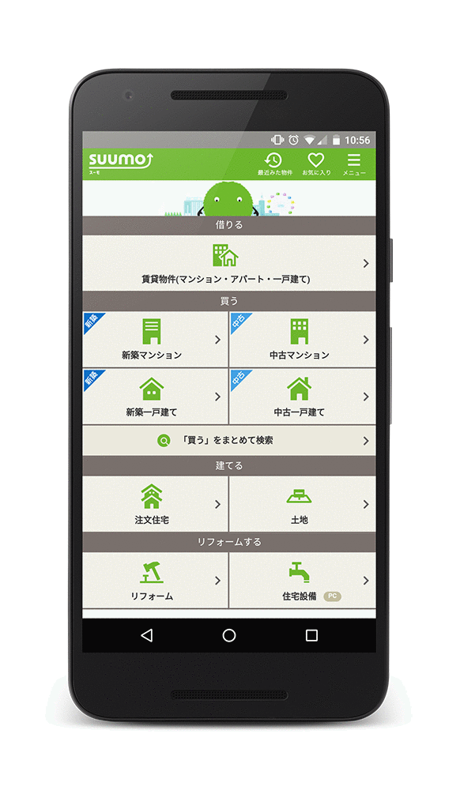

project_path: /web/_project.yaml
book_path: /web/showcase/_book.yaml

{# wf_published_on: 2016-05-17T17:00:00.000Z #}
{# wf_updated_on: 2016-05-17T17:00:00.000Z #}
{# wf_featured_image: /web/showcase/2016/images/suumo/featured.png #}
{# wf_featured_snippet: "We finally have a way to retain users on the mobile web. This has been a game changer for us!" <b>Dai Shibayama</b>, manager, Smart Device Division, Recruit Sumai Company Ltd. #}
{# wf_tags: progressive-web-apps,serviceworker,casestudy #}
{# wf_region: asia #}
{# wf_featured_date: 2017-04-16 #}
{# wf_vertical: real-estate #}

# Suumo {: .page-title }

### TL;DR {: .hide-from-toc }

Japan's top real estate site supercharges new listings with web Push
Notifications and sees a 31% open rate for notifications.

### Results

 75% decrease in load time

 31% open rate from web Push Notifications

<a class="button button-primary" href="pdfs/suumo.pdf">
  Download PDF Case study
</a>

## About Suumo

SUUMO is Japan’s top real estate site, serving nearly 11% of the country’s 
population. Fourteen million unique users, many on smartphones, search for
new homes on SUUMO every month.

## Challenge

More and more users rely on search engines to stay on top of the
ever-increasing number of housing listings online. This means SUUMO saw a lot
of traffic coming into their mobile website. The company found it difficult,
however, to build an engaging experience on the web that was as fast as their
mobile app. The resulting high bounce and low retention rates prompted the
company to encourage users to download their native app. Actually getting
people to download and re-engage with the app, though, was challenging and
costly. 

## Solution

SUUMO looked to Progressive Web App technologies, including offline support
and web Push Notifications, to provide a fast, app-like user experience and
re-engage their mobile web users. The company added service workers and
streamlined the landing page to help consumers quickly find properties they
were looking for. The new strategy worked, decreasing the load time on the
landing page by 75%.

The real estate site also implemented Push Notifications for mobile web
users on Android, to alert them instantly to new property listings. They
understood the value of Push Notifications, thanks to their native app
experience. The new strategy delivered a 31% open rate. 

“We finally have a way to retain users on the mobile web,” says Dai
Shibayama, manager of the Smart Device Division, Recruit Sumai Company Ltd.,
which operates the SUUMO portal site. “This has been a game changer for us!” 
