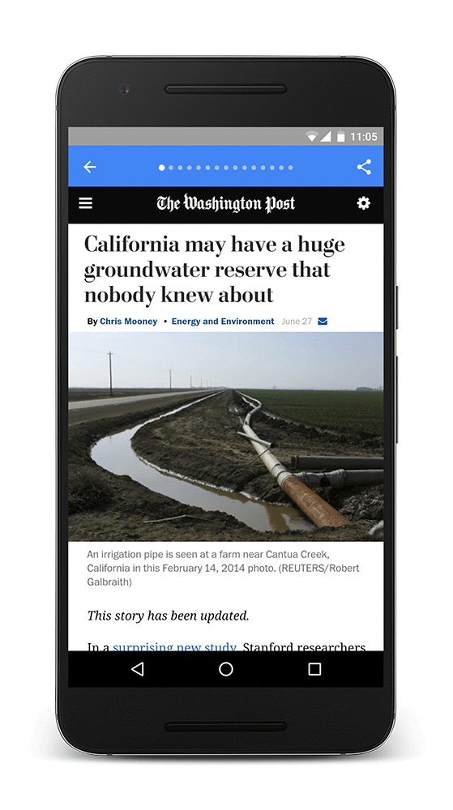

project_path: /web/_project.yaml
book_path: /web/showcase/_book.yaml

{# wf_published_on: 2016-07-20T18:00:00.000Z #}
{# wf_updated_on: 2016-07-20T18:00:00.000Z #}
{# wf_featured_image: /web/showcase/2016/images/wapo/wapo-featured.gif #}
{# wf_featured_snippet: AMP helps the Washington Post increase returning users from mobile search by 23%!   "We are committed to improving speed across the board. If our site takes a long time to load, it doesn’t matter how great our journalism is, some people will leave the page before they see what’s there" <b>David Merrell</b>, Senior Product Manager, The Washington Post #}
{# wf_tags: progressive-web-apps,serviceworker,casestudy #}
{# wf_region: north-america #}
{# wf_featured_date: 2017-04-17 #}
{# wf_vertical: media #}

# The Washington Post {: .page-title }

### TL;DR {: .hide-from-toc }

AMP helps the Washington Post increase returning users from mobile search by 23%

### Results

 23% increase in mobile search users who
return within 7 days

 88% improvement in load time for AMP content
versus traditional mobile web

 1000+ articles The Washington Post publishes
in AMP HTML daily

<a class="button button-primary" href="pdfs/wapo.pdf">
  Download PDF Case study
</a>

## Using AMP

With nearly 55% of their traffic coming from mobile devices, The Washington
Post knows that providing a great reading experience on mobile devices is
critical to their long-term success.

In particular, The Post is focused on making their mobile content load as quickly
as possible, because data shows that people abandon websites after just three
seconds if the content doesn’t load quickly.

In June 2015, The Washington Post joined a group of publishers and technology
companies to create the <a href="https://www.ampproject.org/">Accelerated Mobile
Pages Project</a>, a new open standard for publishing content which loads
instantly, anywhere across the mobile web.

> “We are committed to improving speed across the board,” said David Merrell,
Senior Product Manager at The Washington Post. “If our site takes a long time
to load, it doesn’t matter how great our journalism is, some people will leave
the page before they see what’s there.”

The Post publishes over 1,000 articles in AMP every day, and they’re already
seeing concrete benefits. “We have seen load times average 400 milliseconds,
an 88% improvement over our traditional mobile website. This has made
readers more likely to tap on Washington Post stories because they know
our articles will load consistently fast.”

AMP has been great for retention as well. Traditionally 51% of mobile search
users return to The Washington Post within 7 days. For users who read stories
published in AMP, this number jumps to 63%.

> “Getting started with AMP was easy because it is built on existing web
technologies. And since AMP is not a template based system, we were able
to host our content, style it as we see fit, and easily integrate our existing
advertising, analytics and other business tools,” Merrell said.
