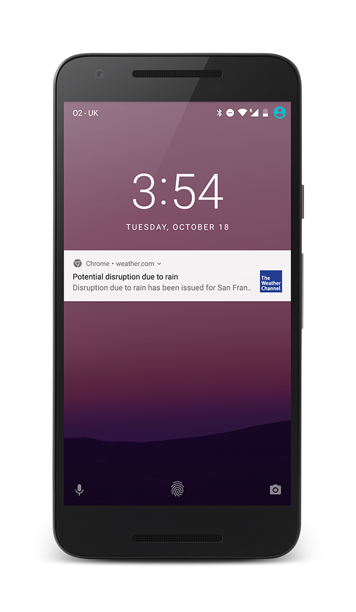

project_path: /web/_project.yaml
book_path: /web/showcase/_book.yaml

{# wf_published_on: 2016-11-09 #}
{# wf_updated_on: 2017-02-15 #}
{# wf_featured_image: /web/showcase/2016/images/weather-channel/card.png #}
{# wf_featured_snippet: The Weather Company, an IBM Business, serves an average of 40 billion forecast requests every day, helping people plan their daily lives and make better decisions based on weather. #}
{# wf_tags: progressive-web-apps,webpush,notifications,serviceworker,casestudy #}
{# wf_vertical: media #}

# The Weather Channel {: .page-title }

### TL;DR {: .hide-from-toc }

**The Weather Channel sees mobile web success with Progressive Web App,
launching in 62 languages to 178 countries.**

### Results

 Progressive web app now available in 62
languages and 178 countries

 80% improvement in load time

 Based on this successful global test, the
team will expand the PWA to its U.S. site in 2017

<a class="button button-primary" href="pdfs/weather-channel.pdf">
  Download PDF Case study
</a>

## About The Weather Channel

The Weather Channel has been forecasting since the 1980s and now serves people
all around the world across many platforms. Its weather.com website sees traffic
from every country and is a top-20 site in the United States. And its parent,
The Weather Company, an IBM Business, serves an average of 40 billion forecast
requests every day, helping people plan their daily lives and make better
decisions based on weather.

## Challenge

The Weather Channel has always leveraged the latest technology innovations to
help do its job in being the number one destination for weather reporting. The
team’s goal is to supply timely, accurate information when it matters most.
Weather is volatile, and delivering important data when people need it isn’t
always easy, so the team was interested in improving its mobile web experience.

On mobile, The Weather Channel has pushed vital information to their native-app
users for some time. But this represents only half of their mobile traffic, with
the other fifty percent accessing their site via the mobile web. The mobile web
is also an extremely important discovery portal in markets where users don’t
have the latest smartphones, reliable connectivity, or there’s significant cost
for downloading an app.

Weather looked to progressive web app technologies for a solution, approaching
it in steps. Being a site that focuses on immediacy, especially related to real-
time weather notifications in severe situations, the first area the team tackled
was to create browser push notifications when severe weather hits. They also
wanted to re-engage mobile users who hadn’t downloaded their app but were likely
to be affected by severe weather.

## Solution

To scale quickly, The Weather Channel implemented push notifications for mobile
web users on Android and desktop users on Chrome. The experience looks and feels
like a native app, and works even if the browser isn't running. The team used a
technology called service workers to provide offline processing and deliver
messages quickly. Within three months, The Weather Channel had seen almost 1
million users opt in to receive web push notifications, with 52 percent coming
from mobile.

After success with testing push, they continued along the full journey to build
a Progressive Web App (PWA). Given the complexity of its U.S. site, Weather
turned to its international sites first and have now rolled out progressive web
apps in 178 countries, serving 62 languages. After upgrading their site to a
PWA, they saw a 80% improvement in load time.
 
The Weather Channel has a global audience, so being able to provide a PWA
experience with the most reliable weather information to people across the world
in their local language has been key in growing that user base. On a technical
level they made this efficient by enabling support for over 60 languages using
one code base.

“A web experience, especially weather forecasts and notifications, must be
timely and relevant to be useful, and we deliver the most relevant information
when needed most,” says Wendy Frazier, vice president of web development at
The Weather Company, which runs weather.com. “We provide a helpful service
with accurate science and crucial information. And we use the most innovative
technology to help people know what kind of weather is heading their way, no
matter what platform they’re on.”

“For the first time, we can reach people anywhere, which extends our mission
to keep people safe and informed,” she adds. “It’s amazing to be able to do
that globally, but with local presence and in language to make it relevant.
We have the most accurate forecasts and the best data, and progressive
technologies give us the ability to provide weather info to users in their
preferred experience.”
