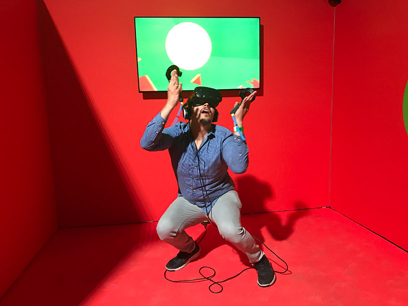
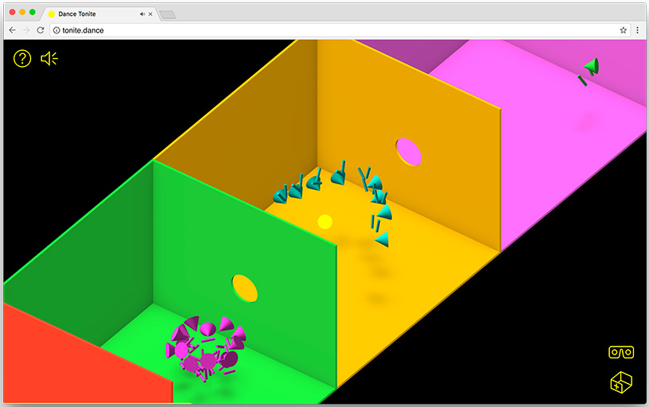
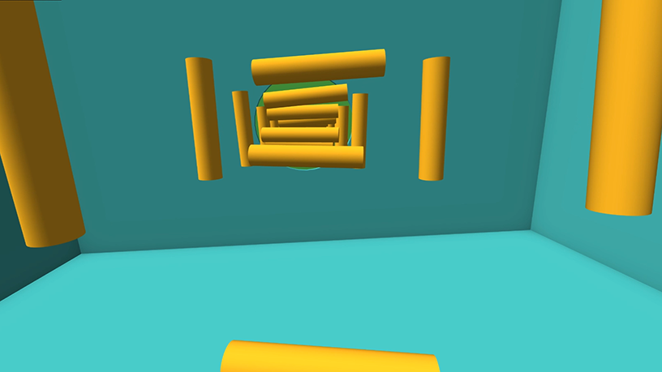
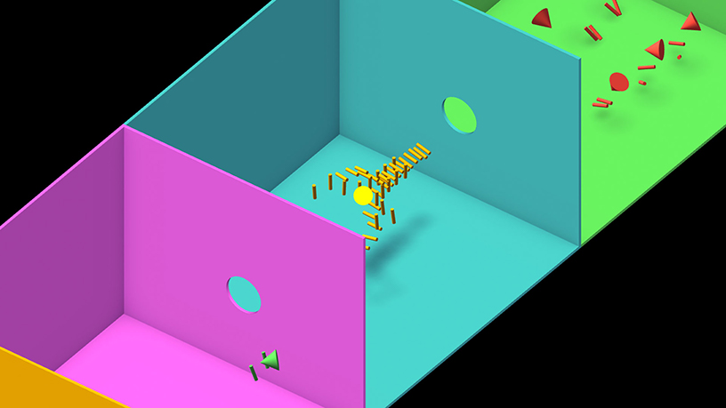
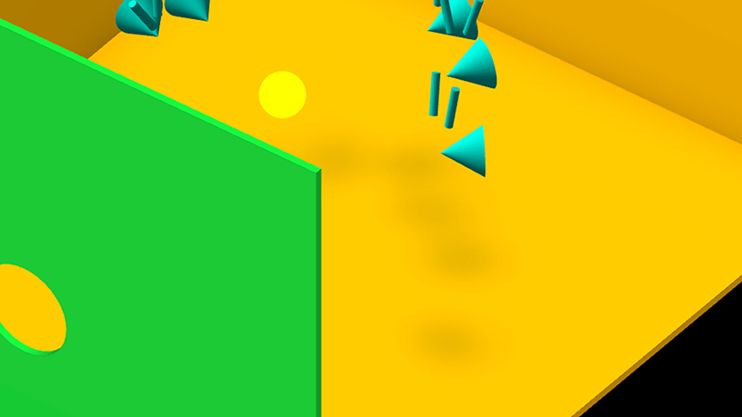
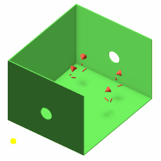
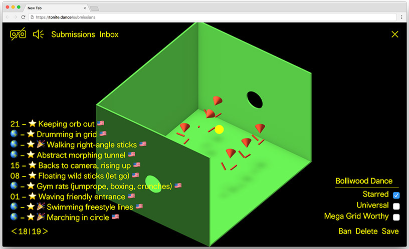

project_path: /web/_project.yaml
book_path: /web/showcase/_book.yaml

{# wf_published_on: 2017-08-22T10:00:00.000Z #}
{# wf_updated_on: 2017-08-22T10:00:00.000Z #}
{# wf_featured_image: /web/showcase/2017/images/dance-tonite/featured.jpg #}
{# wf_featured_snippet: Dance Tonite is an ever-changing VR collaboration with the band LCD Soundsystem and their fans. Built in WebVR, the project works across platforms–with and without VR–giving users a different role into the experience depending on their device. Project creators Jonathan Puckey, Moniker and Google’s Data Arts Team’s creative decisions and advanced optimization techniques enabled high-quality performance–close to 60FPS for 3DoF and 90FPS for 6DoF–and a compelling user experience across all platforms using a single codebase. #}
{# wf_tags: casestudy,webvr,serviceworker #}
{# wf_blink_components: Blink>WebVR #}
{# wf_vertical: media #}
{# wf_featured_date: 2017-08-22 #}

# Dance Tonite in WebVR {: .page-title }

<section class="wf-byline-meta">
  

    <strong>By</strong>
    
      Jonathan
      Puckey
    
  

  

      Artist and Dance Tonite creator
  

</section>

<video autoplay loop muted class="attempt-right">
  <source src="images/dance-tonite/img1.webm" type="video/webm">
  <source src="images/dance-tonite/img1.mp4" type="video/mp4">
</video>

I was excited when the Google Data Arts team approached Moniker and myself about
working together to explore the possibilities introduced by WebVR. I have
watched the work coming from their team over the years and their projects have
always struck a chord with me. Our collaboration resulted in
[Dance Tonite](https://tonite.dance), an ever-changing VR dance experience
with [LCD Soundsystem](https://lcdsoundsystem.com/) and their fans. Here is
how we did it.

## The concept {: #concept }

We began with developing a series of prototypes using WebVR, an open standard
that makes it possible to enter VR by visiting a website using your browser. The
goal is to make it easier for everyone to get into VR experiences, no matter
what device you have.

We took this to heart. Whatever we came up with should work on all types of VR,
from the  VR headsets that work with mobile phones such as Google’s Daydream
View, Cardboard and Samsung’s Gear VR to room-scale systems such as the HTC VIVE
and Oculus Rift which reflect your physical movements in your virtual
environment. Perhaps most importantly, we felt it would be in the spirit of the
web to make something that also works for everyone who does not own a VR device.

### 1. DIY motion capture {: #dyi }

Because we wanted to involve users creatively, we started looking into the
possibilities for participation and self expression using VR. We were impressed
by how finely you could move and look around in VR, and how much fidelity there
was. This gave us an idea. Instead of having users look at or create something,
how about recording their movements?

We cooked up a prototype where we recorded the positions of our VR goggles and
controllers while dancing. We replaced the recorded positions with abstract
shapes and marveled at the results. The results were so human and contained so
much personality! We quickly realized that we could use WebVR to do cheap motion
capture at home.

With WebVR, the developer has access to the user’s head position and orientation
via the [VRPose](https://developer.mozilla.org/en-US/docs/Web/API/VRPose)
object. This value is updated every frame by the VR hardware so that your code
can render new frames from the correct point of view. Through the [GamePad API
with WebVR](https://developer.mozilla.org/en-US/docs/Web/API/WebVR_API/Using_VR_controllers_with_WebVR), we also can access the position/orientation of the users
controllers via the
[GamepadPose](https://developer.mozilla.org/en-US/docs/Web/API/GamepadPose)
object. We simply store all these position and orientation values every frame,
thus creating a “recording” of the user’s movements.

### 2. Minimalism & costumes {: #minimalism-costumes }

With today’s room scale VR equipment, we can track three points of the user’s
body: their head and two hands. In Dance Tonite, we wanted to keep the focus on
the humanity in the movement of these 3 points in space. To achieve this, we
pushed the aesthetic as minimal as we possibly could in order to focus on the
movement. We liked the idea of putting people’s brains to work.

  <iframe class="devsite-embedded-youtube-video" data-video-id="1F5ICP9SYLU"
          data-autohide="1" data-showinfo="0" frameborder="0" allowfullscreen>
  </iframe>

This video demonstrating the work of the Swedish Psychologist Gunnar Johansson
was one of the examples we referred to when considering stripping things down as
much as possible. It shows how floating white dots are instantly recognizable as
bodies when seen in motion.

Visually, we were inspired by the colored rooms and geometric costumes in this
recording of Margarete Hastings’s 1970 restaging of Oskar Schlemmer’s Triadic
Ballet.

  <iframe class="devsite-embedded-youtube-video" data-video-id="rlIiT80dqHE"
          data-autohide="1" data-showinfo="0" frameborder="0" allowfullscreen>
  </iframe>

Whereas Schlemmer’s reason for choosing abstract geometric costumes was to limit
the movements of his dancers to that of puppets & marionettes, we had the
opposite goal for Dance Tonite.

We ended up basing our choice of shapes on how much information they conveyed by
rotation. An orb looks the same no matter how it is rotated, but a cone really
points in the direction that it is looking and looks different from the front
than the back.

### 3. Loop pedal for movement {: #loop }

We wanted to show large groups of recorded people dancing and moving with each
other. To do so live wouldn’t be feasible, since VR devices aren’t out in large
enough numbers. But we still wanted to have groups of people reacting to each
other through movement. Our minds went to Norman McClaren’s recursive
performance in his 1964 video piece “Canon.”

  <iframe class="devsite-embedded-youtube-video" data-video-id="2VrnXw9waJI?t=4m15s"
          data-autohide="1" data-showinfo="0" frameborder="0" allowfullscreen>
  </iframe>

McClaren’s performance features a series of highly choreographed movements that
start to interact with one another after every loop. Much like a loop pedal in
music, where musicians jam with themselves by layering different pieces of live
music, we were interested in seeing if we could create an environment where
users could improvise looser versions of performances freely.

### 4. Interconnected rooms {: #interconnected-rooms }

Like a lot of music, the tracks of LCD Soundsystem are built up using precisely
timed measures. Their track, Tonite, which is featured in our project, features
measures that are exactly 8 seconds long. We wanted to have users make a
performance for each 8-second loop in the track. Even though the rhythm of these
measures does not change, their musical content does. As the song progresses,
there are moments with different instruments and vocals to which the performers
can react in different ways. Each of these measures are expressed as a room, in
which people can make a performance that fits to it.

## Optimizations for performance: don't drop frames {: #optimizations }

Creating a multi-platform VR experience that runs on a single codebase with
optimal performance for each device or platform is not a simple feat.

When in VR, one the most nauseating things you can experience is caused by the
frame rate doesn’t keep up with your movement. If you turn your head but the
visuals your eyes see don’t match the motion your inner ear feels, it causes
instant stomach churn. For this reason, we needed to avoid any large frame rate
delay. Here are some optimizations we implemented.

### 1. Instanced buffer geometry {: #buffered-geometry }

Since our entire project uses only a handful of 3d objects, we were able to get
a huge performance boost by using Instanced Buffer Geometry. Basically, it
allows you to upload your object to the GPU once and draw as many “instances” of
that object as you like in a single draw call. In Dance Tonite, we only have 3
different objects (a cone, a cylinder, and room with a hole), but potentially
hundreds of copies of those objects. Instance Buffer Geometry is [a part of
ThreeJS](https://threejs.org/examples/?q=inst#webgl_buffergeometry_instancing),
but we used [Dusan Bosnjak’s experimental and in-progress
fork](https://github.com/pailhead/three-instanced-mesh) that implements
`THREE.InstanceMesh`, which makes working with Instanced Buffer Geometry much
easier.

### 2. Avoiding the garbage collector {: #avoid-gc }

As with many other scripting languages, JavaScript automatically frees memory by
finding out which objects that were allocated are not used anymore. This process
is called garbage collection.

Developers have no control over when this happens. The garbage collector could
show up at our doors at any moment and start emptying the garbage, resulting in
dropped frames as they take their sweet time.

The solution for this is to produce as little garbage as we can by recycling our
objects. Instead of creating a new vector object for every calculation, we
marked scratch objects for reuse. Because we hold on to them by moving our
reference to them outside of our scope, they weren’t marked for removal.

For instance, here’s our code to convert the location matrix of the user’s head
and hands into the array of position/rotation values we store each frame. By
reusing `SERIALIZE_POSITION`, `SERIALIZE_ROTATION`, and `SERIALIZE_SCALE`, we
avoid the memory allocation and garbage collection that would take place if we
created new objects each time the function is called.

    const SERIALIZE_POSITION = new THREE.Vector3();
    const SERIALIZE_ROTATION = new THREE.Quaternion();
    const SERIALIZE_SCALE = new THREE.Vector3();
    export const serializeMatrix = (matrix) => {
      matrix.decompose(SERIALIZE_POSITION, SERIALIZE_ROTATION, SERIALIZE_SCALE);
      return SERIALIZE_POSITION.toArray()
        .concat(SERIALIZE_ROTATION.toArray())
        .map(compressNumber);
    };

### 3. Serializing motion & progressive playback {: #serialize }

In order to capture the movements of users in VR, we needed to serialize the
position and rotation of their headset and controllers and upload this data to
our servers. We started out capturing the full transformation matrices for every
frame. This performed well, but with 16 numbers multiplied by 3 positions each
at 90 frames per second, it led to very large files and therefore long waits
while uploading and downloading the data. By extracting just the positional and
rotational data from the transformation matrices we were able to bring down
these values from 16 to 7. (see the code above in
[Avoid the Garbage Collector](#avoid-gc))

Since visitors on the web often click on a link without knowing exactly what to
expect, we need to show visual content quickly or they will leave within
seconds.

For this reason, we wanted to make sure our project could start playing as soon
as possible. Initially, we were using JSON as a format to load our movement
data. The problem is that we have to load the complete JSON file before we are
able to parse it. Not very progressive.

In order to keep a project like Dance Tonite displaying at the highest possible
frame rate, the browser only has a small amount of time each frame for
JavaScript calculations. If you take too long, the animations start to stutter.
At first, we were experiencing stutters as these huge JSON files were decoded by
the browser.

We came across a convenient streaming data format based called
[**NDJSON**](http://specs.okfnlabs.org/ndjson/) or Newline delimited JSON. The
trick here is to make a file with a series of valid JSON strings, each on their
own line. This allows you to parse the file while it is loading, allowing us to
display performances before they are fully loaded.

Here is what a section of
[one of our recordings](https://storage.googleapis.com/you-move-me.appspot.com/recordings/ceB8CA/15FPS.json)
looks like:

<pre>
{"fps":15,"count":1,"loopIndex":"1","hideHead":false}
[-464,17111,-6568,-235,-315,-44,9992,-3509,7823,-7074, ... ]
[-583,17146,-6574,-215,-361,-38,9991,-3743,7821,-7092, ... ]
[-693,17158,-6580,-117,-341,64,9993,-3977,7874,-7171, ... ]
[-772,17134,-6591,-93,-273,205,9994,-4125,7889,-7319, ... ]
[-814,17135,-6620,-123,-248,408,9988,-4196,7882,-7376, ... ]
[-840,17125,-6644,-173,-227,530,9982,-4174,7815,-7356, ... ]
[-868,17120,-6670,-148,-183,564,9981,-4069,7732,-7366, ... ]
...
</pre>

Using NDJSON let us keep the data representation of the individual frames of the
performances as strings. We could wait until we reached the necessary time,
before decoding them into positional data, thus spreading out the processing
needed over time.

### 4. Interpolating movement {: #interpolating-movement }

Because we were hoping to display between 30 to 60 performances running at the
same time, we needed to bring our data rate down even further than we already
had. The Data Arts Team tackled the same problem in their [Virtual Art
Sessions](https://virtualart.chromeexperiments.com/) project, where they play
back recordings of artists painting in VR using Tilt Brush. They solved it by
making intermediate versions of the user data with lower frame rates and
interpolating between the frames while playing them back. We were surprised to
find that we could hardly spot the difference between an interpolated recording
running at 15 FPS versus the original 90 FPS recording.

To see for yourself, you can force Dance Tonite to play back the data at various
rates using the `?dataRate=` query string. You can use this to compare the
recorded motion at [90 frames a second](https://tonite.dance/?dataRate=90), [45
frames a second](https://tonite.dance/?dataRate=45), or [15 frames a
second](https://tonite.dance/?dataRate=15).

For position, we do a linear interpolation between the previous keyframe and the
next, based on how close we are in time between the keyframes (ratio):

    const { x: x1, y: y1, z: z1 } = getPosition(previous, performanceIndex, limbIndex);
    const { x: x2, y: y2, z: z2 } = getPosition(next, performanceIndex, limbIndex);
    interpolatedPosition = new THREE.Vector3();
    interpolatedPosition.set(
        x1 + (x2 - x1) * ratio,
        y1 + (y2 - y1) * ratio,
        z1 + (z2 - z1) * ratio
      );

For orientation, we do a spherical linear interpolation (slerp) between
keyframes. Orientation is stored as
[Quaternions](https://en.wikipedia.org/wiki/Quaternion). 

    const quaternion = getQuaternion(previous, performanceIndex, limbIndex);
    quaternion.slerp(
       getQuaternion(next, performanceIndex, limbIndex),
       ratio
     );

### 5. Syncing movements to music {: #syncing }

In order to know which frame of the recorded animations to playback, we need to
know the current time of the music down to the millisecond. It turns out that
although the [HTML Audio
element](https://developer.mozilla.org/en/docs/Web/HTML/Element/audio) is
perfect for progressively loading and playing back sound, the time property it
provides does not change in sync with the frame loop of the browser. It is
always a bit off. Sometimes a fraction of a ms too early, sometimes a fraction
too late.

This leads to stutters in our beautiful dance recordings, which we want to avoid
at all costs. To remedy this, we implemented our 
[own timer in JavaScript](https://github.com/puckey/dance-tonite/blob/master/src/audio.js#L89).
This way we can be certain that the amount of time changing between frames is
exactly the amount of time that has passed since the last frame. Whenever our
timer goes more than 10 ms out of sync with the music, we synchronize it back
again.

### 6. Culling and fog {: #culling-and-fog }

Every story needs a good ending and we wanted to do something surprising for the
users that made it to the end of our experience. As you leave the last room, you
enter what feels like a quiet landscape of cones and cylinders. “Is this the
end?”, you wonder. As you move further into the field, suddenly the tones of the
music cause different groups of cones and cylinders to form into dancers. You
find yourself in the middle of a huge party! Then as the music stops abruptly,
everything falls to the ground.

While this felt great as a viewer, it introduced some performance hurdles to
solve. Room scale VR devices and their high end gaming rigs performed perfectly
with the 40 odd extra performances needed for our new ending. But frame rates on
certain mobile devices were halved.

To counteract this, we introduced fog. After a certain distance everything
slowly becomes black. Since we don’t need to calculate or draw that which is not
visible, we cull performances in rooms that aren’t visible and this allows us to
save work for both the CPU & GPU. But how to decide on the right distance?

Some devices can handle anything you throw at them and others are more
constricted. We chose to implement a sliding scale. By continually measuring the
amount of frames per second, we can adjust the distance of our fog accordingly.
As long as our frame rate is running smoothly, we try taking on more render work
by pushing out the fog. If the framerate isn’t running smooth enough, we bring
the fog closer allowing us to skip rendering performances in the darkness.

    // this is called every frame
    // the FPS calculation is based on stats.js by @mrdoob
    tick: (interval = 3000) => {
      frames++;
      const time = (performance || Date).now();
      if (prevTime == null) prevTime = time;
      if (time > prevTime + interval) {
        fps = Math.round((frames * 1000) / (time - prevTime));
        frames = 0;
        prevTime = time;
        const lastCullDistance = settings.cullDistance;

        // if the fps is lower than 52 reduce the cull distance
        if (fps <= 52) {
          settings.cullDistance = Math.max(
            settings.minCullDistance,
            settings.cullDistance - settings.roomDepth
          );
        } 
        // if the FPS is higher than 56, increase the cull distance
        else if (fps > 56) {
          settings.cullDistance = Math.min(
            settings.maxCullDistance,
            settings.cullDistance + settings.roomDepth
          );
        }
      }

      // gradually increase the cull distance to the new setting
      cullDistance = cullDistance * 0.95 + settings.cullDistance * 0.05;
     
      // mask the edge of the cull distance with fog
      viewer.fog.near = cullDistance - settings.roomDepth;
      viewer.fog.far = cullDistance;
    }

## Something for everyone: building VR for the web {: #everyone }

Designing and developing multi-platform, asymmetric experiences means accounting
for each user’s needs depending on their device. And with every design decision,
we needed to see how that might impact other users. How do you ensure that what
you see in VR is equally as exciting as without VR, and visa versa?

### 1. The yellow orb {: #yellow-orb }

So our room-scale VR users would be making the performances, but how would the
users of mobile VR devices (such as Cardboard, Daydream View or Samsung Gear)
experience the project? For this, we introduced a new element to our
environment: the yellow orb.

When you watch the project in VR, you are doing so from the point of view of the
yellow orb. As you float from room to room, the dancers react to your presence.
They gesture to you, dance around you, make funny motions behind your back and
move quickly out of your way so they don’t bump into you. The yellow orb is
always the center of attention.

The reason for this is that while recording a performance, the yellow orb moves
through the center of the room in sync with the music and loops back around. The
position of the orb gives the performer an idea where they are in time and how
much time they have left in their loop. It provides a natural focus for them to
build a performance around.

### 2. Another point of view {: #another-pov }

  <iframe class="devsite-embedded-youtube-video" data-video-id="ul2vX8-dmTA"
          data-autohide="1" data-showinfo="0" frameborder="0" allowfullscreen>
  </iframe>

We didn’t want to leave out users without VR, especially as they would likely be
our biggest audience. Instead of making a faux VR experience, we wanted to give
screen-based devices their very own experience. We had the idea of showing the
performances from above from an isometric perspective. This perspective has a
rich history in computer games. It was first used in Zaxxon, a space shooter
game from 1982. Whereas VR users are in the thick of it, the isometric
perspective gives a god-like view on the action. We chose to scale up the models
slightly, giving a touch of doll-house aesthetic.

### 3. Shadows: fake it 'till you make it {: #shadows }

We found that some our users were having a hard time seeing depth in our
isometric point of view. I am quite sure it is for this reason that Zaxxon was
also one of the first computer games in history to project a dynamic shadow
under its flying objects.

It turns out that making shadows in 3D is hard. Especially for constricted
devices like mobile phones. Initially we had to make the difficult decision to
cut them out of the equation, but after asking the author of Three.js and
experienced demo hacker [Mr doob](http://github.com/mrdoob) for advice, he came
up with the novel idea of... faking them.

Instead of having to calculate how each of our floating objects is obscuring our
lights and therefore throwing shadows of different shapes, we draw the same
circular blurred texture image under each of them. Since our visuals are not
trying to mimic reality in the first place, we found we could get away with it
quite easily with just a few tweaks. When the objects come closer to the ground,
we have the textures become darker and smaller. When they move up, we make the
textures more transparent and larger.

To create them, we used 
[this texture](https://github.com/puckey/dance-tonite/blob/master/src/props/shadow.png)
with a soft white to black gradient (with no alpha transparency). We set the
material as transparent and use subtractive blending. This helps them blend
nicely when they overlap:

    function createShadow() {
        const texture = new THREE.TextureLoader().load(shadowTextureUrl);
        const material = new THREE.MeshLambertMaterial({
          map: texture,
          transparent: true,
          side: THREE.BackSide,
          depthWrite: false,
          blending: THREE.SubtractiveBlending,
        });
        const geometry = new THREE.PlaneBufferGeometry(0.5, 0.5, 1, 1);
        const plane = new THREE.Mesh(geometry, material);
        return plane;
      }

### 4. Being there {: #being-there }

<video autoplay loop muted class="attempt-right">
  <source src="images/dance-tonite/img7.webm" type="video/webm">
  <source src="images/dance-tonite/img7.mp4" type="video/mp4">
</video>

By clicking on the heads of a performer, visitors without VR are able to watch
things from the dancer’s point of view. From this angle, lots of little details
become apparent. Trying to keep their performances in step, dancers quickly
glance at each other. As the orb enter the room, you see them nervously looking
in its direction. While as a viewer, you cannot influence these movements, it
does convey the feeling of immersion surprisingly well. Again, we preferred
doing this over presenting our users with a bland mouse-controlled faux VR
version.

### 5. Sharing recordings {: #sharing }

We know how proud you can be when pulling off an intricately choreographed
recording of 20 layers of performers reacting to each other. We knew our users
would probably want to show it to their friends. But a still image of this feat
doesn’t communicate enough. Instead, we wanted to allow our users to share video
of their performances. Actually, why not a GIF? Our animations are flat shaded,
perfect for the format’s limited color palettes.

We turned to [GIF.js](https://jnordberg.github.io/gif.js/), a JavaScript library
that allows you to encode animated gifs from within the browser. It offloads the
encoding of frames to
[web workers](https://developer.mozilla.org/en-US/docs/Web/API/Web_Workers_API/Using_web_workers)
which are able to run in the background as separate processes, thus being able
to take advantage of multiple processors working side-by-side.

Sadly, with the amount of frames we needed for the animations, the encoding
process was still too slow. The GIF is able to make small files by using a
limited color palette. We found that most time was being spent finding the
closest color for each pixel. We were able to optimize this process tenfold by
hacking in a small short cut: if the color of the pixel is the same as the last
one, use the same color from the palette as before.

Now we had fast encodes, but the resulting GIF files were too large in size. The
GIF format allows you to indicate how each frame is to be displayed on top of
the last by defining its dispose method. To get smaller files, instead of
updating each pixel each frame, we only update the pixels that changed. While
slowing down the encoding process again, this did bring down our file sizes
nicely.

### 6. Solid ground: Google Cloud & Firebase {: #solid-ground }

The backend of a “user-generated content” site can often be complicated and
fragile, but we came up with a system that is simple and robust thanks to Google
Cloud and Firebase. When a performer uploads a new dance to the system, they are
authenticated anonymously by
[Firebase Authentication](https://firebase.google.com/docs/auth/). They are
given permission to upload their recording to a temporary space using
[Cloud Storage for Firebase](https://firebase.google.com/docs/storage/). When
the upload is completed, the client machine calls a
[Cloud Functions for Firebase](https://firebase.google.com/docs/functions/)
HTTP trigger using their Firebase token. This triggers a server process that
validates the submission, creates a database record, and moves the recording
to a public directory on Google Cloud Storage.

All of our public content is stored in a series of flat files in a Cloud Storage
Bucket. This means our data is quickly accessible around the world and we don’t
need to worry about high traffic loads affecting data availability in any way.

We used a
[Firebase Realtime Database](https://firebase.google.com/docs/database/) and
Cloud Function endpoints to build a simple moderation/curation tool that lets
us watch each new submission in VR and publish new playlists from any device.

### 7. Service Workers {: #service-workers }

[Service workers](/web/fundamentals/getting-started/primers/service-workers)
are a fairly recent innovation that help manage the caching of web site
assets. In our case, service workers load our content lightning fast for
return visitors and even allow the site to work offline. These are important
features since many of our visitors will be on mobile connections of varying
quality.

Adding a service workers to the project was easy thanks to a
[handy webpack plugin](https://github.com/goldhand/sw-precache-webpack-plugin)
that handles most of the heavy lifting for you. In the configuration below,
we generate a service worker that will automatically cache all our static
files. It will pull the latest playlist file from the network, if available,
since the playlist will be updating all the time. All the recording json
files should pull from the cache if available, because these will never change. 

    const SWPrecacheWebpackPlugin = require('sw-precache-webpack-plugin');
    config.plugins.push(
      new SWPrecacheWebpackPlugin({
        dontCacheBustUrlsMatching: /\.\w{8}\./,
        filename: 'service-worker.js',
        minify: true,
        navigateFallback: 'index.html',
        staticFileGlobsIgnorePatterns: [/\.map$/, /asset-manifest\.json$/],
        runtimeCaching: [{
          urlPattern: /playlist\.json$/,
          handler: 'networkFirst',
        }, {
          urlPattern: /\/recordings\//,
          handler: 'cacheFirst',
          options: {
            cache: {
              maxEntries: 120,
              name: 'recordings',
            },
          },
        }],
      })
    );

Currently, the plugin doesn’t handle progressively loaded media assets like our
music files, so we worked around that by setting the Cloud Storage 
`Cache-Control` header on these files to `public, max-age=31536000` so
that the browser will cache the file for up to one year.

## Conclusion {: #conclusion }

We’re excited to see how performers will add to this experience and use it as a
tool for creative expression using motion. We’ve released all the code open
source, which you can find at
[https://github.com/puckey/dance-tonite](https://github.com/puckey/dance-tonite).
In these early days of VR and especially WebVR, we look forward to seeing
what new creative and unexpected directions this new medium will take.
[Dance on](https://tonite.dance).

