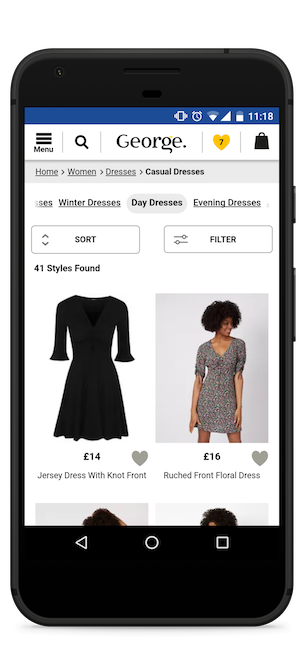

project_path: /web/_project.yaml
book_path: /web/showcase/_book.yaml

{# wf_published_on: 2018-02-23 #}
{# wf_updated_on: 2018-02-23 #}
{# wf_blink_components: N/A #}
{# wf_featured_image: /web/showcase/2018/images/asda-george/logo_.jpg #}
{# wf_featured_snippet: George.com is a leading UK clothing brand, part of ASDA Walmart. After upgrading their site to a Progressive Web App (PWA), the brand saw a 31 percent increase in mobile conversion. #}
{# wf_tags: casestudy,progressive-web-apps #}
{# wf_region: europe #}
{# wf_vertical: retail #}
{# wf_featured_date: 2018-02-22 #}
{# wf_blink_components: N/A #}

# George.com enhances the mobile customer experience with new Progressive Web App {: .page-title }

[George.com](http://www.george.com) is a leading UK clothing brand, part of ASDA
Walmart. After upgrading their site to a Progressive Web App (PWA), the brand 
saw a 31 percent increase in mobile conversion.

* 3.8x - Faster average page load time
* 2x - Lower bounce rate
* 31% - Increase in Conversion Rate
* 20% - More page views per visit
* 28% - Longer average time on site for visits from Home screen

## Challenge

With consumer expectations around the mobile shopping experience at an all-time 
high, Asda George realised they needed to revamp an outdated mobile solution and 
thereby improve the offer for customers. The team embraced a mobile-first approach, 
placing focus on design, speed and functionality to drive mobile conversion.

## Solution

The George.com team recognised that to meet this challenge the business had to 
enhance the mobile experience by building a Progressive Web App. Working with 
Isobar UK to assess the end to end customer journey, the team adopted a scrum 
driven, agile approach to the workstream. By incrementally deploying the PWA, the 
Asda George team were able to realise the benefits immediately.

<figure class="attempt-left">
  
  <figcaption>Skeleton screen during page transition</figcaption>
</figure>
<figure class="attempt-right">
  
  <figcaption>Page fully rendered after page transition</figcaption>
</figure>

Site speed was the most crucial part of the initiative. Following PWA best 
practices, in accordance with Google, Asda George reduced page load time for 
shoppers by <strong>3.8x times</strong>. The business also saw a 31 percent 
increase in conversion and <strong>20 percent more page views</strong> per visit. 

By implementing site wide HTTPS, Asda George now offers a more secure end-to-end
 shopping experience for customers, enabling modern browser capabilities, like 
 Service Worker, and therefore allowing consumers to stay in touch with the brand 
 whilst offline. 

In addition, the brand implemented an “Add to Home Screen” prompt, which resulted
 in an increase in customer time on site by <strong>28 percent</strong>, truly 
 creating a native app like experience on the web.
