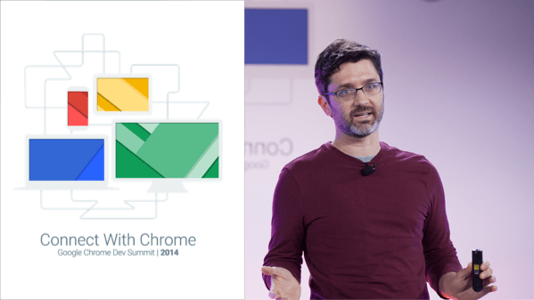

project_path: /web/_project.yaml
book_path: /web/shows/_book.yaml
description: Get started or build your web design and development skills with these free Udacity courses taught by your friends at Google.

{# wf_updated_on: 2016-08-24 #}
{# wf_published_on: 2016-08-24 #}

# Chrome Dev Summits {: .page-title }

## Chrome Dev Summit 2015

[View Playlist](2015/)

## Chrome Dev Summit 2014

[View Playlist](2014/)

## Chrome Dev Summit 2013

[View Playlist](2013/)

