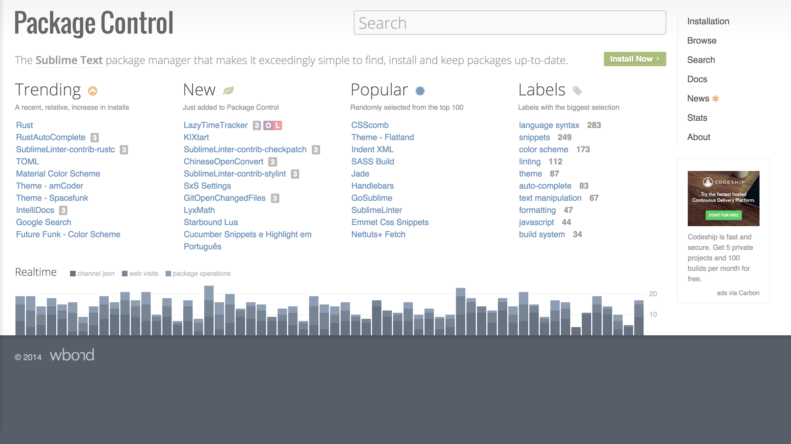

project_path: /web/_project.yaml
book_path: /web/shows/_book.yaml
description: The minute you start developing a site, the first tool you’ll use is a text editor, whether it’s as simple as notepad or a full-blown IDE. In this episode, Addy & Matt look at their collection of plugins for Sublime Text and discuss how each one helps with their workflow.

{# wf_updated_on: 2017-07-25 #}
{# wf_published_on: 2015-05-19 #}
{# wf_youtube_id: 2eu23_if6Lw #}

# Sublime Text Plugins {: .page-title }

  <iframe class="devsite-embedded-youtube-video" data-video-id="2eu23_if6Lw"
          data-autohide="1" data-showinfo="0" frameborder="0" allowfullscreen>
  </iframe>

The minute you start developing a site, the first tool you'll use
is a text editor, whether it's as simple as notepad or a full blown
IDE.

In this episode Addy & Matt look at their collection of plugins
for [Sublime Text](http://www.sublimetext.com/){: .external } and discuss how
each one helps with their workflow.

## Package Control

To get the packages (or plugins) referenced in the episode, you need to
install [Package Control](https://packagecontrol.io/){: .external }, it's nice and simple
to install and you can [find
instructions on how to do so here](https://packagecontrol.io/installation).

## JSHint

[JSHint](http://jshint.com/){: .external } is a JavaScript linter which examines your JavaScript
and highlights any possible errors or bad practices in your code.

For example, if you accidentally typed a variable name wrong, like
below, then JSHint will point out that `fo` was never defined and is
going to cause an error.

    var foo = { bar: 'Hello, World.' };
    var msg = fo.bar;

The [JSHint plugin](https://packagecontrol.io/packages/SublimeLinter-jshint)
points out issues the by displaying a yellow box around the relevant
text and placing your cursor in that bit of code will result in an error
message being shown in the bottom left of Sublime.

Other issues it'll catch are:

- Variables which are defined but never used
- Avoiding creating functions inside of loops
- Using the right comparison methods

To install the [SublimeLinter-JSHint Package](https://packagecontrol.io/packages/SublimeLinter-jshint)
you'll need to also install the [SublimeLinter](https://packagecontrol.io/packages/SublimeLinter) package and follow the installation
instructions on the [SublimeLinter-JSHint Package page](https://packagecontrol.io/packages/SublimeLinter-jshint).

Some developers may find it helpful to include the
[JSHint Gutter](https://packagecontrol.io/packages/JSHint%20Gutter)
plugin as well. It places a small dot in the
gutter of any line with a JSHint issue.

## JSCS

[JSCS](http://jscs.info/){: .external } will highlight any places where
your JavaScript isn't following a specific coding style.

For example, JSCS can be used to define whether spaces should
be used after keywords, like 'if', or defining whether curly braces
should be on the same line or new line of a method.

The [SublimeLinter-JSCS package](https://packagecontrol.io/packages/SublimeLinter-jscs)
highlights any issues inline in a similar style to JSHint
making it easy to correct any problems.

This is extremely helpful when it comes to working in a
team as everyone can follow the same styleguide and
keep your code consistent.

The best bit is, with the [JSCS-Formatter package](https://packagecontrol.io/packages/JSCS-Formatter) you can **automatically fix** any issues on the page
by pressing `ctrl + shift + p`, typing 'JSCS Formatter: Format this file'
and pressing enter. You [learn more in Addy's blog post](https://medium.com/dev-channel/auto-formatting-javascript-code-style-fe0f98a923b8).

## Color Highlighter

[Color highlighter](https://packagecontrol.io/packages/Color%20Highlighter)
will add a color to the background of
any color definitions in your CSS or Sass.

You can define whether it shows as an underline with a
full background when you hover over it or always
displays color on the definition background. Just go to
'Package Settings' > 'Color Highlighter' >
'Settings - Default' to see the initial settings
and alter your settings in 'Settings - User'.

For full background highlighting
add the following to the 'Settings - User' file:

    {
      "ha_style": "filled"
    }

## Gutter Color

[Gutter Color](https://packagecontrol.io/packages/Gutter%20Color)
is an alternative to color highlighter,
instead of showing the color on top of the color variable,
it puts the color in the gutter of that line.

## Color Picker

If you ever need a quick and easy way to select a color from your screen
then the [Color Picker Package](https://packagecontrol.io/packages/ColorPicker)
may be for you.

Press `ctrl + shift + c` and boom - you got yourself a color picker.

## AutoFileName

[AutoFileName](https://packagecontrol.io/packages/AutoFileName)
is a simple little plugin which gives
you a list of possible files as you type. This is super
handy if you're trying to type out an image name or
add a CSS or JS file as it saves you time
and more importantly reduces the risk of typos.

## Autoprefixer

We've all had that moment of realization where we've forgotten to
add a prefixed CSS property. With
[Autoprefixer](https://packagecontrol.io/packages/Autoprefixer)
you simple run it on your CSS and it'll
add all the prefixes you need.

It means we go from this..

    .container-thingy {
      display: flex;
      flex-direction: column;
      align-items: flex-start;
    }

..to the following, just by hitting `ctrl + shift + p` and typing
 'Autoprefix CSS' and hitting enter.

    .container-thingy {
      display: -webkit-flex;
      display: -ms-flexbox;
      display: flex;
      -webkit-flex-direction: column;
          -ms-flex-direction: column;
              flex-direction: column;
      -webkit-align-items: flex-start;
          -ms-flex-align: start;
              align-items: flex-start;
    }

You can also define what browsers and browser versions you would like
to support in the package settings. Checkout the [Package Control page
for more info](https://packagecontrol.io/packages/Autoprefixer).

## More...

There are a tonne of other plugins that exist for
Sublime Text, so be sure to explore [Package Control](https://packagecontrol.io/){: .external }.

For more advice and tips, you should
checkout WesBos's [great slide deck on
keyboard shortcuts and other plugins for Sublime Text](
http://wesbos.github.io/Sublime-Text-Power-User-Talk/).

[WesBos](http://wesbos.com/){: .external } has also written a book titled
['Sublime Text for the Power User'](https://sublimetextbook.com/){: .external }
which may be of interest to you wonderful people as well :)
