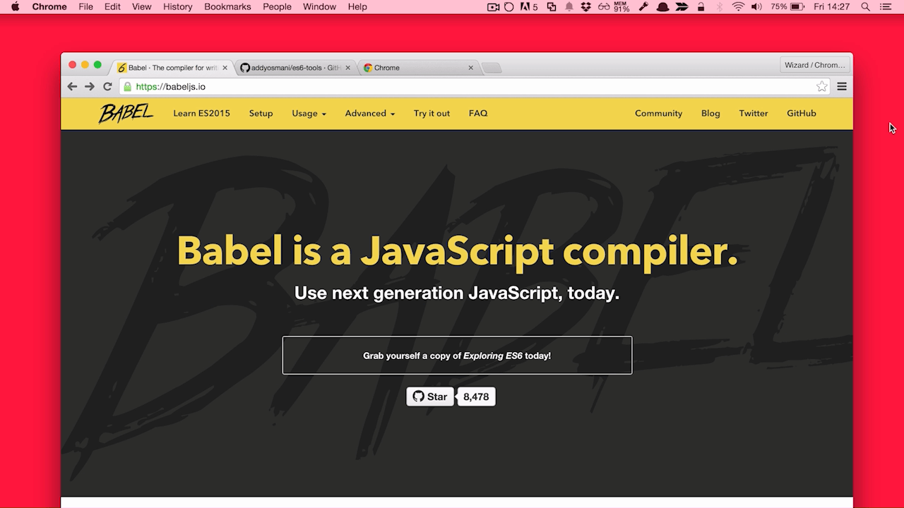
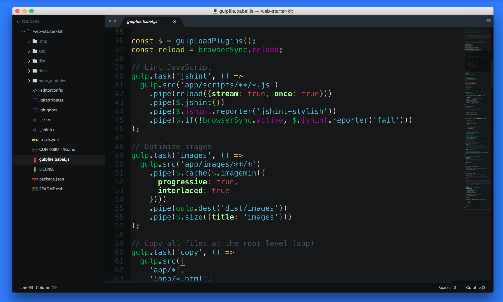

project_path: /web/_project.yaml
book_path: /web/shows/_book.yaml
description: ES2015 is a fantastic step forward for the JavaScript language. It brings new features and sugaring for patterns that required significant boilerplate in ES5.

{# wf_updated_on: 2017-07-25 #}
{# wf_published_on: 2015-09-28 #}
{# wf_youtube_id: he1SoCUIFW0 #}

# ES2015 {: .page-title }

  <iframe class="devsite-embedded-youtube-video" data-video-id="he1SoCUIFW0"
          data-autohide="1" data-showinfo="0" frameborder="0" allowfullscreen>
  </iframe>

[ES2015](http://www.ecma-international.org/ecma-262/6.0/) (formally ES6) is a
fantastic step forward for the JavaScript language. It brings new features and
sugaring for patterns that required significant boilerplate in ES5. This
includes classes, arrow functions and modules. In this episode, we cover tools
we use to take full advantage of ES2015 when building JavaScript web-apps.

## Transpilation with Babel

Although JavaScript engines are making great
[progress](https://kangax.github.io/compat-table/es6/) in implementing ES2015
features natively, there is one gotcha. To use the complete set of features
today, you will need to transpile your code back down to ES5 so it can be
interpreted by current browsers. Thankfully, tools like Babel exist that make
this process next to painless.

### Using Babel in Your Build Process

[Babel](https://babeljs.io/){: .external } allows you to take JavaScript written using ES2015
features and transpiles it back to ES5 so that it can work in browsers that
don't support these features today. Adding Babel to your build process can be
done like so.

    var gulp = require('gulp');
    var babel = require('gulp-babel');
    
    gulp.task('default', function () {
        return gulp.src('src/app.js')
            .pipe(babel())
            .pipe(gulp.dest('dist'));
    });
    

The one feature Babel can't transpile is Modules. Modules in ES6 allow you
create classes and export / import classes between files. To transpile modules
pass your JavaScript through
[Browserify](https://github.com/substack/node-browserify), which will merge the
files and then pass this through [Babelify](https://github.com/babel/babelify)
(a version of Babel which can handle the output from Browserify).

    var babelify = require('babelify');
    var source = require('vinyl-source-stream');
    var browserify = require('browserify');
    
    gulp.task('babelify', function() {
      browserify({ entries: './src.js', debug: true })
        .transform(babelify)
        .bundle()
        .pipe(source('bundle.js'))
        .pipe(gulp.dest('./dist/js/'));
    });
    

### Multiple JavaScript Files

The above example requires you to define a specific file, which may become a bit
of a burden, Matt does the following in Gulp to search and transpile files
ending with .es6.js.

    var config = {
      src: 'src/scripts',
      dest: 'dist/scripts'
    };
    var es6FileGlob = '/**/*.es6.js';
    
    var gulp = require('gulp');
    var plugins = require('gulp-load-plugins')();
    var glob = require('glob');
    var path = require('path');
    var browserify = require('browserify');
    var babelify = require('babelify');
    var source = require('vinyl-source-stream');
    
    // Takes an array of bundles to run through browserify and babelify
    function transpileES6Modules(browserifyFileEntries) {
      browserifyFileEntries.forEach(function(fileEntry) {
        var browserifyBundle = browserify({
            entries: [fileEntry.srcPath]
          })
          .transform(babelify);
    
        var finalStream = browserifyBundle.bundle()
          .on('log', plugins.util.log.bind(plugins.util, 'Browserify Log'))
          .on('error', plugins.util.log.bind(plugins.util, 'Browserify Error'))
          .pipe(source(fileEntry.outputFilename));
    
        return finalStream.pipe(gulp.dest(fileEntry.dest));
      });
    }
    
    // This takes a source path and finds all files ending
    // with .es6.js and creates the bundles to run through browserify
    // and babelify
    function handleES6Scripts(srcPath) {
      var browserifyFileEntries = [];
    
      var es6Filepaths = glob.sync(srcPath + es6FileGlob);
      es6Filepaths.forEach(function(filepath) {
        var filename = path.basename(filepath);
        var directoryOfFile = path.dirname(filepath);
        var relativeDirectory = path.relative(
          srcPath,
          directoryOfFile);
    
        // Create an object and add to the browserify bundle array
        browserifyFileEntries.push({
          srcPath: './' + filepath,
          outputFilename: filename,
          dest: path.join(config.dest, relativeDirectory)
        });
      });
    
      transpileES6Modules(browserifyFileEntries);
    }
    
    gulp.task('scripts:es6', ['scripts:lint'], function(cb) {
      handleES6Scripts(config.src);
    
      cb();
    });
    

## Linting and Style Checks

There are few options when linting your code for possible issues and style
compliance.

### JSHint and JSCS

[JSHint](http://jshint.com/){: .external } and [JSCS](http://jscs.info/) are the most common
tools used for today's JavaScript style-checking.

JSHint will highlight any possible issues in your code as well as call out any
patterns generally regarded as bad practice.

JSCS will look at the style of your code, this includes things like ensuring
just tabs or spaces are used and spaces are put in consistent places.

To use JSHint and JSCS on ES2015 code you need to add `"esnext": true` to your
`.jshintrc` and `.jscsrc` files

### ESLint

[ESLint](http://eslint.org/){: .external } is an alternative linter and style checker in one.
This tool is picking up a lot of steam and has some nice features over JSHint
such as being able to indicate environments your JavaScript is written for and
setting the error / warning level for specific problems.

ESLint is fully customisable and provides custom linting rules where you're in
the driver's seat of whether options can be switched off or toned down via its
configuration files. In addition, if you're using React, ESLint also works with
JSX.

Setting up ESLint in your build process isn't too hard either.

    var gulp = require('gulp'),
        eslint = require('gulp-eslint');
    
    gulp.task('lint', function () {
        return gulp.src(['js/**/*.js'])
            // eslint() attaches the lint output to the eslint property
            // of the file object so it can be used by other modules.
            .pipe(eslint())
            // eslint.format() outputs the lint results to the console.
            // Alternatively use eslint.formatEach() (see Docs).
            .pipe(eslint.format())
            // To have the process exit with an error code (1) on
            // lint error, return the stream and pipe to failOnError last.
            .pipe(eslint.failOnError());
    });
    
    gulp.task('default', ['lint'], function () {
        // This will only run if the lint task is successful...
    });
    

The Babel team maintain [babel-estlint](https://github.com/babel/babel-eslint),
a tool that lets you lint any valid Babel code using ESLint. While ESLint
supports custom parsers, some of the syntax supported by Babel isn't directly
supported by ESLint so it's another option if you require even further
flexibility. This can be setup by customizing the `parser` section of your
`.eslintrc` file:

    {  
      "parser": "babel-eslint",  
      "rules": {  
        "strict": 0  
      }  
    }
    

Dan Abramov has a great write-up on setting up ESLint and babel-eslint in [Lint
Like It's
2015](https://medium.com/@dan_abramov/lint-like-it-s-2015-6987d44c5b48). It also
covers how to integrate
[SublimeLinter-eslint](https://github.com/roadhump/SublimeLinter-eslint) into
your workflow for ES2015 linting support in Sublime Text.   

Which should you use? Try them out and stick with what works best for you.

## ES2015 Syntax Highlighting

You'll of course want your ES2015 code to be correctly syntax highlighted. We
enjoy using [babel-sublime](https://github.com/babel/babel-sublime), which can
be installed from [Package Control](https://packagecontrol.io/installation).
When setting up, we recommend making sure to set it as the default for any files
you need highlighting to work against. This will of course include JS but may
also cover JSX if using React.

## Documenting ES2015

We've historically relied on [JSDoc](http://usejsdoc.org/){: .external } quite heavily for documenting our JavaScript code. Unfortunately, it has [open issues](https://github.com/jsdoc3/jsdoc/milestones/3.4.0) for supporting ES2015 (due to be addressed in JSDoc 3), however there are a growing number of alternatives available while we wait for it to catch up. [ESDoc](https://esdoc.org/) is one such option and Jonathan Creamer has a recent [write-up](http://jonathancreamer.com/document-es6-with-esdoc/) on it worth reading.

## Authoring Gulp.js files with Babel

If you happen to be using Gulp for your build process, Gulpfiles can now be
authored using any syntax supported by Babel. We do this over in [Web Starter
Kit](https://github.com/google/web-starter-kit/blob/master/gulpfile.babel.js)
and it's relatively trivial to setup. Using a recent version of Gulp and the
Gulp CLI, simply rename your `gulpfile.js` to `gulpfile.babel.js` and Gulp will
interpret and transpile your ES2015 gulpfile using Babel automatically.

## Favorite ES2015 Features

### Modules

Modules are a way of exporting values, functions and classes from one file such
that you can import them into another file.

    export function exampleFunction() {
      console.log('I\'m an example. #TrueStory');
    }
    

    import { exampleFunction } from './example-function';
    import BaseController from './base-controller';
    
    export default class ExampleController extends BaseController {
      constructor() {
        super();
    
        exampleFunction();
      }
    
      doSomething() {
        console.log('What should I do? Change the DOM? Print a dancing shark to the console?');
      }
    }
    

[This site has some great examples and explanations of
Modules](http://www.2ality.com/2014/09/es6-modules-final.html).

### Template Strings

Template strings allow you to replace a port of a string with a variable.

    // Simple string substitution  
    var name = "Brendan";  
    console.log('Yo, ${name}!');
    
    // =&gt; "Yo, Brendan!"
    

The nice thing with template strings is that the substitution is a JavaScript
execution, meaning you can use functions or inline expressions.

    var a = 10;  
    var b = 10;  
    console.log('a+b = ${a+b}.');  
    //=&gt; a+b = 20.
    
    function fn() { return "I am a result. Rarr"; }  
    console.log('foo ${fn()} bar');  
    //=&gt; foo I am a result. Rarr bar.
    

You can learn more from [this handy blog post by
Addy](/web/updates/2015/01/ES6-Template-Strings).

### Shorthand Object Literals

Object literals allow you to avoid having to define the key and value when
creating an object, if the variable has the same name as the key you want the
object to have.

Meaning this:

    function createObject(name, data) {
      return { name: name, data: data };
    }
    

Becomes this:

    function createObject(name, data) {
      return { name, data };
    }
    

### Computed Property Names

This feature in ES2015 allows you to create property names dynamically on an
object. The [Mozilla docs is a great source of info and have this great
example](https://developer.mozilla.org/en-US/docs/Web/JavaScript/Reference/Operators/Object_initializer).

    var a = {  
      ["foo" + ++i]: i,  
      ["foo" + ++i]: i,  
      ["foo" + ++i]: i  
    };
    
    console.log(a.foo1); // 1  
    console.log(a.foo2); // 2  
    console.log(a.foo3); // 3
    

### Fat Arrow Functions

Fat arrow functions allow you to write functions in shorthand where this:

    button.addEventListener('click', function(event) {
      console.log('The button has received a click', event);
    });
    

Becomes this:

    button.addEventListener('click', (event) => {
      console.log('The button has received a click', event);
    });
    

Apart from having a shorter syntax, one great feature of using fat arrow
functions is that the scope of the object is the same the enclosing statement.
What this means is that you don't need to call .bind(this) on your function or
create a var that = this.

There are [plenty more examples over on
MDN](https://developer.mozilla.org/en-US/docs/Web/JavaScript/Reference/Functions/Arrow_functions).

## Links for More Info

### Addy's ES6 Tools Repo

Addy has been busy keeping a list of ES2015 tools and if the tools above aren't
right for you, perhaps you are using Grunt instead of Gulp, then this may have
an answer for you.

[https://github.com/addyosmani/es6-tools](https://github.com/addyosmani/es6-tools)

The above also includes links to additional Babel tooling that can help during
unit testing and beyond.

### Books to Read

There are two books you can check out for free online to learn more about
ES2015. [Understanding ECMAScript 6](https://leanpub.com/understandinges6)
written by Nicholas C. Zakas and [Exploring ES6](http://exploringjs.com/){: .external }
written by   
Dr. Axel Rauschmayer.

### Tower of Babel

If you're interested in learning ES2015 features in your command-line,
[tower-of-babel](https://github.com/yosuke-furukawa/tower-of-babel) offers a
series of exercises that might be of interest. All of them walk through using
Babel.

**Other resources in case of interest:**

* [ES2015 equivalents authored in ES5](https://github.com/addyosmani/es6-equivalents-in-es5)
* [Voice Memos app written using ES2015 (Babel)](https://github.com/GoogleChrome/voice-memos)
* [You Don't Know JS: ES6 & Beyond](https://github.com/getify/You-Dont-Know-JS/blob/master/es6%20&%20beyond/README.md#you-dont-know-js-es6--beyond)
