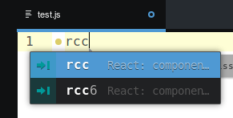
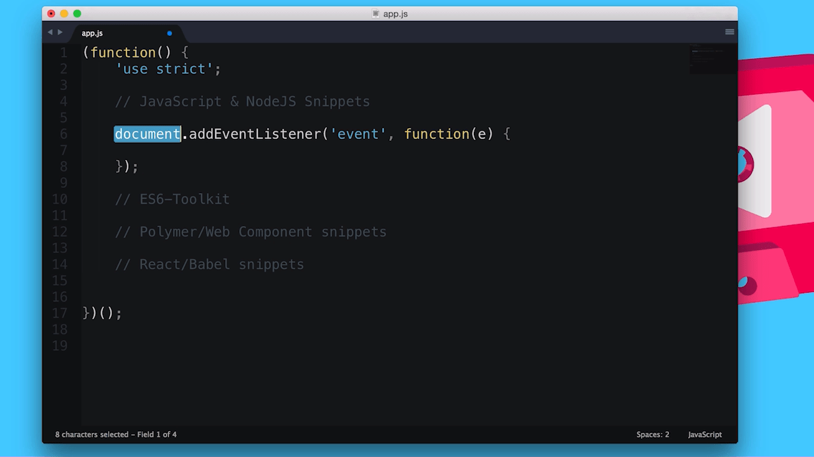
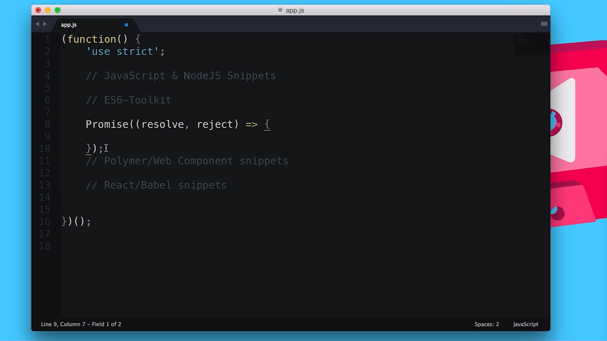
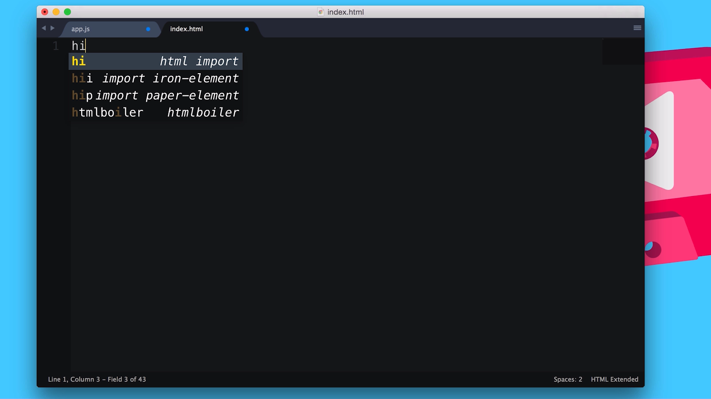
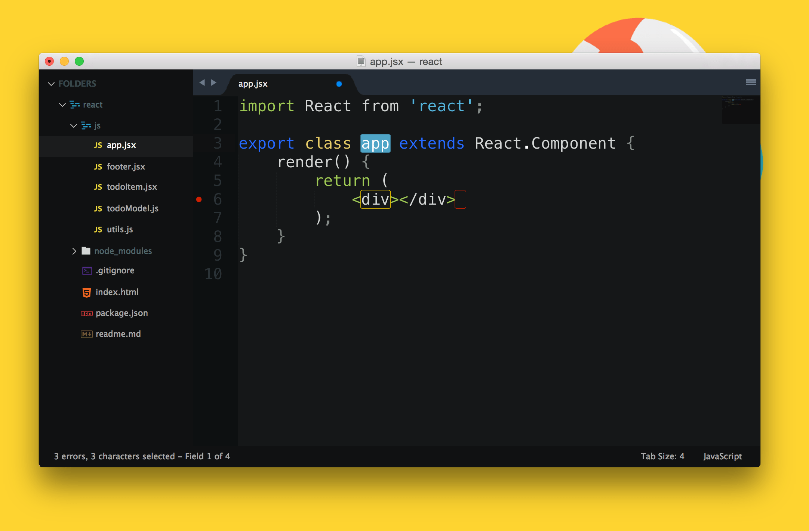

project_path: /web/_project.yaml
book_path: /web/shows/_book.yaml
description: In this a-maz-ing TTT video Matt and Addy look at Sublime snippets, what they are and why they're good.

{# wf_updated_on: 2015-10-13 #}
{# wf_published_on: 2015-10-13 #}
{# wf_youtube_id: EkX_nX3tEJk #}

# Sublime (and Atom) Snippets {: .page-title }

  <iframe class="devsite-embedded-youtube-video" data-video-id="EkX_nX3tEJk"
          data-autohide="1" data-showinfo="0" frameborder="0" allowfullscreen>
  </iframe>

[Snippets are reusable chunks of
code](http://docs.sublimetext.info/en/latest/extensibility/snippets.html) that
you can easily and quickly drop into your text editor.

The way they work is you start typing a short hand code, a popup will appear and
you simply press enter for the snippet you want and you'll get a predefined
chunk of code.

The only gotcha to bare in mind is that snippets may only work when the file you
are editing has a specific extension (i.e. JavaScript snippets would only work
when editing a file ending with .js).

## JS and NodeJS Snippets

[Sublime](https://packagecontrol.io/packages/JavaScript%20%26%20NodeJS%20Snippets)
| [Atom](https://atom.io/packages/javascript-snippets)

The [JavaScript and NodeJS Snippets
package](https://packagecontrol.io/packages/JavaScript%20%26%20NodeJS%20Snippets)
by [Zeno Rocha](http://zenorocha.com/){: .external } is a great package of simple snippets
that allow you to quickly write out common JavaScript.

Below are some examples of shorthand codes and the code they produce:

### ae (Add Event Listener)

    document.addEventListener('event', function(e) {  
     // body...  
    });
    

### cel (Create Element)

    document.createElement(elem);
    

### cdf (Create Document Fragment)

    document.createDocumentFragment(elem);
    

### pr (Prototype)

    ClassName.prototype.methodName = function(arguments) {  
     // body...  
    }
    

### iife (Immediately-invoked function expression)

    (function(window, document, undefined) {  
     // body...  
    })(window, document);
    

[Here's the post by Ben Alman on
iife's](http://benalman.com/news/2010/11/immediately-invoked-function-expression/),
just for Matt.

Zeno has a full list of the commands you can use on the [github
repo](https://github.com/zenorocha/sublime-javascript-snippets) (and package
pages).

## ES2015 Toolkit

[Sublime](https://packagecontrol.io/packages/ES6-Toolkit)

ES2015 (a.k.a ES6) is awesome and with most awesome things, there's a snippet
package to go with it.

To use this package and it's snippets, be sure to install
[Babel](https://www.npmjs.com/package/babel) through NPM.

   npm install -g babel

Also take note of the capital at the start of some of the shorthand codes.

### Promise

    Promise((resolve, reject) => {
    
    });
    

### class

    class Classname extends AnotherClass {
      constructor(args) {
        // code
      }
    
      // methods
    }
    

### object

    var obj = {
      __proto__: theProtoObj,
      handler,
      toString() {
        return "object";
      }
    }
    

For full listing of the supported snippets check out the [Sublime package
control page](https://packagecontrol.io/packages/ES6-Toolkit).

Unfortunately this package isn't available for Atom. The closest equivalent
seems to be [this package titled
'es6-javascript'](https://atom.io/packages/es6-javascript).

## Polymer and Web Component Package

[Sublime](https://packagecontrol.io/packages/Polymer%20%26%20Web%20Component%20Snippets)
| [Atom](https://atom.io/packages/polymer-snippets)

Cut down your effort writing out boilerplate for Polymer with [Mr
Dodsons](http://robdodson.me/){: .external }  awesome Polymer and Web Component snippets.

### hi (HTML Import)

    <link rel="import" href="bower_components//.html">
    

### pe (Polymer Element)

    <dom-module id="">
      
      <template>
    
      </template>
      
    </dom-module>
    

## React Snippets

[Sublime](https://github.com/babel/babel-sublime-snippets) |
[Atom](https://atom.io/packages/react)

Finally for the React fans out there, there's a package for you too. Scaffold
out components and commonly written code with these snippets.

### rcc (Class Component Skeleton)

    var React = require('react');
    var PropTypes = React.PropTypes;
    
    var  = React.createClass({
    
      render: function() {
        return (
          

        );
      }
    
    });
    
    module.exports = ;
    

### scu (shouldComponentUpdate)

    shouldComponentUpdate: function(nextProps, nextState) {
    
    },
    

### props

    this.props.
    

### state

    this.state.
    

## MOAR Packages

There are a tonne of other packages which offer snippets for different
frameworks, so if you find yourself writing the same pieces of code over and
over, chances are someone has written a package to help make that a thing of the
past, just do a search in the package manage for your editor
([Sublime](https://packagecontrol.io/){: .external } | [Atom](https://atom.io/packages)).
