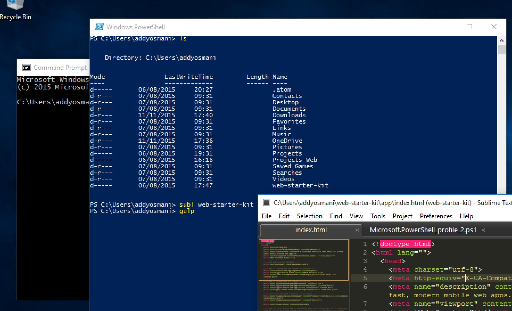
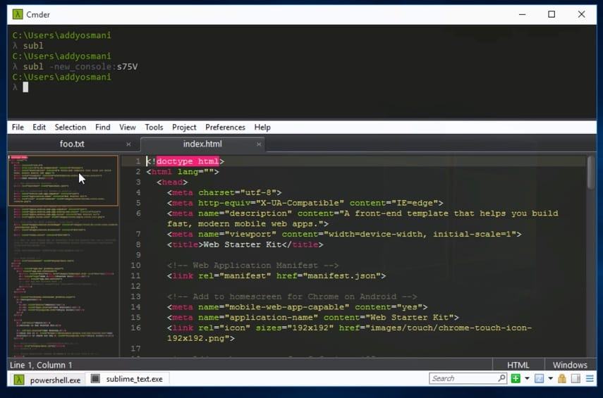
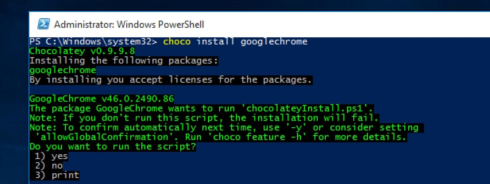

project_path: /web/_project.yaml
book_path: /web/shows/_book.yaml
description: Windows Tooling: If you develop for the web on Windows, this is the tooling video for you. Addy looks at the web front end tooling landscape for Windows covering the tools he uses.

{# wf_updated_on: 2017-07-25 #}
{# wf_published_on: 2015-11-10 #}
{# wf_youtube_id: msCUKTdBzg4 #}

# Windows Command-line Tools {: .page-title }

  <iframe class="devsite-embedded-youtube-video" data-video-id="msCUKTdBzg4"
          data-autohide="1" data-showinfo="0" frameborder="0" allowfullscreen>
  </iframe>

As devs who spend the majority of our time coding on OSX and Linux, we were [curious](https://plus.google.com/+AddyOsmani/posts/91JeoX83S69) what a modern command-line setup might look like on Windows. 

A StackOverflow [developer survey](http://stackoverflow.com/research/developer-survey-2015) reminded us that there are more devs using Windows than any other OS so we were curious if the tooling there was on par with what we were used to in *nix land.

After spending some time evaluating the landscape of Windows CLI tooling, we settled on a set of tools we think gets us 95% of the way there. 

At the end of the day, we landed on a combination of:

* PowerShell
* ConEmu
* PSReadLine
* PSGet
* Chocolatey
* Babun (optional)

See below for some more notes on what these different pieces of machinery give you.

## [PowerShell](https://technet.microsoft.com/en-us/scriptcenter/dd742419.aspx) (shell)

* Significantly closer to a real 'shell' than cmd.exe, offering us a powerful scripting environment for task automation. It's fair to compare it to [Bash](http://www.gnu.org/software/bash/){: .external } or [zsh](http://www.zsh.org/). 
* Autocompletes directory and filenames
* Autocompletes application names
* Has integrated aliases and commands (called cmdlets - e.g `Select-String` is like `grep`, `Invoke-Elevated` is like `sudo`, `Sort-Object` is like `sort`, `Get-Process` lists all active processes). If moving from another shell to PS, `Set-Alias` lets you map aliases you're used to to Windows equivalents. For example: `Set-Alias server python -m http.server 8000` launches a Python server when the `server` alias is used.
* Aliases can be persisted in a PowerShell profile
* Supports piping, like Unix. Unlike Unix, it pipes objects rather than text streams. This requires getting used to but avoids reparsing when you want to get out a property.
* Supports modules. [PSGet](http://psget.net) is a package manager for PowerShell allowing you to easily extend it. 
* Optionally consider [Posh-Git](https://github.com/dahlbyk/posh-git/), a PowerShell script for git to gain contextual tab-completion.

If you're interested in trivia, here's an answer to why MS created PowerShell from the lead [architect](http://stackoverflow.com/questions/573623/is-powershell-ready-to-replace-my-cygwin-shell-on-windows/573861#573861).

## [PSReadLine](https://github.com/lzybkr/PSReadLine) (console editing helpers)

* Significantly improves the console editing experience
* Syntax highlighting whenever you start typing commands. Clearly indicates syntax errors with a red ">" character.
* Highly customisable key bindings
* Bash-style autocompletion
* Bash/zsh interactive history search (Ctrl + R). Powerful command history traversal too. Easily view previous multi-line commands using arrow keys rather than just the last line of the command.
* Proper support for copy/paste/cut (Ctrl+C/X/V should all work just fine) 
* Good support for undo/redo 
* History saving is automatic

Alternatively, you can use [Clink](http://mridgers.github.io/clink/){: .external }, which has a similar set of features but wasn't strictly written for PowerShell.

## [ConEmu](https://conemu.github.io/){: .external } (console host)

* An advanced console emulator where you can run your shell of choice.
* Supports opening multiple terminals in different tabs. Makes it trivial to launch terminals as different users.
* Extremely customisable - everything from shortcuts to text selection and status bar colors can be changed.
* Supports a split-screen view
* Simple GUI apps can be run in tabs
* Support for Windows 7+ Jump Lists 
* Supports smooth window resizing
* Windows font anti-aliasing
* Starting tabs can be fully customized to start in a particular directory
* Intelligent copy/paste 

Some folks still enjoy using [Console2](http://sourceforge.net/projects/console/){: .external } and Scott Hanselman has a blog [post](http://www.hanselman.com/blog/Console2ABetterWindowsCommandPrompt.aspx) written about it.

## [Cmder](http://cmder.net/){: .external }

Worth a passing note is Cmder - a console emulation package that combines ConEmu, Clink and msysgit - giving you Git helpers. Cmder basically gives you a prettier experience to ConEmu by default via it's Monokai color scheme.

Cmder also includes some other little benefits, like integration with GUI apps such as [Sublime Text](http://laravel.io/forum/02-24-2014-a-neat-way-integrate-cmder-and-sublime-text-seamlessly).

## [Chocolatey](https://chocolatey.org) (package manager)

* Basically homebrew for Windows, allowing you to pull in your favorite Windows apps conveniently. There are currently ~3K packages available that can be updated using Chocolatey directly.
* Differs from [Nuget](https://www.nuget.org). NuGet is for development libraries. Chocolatey is a binary machine package manager and is built on NuGet infrastructure.
* Offers effectively silent builds

You may also be interested in learning about [OneGet](http://www.hanselman.com/blog/AptGetForWindowsOneGetAndChocolateyOnWindows10.aspx), Microsoft's package manager..manager, which should work with Chocolatey under Windows 10.

## [Babun](http://babun.github.io) (Cygwin preconfigured)

* Cygwin (the Linux-like env for Windows) minus some of the historically known quirks. The overall setup is significantly more straight-forward using the Babun installer. If you're particularly experienced with Unix and would prefer to avoid learning PowerShell, cygwin/Babun are worth considering. 
* Includes a package manager called `pact` (a little similar to `brew`) similar to `apt-get`. This is a big deal as you currently have to re-run the Cygwin installer when adding packages vs. just using pact.
* Vim pre-installed and pre-configured
* Integrated support for oh-my-zsh
* Auto-updates

## Further Reading

* [Windows command-line experience comparisons](http://aarontgrogg.com/blog/2015/07/31/a-better-windows-command-line-experience-comparing-powercmd-vs-console2-vs-consolez-vs-conemu-vs-cmder/)
* [Windows editors and shells](http://daverupert.com/2015/10/windows-editors-and-shells/)
* [Windows command-prompt Redux](http://ventajou.com/windows-command-prompt-redux)
* [Scott Hanselman's Ultimate Developer and Power Users Tool List for Windows](http://hanselman.com/tools)
