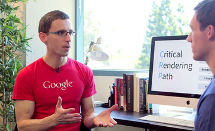

project_path: /web/_project.yaml
book_path: /web/shows/_book.yaml
description: Get started or build your web design and development skills with these free Udacity courses taught by your friends at Google.

{# wf_updated_on: 2015-02-23 #}
{# wf_published_on: 2015-02-23 #}

# Udacity Courses {: .page-title }

## Intro to Progressive Web Apps

In this course you’ll get started working on your very first Progressive
Web App - a web app that can take advantage of many of the features native
applications have enjoyed. You’ll also get more experience in creating a
web app that works offline using Service Workers. Finally, you’ll make your
app installable to the user’s home screen with the Web App Manifest file.

[Take Course](https://udacity.com/ud811)

## Browser Rendering Optimizations

Performance matters to users. Web developers need to build apps that react
quickly and render smoothly.

Google performance guru Paul Lewis is here to help you destroy jank and
create web apps that maintain 60 frames per second performance.

You'll leave this course with the tools you need to profile apps and identify
the causes of jank. You'll explore the browser's rendering pipeline and
uncover patterns that make it easy to build performant apps.

[Take Course](https://udacity.com/ud860)

## Responsive Web Design

In this course you'll learn the fundamentals of responsive web design with
Google's Pete LePage! You'll create your own responsive web page that works
well on any device - phone, tablet, desktop or anything in between.

You’ll start by exploring what makes a site responsive and how some common
responsive design patterns work across different devices. From there, you’ll
learn how to create your own responsive layout using the viewport tag and CSS
media queries. As you proceed, you’ll experiment with major and minor
breakpoints, and optimizing text for reading.

[Take Course](https://udacity.com/ud893)

## Critical Rendering Path

You will learn how to optimize any website for speed by diving into the
details of how mobile and desktop browsers render pages.

In this short course, you’ll learn about the Critical Rendering Path, or the
set of steps browsers must take to convert HTML, CSS and JavaScript into
living, breathing websites. From there, you’ll start exploring and
experimenting with tools to measure performance and simple strategies to
deliver the first pixels to the screen as early as possible. You’ll learn
how to dive into recommendations from PageSpeed Insights and the Timeline
view of Google Chrome’s Developer Tools to find the data you need to achieve
immediate performance boosts!

[Take Course](https://udacity.com/ud884)

## Responsive Images

Did you know that images account for more than 60% of the bytes on average
needed to load a web page?

In this course you will learn how to work with images on the modern web, so
that your images look great and load quickly on any device.

Along the way, you will pick up a range of skills and techniques to smoothly
integrate responsive images into your development workflow. By the end of
the course, you will be developing with images that adapt and respond to
different viewport sizes and usage scenarios.

[Take Course](https://udacity.com/ud882)

## Offline Web Applications

This course is focused squarely on user experience, and seeks to show
developers how thinking offline-first is the best way to ensure that
applications perform their best in all scenarios, not just ideal ones. You'll
learn to recognize the differences between good, poor, intermittent, and
missing connectivity for your users , and master how to make applications
that navigate these conditions with ease.

Using the skills you master in this course, you'll conclude by building an
app that that works both online and offline, and loads in new data when it
can. You'll be a master of the cache! Your web apps will interact with the
network just like native apps do. This will lead to better user experiences
even in traditionally challenging connection scenarios like being stuck in a
train tunnel, having to rely on over-crowded conference Wi-Fi, or traveling
through a cellular “dead zone!”

[Take Course](https://udacity.com/ud899)

## Web Tooling and Automation

In this course, you’ll learn how to setup your development, get super
productive during daily work and iteration, prevent yourself and your site
from disasters and save a lot of time and effort with automatic optimization
and automation. Finally, you’ll learn how to do all this while being confident
your code runs on a multitude of devices in the real world.

[Take Course](https://udacity.com/ud892)

## Web Accessibility

In this course you’ll get hands-on experience making web applications
accessible. You’ll understand when and why users need accessibility. Then
you’ll dive into the “how”: making a page work properly with screen readers,
and managing input focus (e.g. the highlight you see when tabbing through a
form.) You’ll understand what “semantics” and “semantic markup” mean for web
pages and add ARIA markup to enable navigating the interface with a range of
assistive devices. Finally, you’ll learn styling techniques that help users
with partial vision navigate your pages easily and reliably.

[Take Course](https://udacity.com/ud891)

