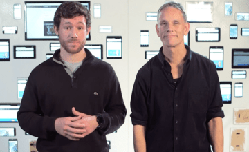

project_path: /web/_project.yaml
book_path: /web/shows/_book.yaml
description: Get started or build your web design and development skills with these free Udacity courses taught by your friends at Google.

{# wf_review_required #}
{# wf_updated_on: 2015-02-23 #}
{# wf_published_on: 2015-02-23 #}

# Udacity Courses {: .page-title }

## Browser Rendering Optimizations

Google performance guru Paul Lewis is here to help you destroy jank and
create web apps that maintain 60 frames per second performance.

[Take Course](https://udacity.com/ud860)

## Responsive Web Design

Learn the fundamentals of responsive web design with and create your own
responsive web page that works well on any device - phone, tablet, desktop.

[Take Course](https://udacity.com/ud893)

## Critical Rendering Path

Learn about the Critical Rendering Path, or the set of steps browsers must
take to convert HTML, CSS and JavaScript into living, breathing websites.

[Take Course](https://udacity.com/ud884)

## Responsive Images

Learn how to work with images on the modern web, so that your images look
great and load quickly on any device.

[Take Course](https://udacity.com/ud882)

