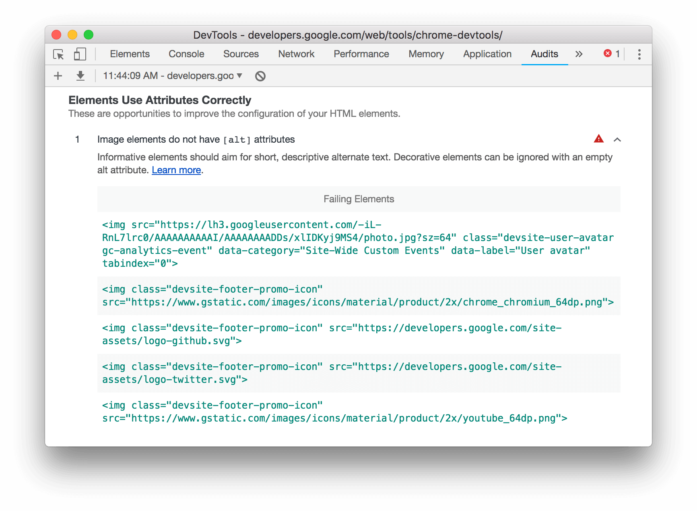

project_path: /web/tools/_project.yaml
book_path: /web/tools/_book.yaml
description: A comprehensive reference of accessibility features in Chrome DevTools.

{# wf_blink_components: Platform>DevTools #}
{# wf_updated_on: 2018-07-19 #}
{# wf_published_on: 2018-07-13 #}

# Accessibility Reference {: .page-title }



This page is a comprehensive reference of accessibility features in Chrome DevTools.
It is intended for web developers who:

* Have a basic understanding of DevTools, such as how to open it.
* Are familiar with [accessibility principles and best practices][a11y].

[a11y]: /web/fundamentals/accessibility/

The purpose of this reference is to help you discover all of the tools available in
DevTools that can help you examine a page's accessibility.

## Overview of accessibility features in Chrome DevTools {: #overview }

This section explains how DevTools fits into your overall accessibility toolkit.

When determining whether a page is accessible, you need to have 2 general questions in mind:

1. Can I navigate the page with a keyboard or [screen reader][reader]?
1. Are the page's elements properly marked up for screen readers?

[reader]: /web/fundamentals/accessibility/semantics-builtin/#screen_readers

In general, DevTools can help you fix errors related to question #2, because these errors are
easy to detect in an automated fashion. Question #1 is just as important, but unfortunately DevTools
can't help you there. The only way to find errors related to question #1 is to try using a page
with a keyboard or screen reader yourself. See [How To Do An Accessibility Review][review]
to learn more.

[review]: /web/fundamentals/accessibility/how-to-review

## Audit a page's accessibility {: #audits }

In general, use the Audits panel to determine if:

* A page is properly marked up for screen readers.
* The text elements on a page have sufficient contrast ratios. See also [View the
  contrast ratio of a text element in the Color Picker](#contrast).

To audit a page:

1. Go to the URL that you want to audit.
1. In DevTools, click the **Audits** tab. DevTools shows you various configuration options.

     <figure>
       
       <figcaption>
         <b>Figure 1</b>. Configuring audits
       </figcaption>
     </figure>

     <aside class="note">
       <b>Note</b>: The screenshots in this section were taken with version 69 of Chrome. You can check what
       version you're running at <code>chrome://version</code>. The Audits panel UI looks different in earlier
       versions of Chrome, but the general workflow is the same.
     </aside>

1. For **Device**, select **Mobile** if you want to simulate a mobile device. This option changes
   your user agent string and resizes the viewport. If the mobile version of the page displays differently
   than the desktop version, this option could have a significant effect on the results of your audit.
1. In the **Audits** section, make sure that **Accessibility** is enabled. Disable the other
   categories if you want to exclude them from your report. Leave them enabled if you want to discover other
   ways to improve the quality of your page.
1. The **Throttling** section lets you throttle the network and CPU, which is useful when analyzing
   load performance. This option should be irrelevant to your accessibility score, so you can use
   whatever you prefer.
1. The **Clear Storage** checkbox lets you clear all storage before loading the page, or preserve
   storage between page loads. This option is also probably irrelevant to your accessibility score, so you
   can use whatever you prefer.
1. Click **Run Audits**. After 10 to 30 seconds, DevTools provides a report.
   Your report gives you various tips on how to improve the page's accessibility.

     <figure>
       
       <figcaption>
         <b>Figure 2</b>. A report
       </figcaption>
     </figure>

1. Click an audit to learn more about it.

     <figure>
       
       <figcaption>
         <b>Figure 3</b>. More information about an audit
       </figcaption>
     </figure>

1. Click **Learn More** to view that audit's documentation.

     <figure>
       
       <figcaption>
         <b>Figure 4</b>. Viewing an audit's documentation
       </figcaption>
     </figure>

### See also: aXe extension {: #axe }

You may prefer to use the [aXe extension][aXe]{:.external} rather than the Audits panel.
They generally provide the same information, since aXe is the underlying engine that powers the
Audits panel. The aXe extension has a different UI and describes audits slightly differently.
One advantage that the aXe extension has over the Audits panel is that it lets you inspect and
highlight failing nodes.

[aXe]: https://chrome.google.com/webstore/detail/axe/lhdoppojpmngadmnindnejefpokejbdd?hl=en-US

<figure>
  
  <figcaption>
    <b>Figure 5</b>. The aXe extension
  </figcaption>
</figure>

## The Accessibility pane {: #pane }

The Accessibility pane is where you can view the accessibility tree, ARIA attributes, and
computed accessibility properties of DOM nodes.

To open the Accessibility pane:

1. Click the **Elements** tab.
1. In the **DOM Tree**, select the element which you want to inspect.
1. Click the **Accessibility** tab. This tab may be hidden behind the **More Tabs**
   {: .inline-icon }
   button.

<figure>
  
  <figcaption>
    <b>Figure 6</b>. Inspecting the <code>h1</code> element of the DevTools homepage in the Accessibility pane
  </figcaption>
</figure>

### View an element's position in the accessibility tree {: #tree }

[The accessibility tree][tree] is a subset of the DOM tree. It only contains elements from
the DOM tree that are relevant and useful for displaying the page's contents in a screen reader.

Inspect an element's position in the accessibility tree from [the Accessibility pane](#pane).

<figure>
  
  <figcaption>
    <b>Figure 7</b>. The Accessibility Tree section
  </figcaption>
</figure>

[tree]: /web/fundamentals/accessibility/semantics-builtin/the-accessibility-tree

### View an element's ARIA attributes {: #aria }

ARIA attributes ensure that screen readers have all of the information that they need in order
to properly represent a page's contents.

View an element's ARIA attributes in [the Accessibility pane](#pane).

<figure>
  
  <figcaption>
    <b>Figure 8</b>. The ARIA Attributes section
  </figcaption>
</figure>

### View an element's computed accessibility properties {: #computed }

Note: If you're looking for computed CSS properties, see [the Computed tab][CSS].

[CSS]: /web/tools/chrome-devtools/css/reference#computed

Some accessibility properties are dynamically calculated by the browser. These properties
can be viewed in the **Computed Properties** section of the **Accessibility** pane.

View an element's computed accessibility properties in [the Accessibility pane](#pane).

<figure>
  
  <figcaption>
    <b>Figure 9</b>. The Computed (Accessibility) Properties section
  </figcaption>
</figure>

## View the contrast ratio of a text element in the Color Picker {: #contrast }

Some people with low vision don't see areas as very bright or very dark. Everything tends to
appear at about the same brightness, which makes it hard to distinguish outlines and edges.
Contrast ratio measures the difference in brightness between the foreground and background
of text. If your text has a low contrast ratio, then these low vision users may literally
experience your site as a blank screen.

The Color Picker can help you make sure that your text meets recommended contrast ratio
levels:

1. Click the **Elements** tab.
1. In the **DOM Tree**, select the text element that you want to inspect.

     <figure>
       
       <figcaption>
         <b>Figure 10</b>. Inspecting a paragraph in the DOM Tree
       </figcaption>
     </figure>

1. In the **Styles** pane, click the color square next to the element's `color` value.

     <figure>
       
       <figcaption>
         <b>Figure 11</b>. The <code>color</code> property of the element
       </figcaption>
     </figure>

1. Check the **Contrast Ratio** section of the Color Picker. One checkmark means that
   the element meets the [minimum recommendation][minimum]{:.external}.
   Two checkmarks means that it meets the [enhanced recommendation][enhanced]{:.external}.

     <figure>
       
       <figcaption>
         <b>Figure 12</b>. The Contrast Ratio section of the Color Picker shows 2 checkmarks and a value
         of <code>16.10</code>
       </figcaption>
     </figure>

1. Click the **Contrast Ratio** section to see more information. A line appears in the visual picker at the
   top of the Color Picker. If the current color meets recommendations, then anything on the same side of the
   line also meets recommendations. If the current color does not meet recommendations, then anything on the
   same side also does not meet recommendations.

     <figure>
       
       <figcaption>
         <b>Figure 13</b>. The Contrast Ratio Line in the visual picker
       </figcaption>
     </figure>

[minimum]: https://www.w3.org/WAI/WCAG21/quickref/#contrast-minimum
[enhanced]: https://www.w3.org/WAI/WCAG21/quickref/#contrast-enhanced

## Feedback {: #feedback }





