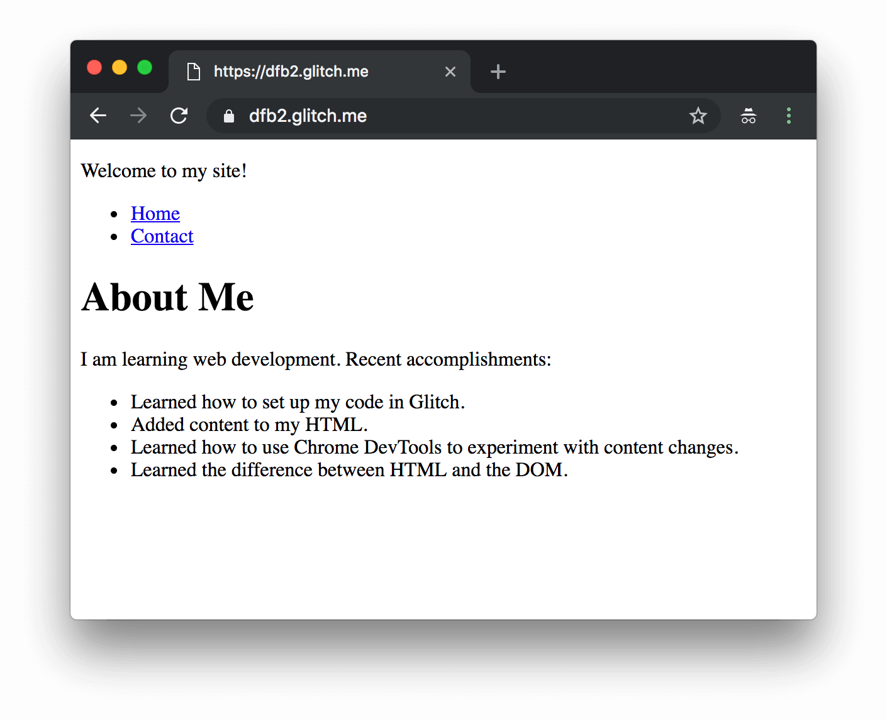
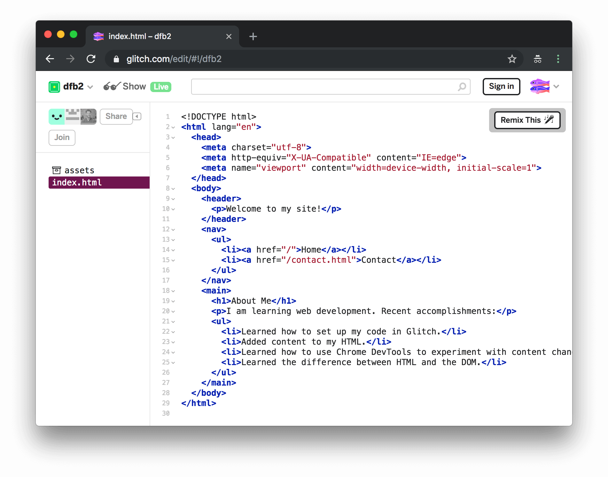
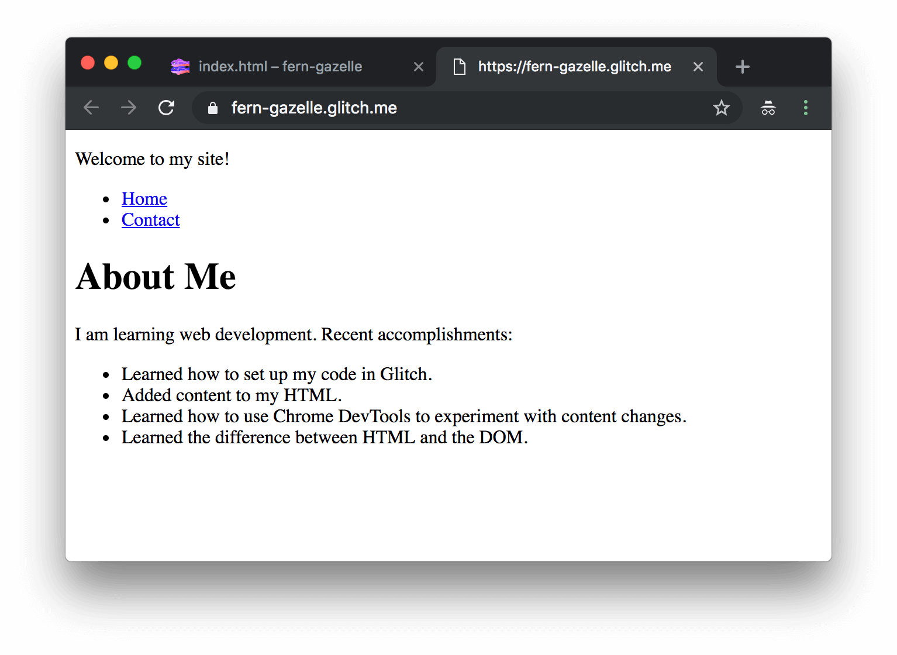
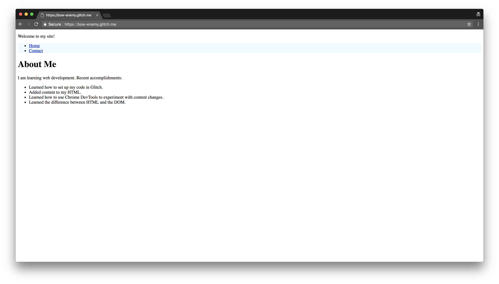

project_path: /web/tools/_project.yaml
book_path: /web/tools/_book.yaml

{# wf_updated_on: 2018-08-29 #}
{# wf_published_on: 2018-08-28 #}
{# wf_blink_components: Platform>DevTools #}

[HTML]: /web/tools/chrome-devtools/beginners/html

# DevTools For Beginners: Getting Started with CSS {: .page-title }

In this tutorial, you learn how to use CSS to style a web page. You also learn how to
use Chrome DevTools to experiment with CSS changes.

This is the second tutorial in a series of tutorials that teaches you the basics of web
development and Chrome DevTools. You gain hands-on experience by actually building your own
website. 

Note: You don't have to complete the first tutorial before doing this one. 
You can start with this tutorial. 
[Set up your code](#setup) will show you how to get set up.

Currently your site looks like this: 

<figure>
  
  <figcaption>
    <b>Figure X</b>. What your site currently looks like
  </figcaption>
</figure>

After completing the tutorial, it will look like this: 

<figure>
  
  <figcaption>
    <b>Figure X</b>. What your site will look like at the end of the tutorial
  </figcaption>
</figure>

## Goals {: #goals }

By the end of this tutorial, you will understand:

* How to use CSS to style a web page.
* How to use Chrome DevTools to experiment with CSS.
* The difference between CSS and CSS frameworks.

You'll also have a real website!

## Prerequisites {: #prerequisites }

Before attempting this tutorial, complete the following prerequisites:

* Complete [Get Started with HTML and the DOM][HTML] 
  or make sure that you have an understanding
  of HTML and the DOM similar to what's taught in that tutorial.
* Download the [Google Chrome][chrome]{: .external } web browser. This tutorial uses a set of
  web development tools, called Chrome DevTools, that are built into Google Chrome. 

[chrome]: https://www.google.com/chrome/

## Set up your code {: #setup }

In order to start creating your site, you need to set up your code:

1. **If you have already completed the first tutorial in this series, skip this section! 
   Continue using your code from the last tutorial, 
   [Getting Started with HTML and the DOM](/web/tools/chrome-devtools/beginners/html).**
2. Open the [source code](https://glitch.com/edit/#!/dfb2). A code editor called 
   Glitch shows a page called `index.html`. This tab of your browser will be called the
   **editing tab**.

     <figure>
       
       <figcaption>
         <b>Figure X</b>. The source code
       </figcaption>
     </figure>

2. Click **dfb2**. A menu pops up.

     <figure>
       
       <figcaption>
         <b>Figure X</b>. The editor tab
       </figcaption>
     </figure>

3. Click **Remix This**. Glitch creates a copy of the project that you can 
   edit. Note that the name of the new project will be randomly generated.
4. Click **Show Live**. Another tab opens with a live view of your site.
   This tab of your browser will be called the **live tab**.

     <figure>
       
       <figcaption>
         <b>Figure X</b>. The live tab
       </figcaption>
     </figure>

## Add CSS {: #add }

**CSS** is a computer language that determines the layout and styling of web pages. For
example, here is a paragraph with a border:

<p style="border:1px dashed red; padding:5px">This has been styled with CSS.</p> 

Here is the HTML and CSS code used to create that paragraph:

```
<p style="border:1px dashed red; padding:5px">
  This has been styled with CSS.
</p> 
```

The code that you haven't seen before is `style="border:1px dashed red; padding:5px"`. 
The rest should look familiar. If not, complete [Get Started with HTML and the DOM][HTML]
before attempting this tutorial.

### Add inline styles {: #inline }

Use **inline styles** when you want to apply styles to a single element. 
Try it now by adding a background color to your page's navigation menu:

1. Copy the following code: 

     style="background-color: aliceblue"

1. In `index.html`, add the code that you just copied to your `<nav>`.

       TODO add code here

1. Go to the **live tab** to see the changes! 
   The background of the `<nav>` section is now blue.
     <figure>
       
       <figcaption>
         <b>Figure X</b>. The result of applying the inline style
       </figcaption>
     </figure>

As mentioned above, inline styles only apply to a single element,
so only the `<nav>` section of `index.html` changes. 
In the next section, you learn about how to add styling to multiple elements.


### Re-use styles with internal stylesheets {: #internal }

[Earlier](#add), you saw an inline style that applied a style to a `<p>` tag like this:

```
<p style="border:1px dashed red; padding:5px">
  This has been styled with CSS.
</p>
```

But what if you wanted all of the `<p>` elements on your webpage to be styled the same way? 
You'd have to copy and paste the code into every single `<p>` tag on your site. 
That's a lot of time and effort, and if you need to make an edit, 
you'll have to change every tag again. 
**Internal stylesheets** allow you to write your CSS once 
so that applies to multiple elements. Try it now:

1. Go to the **live tab**. 
1. Click **Contact** to go to the contact page. Notice the font of **Home** and **Contact**.

     <figure>
       
       <figcaption>
         <b>Figure X</b>. The result of applying the inline style
       </figcaption>
     </figure>


1. Copy the following code:
```
<style>
  li a {
    font-family: 'Courier New', Courier, monospace;
  }
</style>
```
1. In the **editor tab**, go to `contact.html`.
1. Add the code that you just copied just before the `</head>` tag.

TODO: Add code sample with highlighting the new code.

1. Go back to the **live tab**. 
1. Click **Contact** to go back to the contact page. 
   The font of **Home** and **Contact** has changed.

     <figure>
       
       <figcaption>
         <b>Figure X</b>. The result of applying the inline style
       </figcaption>
     </figure>

Internal stylesheets apply styles using **CSS selectors**. 
CSS selectors are patterns that may apply to one or more HTML elements. 
For example, in the previous code:

```
<style>
  li a {
    font-family: 'Courier New', Courier, monospace;
  }
</style>
```
**li a** is a CSS selector that translates to "any list item that contains a link". 
The browser changed the font of the **Home** and **Contact** links 
because they matched this pattern. 

```
<li><a href="/">Home</a></li>
<li><a href="/contact.html">Contact</a></li>
```

`font-family: 'Courier New', Courier, monospace;` is a CSS **declaration**. 
A declaration is made of two parts: a property and a value. 
In the example above, `font-family` is a property that has a value of 
`'Courier New', Courier, monospace`. If Courier New isn't available, 
the browser will choose Courier, and if Courier isn't available, t
he browser will choose monospace. So, in plain English, the code above reads: 
"Change the font of any list item that contains a link to Courier New, 
and if Courier New isn't available use Courier, and if Courier isn't available, 
use monospace". A CSS selector combined with a declaration is called a **ruleset**. 

CSS selectors are also flexible, meaning that multiple CSS selectors can be 
assigned to a style definition. For example, to add the same font to the `<h1>`
elements on your contact page:

1. Go to the **editor tab**.
1. Go to the internal stylesheet you added before.
1. After `li a`, type `, h1`. This tells the browser you want to apply the style to
   "any list item that contains a link **and** any item that is an h1". 
   Your code should look like this:

```
<style>
  li a, h1 {
    font-family: 'Courier New', Courier, monospace;
  }
</style>
```

1. Go to the **live tab**. 
1. Click the **Contact** link to go back to the contact page. 
   Now, **Contact Me** has the same font as the navigation links.
     <figure>
       
       <figcaption>
         <b>Figure X</b>. The result of applying the inline style
       </figcaption>
     </figure>
Now that you understand internal stylesheets, you can use DevTools to add new styles:

1. Right-click the **Home** link.
1. Select **Inspect Element**. This opens up DevTools' **Elements Panel** 
   with the **Home** link highlighted.
     <figure>
       
       <figcaption>
         <b>Figure X</b>. The result of applying the inline style
       </figcaption>
     </figure>

1. On the bottom left, there is a panel called the **Styles Pane**. 
   In that pane, you can see the internal stylesheet you made. 
   Under ` font-family: 'Courier New', Courier, monospace;`, 
   type `color:gray` This tells the browser to change the font color to gray.
     <figure>
       
       <figcaption>
         <b>Figure X</b>. The result of applying the inline style
       </figcaption>
     </figure>

1. Press <kbd>Enter</kbd>. All of the text on the contact page is now gray.
     <figure>
       
       <figcaption>
         <b>Figure X</b>. The result of applying the inline style
       </figcaption>
     </figure>
You can also directly edit existing styles:

1. Copy this number: `#28a78c` This is a **Hexadecimal Color Code**, 
   a different way of representing colors.
1. Click on the gray square next to `gray`. A color picker pops up.
     <figure>
       
       <figcaption>
         <b>Figure X</b>. The result of applying the inline style
       </figcaption>
     </figure>
1. In the box that says **Hex**, paste in the number you copied. 
   The color of the font on the contact page will change.
     <figure>
       
       <figcaption>
         <b>Figure X</b>. The result of applying the inline style
       </figcaption>
     </figure>

Finally, you can add new rulesets:

1. Click on the gray plus to **Add a new style rule**. 
   A ruleset will appear with the `a` selector.
     <figure>
       
       <figcaption>
         <b>Figure X</b>. The result of applying the inline style
       </figcaption>
     </figure>
1. Replace `a` with `a:hover`. `hover` is a **pseudo-state selector**,
   which defines a special state of an element. In this case, `a:hover` translates to, 
   "any link that is being hovered over". 
     <figure>
       
       <figcaption>
         <b>Figure X</b>. The result of applying the inline style
       </figcaption>
     </figure>
1. Inside the brackets in the ruleset, type `background-color: cornsilk`. 
   Now you have a ruleset that translates to "change the background color of any link that
   is being hovered over to cornsilk".
     <figure>
       
       <figcaption>
         <b>Figure X</b>. The result of applying the inline style
       </figcaption>
     </figure>
1. Move your cursor over the home link. The link's background color will change.
     <figure>
       
       <figcaption>
         <b>Figure X</b>. The result of applying the inline style
       </figcaption>
     </figure>
You can use DevTools to preview CSS changes you make in real time, 
much like you did with HTML and the DOM.


### Re-use styles with external stylesheets {: #external}

[Earlier](#internal), you used internal stylesheets to apply styles to 
`li a` and `h1` elements in `contact.html` like this:

```
<style>
  li a, h1 {
    font-family: 'Courier New', Courier, monospace;
  }
</style>
```

What if you wanted to style the elements in `index.html` the same way? 
What if you had a thousand pages and you wanted them to all be styled the same way?
You'd have to copy and paste the stylesheet into every single web page on your site. 
**External stylesheets** allow you to write your CSS once 
so that applies to multiple web pages. Try it now:

1. Copy this code:

```
li a, h1 {
   font-family: 'Courier New', Courier, monospace;
}

a:hover {
  background-color:cornsilk;
}

nav {
  background-color: aliceblue;
}

```
 You've seen the first two rulesets already. 
 The third ruleset represents the **inline style** you applied to the `<nav>` in the 
 *[Add inline styles](#inline)* section. It turns the background color of the `<nav>` 
  section blue. 

1. Go to the **editor tab**.
1. In `contact.html`, delete everything between `<style>` and `</style>`, 
   including the `<style>` and `</style>` tags. This removes the internal stylesheet.
     <figure>
       
       <figcaption>
         <b>Figure X</b>. The result of applying the inline style
       </figcaption>
     </figure>

1. Go to `index.html` and remove the inline style (`style="background-color: aliceblue"`) 
   from the `<nav>` tag.
     <figure>
       
       <figcaption>
         <b>Figure X</b>. The result of applying the inline style
       </figcaption>
     </figure>
1. Click the **New File** button on the left-hand side.
1. Replace `cool-file.js` with `style.css` and click **Add File**.
     <figure>
       
       <figcaption>
         <b>Figure X</b>. The result of applying the inline style
       </figcaption>
     </figure> 
   You've now created a blank external stylesheet.
1. In `style.css`, paste in the code you copied. 
     <figure>
       
       <figcaption>
         <b>Figure X</b>. The result of applying the inline style
       </figcaption>
     </figure>
1. Copy this code: `<link rel="stylesheet" href="style.css">`. 
1. Go back to `index.html`. Above the `</head>` tag, paste the code you copied. 
   The stylesheet is now linked to  `index.html`.
        <figure>
       
       <figcaption>
         <b>Figure X</b>. The result of applying the inline style
       </figcaption>
     </figure>
1. Go back to `contact.html`. Above the `</head>` tag, paste the code you copied. 
   The stylesheet is now linked to  `contact.html`.
1. Go to the **live tab**. The home page now has the same font 
   from the last section and a blue navigation section.
        <figure>
       
       <figcaption>
         <b>Figure X</b>. The result of applying the inline style
       </figcaption>
     </figure>
1. Click the **Contact** link to go to the contact page. 
   The contact page has the same formatting as the home page.
     <figure>
       
       <figcaption>
         <b>Figure X</b>. The result of applying the inline style
       </figcaption>
     </figure>

#### Use CSS frameworks {: #frameworks}

**CSS frameworks** are collections of styles built by other developers that make it easier
to create attractive web sites. Instead of defining styles yourself, a framework gives you
consistent fonts, spacing, and so on for your elements. 
This probably doesn't make complete sense yet, but it will after you complete 
the following two sections.Complete the steps below to begin to understand 
how frameworks work:


1. Copy the following code: 
   `<link rel="stylesheet" href="https://stackpath.bootstrapcdn.com/bootstrap/4.1.1/css/bootstrap.min.css">` 
   This code tells the browser to import a framework called **Bootstrap**.
1. In the `contact.html` file, paste the code you copied directly above the `</head>` tag.
     <figure>
       
       <figcaption>
         <b>Figure X</b>. The result of applying the inline style
       </figcaption>
     </figure>
1. Go to `index.html`.
1. Paste the code you copied above the `</head>` tag.
     <figure>
       
       <figcaption>
         <b>Figure X</b>. The result of applying the inline style
       </figcaption>
     </figure>
1. Go to the **live tab**. While the background color of the `<nav>` 
   and the font of the `li a` elements are the same, 
   the font of the other elements has changed.
     <figure>
       
       <figcaption>
         <b>Figure X</b>. The result of applying the inline style
       </figcaption>
     </figure>
1. Click the `Contact` link to go to the contact page. 
   The same changes are present. 
     <figure>
       
       <figcaption>
         <b>Figure X</b>. The result of applying the inline style
       </figcaption>
     </figure>
  

Why did some of the elements change, but not others? This is because of a CSS property
called **cascading**. One of the properties of cascading is that if you have multiple rulesets for an element, 
the browser will choose to display the ruleset with the most **specific** selector. 
For example, the Bootstrap style sheet has a ruleset for `a` elements, 
but the stylesheet you made has a ruleset for `li a` elements. 
Since "all list items containing a link" is more specific than "all links", 
the browser uses the ruleset from your external stylesheet.

However, if there are two rulesets with the same specificity, 
the browser applies that last ruleset assigned to the element. 
Both your stylesheet and the Bootstrap stylesheet have rulesets for `h1` elements, 
but because you added Bootstrap's stylesheet last, 
the browser applied the Bootstrap ruleset.

This concept is a bit complicated, but DevTools provides a way to visualize **cascading**:

1. Press <kbd>Command</kbd>+<kbd>Shift</kbd>+<kbd>I</kbd> to open DevTools. 
1. In the **Styles Pane**, click **Computed** to go to the **Computed Values Pane**. 
     <figure>
       
       <figcaption>
         <b>Figure X</b>. The result of applying the inline style
       </figcaption>
     </figure>
   This pane allows you to see which rulesets have been applied by the browser.
1. Right-click on **Contact** and select **Inspect**. 
   Now you are looking at the CSS values for the contact link element.
     <figure>
       
       <figcaption>
         <b>Figure X</b>. The result of applying the inline style
       </figcaption>
     </figure>
1. Expand the **font-family** menu with the gray arrow. 
   In the menu you see that two items are crossed out. 
   These are the default fonts for Bootstrap that your stylesheet overwrote.
     <figure>
       
       <figcaption>
         <b>Figure X</b>. The result of applying the inline style
       </figcaption>
     </figure>
1. Click on the link that says **_reboot.scss:58**. This will take you to the place in the  
   Bootstrap stylesheet where the font declaration was made. 
   `body` is a less specific selector than `li a`, 
   so the ruleset associated with `li a` is applied.
     <figure>
       
       <figcaption>
         <b>Figure X</b>. The result of applying the inline style
       </figcaption>
     </figure>
1. Click on the **Elements** tab to go back to the **Elements Panel**.
     <figure>
       
       <figcaption>
         <b>Figure X</b>. The result of applying the inline style
       </figcaption>
     </figure>

If you're using multiple stylesheets and a style isn't showing up, 
you can use the **Computed Values Pane** to see if something wrote over the style.

### Use Bootstrap CSS {: #bootstrap }

In the last section, you added Bootstrap to your web pages, 
which changed the fonts of some of the elements on your site. 
CSS frameworks can help you make major changes to your page with very little code. 
For example, you are going to take your header from this: 
     <figure>
       
       <figcaption>
         <b>Figure X</b>. The result of applying the inline style
       </figcaption>
     </figure>

To this:
     <figure>
       
       <figcaption>
         <b>Figure X</b>. The result of applying the inline style
       </figcaption>
     </figure>

With a single line of code.  

1. Copy this code: `class="jumbotron jumbotron-fluid"`
1. Go to **the editor tab**.
1. In `index.html`, paste the code you copied into the `<header>` tag. 
   This tells the browser that the `<header>` tag should have the attributes of a jumbotron,
   which tells Bootstrap to apply a certain ruleset to the tag.
     <figure>
       
       <figcaption>
         <b>Figure X</b>. The result of applying the inline style
       </figcaption>
     </figure>
1. Go to the **live tab**. Now, there is a big gray box around 
   the elements that were in the `<header>` tag.
     <figure>
       
       <figcaption>
         <b>Figure X</b>. The result of applying the inline style
       </figcaption>
     </figure>
1. Go back to the **editor tab**.
1. In `contact.html`, paste the code you copied into the `<header>` tag. 
     <figure>
       
       <figcaption>
         <b>Figure X</b>. The result of applying the inline style
       </figcaption>
     </figure>
1. Go back to the **live tab**.
1. Click the **Contact** link to go to the contact page. 
   The contact page has the same formatting as the home page.
     <figure>
       
       <figcaption>
         <b>Figure X</b>. The result of applying the inline style
       </figcaption>
     </figure>

You've just used your first **HTML class**. A class is an HTML attribute that defines a 
**CSS selector**. As mentioned in [a previous section](#internal), CSS selectors are 
patterns that may apply to one or more HTML elements. 

For example, setting the `<header>'s` class to `jumbotron` applied this ruleset:

```
.jumbotron {
  padding: $jumbotron-padding ($jumbotron-padding / 2);
  margin-bottom: $jumbotron-padding;
  background-color: $jumbotron-bg;
  @include border-radius($border-radius-lg);

  @include media-breakpoint-up(sm) {
    padding: ($jumbotron-padding * 2) $jumbotron-padding;
  }
}

```

In this case, the selector `.jumbotron` means "all HTML elements with the 
class `jumbotron`". 

While any HTML element can have a **class** attribute, 
a class like `jumbotron` will not format 
in the way you see on your site unless you have Bootstrap linked to your web page.

Bootstrap has other exclusive classes that align elements:

1. Copy this code: `class="container-fluid"` .
1. Go to the **editor tab**.
1. In `index.html`, paste the code you copied into the `<body>` tag.
     <figure>
       
       <figcaption>
         <b>Figure X</b>. The result of applying the inline style
       </figcaption>
     </figure>

1. Above the `<nav>`, type `<div class= "row">`. 
   This adds a **row** to your site. However, 
   nothing will be visible until you assign elements to **columns**.
     <figure>
       
       <figcaption>
         <b>Figure X</b>. The result of applying the inline style
       </figcaption>
     </figure>

1. Below `</main>`, close the `<div>` with `</div>`. Now the `<nav>` section and the 
   `<main>` section are in the same row.
     <figure>
       
       <figcaption>
         <b>Figure X</b>. The result of applying the inline style
       </figcaption>
     </figure>

1. In the `<nav>` tag, insert the following code: `class= "col-2"` 
   This assigns the `<nav>` section to a column that is 2 units wide. 
     <figure>
       
       <figcaption>
         <b>Figure X</b>. The result of applying the inline style
       </figcaption>
     </figure>

1. In the `<main>` tag, insert the following code: `class= "col-10"` 
   This assigns the `<nav>` section to a column that is 10 units wide.
     <figure>
       
       <figcaption>
         <b>Figure X</b>. The result of applying the inline style
       </figcaption>
     </figure>

1. Go to the **live tab**. The `<nav>` section should be a sidebar on the left side 
   of the screen. Note that on some mobile devices, 
   the placement of your content may not reflect your changes, 
   as your site is not mobile optimized.
     <figure>
       
       <figcaption>
         <b>Figure X</b>. The result of applying the inline style
       </figcaption>
     </figure>

1. Repeat the previous steps for `contact.html`.
     <figure>
       
       <figcaption>
         <b>Figure X</b>. The result of applying the inline style
       </figcaption>
     </figure>


## Polish your site {: #polish}
Bootstrap's default CSS has given you a more polished site, 
but there are still some issues you'll need to fix. 
The spacing of the content both inside and outside 
of the `<nav>` section and the jumbotron section looks off. DevTools can help change that:

1. Go to the **live tab**. 
1. Right click on the jumbotron (the big gray box) and click **Inspect**.
     <figure>
       
       <figcaption>
         <b>Figure X</b>. The result of applying the inline style
       </figcaption>
     </figure>

 <figure>
       
       <figcaption>
         <b>Figure X</b>. The result of applying the inline style
       </figcaption>
     </figure>

Next to the **Styles Pane**, there is a diagram called the **Box Model Diagram**. 
The **Box Model** is a set of properties that control the positioning of elements. 
Each box has four elements: content, padding, border, and margin:

1. Click on the left `-` in the **padding** box.
     <figure>
       
       <figcaption>
         <b>Figure X</b>. The result of applying the inline style
       </figcaption>
     </figure>

2. Type `25`. 
3. Press <kbd>Enter</kbd>. 
   This moves the text in the jumbotron to the right so that it isn't so close to the edge.
     <figure>
       
       <figcaption>
         <b>Figure X</b>. The result of applying the inline style
       </figcaption>
     </figure>

Do the same thing to the `<nav>` section:

1. Right-click the `<nav>` section (the blue box) and click **Inspect**. 
   The `<nav>` node is highlighted.
     <figure>
       
       <figcaption>
         <b>Figure X</b>. The result of applying the inline style
       </figcaption>
     </figure>

1. Click the top `-` in the **padding box**. 
     <figure>
       
       <figcaption>
         <b>Figure X</b>. The result of applying the inline style
       </figcaption>
     </figure>
1. Type `10`.
     <figure>
       
       <figcaption>
         <b>Figure X</b>. The result of applying the inline style
       </figcaption>
     </figure>
1. Press <kbd>Enter</kbd>. This changes the padding on the top of the `<nav>` section from `0` pixels to `10` pixels.
     <figure>
       
       <figcaption>
         <b>Figure X</b>. The result of applying the inline style
       </figcaption>
     </figure>


Put these changes in the external stylesheet you made earlier to save them:

1. Copy `padding-top:10px` from the **element.style{}** ruleset.
     <figure>
       
       <figcaption>
         <b>Figure X</b>. The result of applying the inline style
       </figcaption>
     </figure> 
1. Go to the **editor tab**.
1. Go to `style.css`.
1. Paste the code you copied into the **nav{}** ruleset.
     <figure>
       
       <figcaption>
         <b>Figure X</b>. The result of applying the inline style
       </figcaption>
     </figure>
1. Go back to the **live tab**.
1. Right click on the jumbotron (the big gray box) and click **Inspect**.
1. Copy everything in the **element.style{}** ruleset.
     <figure>
       
       <figcaption>
         <b>Figure X</b>. The result of applying the inline style
       </figcaption>
     </figure>
1. Paste the element.style{} ruleset into `style.css`
     <figure>
       
       <figcaption>
         <b>Figure X</b>. The result of applying the inline style
       </figcaption>
     </figure>
1. Replace element.style{} with `.jumbotron jumbotron-fluid`.
     <figure>
       
       <figcaption>
         <b>Figure X</b>. The result of applying the inline style
       </figcaption>
     </figure>

The **Box Model Diagram** can edit other properties related to spacing and layout. 
It can also change the size of an element, the element's **margins** 
(the space around the element), and the element's **border** 
(the space around an element's padding and content).

## Next steps {: #next-steps }
<figure>
       
       <figcaption>
         <b>Figure X</b>. The result of applying the inline style
       </figcaption>
     </figure>

Now that you've got HTML and CSS down, there's one more language you'll need
to put in your web development toolkit: JavaScript. Soon, there will be a
tutorial that will focus on how DevTools can help you create and fix your
JavaScript code.

### Resources
* [CSS Guide]()
* [Bootstrap's Documentation]()
* [More Information on DevTools and CSS]()

## Feedback {: #feedback }

