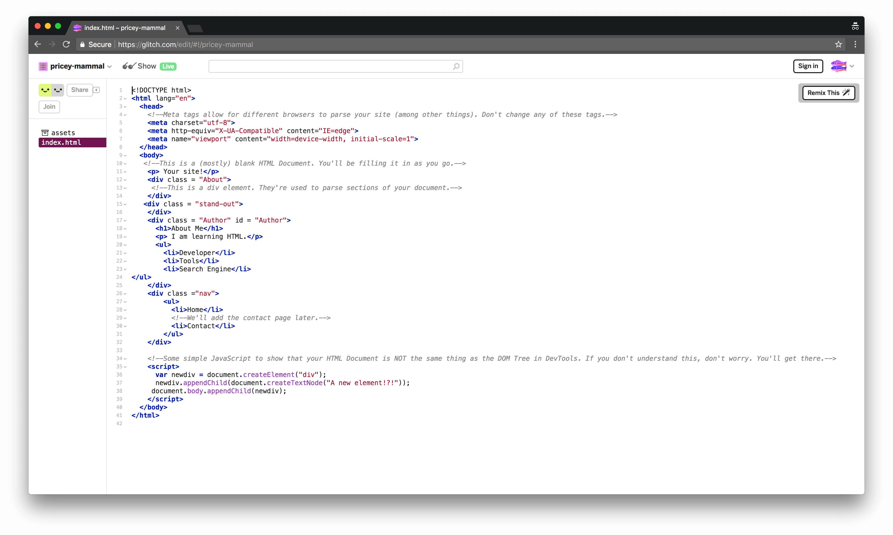

project_path: /web/tools/_project.yaml
book_path: /web/tools/_book.yaml

{# wf_updated_on: 2018-08-14 #}
{# wf_published_on: 2018-07-30 #}
{# wf_blink_components: Platform>DevTools #}

# DevTools For Beginners: Getting Started with CSS {: .page-title }

This is the second in a series of tutorials that teach you the basics of web
development. 
You are going to learn web development by actually building your own website.
In this particular tutorial, you learn about CSS, another of the core
technologies of web development. CSS controls the style of of webpages. 

Currently your site looks like this: 

`(TODO: A screenshot of the basic HTML site)`

After completing the tutorial, it will look like this: 

`(TODO: A screenshot of the basic CSS site)`


## Goals {: #goals }

By the end of this tutorial, you will understand:

* How CSS can be used to style webpages.
* How Chrome DevTools can help you when you're working CSS.
* The difference between CSS and CSS Frameworks.

You'll also have a real website!

## Prerequisites {: #prerequisites }

Before attempting this tutorial, complete the following prerequisites:

* Complete the previous tutorial on HTML and DOM or complete *Setup* below.
* Download the [Google Chrome][chrome]{: .external } web browser. This tutorial uses a set of web development tools, 
called Chrome DevTools, that are built into Google Chrome. 
[chrome]: https://www.google.com/chrome/

## Setup {: #setup}

Note: If you have already completed the first tutorial in this series, skip this section! 

In order to start creating your site, you need to set up your code:

1. Open the [source code](https://dfb2.glitch.me/). A code editor called 
Glitch shows a page called 
index.html.

`(TODO: A screenshot showing the action.)`

2. Click **dfb2**. A menu pops up.

`(TODO: A screenshot showing the menu)`

3. Click **Remix**. Glitch creates a copy of the project that you can 
edit. Note that the name of the new project will be randomly generated
and not dfb2.
The content is the same, but the name on the top-left has changed.
4. Click **Show Live**. Another tab opens with view of what your site 
currently looks like.

`(TODO: A screenshot showing the result.)`

Now, you have two tabs open: the code
(which will be called the editing tab) 
and the preview of your website (which will be called the viewing tab).

## Add CSS {: #add-css}

### What are Stylesheets? {: #stylesheets}

 Stylesheets are files containing the style definitions of your web pages. 
 Stylesheets are not created in HTML but in CSS markup, 
 which follows the layout `Selector {Property:Value}`. 
 A selector is an object that points to an HTML element, like `p` or `h1`.

 There are 3 types of stylesheets: inline, internal, and external. 
 Each type of stylesheet changes the properties of a different amount of 
 elements on your website.

#### Inline Stylesheets {: #inline}

Inline stylesheets are used to define styles for a singular element. 
For example, if you had several images on a web page, 
but you wanted one to have special formatting, 
like a border or a different shape, you could use an internal stylesheet. 
Insert an internal stylesheet into the `img` tag of the picture on the demo
site:

1. Copy the following code `style="border-radius: 50%"`.
2. In the editing tab, navigate to line ______.
3. Click on the end of the `` tag, before the ending `>`, 
and press <kbd>Space</kbd>.
4. Paste the code into the `` tag.
5. Go to the viewing tab to see what's changed.

`(TODO: A screenshot of the results of the CSS)`

All HTML elements have a `style` parameter, 
so you can use this workflow on any element.

#### Internal Stylesheets {: #internal}

Internal Stylesheets are used to define styles for an entire page. 
To demonstrate this idea, 
you'll be adding a internal stylesheet to the `contact.html` file.

1. Copy this code:
```
<style>
  body{
    background: rgb(2,0,36);
    background: linear-gradient(90deg, rgba(2,0,36,1) 0%, rgba(9,9,121,1)  35%, rgba(133,7,148,1) 48%, rgba(0,212,255,1) 100%);
    color: white;
      }
</style>
```
2. Go to the editing tab.
3. Navigate to `contact.html` using the menu on 
the left-hand side of the screen.

`(TODO: A screenshot showing the menu.)`

4. In the `<head>` of the `contact.html` document, 
on line ___ , paste in the code you copied.
5. Go to the viewing tab. 
There should be no changes on the main page (`index.html`).
6. Click on the "Contact" link to take you to the contact page. 
The background color of the page is now different! 

`(TODO: A screenshot showing the change to the contact page)`

#### External Stylesheets {: #external}

Unlike internal stylesheets, 
external stylesheets can be used across multiple pages. 
This allows you to maintain the same style definitions across your website. 
Adding an external stylesheet is as adding a link in your `<head>` section.

First, create the stylesheet:

1. Copy this code:
```
.content {
  font-family: 'Lato', sans-serif;
  font-weight: lighter;
  word-wrap: break-word;
  text-align: left;

}

ul {
  list-style-type: none;
  margin: 0;
  padding: 0;
  overflow: hidden;
  background-color: gray;
}

li {
    float: left;
}

li a {
  display: block;
  color: black;
  text-align: center;
  padding: 14px 16px;
  text-decoration: none;
}
```
2. Go to the editing tab.
3. In the menu on the left-hand side, click **Create A File**.
4. Name the file `style.css`.
5. Click **Add File**
6. Paste the code you copied into `style.css`

`(TODO: A screenshot showing the newly created file.)`

Now, this hasn't changed anything yet. You'll need to link 
the stylesheet you made: 

1. Copy this code: `<link rel="stylesheet" type="text/css" href="style.css">`
2. Go to the editing tab.
3. On line ____ of the `contact.html`document, press enter.
4. Paste in the code.
5. Repeat steps 3 and 4 for `index.html`.
6. Go to the viewing tab. Both of your webpages should have the same 
formatting.

`(TODO: A screenshot showing the new formatting.)`

Note: You may have noticed that the external stylesheet 
overwrote the previous formatting for `contact.html`. 
This is because the browser considers the definitions from the latest 
stylesheet it sees. 

Now that you've linked your external spreadsheet, 
you will continue to use it for the rest of this tutorial.

### Align Objects {: #align}

One of the most important things CSS can do is object alignment. 
For example, you can easily create a sidebar on your site with CSS:

1. Copy this code:
```
.right{
  display:block;
  background-color: lightgrey;
  box-shadow: 0 4px 8px 0 rgba(0, 0, 0, 0.2), 0 6px 20px 0 rgba(0, 0, 0, 0.19);
  padding: 5px;
  height:100%;
  width: 100%;
}
```
2. Go to the editing tab.
3. Navigate to `style.css` using the menu on the left.
4. On line ___ , paste in the code.
5. Navigate to the viewing tab to see your new sidebar.

`(TODO: A screenshot showing the new sidebar.)`

That's a nice looking sidebar, but it's not actually on the side of the page!
To remedy that:

1. Go to the editing tab.
2. Navigate to `style.css` using the menu on the left.
3. On line ___ , under the `content` section, press enter and type `display: flex`. This will align all `<divs>` inside the content `<div>` horizontally.
4. Navigate to the viewing tab to see the changes.

You can also use CSS to format tables, graphs, and other objects.

## CSS with Devtools {: #css-dev}

### Inspect Element Review {: #inspect}

The **Inspect Element** feature allows for easy access to the Elements Panel, 
where the DevTools CSS tools lie. Here's a quick refresh on how to do that: 

1. Right click on the sidebar you created in the *Aligning Objects* section.

`(TODO: A screenshot showing someone right clicking on the sidebar.)`

2. Choose the **Inspect** option.

You should now see the Elements Panel.

`(TODO: A screenshot showing the Elements Panel.)`

### The Styles Pane and the Box Model {: #styles-pane}

In this tutorial, you'll be focusing on the styles pane, 
located on the bottom of the Elements Panel. 
In this pane, you'll see two things: 
a readout of the selected element's CSS, and a Box Model Diagram.

`(TODO: A screenshot showing the styles pane and the BMD.)`

The box model states that a browser renders each HTML element as a box whose 
properties can be edited by CSS declarations. 
Each box has four elements: content, padding, border, and margin. 
While this might seem complicated, 
a quick example will help you understand this CSS fundamental.

Note: Before you start this example, 
make sure you are viewing the CSS for the "right" `<div>`. 
The `<div>`name should be highlighed.

1. Double click on the first 5 in the padding box and replace the 5 with 50. 
You should see a change in the space around the content inside the sidebar.

`(TODO: A screenshot showing someone doing that action.)`

2. Repeat this for the other 5s in the padding box.
3. Double click on the first dash in the margin box. Type in the number 10. 
You should see a change in the space around the sidebar.

`(TODO: A screenshot showing someone doing that action.)`

4. Repeat this for the other spaces in the margin box.
5. Double click on the #_ in the blue box and change it to __ . 
The size of the sidebar will change.

`(TODO: A screenshot showing someone doing that action.)`

6. You may have noticed that an inline stylesheet 
was added to the "right" `<div>`. Copy every CSS declaration after `style="`.

`(TODO: A screenshot showing someone doing that action.)`

7. Paste the CSS on line ___  of `style.css`.

The box model diagram is useful for editing the size and spacing of your HTML elements.


### Change Colors {: #colors}

The Styles Pane in DevTools can also be used to change 
the colors of elements on your web page. 

Note: CSS colors come in several forms, including RGB, Hex, 
and HTML Safe Color codes. 
For the following examples, you will be using hex colors. 
See [this resource](https://developer.mozilla.org/en-US/docs/Web/CSS/color_value) for more information.

Since your website is mostly white and grey, 
it would be nice to add a pop of color to the top of the website:

1. Go to the viewing tab. 
2. In the Elements Panel, click on the "top" `<div>` to highlight it.

`(TODO: A screenshot showing someone doing that action.)`

3. In the part of the Styles Pane that says **.top{}**, 
type `background-color: #c0d8e5`. 

`(TODO: A screenshot showing someone doing that action.)`

4. Copy the new .top CSS and paste it into style.css.

The color is now changed. 
You can also change the color of an existing style definition 
by doing the following:

1. Click on the arrow next to the nav `<div>` to reveal the elements in it.

	`(TODO: A screenshot showing someone doing that action.)`

2. Click on the `<ul>` tag to highlight it.

	`(TODO: A screenshot showing someone doing that action.)`

3. Click on the gray square before the `background-color` code.
4. A menu pops up with several options to change the color.

	`(TODO: A screenshot showing the menu.)`

For now, click on the box color code and replace the current code with ____.

5. Copy the code from the Styles Pane and paste it after line __ in style.css.


### Change Behavior (sort of) {: #behavior}

One thing you might notice about many websites 
is that links and buttons will change colors 
when you hover over them with your mouse. 
This is a CSS property called a pseudostate, 
which defines a special state of an element.

Changing a element's pseudostate is just as easy a changing an element's color:

1. Click on the first `<li>` tag inside the nav `<div>`. 

	`(TODO: A screenshot showing someone doing that action.)`

2. In the Styles Pane, click the gray plus in the center of the pane.

`(TODO: A screenshot showing someone doing that action.)`

3. Type `:hover` after li in the newly created style.

`(TODO: A screenshot showing someone doing that action.)`

4. In the new `li:hover{}` section, type `background-color: gray;`.

`(TODO: A screenshot showing someone doing that action.)`

5. Hover over the Home and Contact links to see the changes.
6. Copy the code from the Styles Pane and paste it after line __ in style.css.

Note: This behavior is *not* the same as having an event occur
when you click on a button. 
For that, you will need to utilize JavaScript, a different framework.

You've successfully made yourself a much more polished website!

## Next Steps {: #next-steps}

###Bootstrap and Other CSS Frameworks {: #frameworks}

All of this CSS can be a lot of work, and this is a relatively simple site,
so imagine what complex CSS looks like! 
You might be wondering, "Is there an easier way to format my site?". 

The answer is yes! 
CSS frameworks like Bootstrap are external stylesheets that contains many CSS
components that are formatted automatically 
(or, as close to automatically as you can get). 
All you have to do is link to the external stylesheet 
in your `<head>` section. 

####Pros and Cons of CSS Frameworks {: #pro-cons}
<table>
  <tr>
    <th>Pros</th>
    <th>Cons</th>
  </tr>
  <tr>
    <td>Helps you save time</td>
    <td>You may have to rewrite your HTML if your project didn't start with the framework.</td>
  </tr>
  <tr>
    <td>Helps you maintain CSS best practices</td>
    <td>Your site may not look unique (unless you spend time customizing the site)</td>
  </tr>
  <tr>
    <td>Automatically optimized for mobile Devices</td>
    <td>Higher learning curve compared to CSS</td>
  </tr>
</table>

For the rest of this tutorial (and subsequent tutorials), 
you will be using a site made with Bootstrap. 
Don't worry, you won't have to rewrite you site,
as it's already been done for you:

1. Open the [source code](https://dfb4.glitch.me/). 
<figure> 
<figcaption>
    <b>Figure 1</b>. The initial window you will see.
  </figcaption>
</figure>
2. Click **dfb4**. A menu pops up.
<figure> 
<figcaption>
    <b>Figure 2</b>. The Glitch menu that will appear.
  </figcaption>
</figure>
3. Click **Remix**.
4. Click **Show Live**. 

You'll notice that some elements have changed in the `index.html` document. 
This is because Bootstrap requires exclusive HTML elements in order to format 
correctly.

Note: If you'd like to see a finished version of the demo site with only 
basic CSS, remix [this project](https://dfb3.glitch.me/) using the steps above.

###The Next Tutorial {: #next-tutorial}

Now that you've got HTML and CSS down, there's one more language you'll need
to put in your web development toolkit: JavaScript. Soon, there will be a
tutorial that will focus on how DevTools can help you create and fix your
JavaScript code.

## Feedback {: #feedback }

